# AI Coding Best Practices - Visual Diagrams

Comprehensive Mermaid diagrams visualizing workflows, architectures, and decision trees from the AI Coding Best Practices guide.

**Source**: AI-CODING-BEST-PRACTICES.txt v3.2 (2025-11-03)

---

## Table of Contents

1. [Repository Pattern Architecture](#1-repository-pattern-architecture)
2. [Four-Phase Universal Workflow](#2-four-phase-universal-workflow)
3. [Platform Detection & Selection](#3-platform-detection--selection)
4. [Planning Methodology Workflow](#4-planning-methodology-workflow)
5. [Dev Docs Workflow](#5-dev-docs-workflow)
6. [Claude Code Skills Auto-Activation System](#6-claude-code-skills-auto-activation-system)
7. [Claude Code Hooks Pipeline](#7-claude-code-hooks-pipeline)
8. [Multi-Layer Review System](#8-multi-layer-review-system)
9. [Progressive Complexity Management](#9-progressive-complexity-management)
10. [Error Prevention & Recovery](#10-error-prevention--recovery)
11. [Codex CLI Tool Selection Matrix](#11-codex-cli-tool-selection-matrix)
12. [Custom GPT File Format Decision Tree](#12-custom-gpt-file-format-decision-tree)
13. [Common Pitfalls Decision Tree](#13-common-pitfalls-decision-tree)

---

## 1. Repository Pattern Architecture


**Key Principle**: `docs/` files are repository-agnostic and portable. Copy to any project for instant best practices.

---

## 2. Four-Phase Universal Workflow

```mermaid
graph TB
    START([New Task]) --> ASSESS{Is task<br/>non-trivial?}

    ASSESS -->|Yes: >3 files or<br/>2+ unknowns| PLAN[PHASE 1: PLANNING]
    ASSESS -->|No: Simple fix| IMPL[PHASE 2: IMPLEMENTATION]

    PLAN --> PLAN_STEPS["• Enter planning mode<br/>• Create comprehensive plan<br/>• Review thoroughly<br/>• Document in dev docs"]
    PLAN_STEPS --> PLAN_REVIEW{Plan<br/>approved?}
    PLAN_REVIEW -->|No| PLAN_STEPS
    PLAN_REVIEW -->|Yes| IMPL

    IMPL --> IMPL_STEPS["• Work in small increments<br/>• Review between phases<br/>• Update context continuously<br/>• Mark tasks complete immediately"]
    IMPL_STEPS --> IMPL_CHECK{Phase<br/>complete?}
    IMPL_CHECK -->|More work| IMPL_STEPS
    IMPL_CHECK -->|Phase done| VAL

    VAL[PHASE 3: VALIDATION] --> VAL_STEPS["• Run tests (unit, integration, e2e)<br/>• Check builds and linters<br/>• Verify acceptance criteria<br/>• Multi-layer review"]
    VAL_STEPS --> VAL_CHECK{All tests<br/>pass?}
    VAL_CHECK -->|No| IMPL_STEPS
    VAL_CHECK -->|Yes| HANDOFF

    HANDOFF[PHASE 4: HANDOFF] --> HANDOFF_STEPS["• Summarize changes (file:line)<br/>• Document risks and TODOs<br/>• Suggest next steps<br/>• Create PR with description"]
    HANDOFF_STEPS --> COMPLETE([Task Complete])

    style PLAN fill:#87CEEB
    style IMPL fill:#98FB98
    style VAL fill:#FFD700
    style HANDOFF fill:#DDA0DD
    style COMPLETE fill:#90EE90
```



**Checkpoint Rhythm**:
- After each phase: Review and validate
- Before context compaction: Update dev docs
- After major milestones: Full quality review
- Before handoff: Complete QA checklist

---

## 3. Platform Detection & Selection

```mermaid
graph TB
    START([Select AI Coding Platform]) --> NEEDS{What are your<br/>primary needs?}

    NEEDS -->|Large refactors<br/>Multi-file changes<br/>Backend debugging| CLAUDE_CHECK
    NEEDS -->|Focused edits<br/>Script execution<br/>CI/CD automation| CODEX_CHECK
    NEEDS -->|Structured workflows<br/>Templated outputs<br/>Consultative tasks| GPT_CHECK

    CLAUDE_CHECK{Need advanced<br/>automation?}
    CLAUDE_CHECK -->|Yes| CLAUDE[CLAUDE CODE]
    CLAUDE_CHECK -->|Basic needs| CODEX_CHECK

    CODEX_CHECK{Terminal-based<br/>workflow?}
    CODEX_CHECK -->|Yes| CODEX[CODEX CLI]
    CODEX_CHECK -->|Prefer GUI| GPT_CHECK

    GPT_CHECK{Within 8000<br/>char limit?}
    GPT_CHECK -->|Yes| GPT[CUSTOM GPT]
    GPT_CHECK -->|No| CLAUDE

    CLAUDE --> CLAUDE_FEATURES["FEATURES:<br/>• 200k token context<br/>• Skills, hooks, agents<br/>• PM2 process management<br/>• Browser automation<br/>• MCP integrations<br/>• Visual diagrams<br/>• Metrics tracking"]

    CODEX --> CODEX_FEATURES["FEATURES:<br/>• Terminal UI<br/>• Multiple modes (Interactive, Direct, Exec)<br/>• Approval modes (Auto, Read-only, Full)<br/>• GPT-5-Codex model<br/>• Image input support<br/>• MCP integration (experimental)<br/>• Workspace safety"]

    GPT --> GPT_FEATURES["FEATURES:<br/>• 8000 char instruction limit<br/>• Knowledge files (unlimited)<br/>• Web search & browsing<br/>• Conversation-based<br/>• Stateless sessions<br/>• Action integrations"]

    CLAUDE_FEATURES --> SETUP_CLAUDE["QUICK SETUP:<br/>1. Run /setup-hooks<br/>2. Activate claude-code-workflow skill<br/>3. Create CLAUDE.md"]

    CODEX_FEATURES --> SETUP_CODEX["QUICK SETUP:<br/>1. npm install -g @openai/codex<br/>2. Authenticate<br/>3. /approvals auto<br/>4. /model gpt-5-codex"]

    GPT_FEATURES --> SETUP_GPT["QUICK SETUP:<br/>1. Keep instructions <8000 chars<br/>2. Use knowledge files for data<br/>3. Three-file pattern (md, yaml, json)"]

    SETUP_CLAUDE --> READY([Ready to Code])
    SETUP_CODEX --> READY
    SETUP_GPT --> READY

    style CLAUDE fill:#87CEEB
    style CODEX fill:#98FB98
    style GPT fill:#FFD700
    style READY fill:#90EE90
```



---

## 4. Planning Methodology Workflow


**Planning Structure Template**:
- Executive Summary (2-3 sentences)
- Current State Analysis
- Proposed Solution
- Implementation Phases (detailed tasks with file paths)
- Risks & Mitigations
- Success Metrics
- Timeline Estimate

---

## 5. Dev Docs Workflow

```mermaid
graph TB
    START([Feature Planning Complete]) --> CREATE[Create Dev Docs Structure]

    CREATE --> FILES["dev/active/[feature-name]/<br/><br/>1. plan.md<br/>   (Approved plan, never changes)<br/><br/>2. context.md<br/>   (Living document)<br/><br/>3. tasks.md<br/>   (Actionable checklist)"]

    FILES --> IMPL_START[Start Implementation]

    IMPL_START --> WORK[Implement Phase]

    WORK --> CHECKPOINT[Checkpoint]

    CHECKPOINT --> UPDATE_CONTEXT["Update context.md:<br/>• Key files and purposes<br/>• Important decisions<br/>• Discoveries and gotchas<br/>• Integration points<br/>• Next steps (CRITICAL)<br/>• Timestamp"]

    UPDATE_CONTEXT --> UPDATE_TASKS["Update tasks.md:<br/>• Mark completed immediately<br/>• Add new tasks discovered<br/>• Update acceptance criteria"]

    UPDATE_TASKS --> COMPACTION{Context<br/>compaction<br/>imminent?}

    COMPACTION -->|No| MORE_WORK{More work<br/>to do?}
    COMPACTION -->|Yes| PRECOMPACT[CRITICAL:<br/>Update Next Steps]

    PRECOMPACT --> PRECOMPACT_STEPS["In context.md:<br/>• Document current state<br/>• Explicit next steps<br/>• Update timestamp<br/>• Note blockers"]

    PRECOMPACT_STEPS --> COMPACTION_EVENT[Context Compaction]

    COMPACTION_EVENT --> NEW_SESSION[New Session]

    NEW_SESSION --> CONTINUE{User says<br/>'continue'?}

    CONTINUE -->|Yes| AUTO_LOAD[Claude reads dev docs<br/>automatically]
    CONTINUE -->|No| MANUAL[Manual context restoration]

    AUTO_LOAD --> WORK
    MANUAL --> WORK

    MORE_WORK -->|Yes| WORK
    MORE_WORK -->|No| COMPLETE[Feature Complete]

    COMPLETE --> ARCHIVE["Move to dev/archive/<br/>Keep for reference"]

    style UPDATE_CONTEXT fill:#87CEEB
    style UPDATE_TASKS fill:#98FB98
    style PRECOMPACT fill:#FFD700
    style PRECOMPACT_STEPS fill:#FFD700
    style AUTO_LOAD fill:#90EE90
    style COMPLETE fill:#90EE90
```



**Key Benefits**:
- Eliminates context loss across compactions
- Maintains focus during long implementations
- "Most impact on results" (verified 300k LOC rewrite)
- Automatic restoration with "continue" command

---

## 6. Claude Code Skills Auto-Activation System


**Configuration Example**:

```json
{
  "backend-dev-guidelines": {
    "type": "domain",
    "enforcement": "suggest",
    "priority": "high",
    "promptTriggers": {
      "keywords": ["backend", "controller", "service", "API"],
      "intentPatterns": ["(create|add).*?(route|endpoint)"]
    },
    "fileTriggers": {
      "pathPatterns": ["backend/src/**/*.ts"],
      "contentPatterns": ["router\\.", "export.*Controller"]
    }
  }
}
```

**Token Efficiency**: 40-60% savings with progressive disclosure

---

## 7. Claude Code Hooks Pipeline

```mermaid
graph TB
    START([User Submits Prompt]) --> HOOK1[Hook 1: UserPromptSubmit]

    HOOK1 --> H1_ACTIONS["• Analyze for skill matches<br/>• Inject skill reminders<br/>• Add project context<br/>• Block if secrets detected"]

    H1_ACTIONS --> H1_EXIT{Exit code?}

    H1_EXIT -->|0: Success| CLAUDE[Claude Processes Request]
    H1_EXIT -->|2: Block| FEEDBACK1[Show Feedback to Claude]
    H1_EXIT -->|Other| LOG1[Log Error, Continue]

    FEEDBACK1 --> CLAUDE
    LOG1 --> CLAUDE

    CLAUDE --> RESPONSE[Claude Generates Response]

    RESPONSE --> TOOL_USE{Uses Edit/Write<br/>tools?}

    TOOL_USE -->|Yes| HOOK2[Hook 2: PostToolUse]
    TOOL_USE -->|No| FINISH

    HOOK2 --> H2_ACTIONS["• Track edited files<br/>• Log: timestamp | repo | filepath<br/>• Store in /tmp/claude-edits.log"]

    H2_ACTIONS --> H2_NOTE[Note: Do NOT run builds here<br/>Claude makes breaking edits]

    H2_NOTE --> FINISH[Claude Finishes Response]

    FINISH --> HOOK3[Hook 3: Stop Event - Build Check]

    HOOK3 --> H3_ACTIONS["• Read /tmp/claude-edits.log<br/>• Identify affected repos<br/>• Run builds on each repo<br/>• Show errors if <5 errors<br/>• Suggest auto-error-resolver if many<br/>• Clear edit log"]

    H3_ACTIONS --> H3_RESULT{Build<br/>errors?}

    H3_RESULT -->|Yes| SHOW_ERRORS[Show Errors to Claude]
    H3_RESULT -->|No| HOOK4

    SHOW_ERRORS --> HOOK4[Hook 4: Stop Event - Error Reminder]

    HOOK4 --> H4_ACTIONS["• Analyze edited files<br/>• Check for risky patterns:<br/>  - try/catch blocks<br/>  - async/await<br/>  - database operations<br/>• Show non-blocking reminder"]

    H4_ACTIONS --> H4_SHOW{Risky patterns<br/>detected?}

    H4_SHOW -->|Yes| REMINDER[Show Error Handling Reminder]
    H4_SHOW -->|No| DONE

    REMINDER --> REMINDER_TEXT["💡 Reminder: Review error handling<br/>in recently edited files"]

    REMINDER_TEXT --> DONE([Pipeline Complete])

    style HOOK1 fill:#87CEEB
    style HOOK2 fill:#98FB98
    style HOOK3 fill:#FFD700
    style HOOK4 fill:#DDA0DD
    style DONE fill:#90EE90
```



**Additional Modern Hooks (2025)**:
- **PreCompact**: Summarize state before context compaction
- **SessionStart**: Initialize session with project context
- **SessionEnd**: Save state and cleanup
- **SubagentStop**: Handle specialized agent completion

**Best Practices**:
- Use exit codes correctly (0=allow, 2=block, other=log)
- Quote variables: `"$VAR"` not `$VAR`
- Implement timeouts (60-second default)
- Security first: validate inputs, no secrets
- Use JSON output for structured decisions

---

## 8. Multi-Layer Review System


**Quality Metrics**:
- **Layer 1**: Catches 60-70% of technical errors
- **Layer 2**: Catches 15-20% of logical issues
- **Layer 3**: Catches 10-15% of architectural concerns
- **Layer 4**: Final 5-10% strategic/business validation

**Result**: Zero errors accumulate, immediate feedback, systematic quality

---

## 9. Progressive Complexity Management


**Strategy**: Don't overwhelm AI with full complexity upfront

**Benefits**:
- Each phase validates assumptions before adding complexity
- Easier debugging (know which layer has issues)
- Incremental progress reduces risk
- Clear checkpoints for review

**Example Progression**:
1. "Create basic user CRUD endpoints with in-memory storage"
2. "Replace in-memory storage with Prisma and PostgreSQL"
3. "Add user role validation and permissions"
4. "Add error handling, logging, rate limiting"

---

## 10. Error Prevention & Recovery

```mermaid
graph TB
    START([Development Phase]) --> PREVENT[Prevention Strategies]

    PREVENT --> PREV1[Validate Early]
    PREVENT --> PREV2[Incremental Implementation]
    PREVENT --> PREV3[Frequent Builds]
    PREVENT --> PREV4[Documentation Validation]

    PREV1 --> PREV1_DESC[Check assumptions before<br/>large implementations]
    PREV2 --> PREV2_DESC[Small changes → verify → next]
    PREV3 --> PREV3_DESC[Catch type errors immediately]
    PREV4 --> PREV4_DESC[Confirm API signatures<br/>before implementing]

    PREV1_DESC --> WORK[Development Work]
    PREV2_DESC --> WORK
    PREV3_DESC --> WORK
    PREV4_DESC --> WORK

    WORK --> ERROR{Error<br/>detected?}

    ERROR -->|No| CONTINUE[Continue Development]
    CONTINUE --> WORK

    ERROR -->|Yes| TRIAGE[Error Triage]

    TRIAGE --> ERROR_TYPE{Error<br/>type?}

    ERROR_TYPE -->|Build/TypeScript| TS_ERROR[TypeScript Error]
    ERROR_TYPE -->|Logic/Runtime| LOGIC_ERROR[Logic Error]
    ERROR_TYPE -->|Integration| INT_ERROR[Integration Error]
    ERROR_TYPE -->|Test Failure| TEST_ERROR[Test Failure]

    TS_ERROR --> TS_COUNT{Error<br/>count?}
    TS_COUNT -->|<5| TS_FIX[Fix Manually]
    TS_COUNT -->|5-20| TS_SYSTEMATIC[Systematic Fix]
    TS_COUNT -->|>20| TS_AGENT[Launch build-error-resolver]

    LOGIC_ERROR --> LOGIC_DEBUG[Debug with PM2 logs]
    LOGIC_DEBUG --> LOGIC_FIX[Fix Logic Issue]

    INT_ERROR --> INT_CHECK[Check Integration Points]
    INT_CHECK --> INT_SCHEMA{Schema<br/>mismatch?}
    INT_SCHEMA -->|Yes| INT_SCHEMA_FIX[Update Schema/Contracts]
    INT_SCHEMA -->|No| INT_CONFIG[Check Configuration]

    TEST_ERROR --> TEST_TYPE{Test<br/>type?}
    TEST_TYPE -->|Unit| TEST_UNIT[Fix Unit Test]
    TEST_TYPE -->|Integration| TEST_INT[Fix Integration Test]
    TEST_TYPE -->|E2E| TEST_E2E[Fix E2E Test]

    TS_FIX --> VERIFY
    TS_SYSTEMATIC --> VERIFY
    TS_AGENT --> VERIFY
    LOGIC_FIX --> VERIFY
    INT_SCHEMA_FIX --> VERIFY
    INT_CONFIG --> VERIFY
    TEST_UNIT --> VERIFY
    TEST_INT --> VERIFY
    TEST_E2E --> VERIFY

    VERIFY[Verify Fix] --> RETEST{Tests<br/>pass?}

    RETEST -->|No| TRIAGE
    RETEST -->|Yes| DOCUMENT[Document Solution]

    DOCUMENT --> WORK

    style PREVENT fill:#87CEEB
    style TRIAGE fill:#FFD700
    style VERIFY fill:#98FB98
    style DOCUMENT fill:#90EE90
```



**Key Principles**:
- **Prevention > Cure**: Validate early, build frequently
- **Incremental debugging**: Isolate issues to specific phases
- **Systematic approach**: Use tools and agents for large error sets
- **Documentation**: Record solutions for future reference

---

## 11. Codex CLI Tool Selection Matrix

```mermaid
graph TB
    START([Codex CLI Task]) --> TASK_TYPE{Task<br/>Type?}

    TASK_TYPE -->|Run commands| SHELL
    TASK_TYPE -->|Edit files| EDIT
    TASK_TYPE -->|Read content| READ
    TASK_TYPE -->|Search code| SEARCH
    TASK_TYPE -->|Multi-step work| PLAN
    TASK_TYPE -->|Visual analysis| IMAGE

    SHELL[shell tool] --> SHELL_USE["USE FOR:<br/>• Tests, linters, counts<br/>• Git operations<br/>• Build commands<br/>• Package management"]
    SHELL_USE --> SHELL_AVOID["AVOID FOR:<br/>✗ Editing files (use apply_patch)<br/>✗ Chaining cd commands"]

    EDIT[apply_patch tool] --> EDIT_USE["USE FOR:<br/>• Surgical updates<br/>• Multi-file patches<br/>• Precise edits with context"]
    EDIT_USE --> EDIT_AVOID["AVOID:<br/>✗ Massive rewrites<br/>✗ Large context lines"]

    READ[read_file tool] --> READ_USE["USE FOR:<br/>• Inspecting code structure<br/>• Reviewing contents<br/>• Understanding architecture"]
    READ_USE --> READ_FEAT["FEATURES:<br/>• Chunked reading<br/>• Workspace-restricted<br/>• Optional indentation"]

    SEARCH[grep_files tool] --> SEARCH_USE["USE FOR:<br/>• Finding code patterns<br/>• Debugging searches<br/>• Quick lookups"]
    SEARCH_USE --> SEARCH_ALT["ALTERNATIVE:<br/>Use rg in shell<br/>for advanced searches"]

    PLAN[plan tool] --> PLAN_USE["USE FOR:<br/>• Multiple files involved<br/>• Ambiguous scope<br/>• Phased work"]
    PLAN_USE --> PLAN_RULES["RULES:<br/>• Short steps (5-7 words)<br/>• Exactly one in_progress<br/>• Update as you go<br/>• Available in interactive & exec"]

    IMAGE[view_image tool] --> IMAGE_USE["USE FOR:<br/>• Diagrams<br/>• Screenshots<br/>• UI assets<br/>• Error displays"]
    IMAGE_USE --> IMAGE_CMD["COMMAND:<br/>codex -i screenshot.png<br/>'explain this error'"]

    SHELL_AVOID --> BEST_PRACTICE
    EDIT_AVOID --> BEST_PRACTICE
    READ_FEAT --> BEST_PRACTICE
    SEARCH_ALT --> BEST_PRACTICE
    PLAN_RULES --> BEST_PRACTICE
    IMAGE_CMD --> BEST_PRACTICE

    BEST_PRACTICE["BEST PRACTICES:<br/>✓ Set workdir explicitly<br/>✓ Avoid chaining cd<br/>✓ Prefer rg for search<br/>✓ Read in chunks (≤250 lines)<br/>✓ Never run destructive commands<br/>✓ Respect sandbox boundaries"]

    style SHELL fill:#87CEEB
    style EDIT fill:#98FB98
    style READ fill:#FFD700
    style SEARCH fill:#DDA0DD
    style PLAN fill:#FFA07A
    style IMAGE fill:#E6E6FA
    style BEST_PRACTICE fill:#90EE90
```



**MCP Tools** (when configured):
- `list_mcp_resources` - Discover available context
- `read_mcp_resource` - Load resource by URI
- `list_mcp_resource_templates` - Discover templates
- All MCP tools prefixed with `mcp__`

---

## 12. Custom GPT File Format Decision Tree

```mermaid
graph TB
    START([Need to store<br/>information]) --> TYPE{Content<br/>Type?}

    TYPE -->|Reasoning, tone,<br/>workflows, explanations| MD
    TYPE -->|Compact lookups,<br/>mappings, structured data| JSON
    TYPE -->|Raw label lists,<br/>keywords, triggers| TXT
    TYPE -->|Role definitions,<br/>configs, commands| YAML

    MD[Use .md Markdown] --> MD_CHECK{Instruction<br/>file?}

    MD_CHECK -->|Yes| LIMIT[CRITICAL: 8000 char limit]
    MD_CHECK -->|No| MD_SUPP[Supplemental file:<br/>NO limit]

    LIMIT --> OPTIMIZE[Optimize for tokens]

    OPTIMIZE --> OPT_STEPS["REMOVE:<br/>✗ --- dividers<br/>✗ Emojis/Unicode<br/>✗ Decorative bullets<br/>✗ Verbose phrases<br/><br/>KEEP:<br/>✓ Plain bullets (-)<br/>✓ Clear headings<br/>✓ Concise directives"]

    OPT_STEPS --> MEASURE[Run: wc -c file.md]

    MEASURE --> CHAR_CHECK{≤ 7900<br/>chars?}

    CHAR_CHECK -->|No| SPLIT{Can<br/>split?}
    CHAR_CHECK -->|Yes| GOOD

    SPLIT -->|Yes| MULTI["Multi-file pattern:<br/>01_agent-name.md<br/>02_supplemental.md<br/>03_data.json"]
    SPLIT -->|No| MOVE_DATA[Move data to<br/>.json or .txt]

    MOVE_DATA --> JSON

    JSON[Use .json JSON] --> JSON_USE["BEST FOR:<br/>• Structured data<br/>• Mode definitions<br/>• API responses<br/>• Configuration maps<br/><br/>NO CHARACTER LIMIT"]

    TXT[Use .txt Plain Text] --> TXT_USE["BEST FOR:<br/>• Keyword lists<br/>• Simple enumerations<br/>• Triggers<br/>• Raw labels<br/><br/>NO CHARACTER LIMIT"]

    YAML[Use .yaml YAML] --> YAML_USE["BEST FOR:<br/>• Role definitions<br/>• Command structures<br/>• Config parameters<br/>• Agent metadata<br/><br/>NO CHARACTER LIMIT"]

    JSON_USE --> THREE_FILE
    TXT_USE --> THREE_FILE
    YAML_USE --> THREE_FILE
    MD_SUPP --> THREE_FILE
    MULTI --> THREE_FILE

    THREE_FILE[Three-File Deliverable Pattern]

    THREE_FILE --> PATTERN["REQUIRED FILES:<br/>1. 01_agent-name.md<br/>   (Main prompt, <8000 chars)<br/><br/>2. agent-name.yaml<br/>   (Config, commands, constraints)<br/><br/>3. 02_sources-agent-name.json<br/>   (Web resources for domain)"]

    PATTERN --> GOOD([Properly Formatted])

    style LIMIT fill:#FF6B6B
    style OPTIMIZE fill:#FFD700
    style CHAR_CHECK fill:#FFD700
    style JSON_USE fill:#87CEEB
    style TXT_USE fill:#98FB98
    style YAML_USE fill:#DDA0DD
    style THREE_FILE fill:#E6E6FA
    style GOOD fill:#90EE90
```



**Key Rule**: Only `.md` instruction files have 8000 char limit. Supporting files (`.json`, `.txt`, `.yaml`) have NO limits.

---

## 13. Common Pitfalls Decision Tree

```mermaid
graph TB
    START([Problem Detected]) --> SYMPTOM{What's the<br/>symptom?}

    SYMPTOM -->|AI builds wrong thing| P1
    SYMPTOM -->|AI forgets after compaction| P2
    SYMPTOM -->|Skills never activate| P3
    SYMPTOM -->|Discover 20+ errors later| P4
    SYMPTOM -->|Inconsistent code patterns| P5
    SYMPTOM -->|AI always agrees| P6
    SYMPTOM -->|Wasting 30+ min on trivial| P7
    SYMPTOM -->|CustomGPT rejected/truncated| P8

    P1[Pitfall 1:<br/>Vibe-Coding] --> P1_CAUSE[No clear plan<br/>or validation]
    P1_CAUSE --> P1_FIX["SOLUTION:<br/>✓ Use planning mode<br/>✓ Review plans before implementation<br/>✓ Break into phases with checkpoints"]

    P2[Pitfall 2:<br/>Context Loss] --> P2_CAUSE[No systematic<br/>context preservation]
    P2_CAUSE --> P2_FIX["SOLUTION:<br/>✓ Implement dev docs workflow<br/>✓ Update context.md before compaction<br/>✓ Document next steps explicitly"]

    P3[Pitfall 3:<br/>Skills Unused] --> P3_CAUSE[Relying on<br/>automatic activation]
    P3_CAUSE --> P3_FIX["SOLUTION:<br/>✓ Implement UserPromptSubmit hook<br/>✓ Use explicit keywords<br/>✓ Create skill-rules.json config"]

    P4[Pitfall 4:<br/>Error Accumulation] --> P4_CAUSE[No automatic<br/>build validation]
    P4_CAUSE --> P4_FIX["SOLUTION:<br/>✓ Implement Stop hook with build checker<br/>✓ Run builds on affected repos immediately<br/>✓ Show errors to AI before continuing"]

    P5[Pitfall 5:<br/>Inconsistent Patterns] --> P5_CAUSE[Documentation not<br/>loaded consistently]
    P5_CAUSE --> P5_FIX["SOLUTION:<br/>✓ Move patterns to skills with auto-activation<br/>✓ Use hooks to enforce guidelines<br/>✓ Create guardrail skills"]

    P6[Pitfall 6:<br/>Leading Questions] --> P6_CAUSE[Biased questions<br/>'Is this good?']
    P6_CAUSE --> P6_FIX["SOLUTION:<br/>✓ Ask neutral questions<br/>✓ Request alternatives<br/>✓ Explicitly request criticism"]

    P7[Pitfall 7:<br/>Over-Reliance] --> P7_CAUSE[Stubborn insistence<br/>AI should do everything]
    P7_CAUSE --> P7_FIX["SOLUTION:<br/>✓ Step in manually for quick fixes<br/>✓ Use human intuition<br/>✓ Recognize when AI is struggling"]

    P8[Pitfall 8:<br/>Character Limit] --> P8_CAUSE[Exceeding 8000<br/>character limit]
    P8_CAUSE --> P8_FIX["SOLUTION:<br/>✓ Run wc -c before finalizing<br/>✓ Target 7500-7900 chars<br/>✓ Split into multiple files<br/>✓ Move data to .json/.txt files"]

    P1_FIX --> IMPLEMENT[Implement Solution]
    P2_FIX --> IMPLEMENT
    P3_FIX --> IMPLEMENT
    P4_FIX --> IMPLEMENT
    P5_FIX --> IMPLEMENT
    P6_FIX --> IMPLEMENT
    P7_FIX --> IMPLEMENT
    P8_FIX --> IMPLEMENT

    IMPLEMENT --> VERIFY{Problem<br/>resolved?}

    VERIFY -->|No| DEEPER[Investigate Deeper]
    VERIFY -->|Yes| DOCUMENT[Document Solution]

    DEEPER --> SYMPTOM
    DOCUMENT --> RESOLVED([Issue Resolved])

    style P1 fill:#FF6B6B
    style P2 fill:#FF6B6B
    style P3 fill:#FF6B6B
    style P4 fill:#FF6B6B
    style P5 fill:#FF6B6B
    style P6 fill:#FF6B6B
    style P7 fill:#FF6B6B
    style P8 fill:#FF6B6B
    style IMPLEMENT fill:#FFD700
    style DOCUMENT fill:#90EE90
    style RESOLVED fill:#90EE90
```



**Prevention Strategy**: Recognize symptoms early and implement systematic solutions

---

## Summary

These diagrams visualize the complete AI-assisted development workflow covering:

1. **Architecture** - Universal three-layer repository pattern
2. **Core Workflow** - Four-phase development cycle
3. **Platform Selection** - Choose the right tool for your needs
4. **Planning** - Systematic approach to feature development
5. **Context Management** - Dev docs workflow prevents context loss
6. **Automation** - Skills auto-activation and hooks pipeline
7. **Quality** - Multi-layer review system
8. **Implementation** - Progressive complexity management
9. **Error Handling** - Prevention and recovery strategies
10. **Tool Selection** - Platform-specific best practices
11. **File Formats** - Optimal format selection for Custom GPT
12. **Troubleshooting** - Common pitfalls and solutions

**Key Insight**: Effectiveness depends on systematic workflow setup, not just AI capabilities.

**Verified Results**: 300k LOC rewrite in 6 months (solo developer) using these patterns.

---

**Source**: AI-CODING-BEST-PRACTICES.txt v3.2 (2025-11-03)
**Repository**: https://github.com/diet103/claude-code-infrastructure-showcase
**License**: Portable - Copy to any project
