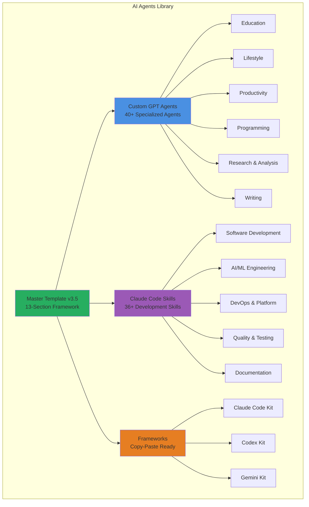
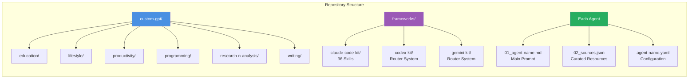
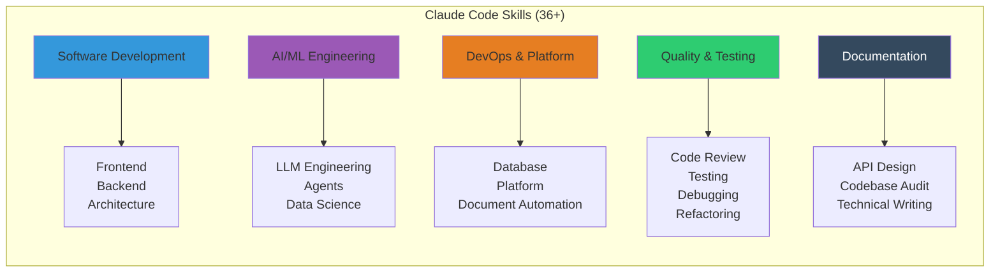
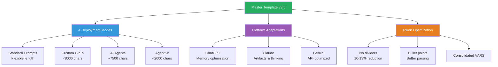
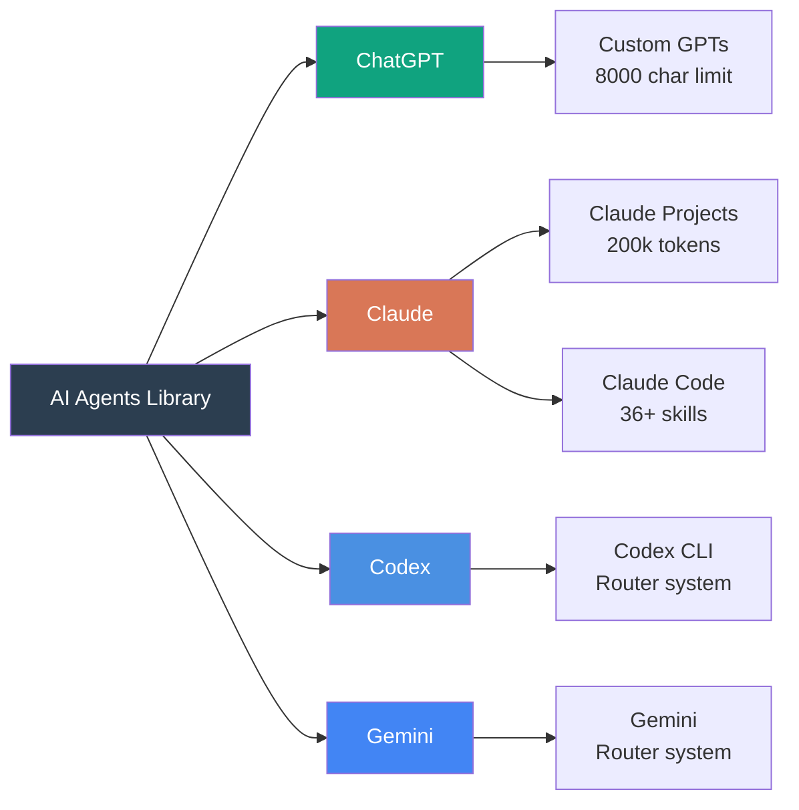

# AI Agents Library

## Production-Ready AI Agent Prompts & Claude Code Skills

<div align="center">

A curated collection of **40+ Custom GPT agents** and **36+ Claude Code skills** optimized for ChatGPT, Claude Projects, Codex, and Gemini platforms.

[](https://opensource.org/licenses/MIT)
[](./custom-gpt)
[](./frameworks/claude-code-kit)
[](CONTRIBUTING.md)
[](https://twitter.com/vasilyu)

[Quick Start](#-quick-start) • [Custom GPTs](#-custom-gpt-agents) • [Claude Skills](#-claude-code-skills) • [Frameworks](#-frameworks) • [Contributing](#-contributing)

</div>

---

## Table of Contents

- [What's Inside](#whats-inside)
- [Repository Architecture](#repository-architecture)
- [Custom GPT Agents](#custom-gpt-agents)
- [Claude Code Skills](#claude-code-skills)
- [Frameworks](#frameworks)
- [Quick Start](#quick-start)
- [Prompt Engineering Framework](#prompt-engineering-framework)
- [Platform Support](#platform-support)
- [Contributing](#contributing)
- [License](#license)

## What's Inside

This repository contains **40+ specialized AI agents** and **36+ Claude Code skills** organized by domain, each optimized for specific tasks and workflows. All agents follow a consistent template structure with platform-specific optimizations.



### What Makes This Different?

- **Production-Ready**: Every agent tested and optimized for real-world use
- **Multi-Platform**: Works across ChatGPT, Claude, Codex, and Gemini
- **Systematic Framework**: Master Template v3.5 with 13 standardized sections
- **Character-Optimized**: Custom GPT agents under 8000 char limit
- **Curated Resources**: JSON source files with 60+ curated references per domain
- **Copy-Paste Kits**: Complete `.claude/` and `.codex/` workspace templates

## Repository Architecture



### Three-File Agent Pattern

Every agent follows a consistent structure:

```text
AgentName/
├── 01_agent-name.md           # Main prompt file (<8000 chars for Custom GPT)
├── 02_sources-agent-name.json # Curated web resources and references
├── agent-name.yaml            # Configuration (role, commands, constraints)
└── archive/                   # Version history (git-ignored)
```

## Custom GPT Agents

**40+ specialized agents** optimized for ChatGPT Custom GPTs (8000 character limit).

### Agent Categories

#### Education (3 agents)

- **English Tutor** - IELTS Writing Task 1 & 2 preparation with band score feedback
- **UK Tax and Legal Adviser 2025** - UK tax, legal, and regulatory guidance (2025/26 tax year)
- **Life in the UK 2025** - Citizenship test preparation with practice questions

#### Lifestyle (7 agents)

- **Fitness Buddy** - Personalized workout programming with progressive overload strategies
- **DietGPT** - Comprehensive nutrition planning with macro/micronutrient targets
- **Sleep Coach** - Sleep optimization with CBT-I techniques and environmental guidance
- **ChildBridge** - Child development expert with parenting strategies
- **Pet Whisperer** - Pet care covering nutrition, training, and species-specific needs
- **ReelRecipe** - Short-form video content strategist for TikTok, Instagram Reels, YouTube Shorts
- **CineMatch** - Movie recommendations with 66+ sources and 17 discovery commands

#### Productivity (5 agents)

- **Prompt Engineer** - Master template v3.5 with 4 deployment modes and platform-specific versions
- **Product Coach** - Product management with discovery, roadmapping, and prioritization frameworks
- **The Negotiator** - Principled negotiation with BATNA analysis and tactical empathy
- **Contract Crusher** - Legal contract analysis with risk identification and plain-English summaries
- **SMMA** - Social media marketing with campaign strategy and paid advertising tactics

#### Programming (5 agents)

- **AI Agents Builder** - OpenAI Assistants API, LangChain, CrewAI with multi-agent orchestration
- **LLM Engineer** - Fine-tuning, RAG architecture, embeddings, and production deployment
- **Data Scientist** - ML/AI with PyTorch, TensorFlow, XGBoost, and MLOps pipelines
- **PRD Business Analyst** - User stories, technical specifications, and API contracts
- **SQL and DevOps Engineer** - Database optimization, Kubernetes, Terraform, and observability

#### Research & Analysis (3 agents)

- **AI Strategist** - AI readiness assessments, use case identification, and governance frameworks
- **Startup Consultant** - Business model validation, fundraising strategy, and financial modeling
- **Strategy Consultant** - Porter's Five Forces, SWOT, PESTEL, and competitive positioning

#### Writing (2 agents)

- **AI Text Humaniser** - Transform AI content into natural writing while eliminating detection markers
- **FAANG Resume Coach** - ATS optimization, STAR stories, and behavioral interview preparation

[See full agent catalog →](./custom-gpt/README.md)

## Claude Code Skills

**36+ production-ready skills** for Claude Code, organized into domain-specific categories.



### Installation

Copy the entire `.claude/skills/` directory to your Claude Code workspace:

```bash
# Clone the repository
git clone https://github.com/vasilyu1983/AI-Agents-public
cd AI-Agents-public

# Copy skills to Claude Code
cp -r frameworks/claude-code-kit/initial-setup/skills ~/.config/claude-code/skills/
```

[See full skills catalog →](./frameworks/README.md)

## Frameworks

Three complete development kits for different AI platforms:

### Claude Code Kit

Complete `.claude/` workspace with 36+ skills covering software development, AI/ML, DevOps, and quality engineering.

**Copy-paste ready**: Drop the `initial-setup/` directory into your Claude Code workspace.

### Codex Kit

Router-based system for Codex CLI with intelligent agent dispatch and workflow orchestration.

### Gemini Kit

Gemini-optimized router system with platform-specific adaptations.

[See frameworks documentation →](./frameworks/README.md)

## Quick Start

### Using a Custom GPT Agent

1. Browse the [agent catalog](./custom-gpt/README.md) to find an agent
2. Navigate to the agent folder (e.g., `custom-gpt/productivity/Prompt Engineer/`)
3. Copy content from `01_agent-name.md` (guaranteed <8000 chars)
4. Create new Custom GPT in ChatGPT
5. Paste into Instructions field
6. Upload `02_sources-*.json` as knowledge file (optional)

### Installing Claude Code Skills

```bash
# Clone repository
git clone https://github.com/vasilyu1983/AI-Agents-public

# Install all skills
cp -r frameworks/claude-code-kit/initial-setup/skills ~/.config/claude-code/skills/

# Verify installation
ls ~/.config/claude-code/skills/
```

### Using with Claude Projects

1. Create new Claude Project
2. Add `01_agent-name.md` as project knowledge
3. Add supplemental files (`02_sources-*.json`) if available
4. Reference in custom instructions

## Prompt Engineering Framework

All agents built on **Master Template v3.5** with 13 standardized sections:

1. **VARS** - Configuration variables
2. **IDENTITY** - Role definition
3. **CONTEXT** - Background knowledge
4. **CONSTRAINTS** - Boundaries and requirements
5. **PRECEDENCE & SAFETY** - Security protocols
6. **OUTPUT CONTRACT** - Format specifications
7. **FRAMEWORKS** - Reasoning frameworks
8. **WORKFLOW** - Execution process
9. **ERROR RECOVERY** - Edge case handling
10. **TOOLS & UI** - Tool usage guidelines
11. **MEMORY** - State management
12. **COMMANDS** - Slash commands
13. **EXEMPLARS** - Real-world examples

### Template Features



## Platform Support



### Platform-Specific Features

#### ChatGPT Custom GPTs

- 8000 character hard limit (strictly enforced)
- Memory feature integration
- Knowledge file uploads
- Target: 7,500-7,900 characters

#### Claude Projects & Code

- 200k token context window
- Artifacts for long outputs
- `<thinking>` tags for transparency
- Multi-file knowledge base
- 36+ specialized skills

#### Codex & Gemini

- Router-based agent dispatch
- Workflow orchestration
- Platform-specific optimizations

## Contributing

We welcome contributions! Please follow these guidelines:

### Adding a New Agent

1. Fork the repository
2. Create three files following the pattern:
   - `01_agent-name.md` (<8000 chars for Custom GPT)
   - `02_sources-agent-name.json` (curated resources)
   - `agent-name.yaml` (configuration)
3. Use Master Template v3.5 structure (13 sections)
4. Validate character count: `wc -c 01_agent-name.md`
5. Test on target platform
6. Submit pull request

### Adding a Claude Code Skill

1. Create skill directory under appropriate category
2. Add `SKILL.md` with skill definition
3. Include resources and templates subdirectories
4. Test skill activation in Claude Code
5. Submit pull request

### Quality Standards

- All Custom GPT agents must be under 8000 characters
- Include curated sources in JSON format
- Follow YAML configuration schema
- Test prompts before submission
- Document any platform-specific features

## License

MIT License - see [LICENSE](LICENSE) file for details.

All prompts and configurations are provided as-is for educational and commercial use.

## Resources

### Official Documentation

- [OpenAI Custom GPTs](https://help.openai.com/en/articles/8554397-creating-a-gpt)
- [Claude Projects](https://support.anthropic.com/en/articles/9517075-what-are-projects)
- [Claude Code Documentation](https://github.com/anthropics/claude-code)

### Community

- **Issues**: Report bugs or request features via [GitHub Issues](https://github.com/vasilyu1983/AI-Agents-public/issues)
- **Discussions**: Join conversations in [GitHub Discussions](https://github.com/vasilyu1983/AI-Agents-public/discussions)
- **Twitter**: Follow for updates [@vasilyu](https://twitter.com/vasilyu)

---

<div align="center">

**Built with the Master Template v3.5** | Production-ready since 2024

[Custom GPTs](./custom-gpt) • [Claude Skills](./frameworks/claude-code-kit) • [Frameworks](./frameworks)

</div>
