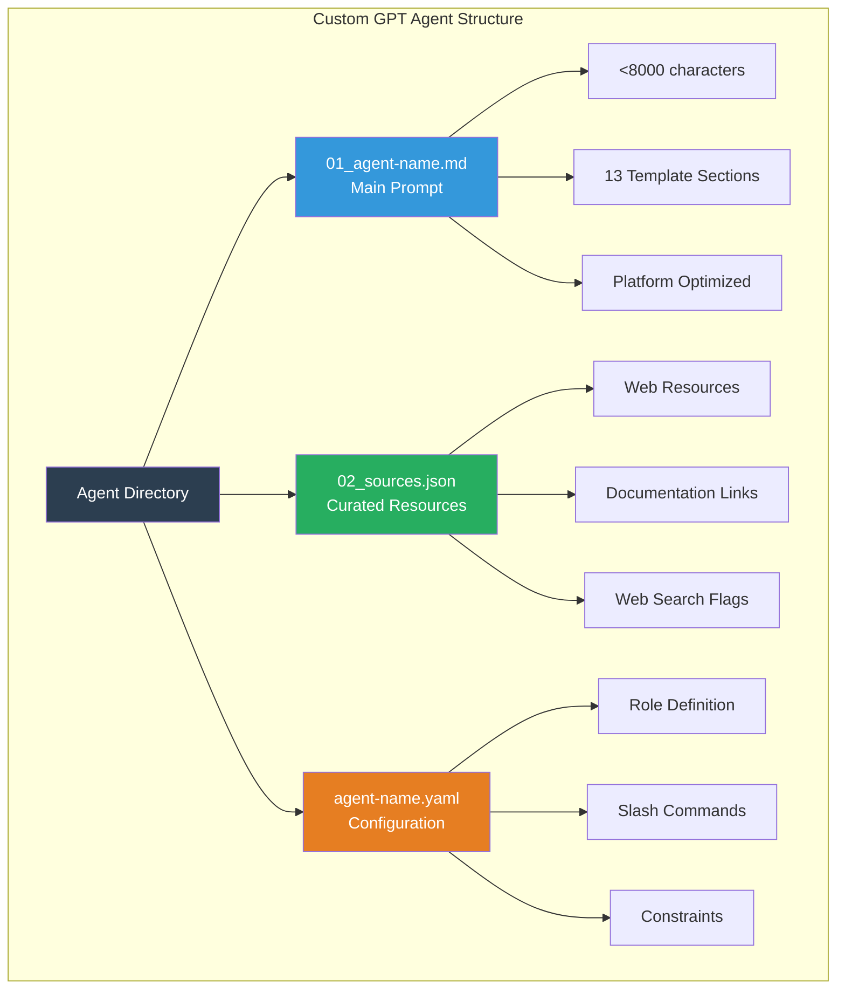
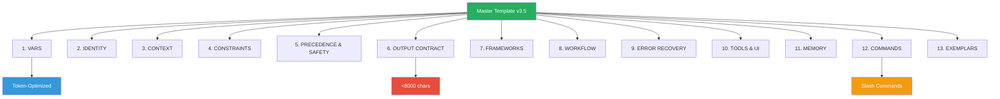
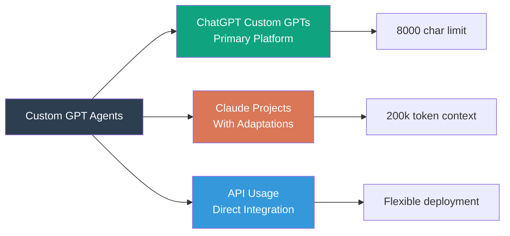

# Custom GPT Agents Catalog

**40+ production-ready ChatGPT Custom GPT agents** optimized for the 8000-character instruction limit.

## Overview

This directory contains specialized AI agents designed for ChatGPT Custom GPTs. Each agent follows a consistent three-file pattern and adheres to OpenAI's 8000-character instruction limit.



## Quick Start

### Deploy a Custom GPT

1. Navigate to an agent directory (e.g., `productivity/Prompt Engineer/`)
2. Open `01_agent-name.md` and copy the contents
3. Go to [ChatGPT Custom GPTs](https://chat.openai.com/gpts/editor)
4. Create a new GPT
5. Paste the prompt into the "Instructions" field
6. (Optional) Upload `02_sources-*.json` as a knowledge file
7. Configure conversation starters from `agent-name.yaml` commands

### File Structure

Every agent includes:

- **`01_agent-name.md`**: Main prompt file (guaranteed <8000 characters)
- **`02_sources-agent-name.json`**: Curated web resources and documentation
- **`agent-name.yaml`**: Role definition, commands, and constraints

## Agent Categories

### Education (3 agents)

#### English Tutor (Real IELTS Writing)

IELTS Writing Task 1 & 2 preparation with detailed band score feedback, task achievement analysis, and examiner-style corrections.

- **Directory**: `education/English Tutor, Real IELTS writing/`
- **Use Cases**: IELTS prep, academic writing, band score improvement
- **Features**: Task 1 & 2 coverage, detailed feedback, real exam strategies

#### UK Tax and Legal Adviser 2025

Comprehensive UK tax, legal, and regulatory guidance for the 2025/26 tax year.

- **Directory**: `education/UK Tax and Legal Adviser 2025/`
- **Use Cases**: Tax planning, legal compliance, business regulations
- **Features**: Income tax, corporation tax, VAT, employment law

#### Life in the UK 2025

Complete Life in the UK test preparation with practice questions and cultural knowledge.

- **Directory**: `education/Life in the UK 2025/`
- **Use Cases**: Citizenship test prep, UK settlement, cultural education
- **Features**: Practice questions, history, government, British values

### Lifestyle (7 agents)

#### Fitness Buddy

Personalized workout programming with progressive overload strategies.

- **Directory**: `lifestyle/Fitness Buddy/`
- **Use Cases**: Strength training, hypertrophy, program design
- **Features**: Exercise selection, form cues, recovery protocols

#### DietGPT

Comprehensive nutrition planning with macro/micronutrient targets.

- **Directory**: `lifestyle/DietGPT/`
- **Use Cases**: Meal planning, weight loss, muscle gain, performance nutrition
- **Features**: Macro calculations, meal timing, food choices

#### Sleep Coach

Sleep optimization with CBT-I techniques and environmental guidance.

- **Directory**: `lifestyle/Sleep Coach/`
- **Use Cases**: Insomnia treatment, sleep hygiene, circadian optimization
- **Features**: CBT-I protocols, sleep architecture, supplement guidance

#### ChildBridge (Child Psychologist)

Child development expert with evidence-based parenting strategies.

- **Directory**: `lifestyle/ChildBridge/`
- **Use Cases**: Developmental milestones, behavioral challenges, parenting
- **Features**: Attachment theory, emotional regulation, learning difficulties

#### Pet Whisperer

Comprehensive pet care covering nutrition, training, and health.

- **Directory**: `lifestyle/Pets/`
- **Use Cases**: Dog/cat/exotic pet care, behavior modification, health monitoring
- **Features**: Species-specific needs, veterinary-aligned guidance

#### ReelRecipe

Short-form video content strategist for TikTok, Instagram Reels, and YouTube Shorts.

- **Directory**: `lifestyle/ReelRecipe/`
- **Use Cases**: Viral video creation, content scripting, platform optimization
- **Features**: Hook strategies, pacing techniques, editing workflows, algorithm insights

#### CineMatch

Intelligent movie recommendation engine with 66+ curated sources.

- **Directory**: `lifestyle/CineMatch/`
- **Use Cases**: Movie discovery, streaming platform search, film curation
- **Features**: 17 slash commands, international coverage, 2024-2025 focus
- **Sources**: IMDb, TMDB, Netflix, Prime, Disney+, HBO, Criterion, Letterboxd

### Productivity (5 agents)

#### Prompt Engineer

Master prompt engineering framework with template v3.5 and 4 deployment modes.

- **Directory**: `productivity/Prompt Engineer/`
- **Use Cases**: Prompt creation, template design, platform optimization
- **Features**: 13-section template, cross-platform translation, token optimization
- **Files**: 7 total including platform-specific versions for ChatGPT and Claude

#### Product Coach

Product management expert covering discovery, roadmapping, and prioritization.

- **Directory**: `productivity/Product Coach/`
- **Use Cases**: Product strategy, user research, stakeholder management
- **Features**: RICE/ICE/MoSCoW frameworks, OKRs, go-to-market strategy

#### The Negotiator

Principled negotiation strategist with BATNA analysis and tactical empathy.

- **Directory**: `productivity/Negotiation Coach/`
- **Use Cases**: Salary negotiations, business deals, conflict resolution
- **Features**: Harvard negotiation method, anchoring, psychology frameworks

#### Contract Crusher

Legal contract analysis with risk identification and plain-English summaries.

- **Directory**: `productivity/Contract Crusher/`
- **Use Cases**: Contract review, risk assessment, negotiation leverage
- **Features**: Clause analysis, liability identification, termination terms

#### SMMA (Social Media Marketing Agency)

Social media marketing specialist with campaign strategy and paid advertising.

- **Directory**: `productivity/SMMA/`
- **Use Cases**: Social media strategy, content calendars, ad campaigns
- **Features**: Meta/TikTok/LinkedIn ads, ROI tracking, audience growth

### Programming (5 agents)

#### AI Agents Builder

Autonomous AI agent development using modern frameworks and APIs.

- **Directory**: `programming/AI Agents/`
- **Use Cases**: Agent architecture, multi-agent systems, production deployment
- **Features**: OpenAI Assistants API, LangChain, CrewAI, AutoGPT

#### LLM Engineer

Large language model specialist covering fine-tuning, RAG, and deployment.

- **Directory**: `programming/LLM/`
- **Use Cases**: Fine-tuning, RAG architecture, embedding systems, production LLMs
- **Features**: LoRA/QLoRA/RLHF, vector databases, vLLM/TGI/Ollama

#### Data Scientist

ML/AI development with PyTorch, TensorFlow, and MLOps pipelines.

- **Directory**: `programming/DS/`
- **Use Cases**: Model development, feature engineering, production ML systems
- **Features**: scikit-learn, XGBoost, MLflow, Weights & Biases

#### PRD Business Analyst

Product Requirements Document specialist with technical specifications.

- **Directory**: `programming/PRD/`
- **Use Cases**: User stories, API contracts, system architecture docs
- **Features**: Agile/waterfall methodologies, stakeholder alignment

#### SQL and DevOps Engineer

Database optimization and DevOps automation specialist.

- **Directory**: `programming/SQL-DevOps/`
- **Use Cases**: Database tuning, Kubernetes, infrastructure-as-code
- **Features**: PostgreSQL/MySQL/MongoDB, Docker, Terraform, Prometheus

### Research & Analysis (3 agents)

#### AI Strategist and Visioner

AI strategy consultant covering readiness assessments and governance.

- **Directory**: `research-n-analysis/AI Strategist and Visioner/`
- **Use Cases**: AI transformation, use case identification, vendor selection
- **Features**: ROI models, ethical AI frameworks, implementation roadmaps

#### Startup Consultant

Startup advisor covering business model validation and fundraising.

- **Directory**: `research-n-analysis/Startup Consultant/`
- **Use Cases**: Market validation, pitch decks, financial modeling
- **Features**: Lean startup, customer development, pre-seed to Series A

#### Strategy Consultant

Business strategy expert using classic frameworks and analysis tools.

- **Directory**: `research-n-analysis/Strategy Consultant/`
- **Use Cases**: Market entry, competitive positioning, M&A evaluation
- **Features**: Porter's Five Forces, SWOT, PESTEL, BCG matrix

### Writing (2 agents)

#### AI Text Humaniser

Transform AI-generated content into natural, human-like writing.

- **Directory**: `writing/AI Text Humaniser/`
- **Use Cases**: Content refinement, AI detection evasion, voice authenticity
- **Features**: Pattern removal, sentence variation, personality injection

#### FAANG Resume & Interview Coach

Tech career specialist for FAANG hiring processes.

- **Directory**: `writing/FAANG Resume & Interview Coach/`
- **Use Cases**: Resume optimization, behavioral interviews, coding prep
- **Features**: ATS systems, STAR method, LeetCode strategies, salary negotiation

## Master Template v3.5

All agents follow the **13-section template structure**:



### Template Features

- **Character Optimized**: Every agent under 8000 characters
- **Token Efficient**: 10-13% reduction through optimization techniques
- **Standardized Structure**: Consistent 13-section format
- **Platform-Specific**: Versions for ChatGPT, Claude, Gemini where needed

### Optimization Techniques

1. **No dividers**: Removed `---` separators (50-70 token savings)
2. **Plain text labels**: No emojis or Unicode symbols
3. **Bullet points**: Better LLM parseability than prose for directives
4. **Consolidated VARS**: Single defaults line instead of inline comments
5. **Tightened phrasing**: Concise language throughout

## Usage Patterns

### Basic Deployment

```bash
# Navigate to agent
cd custom-gpt/productivity/Prompt\ Engineer/

# Check character count
wc -c 01_prompt-engineer-CustomGPT.md

# Verify under 8000
# Output: 7918 01_prompt-engineer-CustomGPT.md
```

### YAML Configuration

Each agent's YAML file defines:

```yaml
role:
  title: "Agent Name"
  scope: "Domain expertise"

commands:
  - name: "/command"
    purpose: "Command description"
    inputs: ["param1", "param2"]
    output_shape: "Expected format"

constraints:
  max_chars: 8000
  framework: "auto"
  tone: "professional"
```

### Sources JSON

Curated resources format:

```json
{
  "metadata": {
    "title": "Agent Name - Sources",
    "description": "Curated resources",
    "last_updated": "YYYY-MM-DD"
  },
  "category": [
    {
      "name": "Resource Name",
      "url": "https://example.com",
      "description": "What this covers",
      "add_as_web_search": true
    }
  ]
}
```

## Platform Compatibility



### ChatGPT Custom GPTs (Primary)

- **Limit**: 8000 characters (strictly enforced)
- **Features**: Memory, knowledge files, conversation starters
- **Optimization**: All agents 7,500-7,900 characters

### Claude Projects (Compatible)

- **Context**: 200k tokens (much larger)
- **Features**: Artifacts, thinking tags, multi-file knowledge
- **Adaptation**: Some agents have Claude-specific versions

### API Integration (Flexible)

- **Deployment**: Direct via OpenAI/Anthropic APIs
- **Format**: Use prompt as system message
- **Customization**: Easy to modify for specific use cases

## Contributing

### Adding a New Agent

1. **Choose category**: education, lifestyle, productivity, programming, research-n-analysis, writing
2. **Create directory**: `category/Agent Name/`
3. **Create three files**:
   - `01_agent-name.md` (<8000 chars)
   - `02_sources-agent-name.json`
   - `agent-name.yaml`
4. **Use template**: Copy from `productivity/Prompt Engineer/02_master-template.md`
5. **Validate**: `wc -c 01_agent-name.md` must show <8000
6. **Test**: Deploy to ChatGPT and verify functionality

### Quality Checklist

- [ ] Prompt under 8000 characters
- [ ] All 13 template sections included
- [ ] YAML commands match markdown COMMANDS section
- [ ] Sources JSON includes 10+ curated resources
- [ ] Tested on ChatGPT Custom GPT
- [ ] No placeholder text (`{{variables}}`)
- [ ] Clear use cases and examples

## Resources

- **Master Template**: `productivity/Prompt Engineer/02_master-template.md`
- **Fill Guide**: `productivity/Prompt Engineer/03_template-fill-guide.md`
- **Deployment Guide**: `productivity/Prompt Engineer/05_deployment-guide.md`
- **OpenAI Docs**: [Creating a GPT](https://help.openai.com/en/articles/8554397-creating-a-gpt)

---

**[← Back to Main README](../README.md)** | **[View Frameworks →](../frameworks/README.md)**
