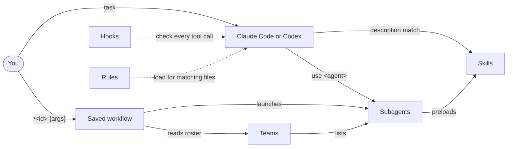

# Concepts

This page explains the six parts of the harness and how they fit together. Read it once; the other guides assume these terms.

- [The parts at a glance](#the-parts-at-a-glance)
- [How the parts connect](#how-the-parts-connect)
- [Skills](#skills)
- [Subagents](#subagents)
- [Teams](#teams)
- [Saved workflows](#saved-workflows)
- [Hooks](#hooks)
- [Rules](#rules)
- [Generated files](#generated-files)
- [Design principles](#design-principles)

## Words used on every page

| Word | Meaning |
|---|---|
| Runtime | Claude Code or Codex: the program you chat with |
| Context | Everything the model can see in one conversation. It has a size limit, so less is better. |
| Front matter | The block between two `---` lines at the top of a Markdown file. It holds settings such as `name` and `description`. |
| Plan (your plan) | Your Claude or OpenAI subscription or API account. Every agent counts against it. |

## The parts at a glance

| Part | What it is | Lives in | Who starts it |
|---|---|---|---|
| **Skill** | A folder of instructions, references and scripts for one kind of task | `skills/universal/<name>/` | The runtime, when your task matches the skill's description |
| **Subagent** | A specialist that works in its own separate context, with a fixed tool list and a fixed report format | `agents/claude/<name>.md` (Codex: generated `.toml`) | You by name, or a workflow |
| **Team** | A recipe that groups subagents and says who may write what | `agents/teams/<id>/team.yaml` | `deploy-preset.sh`, or a workflow that binds it |
| **Saved workflow** | A multi-agent run whose rules are enforced in code | `agents/workflows/<id>.js` | You, with `/<id>` |
| **Hook** | A script the runtime runs before or after a tool call | `hooks/` | The runtime, after you register it |
| **Rule** | A short, path-scoped instruction for one language or domain | `rules/` | The runtime, when you edit a matching file |

## How the parts connect



- A skill is knowledge. A subagent is a worker. A workflow is a process with checks.
- A subagent can preload skills, listed in the `skills:` field of its definition.
- A workflow does not depend on skills. It depends on subagents and, for some workflows, a team roster.

## Skills

A skill is a folder:

```text
skills/universal/software-code-review/
├── SKILL.md                    # required: front matter + the judgment
├── references/                 # depth, loaded only when a step needs it
├── scripts/                    # runnable helpers the skill calls
├── data/                       # data a script reads (with source and date)
├── assets/                     # templates and examples
├── agents/openai.yaml          # Codex display and invocation policy
├── learnings.md                # dated lessons from real use
└── learnings.consolidated.md   # the reviewed summary of those lessons
```

How a skill loads:

1. At session start, the runtime reads only each skill's `name` and `description`.
2. When your task matches a description, the runtime loads that `SKILL.md`.
3. `SKILL.md` links to a reference with a condition, for example "read this when the diff touches authentication". The reference loads only then.

This keeps the context small. A session pays for one short description per skill, not for every full skill.

Some skills are **manual-only**. Their front matter sets `disable-model-invocation: true`, so the runtime never loads them by itself. You start them with `/<name>`. `run-workflow`, the skill that runs a workflow in Codex, is one of these.

The full list, with every description, is in the [catalog](reference/catalog.md#skills). [Skills](skills.md) explains how to find, use and write them.

## Subagents

A subagent definition is a Markdown file with front matter:

```markdown
---
name: dev-feature-reviewer
family: dev
description: "Review a diff or PR for correctness, regressions, and missing tests before merge. ..."
tools:
  - Read
  - Grep
  - Glob
  - Bash
skills:
  - software-clean-code-standard
  - qa-refactoring
  - software-code-review
---

# body: the agent's instructions
```

Each description has the same three parts:

- **What it does.** "Review a diff or PR for correctness, regressions, and missing tests."
- **When to use it.** "Use proactively after implementation work."
- **What it produces, and what it does not do.** "Reviews and reports findings ordered by severity; does not edit code or implement fixes."

The last part is a boundary. A reviewer that does not edit code cannot "fix" what it reviews, so its report stays honest.

`tools:` limits what the agent can do. Most reviewers and architects have read-only tools. Only implementers and writers have `Edit` and `Write`.

## Teams

A team recipe names a roster and the rules for working together:

| Field | Meaning |
|---|---|
| `members` | The core roster. Installed by default. |
| `expansion_gate.candidate_specialists` | Optional specialists. Installed only with `--include-candidates`. |
| `required_context` | What you must provide before the team starts |
| `concurrency_mode` | `staged` (one stage after another) or parallel |
| `synthesis_owner` | The member who merges the results |
| `owned_files` | Which member may write which files |
| `do_not_touch` | Paths no member may change |
| `install: opt-in` | The team installs only when you name it |

The 8 teams and their members are in the [catalog](reference/catalog.md#teams).

## Saved workflows

A saved workflow is a multi-agent run whose guarantees live in code, not in a prompt:

- **Fresh agents each round.** A reviewer never grades its own earlier work.
- **A refuter quorum.** Each finding goes to two refuters. A finding dies only if both disprove it with a reason.
- **Frozen acceptance checks.** In build mode, the checks are fixed when the run starts. An agent cannot weaken them to pass.
- **A round cap and plateau stop.** A loop ends at its cap, or when two rounds in a row bring no gain.
- **A snapshot gate.** Before and after each step, the workflow records `HEAD`, the staging area, protected files such as `AGENTS.md`, and a hash of every changed or untracked file. It only reads: it does not commit, stash or copy anything. If a file outside the allowed list changed, the run stops.

A prompt that imitates a workflow loses all five. Use the saved workflow.

No workflow commits, pushes, opens a pull request or approves anything. You review `git status` and commit yourself.

Each workflow has three files:

| File | Role |
|---|---|
| `<id>.manifest.json` | The source: engine, description, arguments, phases, and the reviewer or loop settings |
| `<id>.js` | Generated. The Claude Code workflow script. |
| `<id>.codex-plan.json` | Generated. A step-by-step JSON checklist for Codex. Codex cannot run the `.js` script, so your main Codex session (the "parent") follows this checklist through the `run-workflow` skill and starts each subagent itself. |

The **engine** is the shared code that runs a family of workflows, for example `review` for the review workflows. Each manifest names its engine.

[Workflows](workflows.md) covers all 8 workflows in detail.

## Hooks

A hook is a script that the runtime calls at an event, such as before a tool call. A hook can block the call by exiting with code 2 and printing the reason.

The harness ships 3 hooks: a git safety guard, a lint-config guard and a desktop notification. None is active until you register it. [Hooks and safety](hooks-and-safety.md) gives the steps.

## Rules

A rule is a short instruction file under `rules/`:

| Folder | Scope |
|---|---|
| `rules/common/` | Every repository: coding behaviour, errors, security, git, dependencies |
| `rules/<language>/` | Files that match the rule's `paths:` field. For example, `rules/python/async-api.md` applies to files under `**/routes/**/*.py` and `**/api/**/*.py`. |
| `rules/repo/` | This repository only |

Each rule ends with `Why and procedure: <path#anchor>`, which points to the skill that holds the reasoning. To use the language rules in Claude Code, copy or link the folders you want into `~/.claude/rules/`.

## Generated files

Four kinds of file are generated. Never edit them by hand; edit the source and run the generator.

| Generated file | Source | Generator |
|---|---|---|
| `agents/codex/*.toml` | `agents/claude/*.md` | `generate_codex_agents.py --write` |
| `agents/workflows/<id>.js`, `<id>.codex-plan.json` | `agents/workflows/<id>.manifest.json` | `generate_workflows.py` |
| Team diagrams in `skills/universal/agents-subagents/references/` | `agents/teams/*/team.yaml` | `generate-team-diagrams.py` |
| Team-member matrix | `agents/teams/*/team.yaml` | `generate_team_member_matrix.py` |

All four generators live in `skills/universal/agents-subagents/scripts/`. Each one has a `--check` mode that exits non-zero when a generated file is stale.

## Design principles

- **Judgment, not data.** A skill holds what a strong model would get wrong without it. Current versions, prices and limits change faster than prose, so a skill gives a lookup step instead of a number.
- **Small always-loaded context.** Instruction files stay short. Depth sits in references that load on demand.
- **Boundaries in every role.** Every subagent says what it does not do.
- **Guarantees in code.** A rule that matters, such as "two refuters per finding", lives in the workflow runtime, not in a prompt.
- **You own the commit.** No workflow commits, pushes or approves. The harness prepares; you decide.
