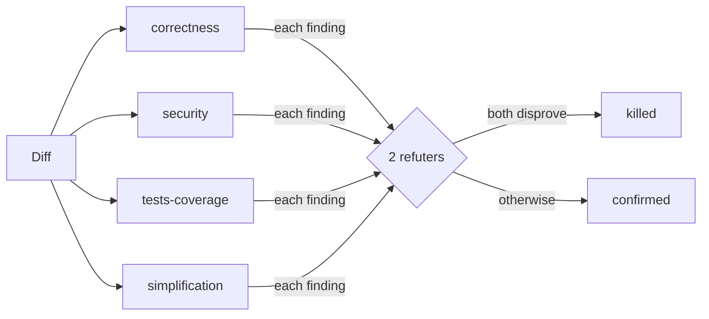
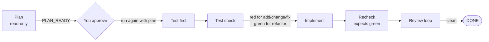

# Workflows

A saved workflow is a multi-agent run whose guarantees live in code: fresh agents each round, a refuter quorum, frozen acceptance checks, a round cap, and a check of the working tree after every step. This page covers all 8 workflows.

- [1. Choose a workflow](#1-choose-a-workflow)
- [2. Run a workflow in Claude Code](#2-run-a-workflow-in-claude-code)
- [3. Verdicts and what to do next](#3-verdicts-and-what-to-do-next)
- [4. Each workflow](#4-each-workflow)
  - [adversarial-review](#adversarial-review)
  - [review-fix-loop](#review-fix-loop)
  - [source-check](#source-check)
  - [feature-delivery](#feature-delivery)
  - [build-mvp](#build-mvp)
  - [epic-delivery](#epic-delivery)
  - [expert-board](#expert-board)
  - [marketing-campaign](#marketing-campaign)
- [5. The snapshot gate](#5-the-snapshot-gate)
- [6. Run a workflow in Codex](#6-run-a-workflow-in-codex)
- [7. Cost and size](#7-cost-and-size)
- [8. Change or add a workflow](#8-change-or-add-a-workflow)

**Terms used on this page**

| Term | Meaning |
|---|---|
| Verdict | The one-word result of a run, such as `CLEAN` or `BLOCKED` ([section 3](#3-verdicts-and-what-to-do-next)) |
| Stop reason | Why a run stopped, such as `cap` (round limit) or `out_of_scope` |
| Escalation | A note in the result that tells you what a human must decide |
| Plan | The JSON object that run 1 of a two-run workflow returns. You approve it by passing it to run 2. |
| Snapshot | The workflow's record of the git tree before and after each step ([section 5](#5-the-snapshot-gate)) |
| Path A, path B | The plugin install and the clone install ([Getting started](getting-started.md#2-choose-one-install-path)) |

## 1. Choose a workflow

| You want to | Workflow | Edits files? | Stops for your approval? |
|---|---|---|---|
| Review a diff, branch, PR or path | `adversarial-review` | No | No |
| Review and fix in rounds | `review-fix-loop` (review mode) | Yes, only files a confirmed finding names | No |
| Build to a fixed spec until checks pass | `review-fix-loop` (build mode) | Yes | No |
| Check a document's quotes, links, figures and attributions | `source-check` | Yes, the target only | No |
| Make one code change, test first | `feature-delivery` | Yes, the plan's files | Yes, after the plan |
| Build an MVP from a PRD, slice by slice | `build-mvp` | Yes, each slice's files | Yes, after the slice plan |
| Deliver an epic as parallel, file-owning tasks | `epic-delivery` | Yes, each task's files | Yes, after the task plan |
| Get a board decision on a question | `expert-board` | No | No |
| Draft a marketing campaign | `marketing-campaign` | No | No |

Every workflow leaves commits to you. None of them commits, pushes, stashes, opens a pull request or approves anything.

**Subagents each workflow needs.** The plugin (path A) includes all of them. With the clone (path B) or Codex, install the team first:

| Workflow | Install |
|---|---|
| `adversarial-review`, `review-fix-loop`, `source-check` | Nothing: they use general agents |
| `feature-delivery`, `epic-delivery` | `deploy-preset.sh dev-feature-delivery --platform <claude\|codex> --user` |
| `build-mvp` | The `dev-feature-delivery` team and the `docs-ai-prd-writer` agent (`--member`) |
| `expert-board` | The board's members (see the [catalog](reference/catalog.md#expert-boards)). A missing member is replaced by a general agent. |
| `marketing-campaign` | `deploy-preset.sh marketing-campaign --platform <claude\|codex> --user`. This team is opt-in, so `deploy-all-teams.sh` skips it unless you add `--include-opt-in`. |

**Before a writing workflow: how to undo.** Writing workflows leave their edits in your working tree on every stop, including `FINDINGS` and `BLOCKED`.

1. Start from a clean tree, or run the workflow in its own worktree: `git worktree add ../wt-task -b task`.
2. If your tree has uncommitted work, save it first: `git diff --binary > "$TMPDIR/before.patch"`.
3. To discard a run's edits, run `git restore` or `git checkout` yourself in a terminal. With the [git safety guard](hooks-and-safety.md) installed, agents cannot run these commands.

## 2. Run a workflow in Claude Code

**Before you run.** Workflows need Claude Code's dynamic workflows feature. On a Pro plan, turn it on in `/config` (the "Dynamic workflows" row). Each run first shows its plan and asks you to approve it once (Yes, View script, or No). If `/adversarial-review` is not offered, see [Troubleshooting](troubleshooting.md#workflows).

Type `/<id>` and then the arguments as one JSON object:

```text
/adversarial-review
/adversarial-review {"target": "feature/login"}
/review-fix-loop {"mode": "review", "target": "src/payments", "maxRounds": 3}
/feature-delivery {"mode": "fix", "task": "The CSV export drops the last row"}
```

- With the plugin install, add the plugin prefix: `/ai-agents:adversarial-review`. This page uses the short form of the clone install.
- A wrong argument, such as an unknown or repeated dimension name or an absolute path, stops the run at once, before any agent starts.
- Give arrays and objects as real JSON values, not as a JSON string. `{"acceptance": ["npm test exits 0"]}` is correct. `{"acceptance": "[\"npm test exits 0\"]"}` is wrong.
- Run the workflow from inside the repository it should work on. The agents find the root with `git rev-parse --show-toplevel`.
- Claude Code shows the run's progress and lets you resume it from its workflow view.
- With path B, the workflow scripts are symlinks in `~/.claude/workflows/`. A repository can also have its own `.claude/workflows/`. If both have a workflow with the same name, the repository's copy runs.

## 3. Verdicts and what to do next

Every run ends with a verdict. Some also give a stop reason and an escalation for a human.

| Verdict | Meaning | Your next step |
|---|---|---|
| `CLEAN` | A review found nothing that survived refutation | Commit when the rest is ready |
| `PASS` | A build met every frozen acceptance check | Review `git status`, then commit |
| `DONE` | A staged delivery finished every stage | Review `git status`, then commit |
| `PLAN_READY`, `SLICES_READY`, `TASKS_READY` | The first run of a two-run workflow produced a plan | Read and edit the plan, then run again with it |
| `FINDINGS` | Open findings remain | Fix them by hand, or run `review-fix-loop` |
| `FAIL` | A build did not pass its checks | Read the escalation; change the spec or the code |
| `INCOMPLETE` | An agent failed, timed out, or broke the output schema | Re-run. The result names the failed agent. |
| `BLOCKED` | The snapshot gate or a plan check stopped the run | Read the stop reason in [section 5](#5-the-snapshot-gate) |

`INCOMPLETE` is never a pass. A workflow does not quietly redo a failed agent's work.

## 4. Each workflow

### adversarial-review

Reviews code with four reviewers, then tries to disprove each finding.

**Arguments**

| Argument | Required | Meaning |
|---|---|---|
| `target` | No | A PR number, a branch, or a path. Without it, the run reviews `git diff` plus `git diff --staged`. New untracked files are in neither diff: run `git add -N <file>` first to include them. |
| `dimensions` | No | Extra reviewers, added after the 4 defaults. Allowed: `publication`, `docs-drift`, `performance`. |

**How it runs**



1. One reviewer per dimension reads the diff and proposes findings. Reviewers report only on lines the diff changed.
2. Two refuters get each finding. A finding is killed only if both refuters disprove it, each with a nonblank reason.
3. The result lists `confirmed`, `killed` and `unverified` findings.

**Target resolution**

| You pass | The reviewers read |
|---|---|
| Nothing | `git diff` and `git diff --staged` |
| A number | `gh pr diff <number>` (needs the GitHub CLI) |
| A branch | `git diff $(git merge-base HEAD <branch>)...<branch>` |
| A path | `git diff -- <path>` and the files under it |

**Verdicts:** `CLEAN`, `FINDINGS`, `INCOMPLETE` (a dimension went unreviewed or a finding is unverified), `BLOCKED` (`read_only_wrote`: the tree changed during this read-only review).

**Example**

```text
/adversarial-review {"target": "feature/login", "dimensions": ["performance"]}
```

### review-fix-loop

Reviews and fixes in rounds (review mode), or builds against frozen checks (build mode). Every round uses fresh agents.

**Review mode arguments:** `{mode?: "review", target?, dimensions?, maxRounds?: 3}`

Each round:

1. Fresh reviewers and refuters, as in `adversarial-review`.
2. One fixer gets only the confirmed findings. It may change only the files those findings name.

**Build mode arguments:** `{mode: "build", spec, acceptance: [...], rubric?: "design", maxRounds?: 3}`

- `spec` and `acceptance` are required. They are frozen for the whole run.
- Write each acceptance check as a pass-or-fail statement: `"npm test exits 0"`, `"GET /health returns 200"`.
- `rubric: "design"` adds a design rubric to the judge.

Each round:

1. One builder works toward the spec.
2. A fresh read-only judge grades every acceptance check.

**Stops**

| Verdict | Stop reason | Meaning |
|---|---|---|
| `CLEAN` | `clean` | Review mode found nothing |
| `PASS` | `pass` | Build mode passed every check |
| `FINDINGS` | `oscillation` | A finding the fixer reported as fixed came back |
| `FINDINGS` | `cap` | The round cap was reached with open items |
| `FINDINGS` | `fixer_failed` | The fixer failed or returned no list of fixes |
| `FAIL` | `plateau` | 2 rounds in a row with no gain over the best round |
| `FAIL` | `cap` or `builder_failed` | The cap was reached, or the builder failed |
| `INCOMPLETE` | `incomplete` | A reviewer, refuter or judge failed, or a check went ungraded |
| `BLOCKED` | a snapshot reason | See [section 5](#5-the-snapshot-gate) |

Every stop other than `CLEAN` or `PASS` returns an escalation for a human.

**Examples**

```text
/review-fix-loop {"target": "src/billing", "maxRounds": 2}
/review-fix-loop {"mode": "build", "spec": "Add a --json flag to the export command", "acceptance": ["python3 -m pytest tests/test_export.py exits 0", "export --json prints valid JSON"]}
```

### source-check

Checks every quote, link, figure and attribution in one document against the source it cites, then fixes only the confirmed defects.

**Arguments:** `{target: "<repo-relative file or folder>", maxRounds?: 3}`. `target` is required.

- The four reviewers check quotes, links, figures and attribution. There are no optional dimensions.
- A reviewer judges a claim only after reading its source. A source that cannot be opened counts as **unverified**, never as false.
- A finding outside the target is dropped in code.
- The fixer has no network access. It can only align the text with the source wording that a confirmed finding quotes, or remove the claim. Re-check those edits yourself.

**Example**

```text
/source-check {"target": "docs/market-report.md"}
```

### feature-delivery

Plans, writes tests first, implements and reviews one code change. It runs twice: the first run stops for your approval of the plan.



1. **Run 1:** `{mode, task}`. `mode` is `add`, `change`, `fix` or `refactor`. The run returns `PLAN_READY` with the plan: the files to change, the test files, and the checks.
2. **Read the plan.** Edit it if you need to.
3. **Run 2:** the same `mode` and `task`, plus `plan` (the approved plan) and optionally `maxRounds` for the review loop.

Run 2, stage by stage:

| Stage | Who | Rule |
|---|---|---|
| Test first | Test writer | May touch only `plan.test_files` |
| Test check | Runtime | New tests must fail (red) for add, change and fix, and pass (green) for refactor |
| Implement | Implementer | May touch only `plan.files` |
| Recheck | Runtime | Tests must now pass |
| Review | Review loop | As in `review-fix-loop` |

Only one writer runs at a time.

| Verdict | Stop reason | Your next step |
|---|---|---|
| `PLAN_READY` | `awaiting_approval` | Approve the plan and run again with `plan` |
| `DONE` | `complete` | Review the tree, then commit |
| `BLOCKED` | `invalid_plan_path`, `out_of_scope`, `tests_not_red`, `tests_not_green`, `report_mismatch`, or a snapshot reason | Read the escalation; fix the plan or the tree |
| `FINDINGS` | `cap` or `oscillation` | Fix by hand, or discard the change |
| `INCOMPLETE` | `incomplete` | An agent failed or broke the schema; re-run |

**Example**

```text
/feature-delivery {"mode": "add", "task": "Add rate limiting to POST /login: 5 attempts per minute per IP"}
```

Run 1 ends with `PLAN_READY` and prints the plan as a JSON object. Copy it whole, edit it if you need to, and pass it as `plan` in run 2. A filled-in run 2:

```text
/feature-delivery {"mode": "add", "task": "Add rate limiting to POST /login: 5 attempts per minute per IP", "plan": {"summary": "Per-IP limiter on POST /login", "files": ["src/auth/login.py", "src/auth/rate_limit.py"], "test_files": ["tests/test_login_rate_limit.py"], "acceptance": ["pytest tests/test_login_rate_limit.py exits 0"]}}
```

Copy the plan exactly as run 1 printed it; it can carry more fields than this example. Instead of pasting, you can also tell Claude: "Run feature-delivery again with the plan above."

### build-mvp

Cuts a PRD into thin vertical slices, then builds the approved slices one at a time.

1. **Run 1:** `{prd: "<path or text>"}`. A read-only PRD writer returns `SLICES_READY` with the slice list.
2. **Run 2:** `{prd, slices: [<approved slices>], maxRounds?: 3}`. Each slice runs a build-and-judge loop against its own checks. A slice may change only its own `files`.

Rules for the slice list:

- Slice ids are unique.
- A slice may depend only on earlier slices.
- A slice may not have a blank check.

The run stops at the first slice that does not reach `PASS`, and names that slice. The slices before it passed; commit them.

**Example.** Run 1, then run 2 with the `slices` array that run 1 printed (copy it whole):

```text
/build-mvp {"prd": "docs/prd/invoice-export.md"}
/build-mvp {"prd": "docs/prd/invoice-export.md", "slices": <the slices array from run 1>}
```

### epic-delivery

Delivers an epic as file-owning tasks in dependency waves, then one integration review.

1. **Run 1:** `{epic: "<the epic>"}`. A read-only planner returns `TASKS_READY` with the tasks.
2. **Run 2:** `{epic, tasks: [<approved tasks>], continueOnFailure?: false, maxRounds?: 3}`.

How run 2 works:

- Each file belongs to exactly one task. There is no dependency cycle.
- Each task's `class` (add, change, fix or refactor) becomes its `feature-delivery` mode.
- Tasks with no open dependency form a wave. After each wave, a fresh `qa-test-reviewer` runs each task's `acceptance_command`.
- At the end, one integration review covers the whole epic.
- A failed task blocks every task that depends on it. The run stops at the first failure unless `continueOnFailure` is true.
- The result has a ledger with one state per task: pending, claimed, done, failed or blocked.

To retry, run again with `tasks` set to the tasks that are still open.

**Example.** Run 1, then run 2 with the `tasks` array that run 1 printed (copy it whole):

```text
/epic-delivery {"epic": "Let users export invoices as CSV and PDF from the billing page"}
/epic-delivery {"epic": "Let users export invoices as CSV and PDF from the billing page", "tasks": <the tasks array from run 1>}
```

### expert-board

Runs a board of subagents on one decision question.

**Arguments**

| Argument | Required | Meaning |
|---|---|---|
| `question` | Yes | The decision, in one sentence |
| `contextData` | Yes | An object with every key the board lists in `required_context` |
| `board` | No | The board id. Without it, keyword matching picks one; the default is `idea-evaluation`. |
| `context` | No | Free-text facts |
| `debateTriggers` | No | Turns on the challenge round |
| `mode` | No | Only `market-penetration`, and only on the `growth` board |
| `baseline` | No | `true` also asks one agent the question once per memo and records its majority verdict beside the board's verdict. Adds agents. |
| `flags`, `namedAgentSupport` | No | Advanced; see the manifest |

If `contextData` misses a required key, the run stops before it starts any agent. The 20 boards and their required keys are in the [catalog](reference/catalog.md#expert-boards).

**Phases**

1. **Panel.** Each member writes a blind memo; no member sees another's memo.
2. **Challenge.** Runs only when you pass `debateTriggers`.
3. **Expand.** Optionally adds members, limited by a value-of-information gate.
4. **Synthesize.** The chair writes a weighted synthesis. The weights are fixed before any agent starts.
5. **Verify.** Optional.

**Statuses:** `decided`, `held_for_regret`, `verification_failed`, `algedonic_bypass`. A hold carries a deadline.

Board agents get only Read, Grep and Glob, and no network.

**Example**

```text
/expert-board {"board": "architecture-rfc", "question": "Should we split the monolith's billing module into a service?", "contextData": {"problem_statement": "Billing deploys block all other teams", "constraints": "2 engineers, 1 quarter, no downtime", "affected_repos": "api, billing-worker"}}
```

### marketing-campaign

Runs the marketing team in stages: research, one positioning lock, channel drafts, and a review against the lock.

**Arguments:** `{brief: "<product, audience, offer, goal, channels>"}`

**Stages**

1. **Research**, in parallel.
2. **Positioning lock**, by one owner, with no web access.
3. **Channel drafts**, in parallel.
4. **Conversion and brand review** against the lock.

| Verdict | Meaning |
|---|---|
| `ready_for_launch` | The drafts in `outputs.drafts` are ready for you |
| `revise_channels` | A draft contradicts the positioning lock |
| `reopen_positioning` | A channel owner asked to reopen the positioning |
| `hold_for_evidence` | The strategist found an evidence gap |

It publishes, sends and schedules nothing. It changes no live page, ad account, budget or email platform.

The marketing subagents in this edition run on their own prompts. Their domain playbooks are not published.

## 5. The snapshot gate

The review, staged and wave workflows check the working tree in code. They do not trust an agent's report.

- A separate agent with only Bash runs one snapshot command. The runtime parses the raw output itself.
- The snapshot records `HEAD`, a hash of the index, a hash of the git config, one hash over the protected paths, and a content hash for each changed or untracked file. A checksum closes it.
- Each snapshot is compared with the one before it, not with a clean tree. Your own uncommitted edits therefore trip nothing.

| Stop reason | Verdict | Meaning |
|---|---|---|
| `snapshot_failed`, `snapshot_tampered` | `INCOMPLETE` | The snapshot was missing or edited |
| `head_moved` | `BLOCKED` | Someone committed or switched branch during the run |
| `index_changed` | `BLOCKED` | An agent staged something |
| `protected_changed` | `BLOCKED` | A protected path changed |
| `read_only_wrote` | `BLOCKED` | A read-only stage wrote a file |
| `out_of_scope` | `BLOCKED` | A writer changed a file outside its scope |
| `report_mismatch` | `BLOCKED` | A writer's report does not match the changes the snapshot saw |

**Protected paths.** No workflow may change these:

- The git config and git hooks of the repository.
- Folders at the repository root: `.claude`, `.codex`, `.agents`, `.github`, `.husky`, `.vscode`, `.idea`, `.devcontainer`.
- Files at the repository root: `CLAUDE.md`, `AGENTS.md`, `.mcp.json`, `.claude.json`, `.envrc`, `.gitattributes`, `.gitmodules`, `.pre-commit-config.yaml`.

A planned path that is absolute, blank, contains `..`, or sits under a protected path is refused. Make edits to instruction files yourself, outside any workflow.

**Limit.** The gate catches ordinary out-of-scope edits. It is not a sandbox: an agent that forges the snapshot output is not caught. Do not rely on it to contain an untrusted agent.

`expert-board` and `marketing-campaign` are read-only by instruction and take no snapshots.

## 6. Run a workflow in Codex

Codex has no workflow runtime. Each workflow therefore ships a generated plan, `agents/workflows/<id>.codex-plan.json`, and the `run-workflow` skill runs it from your Codex session.

1. Link the skills for Codex (`sync-skills.sh agents`). Deploy the team the workflow needs, from the table in [section 1](#1-choose-a-workflow), with `--platform codex`.
2. In Codex, invoke `run-workflow`. Name the workflow id and give the arguments.
3. Your Codex session acts as the parent. It reads the plan's `execution_contract` and runs its phases in order with `spawn_agent`, `wait_agent`, `send_input` and `close_agent`.
4. The parent does every dispatch, wait, merge and verdict. Workers never start workers.
5. The parent keeps to the plan's caps: members, refuter count, `max_dynamic_members` and rounds.
6. A failed, timed-out or malformed member makes the verdict `INCOMPLETE`. The parent names it and does not redo its part.
7. The report gives the verdict, the stop reason, open items, failed members and `git status --short`.

`epic-delivery` adds a claim step in Codex. A claim that already exists stops that task as `BLOCKED claim_held`.

## 7. Cost and size

Each agent in a workflow is a full model session. Cost grows with the number of agents.

| Workflow | What drives the agent count |
|---|---|
| `adversarial-review` | 4 reviewers, plus 2 refuters per finding, plus 1 per extra dimension and its refuters |
| `review-fix-loop`, `source-check` | The review above, plus 1 fixer, per round, up to `maxRounds` |
| `feature-delivery` | 1 planner; then 1 test writer, 1 implementer, and the review loop |
| `build-mvp` | 1 planner; then a builder and a judge per slice per round |
| `epic-delivery` | 1 planner; then a feature delivery per task, 1 acceptance check per task, and 1 integration review |
| `expert-board` | The board's panel, plus optional challenge and expansion members |
| `marketing-campaign` | The team roster across 4 stages |

Worked counts, computed from the manifests, not measured:

| Run | Agent sessions |
|---|---|
| `adversarial-review`, 3 findings | 4 reviewers + 3 × 2 refuters = 10 |
| `adversarial-review`, 0 findings | 4 |
| `review-fix-loop`, 2 rounds, 3 findings each | 2 × (4 + 6 + 1 fixer) = 22 |

The page gives no prices: they depend on your plan and model. Claude Code's workflow view shows each agent as it runs. To cap the size of runs Claude Code plans by itself, set `workflowSizeGuideline` in `/config`.

To keep a run small: give a narrow `target`, name only the extra `dimensions` the diff needs, and set a low `maxRounds`.

## 8. Change or add a workflow

1. Edit `agents/workflows/<id>.manifest.json`.
   - Set `engine`, `codex: "parent-led"`, `description`, `whenToUse` and `phases`.
   - Each `phases` title must match a `phase()` call exactly.
   - Reuse another manifest's `review` or `loop` block with `extends`.
2. Change engine behaviour in `skills/universal/agents-subagents/scripts/<engine>_runtime.js`. Never edit a generated `<id>.js`.
3. Regenerate and check:

   ```bash
   python3 skills/universal/agents-subagents/scripts/generate_workflows.py
   python3 skills/universal/agents-subagents/scripts/generate_workflows.py --check
   ```

4. For a new id, link it: `bash scripts/distribution/sync-skills.sh claude`.
5. Run the workflow test: `node agents/workflows/test-adversarial-review.mjs`.

A **binding** ties a workflow to a team. When a manifest names a team, the generator reads the members, candidates, verdicts and expansion cap from `agents/teams/<team>/team.yaml`.
