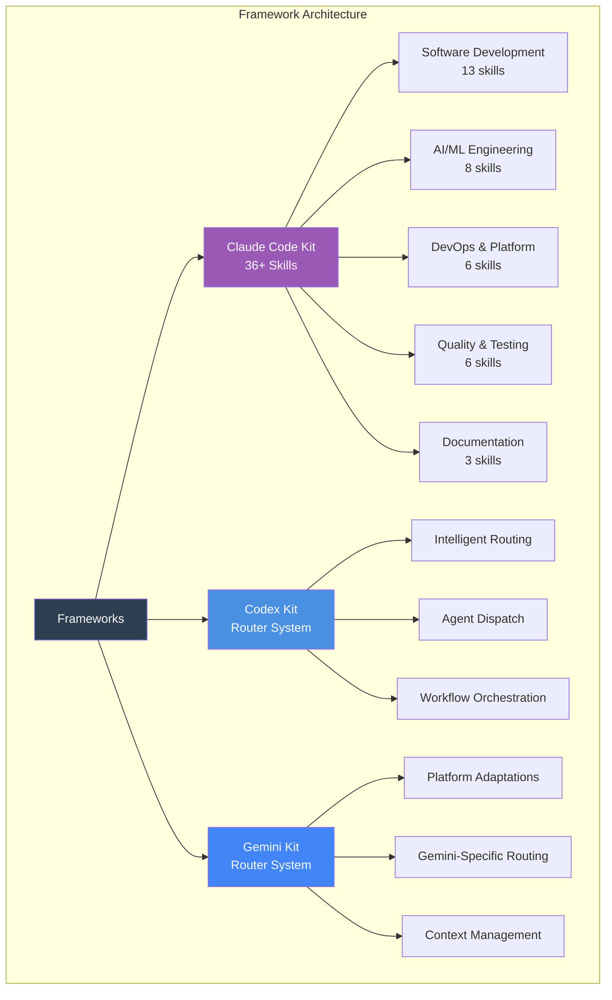
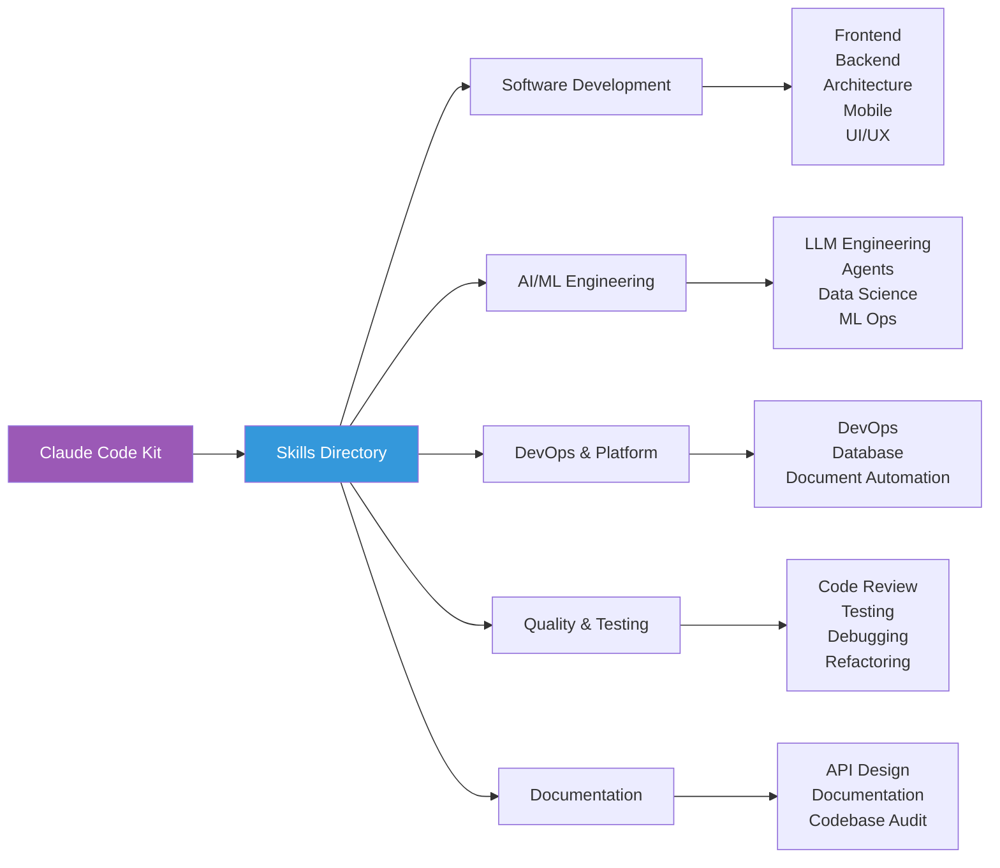
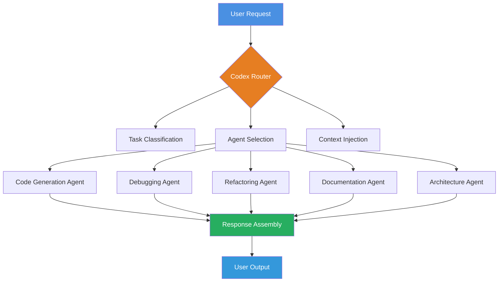
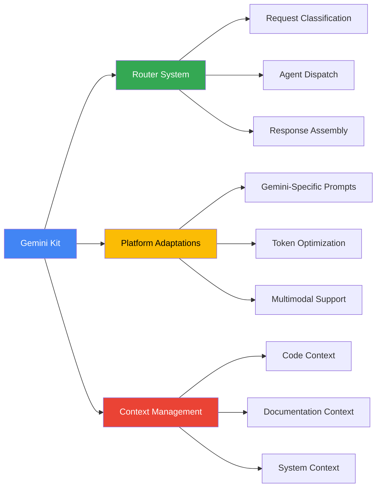

# AI Agent Development Frameworks

**Copy-paste ready development kits** for Claude Code, Codex, and Gemini platforms.

## Overview

This directory contains three complete development kits designed for different AI coding assistant platforms. Each kit is production-ready and can be dropped directly into your development environment.



## Claude Code Kit

**Complete `.claude/` workspace with 36+ production-ready skills.**

### Quick Install

```bash
# Clone repository
git clone https://github.com/vasilyu1983/AI-Agents-public
cd AI-Agents-public

# Copy skills to Claude Code workspace
cp -r frameworks/claude-code-kit/initial-setup/skills ~/.config/claude-code/skills/

# Verify installation
ls ~/.config/claude-code/skills/
```

### What's Included



### Skills Catalog

#### Software Development (13 skills)

**Frontend Development**

- `software-ui-ux-design` - UI/UX design patterns, accessibility, responsive design
- `software-mobile` - React Native, Flutter, Swift, Kotlin mobile development

**Backend Development**

- `software-backend` - Node.js, Python, Go, Rust backend architectures
- `software-architecture-design` - System design, microservices, event-driven patterns
- `software-security-appsec` - OWASP, secure coding, vulnerability assessment

**Product Development**

- `product-prd-development` - PRDs, user stories, technical specifications

#### AI/ML Engineering (8 skills)

**LLM & Agents**

- `ai-llm-engineering` - LLM integration, fine-tuning, RAG systems
- `ai-agents-development` - Autonomous agents, multi-agent orchestration
- `ai-llm-development` - Prompt engineering, LLM application development
- `ai-llm-rag-engineering` - Retrieval-augmented generation pipelines

**ML Operations**

- `ai-ml-data-science` - ML model development, feature engineering
- `ai-ml-ops-production` - MLOps, model deployment, monitoring
- `ai-ml-ops-security` - ML security, adversarial robustness
- `ai-llm-search-retrieval` - Vector search, semantic retrieval systems

#### DevOps & Platform (6 skills)

- `ops-devops-platform` - Kubernetes, CI/CD, infrastructure automation
- `ops-database-sql` - PostgreSQL, MySQL, MongoDB optimization
- `ops-document-automation` - Document generation, template systems

#### Quality & Testing (6 skills)

- `software-code-review` - Code review best practices, PR analysis
- `software-testing-automation` - Test frameworks, E2E testing, coverage
- `quality-debugging-troubleshooting` - Debugging strategies, root cause analysis
- `quality-code-refactoring` - Refactoring patterns, technical debt reduction
- `quality-resilience-patterns` - Fault tolerance, circuit breakers, retry logic
- `quality-observability-performance` - Monitoring, logging, performance optimization

#### Documentation (3 skills)

- `foundation-api-design` - REST/GraphQL API design, OpenAPI specs
- `foundation-documentation` - Technical writing, documentation systems
- `codebase-documentation-audit` - Code documentation review, improvement

### Skill Structure

Each skill follows a consistent pattern:

```
skill-name/
├── SKILL.md              # Skill definition and documentation
├── resources/            # Reference materials and guides
│   ├── best-practices.md
│   ├── patterns.md
│   └── references.md
├── templates/            # Code templates and scaffolds
│   ├── template-1.md
│   └── template-2.md
└── data/                 # Structured data and sources
    └── sources.json
```

### Usage in Claude Code

```bash
# Skills auto-activate based on file context and user requests
# Example: Opening a React file activates software-ui-ux-design

# Manual activation
/skill software-backend

# List available skills
/skills
```

### Platform Features

- **Context-Aware Activation**: Skills auto-activate based on file types
- **Resource Integration**: Templates and patterns available in-context
- **Production-Ready**: Tested patterns and best practices
- **Extensible**: Easy to add custom skills

## Codex Kit

**Router-based system for Codex CLI with intelligent agent dispatch.**

### Architecture



### Installation

```bash
# Copy router configuration
cp -r frameworks/codex-kit/initial-setup/ ~/.codex/

# Verify installation
cat ~/.codex/codex-router.yaml
```

### Router Configuration

The `codex-router.yaml` defines:

- **Agent Dispatch Rules**: Route requests to appropriate agents
- **Context Management**: Inject relevant context per task type
- **Workflow Orchestration**: Multi-step task coordination
- **Fallback Handling**: Default behavior for unclassified requests

### Key Features

- **Intelligent Routing**: Analyzes request intent and routes to specialist agents
- **Context Injection**: Provides relevant codebase context per agent type
- **Multi-Agent Workflows**: Orchestrates complex multi-step tasks
- **Testing Framework**: Comprehensive router behavior tests

### Router Workflow

```yaml
# Example routing rule
routes:
  - pattern: "debug|fix|error"
    agent: debugging-agent
    context: ["error logs", "stack traces", "recent changes"]

  - pattern: "refactor|improve|optimize"
    agent: refactoring-agent
    context: ["code metrics", "design patterns", "best practices"]

  - pattern: "design|architecture|system"
    agent: architecture-agent
    context: ["system diagrams", "tech stack", "scalability requirements"]
```

## Gemini Kit

**Gemini-optimized router system with platform-specific adaptations.**

### Installation

```bash
# Copy Gemini router
cp -r frameworks/gemini-kit/initial-setup/ ~/.gemini/

# Verify configuration
cat ~/.gemini/gemini-router.yaml
```

### Platform Optimizations



### Gemini-Specific Features

- **Multimodal Context**: Handles code, diagrams, and documentation
- **Optimized Prompts**: Tuned for Gemini's reasoning patterns
- **Token Efficiency**: Platform-specific optimization strategies
- **Extended Context**: Leverages Gemini's large context window

## Comparison Matrix

| Feature | Claude Code Kit | Codex Kit | Gemini Kit |
|---------|----------------|-----------|------------|
| **Skills** | 36+ specialized skills | Router-based dispatch | Router-based dispatch |
| **Installation** | Copy skills directory | Copy router config | Copy router config |
| **Context Management** | Auto-activation | Rule-based injection | Multimodal context |
| **Platform** | Claude Code | Codex CLI | Gemini |
| **Customization** | Add/modify skills | Edit router rules | Edit router rules |
| **Best For** | Comprehensive development | Task-specific workflows | Multimodal projects |

## Common Workflows

### Claude Code Kit

```bash
# 1. Install skills
cp -r frameworks/claude-code-kit/initial-setup/skills ~/.config/claude-code/skills/

# 2. Open project in Claude Code
cd your-project

# 3. Skills auto-activate based on context
# Example: Open React component → software-ui-ux-design activates

# 4. Manual skill activation
/skill ai-llm-engineering

# 5. Access templates
# Templates available through skill commands
```

### Codex Kit

```bash
# 1. Install router
cp -r frameworks/codex-kit/initial-setup/ ~/.codex/

# 2. Configure routing rules
vim ~/.codex/codex-router.yaml

# 3. Use Codex with router
codex "debug authentication error"
# → Routes to debugging-agent with error context

codex "design scalable API architecture"
# → Routes to architecture-agent with system context
```

### Gemini Kit

```bash
# 1. Install Gemini router
cp -r frameworks/gemini-kit/initial-setup/ ~/.gemini/

# 2. Configure Gemini-specific optimizations
vim ~/.gemini/gemini-router.yaml

# 3. Use with multimodal context
gemini "explain this architecture diagram and suggest improvements"
# → Handles image + code context
```

## Customization

### Adding a Claude Code Skill

1. Create skill directory:

```bash
mkdir -p ~/.config/claude-code/skills/your-skill-name
```

2. Create `SKILL.md`:

```markdown
# Your Skill Name

Description of what this skill does.

## Activation Triggers

- File patterns: *.ext
- Keywords: keyword1, keyword2

## Resources

- Resource 1
- Resource 2

## Templates

- Template 1
- Template 2
```

3. Add resources and templates subdirectories

4. Test activation

### Modifying Router Rules

Edit the router YAML file:

```yaml
# codex-router.yaml or gemini-router.yaml
routes:
  - pattern: "your pattern"
    agent: your-agent-name
    context: ["context1", "context2"]
    priority: high
```

## Best Practices

### Claude Code Kit

- **Skill Organization**: Group related templates in skill subdirectories
- **Resource Curation**: Keep resources focused and up-to-date
- **Template Quality**: Test templates before committing
- **Documentation**: Maintain clear SKILL.md files

### Router Systems (Codex/Gemini)

- **Pattern Specificity**: Use specific patterns for accurate routing
- **Context Relevance**: Inject only necessary context per agent
- **Fallback Handling**: Define default behavior for unmatched requests
- **Testing**: Use router test suites to validate behavior

## Troubleshooting

### Claude Code Kit

**Skills not activating**:

```bash
# Check skills directory
ls ~/.config/claude-code/skills/

# Verify SKILL.md format
cat ~/.config/claude-code/skills/skill-name/SKILL.md

# Check Claude Code logs
tail -f ~/.config/claude-code/logs/skills.log
```

**Template not loading**:

- Verify template path in SKILL.md
- Check file permissions
- Ensure proper markdown formatting

### Router Systems

**Agent not routing**:

- Check pattern matching in router.yaml
- Verify agent definitions
- Review router logs

**Context not injecting**:

- Validate context sources
- Check context availability
- Review injection rules

## Resources

### Official Documentation

- [Claude Code Skills](https://github.com/anthropics/claude-code/blob/main/docs/skills.md)
- [Claude Code Documentation](https://github.com/anthropics/claude-code)

### Community

- **Issues**: [GitHub Issues](https://github.com/vasilyu1983/AI-Agents-public/issues)
- **Discussions**: [GitHub Discussions](https://github.com/vasilyu1983/AI-Agents-public/discussions)

---

**[← Back to Main README](../README.md)** | **[View Custom GPTs →](../custom-gpt/README.md)**
