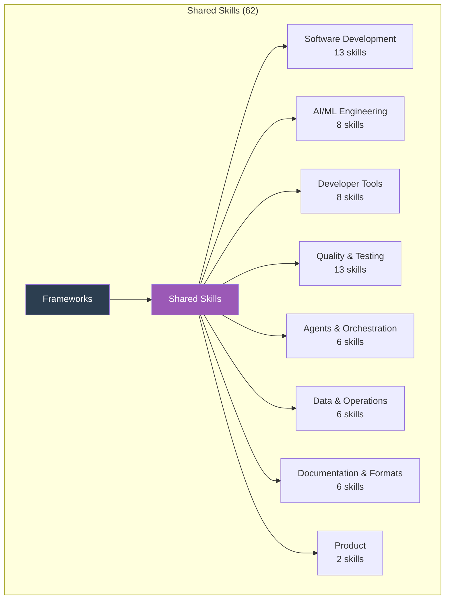

# AI Agent Development Frameworks

**Reusable skills for AI coding agents** — Claude Code, Codex CLI, and Gemini CLI.

## Overview

This directory contains production-ready skills that can be dropped directly into your AI coding agent workspace. Skills are platform-agnostic and work with any agent that supports the [Agent Skills specification](https://agentskills.io/specification).


```mermaid
graph TB
    subgraph "Shared Skills (62)"
        A[Frameworks] --> B[Shared Skills]

        B --> B1[Software Development<br/>13 skills]
        B --> B2[AI/ML Engineering<br/>8 skills]
        B --> B3[Developer Tools<br/>8 skills]
        B --> B4[Quality & Testing<br/>13 skills]
        B --> B5[Agents & Orchestration<br/>6 skills]
        B --> B6[Data & Operations<br/>6 skills]
        B --> B7[Documentation & Formats<br/>6 skills]
        B --> B8[Product<br/>2 skills]
    end

    style A fill:#2C3E50,color:#fff
    style B fill:#9B59B6,color:#fff
```

## Shared Skills

**62 production-ready skills** organized by domain.

### Quick Install

```bash
# Clone repository
git clone https://github.com/vasilyu1983/AI-Agents-public
cd AI-Agents-public

# Copy skills to Claude Code workspace
cp -r frameworks/shared-skills/skills/ /path/to/your/repo/.claude/skills/

# Or for Codex CLI
cp -r frameworks/shared-skills/skills/ /path/to/your/repo/.codex/skills/

# Verify installation
ls /path/to/your/repo/.claude/skills/
```

### What's Included

| Domain | Count | Examples |
|--------|-------|---------|
| **Software Development** | 13 | Frontend, backend, C#/.NET, mobile, architecture, security, payments, crypto |
| **AI/ML Engineering** | 8 | LLMs, agents, RAG, MLOps, data science, inference, prompt engineering |
| **Quality & Testing** | 13 | Test strategy, Playwright, iOS/Android, NUnit, debugging, observability, resilience |
| **Developer Tools** | 8 | API design, git workflow, dependency management, structured logs, context engineering |
| **Agents & Orchestration** | 6 | Subagents, hooks, MCP servers, project memory, skills authoring, swarm orchestration |
| **Data** | 4 | Analytics engineering, data lake, SQL optimization, Metabase |
| **Documentation** | 2 | AI-friendly PRDs, codebase documentation |
| **Document Formats** | 4 | PDF, DOCX, XLSX, PPTX processing |
| **Operations** | 2 | DevOps/platform engineering, NUKE CI/CD |
| **Product** | 2 | Product management, help center design |

**Total**: 62 skills

### Skill Structure

Each skill follows a consistent pattern:

```
skill-name/
├── SKILL.md              # Skill definition and documentation
├── references/           # Operational guides and patterns
├── data/                 # Curated web resources
│   └── sources.json
└── assets/               # Templates and scaffolds
```

### Example Usage

```
You: "Help me design a REST API for task management"
→ dev-api-design + software-backend

You: "Set up E2E testing for my React app"
→ qa-testing-playwright + qa-testing-strategy

You: "Build an MCP server for my database"
→ agents-mcp

You: "Review this pull request"
→ software-code-review
```

### Platform Support

Skills work with any AI coding agent that reads markdown skill files:

| Platform | Workspace Path | Installation |
|----------|---------------|--------------|
| **Claude Code** | `.claude/skills/` | `cp -r skills/ .claude/skills/` |
| **Codex CLI** | `.codex/skills/` | `cp -r skills/ .codex/skills/` |
| **Gemini CLI** | `.gemini/skills/` | Via GEMINI.md configuration |

### Platform Features

- **Context-Aware Activation**: Skills auto-activate based on file types and user requests
- **Resource Integration**: Templates and patterns available in-context
- **Production-Ready**: Tested patterns and best practices
- **Extensible**: Easy to add custom skills

## Customization

### Adding a New Skill

1. Create skill directory:

```bash
mkdir -p .claude/skills/your-skill-name
```

2. Create `SKILL.md`:

```markdown
---
name: your-skill-name
description: One-line description of what this skill does
---

# Your Skill Name

Description of what this skill does.

## When to Use This Skill

- Trigger condition 1
- Trigger condition 2

## Quick Reference

- Pattern 1
- Pattern 2
```

3. Add `references/` and `data/` subdirectories as needed

4. Test activation in your AI coding agent

## Resources

### Official Documentation

- [Agent Skills Specification](https://agentskills.io/specification)
- [Claude Code Skills](https://docs.anthropic.com/en/docs/claude-code/skills)
- [Claude Code Documentation](https://github.com/anthropics/claude-code)

### Community

- **Issues**: [GitHub Issues](https://github.com/vasilyu1983/AI-Agents-public/issues)
- **Discussions**: [GitHub Discussions](https://github.com/vasilyu1983/AI-Agents-public/discussions)
- **Twitter**: Follow [@vasilyu](https://twitter.com/vasilyu) for updates

---

**[Back to Main README](../README.md)**
