# Claude Code Kit Architecture Diagram

This diagram visualizes the complete ecosystem of hooks, commands, agents, and skills in the framework.

## System Architecture Overview


---

## Complete Command → Agent → Skill Flow

```mermaid
%%{init: {'theme':'base', 'themeVariables': { 'fontSize':'16px', 'fontFamily':'arial', 'primaryColor':'#1e1e1e', 'primaryTextColor':'#ffffff', 'lineColor':'#00D9FF', 'edgeLabelBackground':'#1e1e1e'}}}%%
graph TB
    subgraph "User Commands (20 total)"
        cmd_agent_arch["/agent-arch<br/>Design Agent Architecture"]
        cmd_agent_eval["/agent-eval<br/>Evaluate Agent"]
        cmd_agent_plan["/agent-plan<br/>Plan Agent Implementation"]
        cmd_ds_deploy["/ds-deploy<br/>Deploy ML Model"]
        cmd_prd_validate["/prd-validate<br/>Validate PRD"]
        cmd_tech_spec["/tech-spec<br/>Technical Specification"]
        cmd_prompt_validate["/prompt-validate<br/>Validate Prompt"]
        cmd_fullstack["/fullstack-dev<br/>Fullstack Application"]
        cmd_review["/review<br/>Code Review"]
        cmd_security["/security-scan<br/>Security Scan"]
        cmd_test_plan["/test-plan<br/>Test Strategy"]
        cmd_coverage["/coverage-check<br/>Coverage Analysis"]
        cmd_design["/design-system<br/>System Design"]
        cmd_arch_review["/architecture-review<br/>Architecture Review"]
        cmd_smm_plan["/smm-plan<br/>Social Media Strategy"]
        cmd_pm_strategy["/pm-strategy<br/>Product Strategy"]
        cmd_pm_roadmap["/pm-roadmap<br/>Product Roadmap"]
        cmd_pm_discovery["/pm-discovery<br/>Discovery Plan"]
        cmd_pm_okrs["/pm-okrs<br/>OKRs & Metrics"]
        cmd_pm_positioning["/pm-positioning<br/>Positioning"]
    end

    subgraph "Orchestration Agents (18 total)"
        agent_ds["data-scientist<br/>Data Science & ML"]
        agent_llm["llm-engineer<br/>LLM Development"]
        agent_ai_agents["ai-agents-builder<br/>AI Agent Development"]
        agent_backend["backend-engineer<br/>Backend APIs"]
        agent_frontend["frontend-engineer<br/>Frontend UIs"]
        agent_mobile["mobile-engineer<br/>Mobile Apps"]
        agent_crypto["crypto-engineer<br/>Web3 & Blockchain"]
        agent_devops["devops-engineer<br/>DevOps & Infrastructure"]
        agent_prd["prd-architect<br/>Product Requirements"]
        agent_prompt["prompt-engineer<br/>Prompt Engineering"]
        agent_sql["sql-engineer<br/>Database & SQL"]
        agent_code_reviewer["code-reviewer<br/>Code Quality"]
        agent_test_architect["test-architect<br/>Test Strategy & QA"]
        agent_sys_architect["system-architect<br/>System Design"]
        agent_security["security-specialist<br/>Security & AppSec"]
        agent_pm["product-manager<br/>Product Strategy"]
        agent_smm["smm-strategist<br/>Social Media Marketing"]
    end

    subgraph "Core AI/ML Skills (7)"
        skill_ai_agents["ai-agents<br/>Agent Arch, Tools, Memory"]
        skill_ds_suite["ai-ml-data-science<br/>EDA, Features, Training, Eval"]
        skill_mlops["ai-mlops<br/>Deployment, Monitoring, Ops"]
        skill_timeseries["ai-ml-timeseries<br/>Time Series Analysis"]
        skill_llm["ai-llm<br/>RAG, Agents, Fine-tuning, LLMOps"]
        skill_llm_inference["ai-llm-inference<br/>Serving, Quantization, vLLM"]
        skill_rag["ai-rag<br/>Retrieval, Embeddings, VectorDB"]
    end

    subgraph "Core Software Skills (7)"
        skill_backend["software-backend<br/>APIs, Auth, Database"]
        skill_frontend["software-frontend<br/>Next.js, Vue, Angular, Svelte, Remix, Vite (Multi-framework)"]
        skill_mobile["software-mobile<br/>iOS, Android, React Native"]
        skill_crypto["software-crypto-web3<br/>Solidity, Rust, Smart Contracts"]
        skill_code_review["software-code-review<br/>Quality, Best Practices"]
        skill_sw_arch["software-architecture-design<br/>System Design, Patterns"]
        skill_security["software-security-appsec<br/>AppSec, Threat Modeling"]
    end

    subgraph "Testing Skills (3)"
        skill_testing["testing-automation<br/>Test Strategies, Jest, Pytest"]
        skill_playwright["testing-webapp-playwright<br/>E2E Web Testing"]
        skill_ios_sim["testing-ios-simulator<br/>iOS Simulator, XCTest"]
    end

    subgraph "Operations Skills (4)"
        skill_devops["ops-devops-platform<br/>IaC, CI/CD, K8s, Cloud"]
        skill_sql["ops-database-sql<br/>Query Optimization, Schema"]
        skill_metabase["ops-database-metabase<br/>BI, Dashboards, Analytics"]
        skill_doc_automation["ops-document-automation<br/>Document Processing"]
    end

    subgraph "Product & Marketing Skills (5)"
        skill_prd["product-prd-for-agents<br/>PRD, Discovery, Specs"]
        skill_product_mgmt["product-management<br/>Product Strategy, Roadmaps"]
        skill_ai_search["marketing-ai-search-optimization<br/>AEO/GEO for AI Search"]
        skill_smm["marketing-social-media<br/>Content, Campaigns, Analytics"]
        skill_seo["marketing-seo-technical<br/>Technical SEO, Schema"]
    end

    subgraph "Foundation Skills (5)"
        skill_api["foundation-api-design<br/>REST, GraphQL, gRPC"]
        skill_docs["foundation-documentation<br/>Technical Writing, Guides"]
        skill_git["foundation-git-workflow<br/>Version Control, Branching"]
        skill_git_commit["foundation-git-commit-message<br/>Conventional Commits"]
        skill_deps["foundation-dependency-management<br/>Package Management"]
    end

    subgraph "Quality & Observability Skills (5)"
        skill_debug["quality-debugging-troubleshooting<br/>Root Cause Analysis"]
        skill_refactor["quality-code-refactoring<br/>Code Improvement"]
        skill_resilience["quality-resilience-patterns<br/>Error Handling, Retry"]
        skill_observability["quality-observability-performance<br/>Monitoring, Metrics"]
        skill_doc_audit["quality-documentation-audit<br/>Coverage, Audit"]
    end

    subgraph "Document Skills (4)"
        skill_docx["document-docx<br/>Word Documents"]
        skill_pdf["document-pdf<br/>PDF Generation, Extraction"]
        skill_xlsx["document-xlsx<br/>Excel Spreadsheets"]
        skill_pptx["document-pptx<br/>PowerPoint Presentations"]
    end

    subgraph "Workflow & Prompts Skills (3)"
        skill_prompts["ai-prompts<br/>Prompt Design, Optimization"]
        skill_workflow["workflow-planning<br/>Brainstorm, Plan, Execute"]
        skill_ui_ux["software-ui-ux-design<br/>Design Systems, Accessibility"]
    end

    subgraph "Claude Code Meta-Skills (6)"
        skill_cc_skills["claude-code-skills<br/>Skill Creation Reference"]
        skill_cc_agents["claude-code-agents<br/>Agent Development"]
        skill_cc_commands["claude-code-commands<br/>Slash Commands"]
        skill_cc_hooks["claude-code-hooks<br/>Event Automation"]
        skill_cc_mcp["claude-code-mcp<br/>MCP Configuration"]
        skill_cc_memory["claude-code-project-memory<br/>CLAUDE.md, 4-tier"]
    end

    %% AI Agent Commands → Agents → Skills
    cmd_agent_arch --> agent_ai_agents --> skill_ai_agents
    cmd_agent_eval --> agent_ai_agents
    cmd_agent_plan --> agent_ai_agents

    %% Data Science Deploy Command → Agent → Skills
    cmd_ds_deploy --> agent_ds --> skill_mlops
    agent_ds --> skill_ds_suite

    %% PRD Commands → Agent → Skills
    cmd_prd_validate --> agent_prd --> skill_prd
    cmd_tech_spec --> agent_prd

    %% Prompt Validation Command → Agent → Skill
    cmd_prompt_validate --> agent_prompt --> skill_prompts

    %% Fullstack Command → Agents → Skills
    cmd_fullstack --> agent_backend --> skill_backend
    cmd_fullstack --> agent_frontend --> skill_frontend
    cmd_fullstack -.-> agent_mobile --> skill_mobile

    %% Code Review Commands → Agent → Skills
    cmd_review --> agent_code_reviewer --> skill_code_review
    cmd_security --> agent_security --> skill_security

    %% Test Commands → Agent → Skills
    cmd_test_plan --> agent_test_architect --> skill_testing
    cmd_coverage --> agent_test_architect

    %% Debugging Support (Cross-Cutting)
    agent_code_reviewer -.->|debugging| skill_debug
    agent_devops -.->|troubleshooting| skill_debug

    %% Architecture Commands → Agent → Skills
    cmd_design --> agent_sys_architect --> skill_sw_arch
    cmd_arch_review --> agent_sys_architect

    %% Social Media Command → Agent → Skill
    cmd_smm_plan --> agent_smm --> skill_smm

    %% Product Management Commands → Agent → Skill
    cmd_pm_strategy --> agent_pm --> skill_product_mgmt
    cmd_pm_roadmap --> agent_pm
    cmd_pm_discovery --> agent_pm
    cmd_pm_okrs --> agent_pm
    cmd_pm_positioning --> agent_pm

    %% LLM Engineer → Multiple Skills
    agent_llm -->|Primary| skill_llm
    agent_llm -.->|Serving| skill_llm_inference
    agent_llm -.->|RAG| skill_rag

    %% Crypto Engineer → Skills
    agent_crypto --> skill_crypto
    agent_crypto -.->|Backend| skill_backend
    agent_crypto -.->|Security| skill_security

    %% DevOps Engineer → Skills
    agent_devops --> skill_devops

    %% SQL Engineer → Skills
    agent_sql --> skill_sql

    %% Product Manager → Skills
    agent_pm --> skill_product_mgmt

    %% Styling
    style cmd_fullstack fill:#e1f5ff,stroke:#0066cc,stroke-width:3px,color:#000000

    linkStyle default stroke:#00D9FF,stroke-width:2.5px
```



**Legend**:
- **Red** (stroke:#cc0000) - Automation hooks (event-driven layer)
- **Blue** (stroke:#0066cc) - User-facing slash commands (entry points)
- **Yellow** (stroke:#cc9900) - Agent orchestrators (coordinate work)
- **Green** (stroke:#009900) - Core skills (primary capabilities)
- **Purple** (stroke:#990099) - Specialized skills (contextual use)
- **Solid lines** → Primary/direct relationships
- **Dotted lines** -.-> Secondary/conditional relationships

---

## Hooks System Architecture


**Hook Execution Flow**:
1. **session-start-init.sh** - Runs once at session start, sets up environment
2. **pre-tool-validate.sh** - Runs before EVERY tool execution, validates inputs
3. **post-tool-audit.sh** - Runs after tool execution, checks security and quality
4. **post-tool-format.sh** - Runs after code changes, enforces formatting standards
5. **post-tool-notify.sh** - Runs after significant operations, sends notifications
6. **post-tool-cost-tracker.sh** - Runs after API calls, tracks token usage and costs
7. **stop-run-tests.sh** - Runs on test commands, controls test execution

---

## Skills Taxonomy (50 Total)

### AI/ML Skills (7)

**Agent & LLM Development**:

- `ai-agents` - Agent architecture, tools, memory, multi-agent systems
- `ai-llm` - RAG pipelines, fine-tuning, agentic workflows, LLMOps
- `ai-llm-inference` - Serving optimization, quantization, vLLM, cost reduction
- `ai-rag` - Retrieval, embeddings, vector databases, reranking
- `ai-prompts` - Prompt design, optimization, systematic testing

**Data Science & ML**:

- `ai-ml-data-science` - EDA, feature engineering, model training, evaluation
- `ai-ml-timeseries` - Time series forecasting, seasonality, trend analysis
- `ai-mlops` - ML deployment, monitoring, drift detection, governance

### Software Development Skills (7)

**Core Development**:

- `software-backend` - APIs, authentication, databases (Node.js, Go, Rust, Python)
- `software-frontend` - Multi-framework (Next.js 15, Vue/Nuxt 3, Angular 18, Svelte 5, Remix, Vite+React)
- `software-mobile` - iOS (Swift/SwiftUI), Android (Kotlin/Compose), React Native
- `software-crypto-web3` - Solidity, Rust, smart contracts, DeFi, NFTs
- `software-ui-ux-design` - Design systems, accessibility, WCAG compliance
- `software-code-review` - Code quality, best practices, security patterns
- `software-architecture-design` - System design, microservices, event-driven
- `software-security-appsec` - AppSec, OWASP Top 10, threat modeling, secure SDLC

### Testing Skills (3)

- `testing-automation` - Test strategies, Jest, Pytest, E2E testing
- `testing-webapp-playwright` - E2E web testing with Playwright
- `testing-ios-simulator` - iOS simulator automation, XCTest, screenshot capture

### Operations Skills (4)

- `ops-devops-platform` - IaC, CI/CD, Kubernetes, Docker, cloud platforms
- `ops-database-sql` - Query optimization, indexing, schema design, PostgreSQL
- `ops-database-metabase` - BI dashboards, analytics, data visualization
- `ops-document-automation` - Document processing, automation workflows

### Foundation Skills (5)

- `foundation-api-design` - REST, GraphQL, gRPC, OpenAPI, API versioning
- `foundation-documentation` - Technical writing, API docs, user guides
- `foundation-git-workflow` - Git workflows, branching strategies, PR reviews
- `foundation-git-commit-message` - Conventional commits, commit message standards
- `foundation-dependency-management` - Package management, lockfiles, vulnerability scanning

### Quality & Observability Skills (5)

- `quality-debugging-troubleshooting` - Root cause analysis, systematic debugging
- `quality-code-refactoring` - Code improvement, tech debt reduction
- `quality-resilience-patterns` - Error handling, circuit breakers, retry logic
- `quality-observability-performance` - Monitoring, metrics, APM, profiling
- `quality-documentation-audit` - Documentation coverage, audit workflows

### Product & Marketing Skills (6)

- `product-prd-for-agents` - PRD templates, user stories, technical specs for AI agents
- `product-management` - Product strategy, roadmaps, stakeholder management
- `marketing-ai-search-optimization` - AI search optimization (AEO/GEO/LLMO) for ChatGPT, Perplexity, Claude, Gemini
- `marketing-social-media` - Content creation, campaigns, social media analytics
- `marketing-leads-generation` - Lead generation strategies, funnels, conversion
- `marketing-seo-technical` - Technical SEO, schema markup, site structure

### Document Skills (4)

- `document-docx` - Create/edit Word documents, templates, tracked changes
- `document-pdf` - PDF generation, extraction, merge/split, forms
- `document-xlsx` - Excel spreadsheets, formulas, charts, data analysis
- `document-pptx` - PowerPoint presentations, layouts, charts, automation

### Workflow Skills (2)

- `workflow-planning` - Structured development with /brainstorm, /write-plan, /execute-plan
- `software-ui-ux-design` - Design systems, accessibility, WCAG compliance

### Claude Code Meta-Skills (6)

- `claude-code-skills` - Skill creation reference, progressive disclosure, SKILL.md
- `claude-code-agents` - Agent creation, YAML frontmatter, tools, models
- `claude-code-commands` - Slash command creation, $ARGUMENTS, patterns
- `claude-code-hooks` - Event automation, PreToolUse/PostToolUse, security
- `claude-code-mcp` - MCP configuration, .mcp.json, server setup
- `claude-code-project-memory` - CLAUDE.md project memory, 4-tier hierarchy

---

## Agent → Skill Mapping (18 Agents)

**AI/ML Agents (3)**:

1. **data-scientist** → ai-ml-data-science, ai-mlops, ai-ml-timeseries
2. **llm-engineer** → ai-llm, ai-llm-inference, ai-rag
3. **ai-agents-builder** → ai-agents, ai-llm

**Development Agents (7)**:

4. **backend-engineer** → software-backend, foundation-api-design, ops-database-sql
5. **frontend-engineer** → software-frontend, software-ui-ux-design
6. **mobile-engineer** → software-mobile, software-ui-ux-design
7. **crypto-engineer** → software-crypto-web3, software-backend, software-security-appsec
8. **devops-engineer** → ops-devops-platform, foundation-dependency-management
9. **sql-engineer** → ops-database-sql, ops-database-metabase
10. **security-specialist** → software-security-appsec, software-code-review

**Quality Agents (2)**:

11. **code-reviewer** → software-code-review, quality-code-refactoring, quality-debugging-troubleshooting
12. **test-architect** → testing-automation, testing-webapp-playwright, quality-resilience-patterns

**Architecture & Strategy Agents (3)**:

13. **system-architect** → software-architecture-design, ops-devops-platform
14. **product-manager** → product-management, product-prd-for-agents
15. **prd-architect** → product-prd-for-agents, foundation-documentation

**Specialized Agents (3)**:

16. **prompt-engineer** → ai-prompts, ai-llm
17. **smm-strategist** → marketing-social-media, marketing-seo-technical

---

## Command → Agent → Skill Relationships (20 Commands)

**AI Agent Commands (3)**:

- `/agent-arch` → ai-agents-builder → ai-agents
- `/agent-eval` → ai-agents-builder → ai-agents
- `/agent-plan` → ai-agents-builder → ai-agents

**Development Commands (2)**:

- `/fullstack-dev` → backend-engineer + frontend-engineer + mobile-engineer → software-backend + software-frontend + software-mobile
- `/ds-deploy` → data-scientist → ai-mlops

**Quality Commands (4)**:

- `/review` → code-reviewer → software-code-review
- `/security-scan` → security-specialist → software-security-appsec
- `/test-plan` → test-architect → testing-automation
- `/coverage-check` → test-architect → testing-automation

**Architecture Commands (2)**:

- `/design-system` → system-architect → software-architecture-design
- `/architecture-review` → system-architect → software-architecture-design

**Validation Commands (2)**:

- `/prd-validate` → prd-architect → product-prd-for-agents
- `/prompt-validate` → prompt-engineer → ai-prompts

**Product Management Commands (5)**:

- `/pm-strategy` → product-manager → product-management
- `/pm-roadmap` → product-manager → product-management
- `/pm-discovery` → product-manager → product-management
- `/pm-okrs` → product-manager → product-management
- `/pm-positioning` → product-manager → product-management

**Marketing & Specification Commands (2)**:

- `/tech-spec` → prd-architect → product-prd-for-agents
- `/smm-plan` → smm-strategist → marketing-social-media

---

## Skill Dependencies & Relationships

```mermaid
%%{init: {'theme':'base', 'themeVariables': { 'fontSize':'16px', 'fontFamily':'arial', 'primaryColor':'#1e1e1e', 'primaryTextColor':'#ffffff', 'lineColor':'#00D9FF', 'edgeLabelBackground':'#1e1e1e'}}}%%
graph TB
    subgraph "AI/ML Stack"
        ai_agents["ai-agents"]
        ds_suite["ai-ml-data-science"]
        mlops["ai-mlops"]
        llm["ai-llm"]
        llm_inference["ai-llm-inference"]
        rag["ai-rag"]
        prompts["ai-prompts"]
    end

    subgraph "Software Stack"
        backend["software-backend"]
        frontend["software-frontend"]
        mobile["software-mobile"]
        crypto["software-crypto-web3"]
        security["software-security-appsec"]
    end

    subgraph "Operations Stack"
        devops["ops-devops-platform"]
        sql["ops-database-sql"]
        metabase["ops-database-metabase"]
    end

    subgraph "Quality Stack"
        code_review["software-code-review"]
        testing["testing-automation"]
        debug["quality-debugging-troubleshooting"]
        observability["quality-observability-performance"]
    end

    %% Dependencies
    ai_agents -.->|uses| llm
    ai_agents -.->|uses| prompts
    ds_suite -.->|deploys to| mlops
    llm -->|includes| rag
    llm -.->|serving| llm_inference

    backend -.->|deploys to| devops
    frontend -.->|deploys to| devops
    mobile -.->|deploys to| devops
    crypto -.->|security| security

    mlops -.->|infrastructure| devops
    mlops -.->|data storage| sql

    backend -.->|quality| code_review
    backend -.->|testing| testing
    backend -.->|monitoring| observability
    backend -.->|debugging| debug

    %% Debugging is cross-cutting
    devops -.->|troubleshoots| debug
    observability -.->|feeds into| debug

    linkStyle default stroke:#00D9FF,stroke-width:2.5px
```



---

## Complete Inventory

### Hooks (7 total) - Automation Layer

**Session Management (1)**:
- `session-start-init.sh` - Environment setup, git status, dependency checks

**Pre-Execution (1)**:
- `pre-tool-validate.sh` - Syntax validation, security checks, prerequisites

**Post-Execution (4)**:
- `post-tool-audit.sh` - Security audits, code quality scans
- `post-tool-format.sh` - Auto-formatting, linting, style enforcement
- `post-tool-notify.sh` - Slack/Discord alerts, notifications
- `post-tool-cost-tracker.sh` - Token tracking, cost analytics, budget monitoring

**Test Control (1)**:
- `stop-run-tests.sh` - Test execution control, CI/CD integration

### Commands (20 total) - User Entry Points

**AI Agents (3)**:
- `/agent-arch` - Design AI agent architecture
- `/agent-eval` - Evaluate agent performance
- `/agent-plan` - Plan agent implementation

**Code Quality (2)**:
- `/review` - Comprehensive code review
- `/security-scan` - Security vulnerability scan

**Testing (2)**:
- `/test-plan` - Create test strategy
- `/coverage-check` - Analyze test coverage

**Architecture (2)**:
- `/design-system` - Design system architecture
- `/architecture-review` - Review existing architecture

**Validation (2)**:

- `/prd-validate` - Validate PRD completeness
- `/prompt-validate` - Validate prompt quality

**Product Management (5)**:

- `/pm-strategy` - Generate product strategy documents
- `/pm-roadmap` - Create outcome-based roadmaps
- `/pm-discovery` - Plan continuous discovery activities
- `/pm-okrs` - Define OKRs and metric trees
- `/pm-positioning` - Create strategic positioning

**Implementation (4)**:

- `/ds-deploy` - Deploy ML models to production
- `/tech-spec` - Generate technical specifications
- `/fullstack-dev` - Build complete fullstack applications
- `/smm-plan` - Create social media marketing strategy

### Agents (18 total) - Orchestration Layer

**AI/ML Specialists (3)**:
1. **data-scientist** - Data science and ML workflows
2. **llm-engineer** - LLM development and deployment
3. **ai-agents-builder** - AI agent architecture and patterns

**Software Engineers (7)**:
4. **backend-engineer** - Backend API development
5. **frontend-engineer** - Frontend UI development
6. **mobile-engineer** - Mobile app development
7. **crypto-engineer** - Web3 and blockchain development
8. **devops-engineer** - DevOps and infrastructure
9. **sql-engineer** - Database optimization and design
10. **security-specialist** - Security and application security

**Quality & Testing (2)**:
11. **code-reviewer** - Code quality and security review
12. **test-architect** - Test strategy and QA planning

**Architecture & Strategy (3)**:
13. **system-architect** - System design and architecture
14. **product-manager** - Product strategy and roadmaps
15. **prd-architect** - Product requirements and specs

**Specialized (3)**:
16. **prompt-engineer** - Prompt engineering and optimization
17. **smm-strategist** - Social media marketing strategy

### Skills (50 total) - Knowledge Base

See "Skills Taxonomy" section above for complete categorization.

---

## Architecture Patterns

**Four-Layer Architecture**:

```text
Layer 1: Automation (Hooks) - Event-driven orchestration
         ↓
Layer 2: User Interface (Commands) - Entry points and workflows
         ↓
Layer 3: Orchestration (Agents) - Intelligent coordination
         ↓
Layer 4: Knowledge (Skills) - Domain expertise and templates
```

**Pattern 1: Direct Command → Agent → Skill**
```text
/agent-arch → ai-agents-builder → ai-agents-development
```

**Pattern 2: Multi-Skill Orchestration**
```text
/fullstack-dev → backend-engineer + frontend-engineer + mobile-engineer
               ↓
               software-backend + software-frontend + software-mobile
```

**Pattern 3: Hook-Driven Automation**
```text
User Action → pre-tool-validate.sh → Tool Execution
            ↓
            post-tool-audit.sh + post-tool-format.sh + post-tool-notify.sh
```

**Pattern 4: Agent Intelligence Routing**
```text
llm-engineer → [analyzes request]
             ↓
             → ai-llm-engineering (RAG system)
             → ai-llm-development (fine-tuning)
             → ai-llm-ops-inference (serving optimization)
```

---

## Design Rationale

### Why Four Layers?

**Separation of Concerns**:
1. **Hooks** - Automation and cross-cutting concerns (security, quality, cost)
2. **Commands** - User workflows and multi-skill orchestration
3. **Agents** - Intelligent routing and context understanding
4. **Skills** - Domain knowledge and implementation patterns

### Why 18 Agents?

Comprehensive coverage across:
- AI/ML development (3 agents)
- Software engineering (7 agents)
- Quality assurance (2 agents)
- Architecture (3 agents)
- Product & Marketing (3 agents)

### Why 50 Skills?

**Granular expertise** organized into:

- AI/ML (7 skills) - Agents, LLM, RAG, prompts, MLOps
- Software (7 skills) - Backend, frontend, mobile, Web3, security
- Testing (3 skills) - Automation, Playwright, iOS simulator
- Operations (4 skills) - DevOps, databases, BI, document automation
- Foundation (5 skills) - API design, docs, git, commits, dependencies
- Quality (5 skills) - Debugging, refactoring, resilience, observability, audit
- Product & Marketing (6 skills) - PRD, PM, SEO, social, leads
- Documents (4 skills) - DOCX, PDF, XLSX, PPTX
- Workflow (2 skills) - Planning, UI/UX
- Claude Code (6 skills) - Meta-skills for self-documentation

### Hook System Benefits

1. **Automated Quality** - Post-execution audits and formatting
2. **Cost Visibility** - Real-time token tracking and analytics
3. **Team Collaboration** - Slack/Discord notifications
4. **Security First** - Pre-execution validation and post-execution audits
5. **Environment Setup** - Session initialization and dependency checks

---

## Implementation Notes

**Peer Architecture**: Commands and Agents are peers that independently reference Skills. This enables:
- Multiple entry points to same knowledge
- No redundancy in skill definitions
- Clear separation of concerns
- Flexible routing and orchestration

**Skill Consolidation**: Virtual skills have been consolidated into real implementations:
- Data science skills merged into `ai-ml-data-science` and `ai-ml-ops-production`
- LLM skills split into engineering, development, and inference
- Foundation skills extracted for cross-cutting concerns

**Hook Configuration**: Hooks are configured via `.env` and `settings.json`:
- Enable/disable individual hooks
- Configure notification endpoints
- Set cost tracking thresholds
- Define formatting rules

**Dark Mode Optimization**: All diagrams follow mermaid-diagram-standards.md with:
- Dark theme (#1e1e1e background)
- High contrast colors (#00D9FF links)
- Accessible typography (16-18px arial)
- Clear visual hierarchy

---

## Related Documentation

**Framework Files**:

- [README.md](README.md) - Complete initial setup guide
- [HOOKS-GUIDE.md](hooks/HOOKS-GUIDE.md) - Complete hooks documentation
- [commands/](commands/) - All 20 command definitions
- [agents/](agents/) - All 18 agent specifications
- [skills/](skills/) - All 50 skill implementations

**Repository Root Files**:

- [CLAUDE.md](../../../CLAUDE.md) - Claude Code instructions
- [AGENTS.md](../../../AGENTS.md) - Repository standards
- [GEMINI.md](../../../GEMINI.md) - Gemini-specific notes
- [WARP.md](../../../WARP.md) - Warp terminal integration

**Related Kits**:

- [frameworks/README.md](../../README.md) - All development kits overview
- [codex-kit/](../../codex-kit/) - Codex CLI router
- [gemini-kit/](../../gemini-kit/) - Gemini CLI router

---

## Recent Updates

**(2025-12-03)**: Skills Consolidation & Expansion

- **Consolidated AI/LLM skills**: Merged `ai-llm-engineering`, `ai-llm-development` → `ai-llm`; Renamed `ai-agents-development` → `ai-agents`; Renamed `ai-llm-ops-inference` → `ai-llm-inference`; Renamed `ai-llm-rag-engineering` → `ai-rag`; Renamed `ai-prompt-engineering` → `ai-prompts`
- **Consolidated ML skills**: Merged `ai-ml-ops-production`, `ai-ml-ops-security` → `ai-mlops`
- **Reorganized testing skills**: Renamed `software-testing-automation` → `testing-automation`; Added `testing-webapp-playwright`, `testing-ios-simulator`
- **Added Document Suite** (4 skills): `document-docx`, `document-pdf`, `document-xlsx`, `document-pptx`
- **Added Claude Code Meta-Skills** (6 skills): `claude-code-skills`, `claude-code-agents`, `claude-code-commands`, `claude-code-hooks`, `claude-code-mcp`, `claude-code-project-memory`
- **Added Marketing**: `marketing-seo-technical` for technical SEO
- **Added Foundation**: `foundation-git-commit-message` for conventional commits
- **Renamed PRD skill**: `product-prd-development` → `product-prd-for-agents`
- **Renamed audit skill**: `codebase-documentation-audit` → `quality-documentation-audit`
- **Added Workflow**: `workflow-planning` for structured development
- Total skills: 50 (consolidated from 53, with new additions)
- Updated all diagrams, mappings, and documentation references
- Added links to root files: CLAUDE.md, AGENTS.md, GEMINI.md, WARP.md

**(2025-11-21)**: Product Management Commands Suite

- Added 5 product management slash commands: `/pm-strategy`, `/pm-roadmap`, `/pm-discovery`, `/pm-okrs`, `/pm-positioning`
- Connected commands to product-manager agent and product-management skill
- Updated command count from 15 to 20 across all diagrams

**(2025-11-20)**: Complete Architecture Overhaul

- Added hooks layer (7 automation scripts)
- Expanded from 14 to 18 agents (added crypto-engineer, security-specialist)
- Created four-layer architecture diagram (hooks → commands → agents → skills)
- Added comprehensive skill taxonomy and dependency maps
- Documented peer architecture pattern with real-world examples
