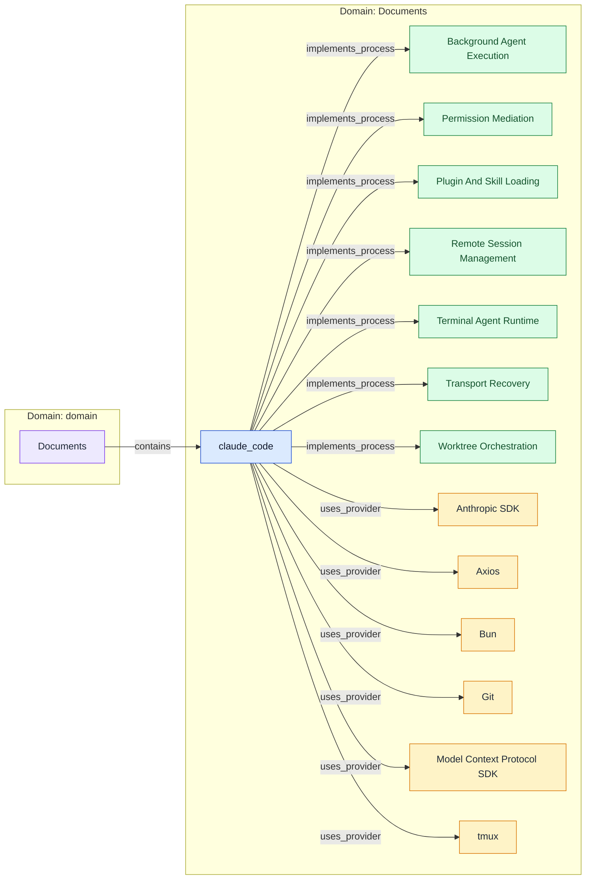
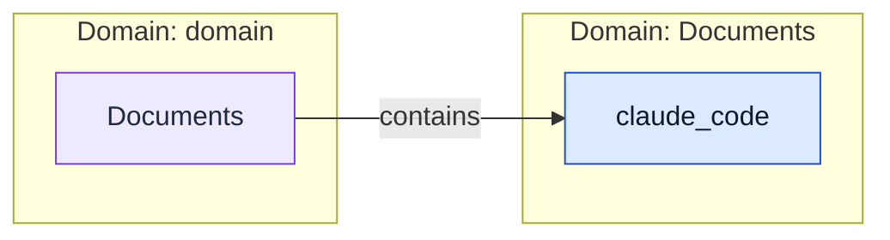
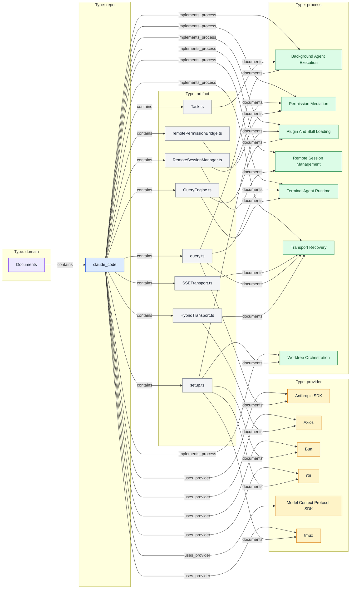

# Claude Code Graph Report

## Build Metadata

| Field | Value |
| --- | --- |
| Title | Claude Code Graph Report |
| Graph File | ../graphs/knowledge-graph.json |
| Generated At | 2026-04-03T12:00:00+00:00 |
| Graph Contract | 1.1 |
| Build Source | profiles |
| Node Count | 23 |
| Edge Count | 40 |
| Base Commit SHAs | 0 |
| Portfolio Metrics | {"process_count": 7, "provider_count": 6, "repo_count": 1} |

## Validation And Freshness

| Artifact | Status | Details |
| --- | --- | --- |
| Graph Validation | 8/8 checks passed | schema_compliance, dangling_refs, orphans, confidence_floor, duplicates, containment_consistency, staleness, circular_deps |
| Consistency | missing | consistency-report.json not found |
| Incremental Update | missing | incremental-update.json not found |

## Graph Inventory

### Nodes By Type

| Type | Count |
| --- | --- |
| artifact | 8 |
| process | 7 |
| provider | 6 |
| domain | 1 |
| repo | 1 |

### Edges By Relation

| Relation | Count |
| --- | --- |
| documents | 18 |
| contains | 9 |
| implements_process | 7 |
| uses_provider | 6 |

## Top Connected Nodes

| Label | Type | Domain | Fan-In | Weighted | ID |
| --- | --- | --- | --- | --- | --- |
| Transport Recovery | process | Documents | 4 | 3.1 | process-transport-recovery |
| Permission Mediation | process | Documents | 3 | 2.4 | process-permission-mediation |
| Terminal Agent Runtime | process | Documents | 3 | 2.3 | process-terminal-agent-runtime |
| Plugin And Skill Loading | process | Documents | 3 | 2.2 | process-plugin-and-skill-loading |
| Background Agent Execution | process | Documents | 3 | 2.1 | process-background-agent-execution |
| Remote Session Management | process | Documents | 2 | 1.7 | process-remote-session-management |
| Worktree Orchestration | process | Documents | 2 | 1.7 | process-worktree-orchestration |
| Anthropic SDK | provider | Documents | 2 | 1.4 | provider-anthropic-sdk |
| Axios | provider | Documents | 2 | 1.3 | provider-axios |
| Bun | provider | Documents | 2 | 1.3 | provider-bun |
| Git | provider | Documents | 2 | 1.3 | provider-git |
| tmux | provider | Documents | 2 | 1.2 | provider-tmux |
| claude_code | repo | Documents | 1 | 1.0 | claude_code |
| HybridTransport.ts | artifact | Documents | 1 | 0.95 | artifact-hybrid-transport-ts |
| QueryEngine.ts | artifact | Documents | 1 | 0.95 | artifact-query-engine-ts |

## Domains To Repositories

| Source | Relation | Target | Target Type |
| --- | --- | --- | --- |
| Documents | contains | claude_code | repo |

## Repositories To Providers

| Source | Relation | Target | Target Type |
| --- | --- | --- | --- |
| claude_code | uses_provider | Anthropic SDK | provider |
| claude_code | uses_provider | Axios | provider |
| claude_code | uses_provider | Bun | provider |
| claude_code | uses_provider | Git | provider |
| claude_code | uses_provider | Model Context Protocol SDK | provider |
| claude_code | uses_provider | tmux | provider |

## Repositories To Processes

| Source | Relation | Target | Target Type |
| --- | --- | --- | --- |
| claude_code | implements_process | Background Agent Execution | process |
| claude_code | implements_process | Permission Mediation | process |
| claude_code | implements_process | Plugin And Skill Loading | process |
| claude_code | implements_process | Remote Session Management | process |
| claude_code | implements_process | Terminal Agent Runtime | process |
| claude_code | implements_process | Transport Recovery | process |
| claude_code | implements_process | Worktree Orchestration | process |

## Repositories To Storage

_No matching relationships found._

## Diagram Exports

### Platform Overview

Domains, repositories, providers, and processes.

### Data Topology

Repositories and storage relationships.

### Documentation Coverage

Artifacts and the nodes they document.

## Node Index

artifact (8)

| Label | ID | Domain | Summary | Tags |
| --- | --- | --- | --- | --- |
| HybridTransport.ts | artifact-hybrid-transport-ts | Documents | Hybrid transport with WebSocket reads, serialized POST writes, batching, and backpressure. | transport |
| QueryEngine.ts | artifact-query-engine-ts | Documents | Persistent execution coordinator for prompt assembly, query execution, and plugin-aware system prompt composition. | runtime-spine |
| RemoteSessionManager.ts | artifact-remote-session-manager-ts | Documents | Remote session manager with message callbacks and permission request handling. | remote-runtime |
| SSETransport.ts | artifact-sse-transport-ts | Documents | SSE transport with resumable sequence tracking and reconnect behavior. | transport |
| Task.ts | artifact-task-ts | Documents | Task model defining background execution types and lifecycle states. | tasks |
| query.ts | artifact-query-ts | Documents | Main query loop with task-budget accounting and max_output_tokens recovery logic. | runtime-spine |
| remotePermissionBridge.ts | artifact-remote-permission-bridge-ts | Documents | Permission bridge that synthesizes assistant messages and fallback tool stubs for remote tools. | permissions |
| setup.ts | artifact-setup-ts | Documents | Startup lifecycle file covering hooks snapshots, worktree setup, tmux bootstrapping, and file-change watching. | startup |

domain (1)

| Label | ID | Domain | Summary | Tags |
| --- | --- | --- | --- | --- |
| Documents | documents |  | Local document portfolio grouping for repo snapshots stored under the user's Documents directory. | portfolio-root |

process (7)

| Label | ID | Domain | Summary | Tags |
| --- | --- | --- | --- | --- |
| Background Agent Execution | process-background-agent-execution | Documents | Task model spanning local shell, local agent, remote agent, teammate, workflow, and MCP monitor execution paths. | tasks, multi-agent |
| Permission Mediation | process-permission-mediation | Documents | Maps remote tool approval requests into locally renderable permission flows and fallback tool stubs. | permissions, approval-flow |
| Plugin And Skill Loading | process-plugin-and-skill-loading | Documents | Loads plugins, skills, and prompt parts while avoiding startup races and stale configuration snapshots. | plugins, skills |
| Remote Session Management | process-remote-session-management | Documents | Control plane for remote sessions with WebSocket reads, HTTP writes, connection lifecycle, and message routing. | remote-runtime, sessions |
| Terminal Agent Runtime | process-terminal-agent-runtime | Documents | Interactive terminal execution loop that assembles prompts, renders UI messages, and coordinates coding-agent behavior. | terminal-ui, agent-loop |
| Transport Recovery | process-transport-recovery | Documents | Stream buffering, serialized writes, reconnect behavior, and bounded recovery paths for network and model output failur… | transport, recovery |
| Worktree Orchestration | process-worktree-orchestration | Documents | Creates or switches isolated worktree sessions, resolves canonical repo roots, and coordinates tmux bootstrapping. | worktrees, session-setup |

provider (6)

| Label | ID | Domain | Summary | Tags |
| --- | --- | --- | --- | --- |
| Anthropic SDK | provider-anthropic-sdk | Documents | Primary model SDK dependency for message types, streaming, and API error handling. | llm, sdk |
| Axios | provider-axios | Documents | HTTP client used across bridge, analytics, and transport flows. | http, client |
| Bun | provider-bun | Documents | Runtime and build feature provider used by setup and startup code. | runtime, build-tool |
| Git | provider-git | Documents | Repository root and worktree operations depend on Git-aware filesystem behavior. | vcs, worktrees |
| Model Context Protocol SDK | provider-mcp-sdk | Documents | Protocol SDK used for MCP server entrypoints and MCP-aware tool types. | mcp, sdk |
| tmux | provider-tmux | Documents | Optional terminal session isolation layer for worktree and teammate flows. | terminal, session-isolation |

repo (1)

| Label | ID | Domain | Summary | Tags |
| --- | --- | --- | --- | --- |
| claude_code | claude_code | Documents | Modular TypeScript/Bun coding-agent runtime with a React terminal UI, remote-session bridge, MCP entrypoints, plugin an… | ai-coding-agents, terminal-ui, remote-runtime, mcp, worktrees |

