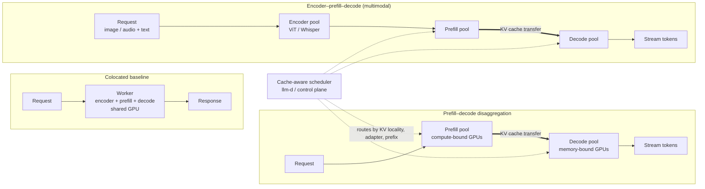

# Disaggregated Inference

Guide for splitting encoder, prefill, and decode work only when a colocated baseline is no longer adequate.

Disaggregation is a topology choice, not a default best practice. Use it when measurements show that different phases want different resources or interfere with each other.

## Contents

- [Reference Diagram](#reference-diagram)
- [What To Separate](#what-to-separate)
- [Current Runtime Status](#current-runtime-status)
- [When To Use It](#when-to-use-it)
- [When Not To Use It](#when-not-to-use-it)
- [Minimal Topology](#minimal-topology)
- [Acceptance Criteria](#acceptance-criteria)
- [Metrics To Track](#metrics-to-track)
- [Practical Rules](#practical-rules)
- [Primary Sources](#primary-sources)

### Reference Diagram

Colocated baseline vs prefill–decode disaggregation vs full encoder–prefill–decode split. Each row is a topology; the arrow weight shows where KV cache transfer happens.



Notes:
- The thick arrows are **KV-cache transfer** — the dominant cost of disaggregation. If transfer time > prefill savings, colocate.
- The scheduler matters more than the split when serving many tenants — prefix caching wins are routing-driven.

## What To Separate

| Split | Use When | Common Trigger |
|---|---|---|
| **prefill -> decode** | long prompts create queueing or p99 spikes | mixed short and long prompts in the same fleet |
| **encoder -> decode** | multimodal encoders saturate independently | VLM or audio workloads |
| **adapter cache -> decode** | many LoRAs are loaded and evicted frequently | multi-tenant adapter serving |

## Current Runtime Status

| Runtime | Current Shape | Notes |
|---|---|---|
| **vLLM** | disaggregated prefilling, disaggregated encoder | official docs flag disaggregated prefilling as experimental and explicitly note it does not improve throughput by itself |
| **SGLang** | PD disaggregation and EPD disaggregation | strong fit for chat, agent, and multimodal flows where reuse and modality-specific scaling matter |
| **TensorRT-LLM** | disaggregated serving plus KV cache reuse primitives | use when the deployment is already NVIDIA-centric |
| **llm-d / control planes** | cluster-level scheduling and cache-aware placement | use when routing policy is the hard problem, not just local engine settings |

## When To Use It

Use disaggregation only when at least one of these is true:

- long prefills inflate TTFT for ongoing decode requests
- multimodal encoders consume resources that do not scale like decode
- decode GPUs are memory-bound while prefill GPUs are compute-bound
- adapter locality or cache transfer drives most of the p95
- request placement needs cache-aware routing across many replicas

## When Not To Use It

Keep the stack colocated when:

- there is no measured queueing problem
- GPU count is still small and ops simplicity matters more
- transfer latency erases the gain
- routing is still naive, so locality problems are self-inflicted
- the workload is batch-only and latency is not user-facing

## Minimal Topology

```text
client
  -> gateway
  -> router
  -> phase-specific worker pool
  -> cache transfer layer
  -> decode worker
```

Decide explicitly:

- how cache handles move across phases
- how requests stay sticky to reusable state
- who owns overload and queue admission
- which metrics prove the split is worth keeping

## Acceptance Criteria

- [ ] colocated baseline recorded first
- [ ] transfer latency and failure modes measured
- [ ] queue depth by phase is observable
- [ ] p95 or p99 improves under realistic concurrency
- [ ] throughput does not regress at the target workload
- [ ] rollback path back to colocated serving is documented

## Metrics To Track

- TTFT by path and request class
- inter-token latency by decode pool
- queue depth by phase
- cache transfer latency and failure rate
- cache hit or reuse rate
- adapter cold-load latency if adapters are involved
- schema-valid rate if structured outputs are required

## Practical Rules

- Fix admission control and routing before adding more topology.
- Prefer encoder/decode separation for multimodal bottlenecks.
- Prefer PD separation only when mixed prompt lengths or long context visibly harm decode latency.
- Use control-plane features such as sticky routing and cache-aware placement before scaling out blindly.
- Mark experimental or beta features explicitly in recommendations.

## Primary Sources

- vLLM disaggregated prefilling: https://docs.vllm.ai/en/latest/features/disagg_prefill/
- vLLM disaggregated encoder: https://docs.vllm.ai/en/latest/features/disagg_encoder/
- SGLang PD disaggregation: https://docs.sglang.io/advanced_features/pd_disaggregation.html
- SGLang EPD disaggregation: https://docs.sglang.io/advanced_features/epd_disaggregation.html
- TensorRT-LLM disaggregated serving: https://nvidia.github.io/TensorRT-LLM/features/disagg-serving.html
- DistServe paper: https://www.usenix.org/system/files/osdi24-zhong-yinmin.pdf
