# Fine-Tuning Recipes (SFT, Instruction Tuning, PEFT/LoRA)

Operational workflows for running safe, reproducible LLM fine-tuning with modern parameter-efficient methods.

---
## Table of Contents

- [Modern Best Practices (May 2026)](#modern-best-practices-may-2026)
- [PEFT Method Family (When LoRA Isn't the Answer)](#peft-method-family-when-lora-isnt-the-answer)
- [Training-Set Strategies: Multi-Task and Federated](#training-set-strategies-multi-task-and-federated)
- [Strategy Selection: When to Fine-Tune](#strategy-selection-when-to-fine-tune)
- [Recipe 1: Supervised Fine-Tuning (SFT) with PEFT](#recipe-1-supervised-fine-tuning-sft-with-peft)
- [Steps (Modern PEFT-first approach)](#steps-modern-peft-first-approach)
- [Checklist: SFT complete](#checklist-sft-complete)
- [Recipe 2: Instruction Tuning](#recipe-2-instruction-tuning)
- [Additional requirements beyond SFT](#additional-requirements-beyond-sft)
- [Dataset composition](#dataset-composition)
- [Checklist: Instruction tuning ready](#checklist-instruction-tuning-ready)
- [Recipe 3: LoRA / QLoRA (Parameter-Efficient Fine-Tuning)](#recipe-3-lora-qlora-parameter-efficient-fine-tuning)
- [LoRA Configuration](#lora-configuration)
- [Parameter selection guide](#parameter-selection-guide)
- [Checklist: LoRA complete](#checklist-lora-complete)
- [Recipe 4: Safety Requirements for Fine-Tuning](#recipe-4-safety-requirements-for-fine-tuning)
- [Avoid in training data](#avoid-in-training-data)
- [Add to training data](#add-to-training-data)
- [Safety validation](#safety-validation)
- [Checklist: Safety verified](#checklist-safety-verified)
- [Recipe 5: Context Window & Build Considerations](#recipe-5-context-window-&-build-considerations)
- [Tokenizer/Encoding](#tokenizerencoding)
- [Scaling Laws and Over-Training](#scaling-laws-and-over-training)
- [Context Optimizations](#context-optimizations)
- [Training Stability](#training-stability)
- [Mid-Training: Continued Pretraining and Annealing](#mid-training-continued-pretraining-and-annealing)
- [Evaluation While Training](#evaluation-while-training)
- [Checklist: Architecture ready](#checklist-architecture-ready)
- [Recipe 6: Data & Feedback Loops (Production)](#recipe-6-data-&-feedback-loops-production)
- [Signal Capture](#signal-capture)
- [Labeling Loop](#labeling-loop)
- [Contamination Control](#contamination-control)
- [Dataset Refresh Cadence](#dataset-refresh-cadence)
- [Online Evaluation](#online-evaluation)
- [Checklist: Feedback loop live](#checklist-feedback-loop-live)
- [Recipe 7: Final Validation Checklist](#recipe-7-final-validation-checklist)
- [See Also](#see-also)

## Modern Best Practices (May 2026)

**Adapters and targeted optimization are the default path when tuning is justified**:
- Minimizes trainable parameters while improving performance
- Significantly reduced computational requirements
- LoRA adapters can be saved separately for efficient deployment

**Key Insight**: Fine-tuning is rarely the first move. Exhaust prompt, contract, and retrieval fixes before adapting weights.

**Post-training stack shift (2026)**: PPO-based RLHF is now often replaced by lighter-weight preference optimization (DPO, SimPO, KTO) and RL-with-verifiable-rewards methods (GRPO, RLVR). See [Post-Training 2026](post-training.md) for the decision tree.

**Regular monitoring**: Evaluate on validation data to detect overfitting, underfitting, and behavior regressions early.

---

## PEFT Method Family (When LoRA Isn't the Answer)

LoRA/QLoRA (Recipe 3) is the production default and covers the overwhelming majority of cases. The methods below are the rest of the parameter-efficient family — mostly **predecessors LoRA largely displaced**. Know them so you can recognize them and justify *not* reaching for them; reach for one only on the stated niche.

The methods differ mainly in *where* they inject the trainable parameters while the base weights stay frozen:

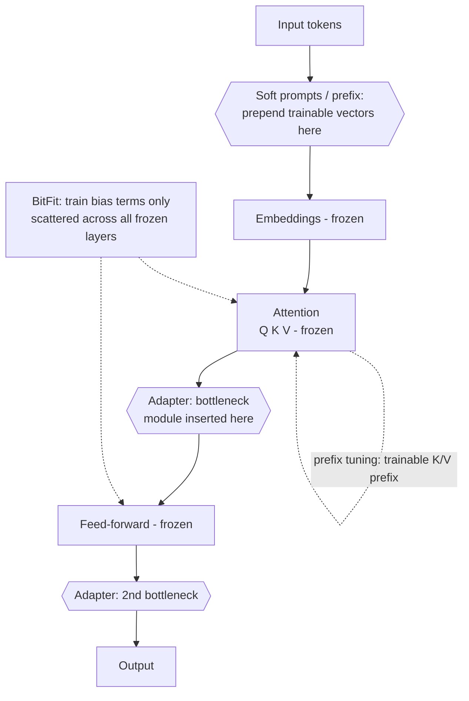

Legend: solid boxes are frozen base components; `{{...}}` and dotted edges are the trainable additions each method introduces.

| Method | What it trains | Params tuned | Reach for it when | Why LoRA usually wins instead |
|---|---|---|---|---|
| **LoRA / QLoRA** | Low-rank update matrices on attention (frozen base) | ~0.1–1% | Default for almost all adaptation | — (this is the baseline) |
| **Adapter tuning** (Houlsby) | Small bottleneck modules inserted *between* layers | ~1–5% | Multi-task serving where you hot-swap many adapters and added inference latency is acceptable | Adds a serial forward-pass cost; LoRA merges into weights with zero inference overhead |
| **Prefix tuning** | Trainable vectors prepended to keys/values at every layer (weights frozen) | ~0.1–1% | Generation tasks; want to steer without touching attention weights | Harder to optimize; LoRA matches/beats it with simpler tuning |
| **P-tuning / P-tuning v2** | Continuous prompt embeddings via a small encoder | <0.1–1% | NLU/classification where discrete prompts are unstable | Narrower task fit; LoRA generalizes better to generation |
| **Soft prompts / prompt tuning** | A handful of learned input embedding vectors only | <0.1% | Many tasks share one frozen base; per-task storage must be tiny | Capacity too low for behavior/format shifts; underperforms on hard tasks |
| **BitFit** | Bias terms only | ~0.08% | Extreme param budget; small-to-medium data; quick baseline | Limited ceiling; LoRA gives far more capacity at similar cost |

**Rule**: default to LoRA/QLoRA. Choose an alternative only for its specific niche — adapter hot-swapping, soft-prompt tiny-storage multi-tenancy, or BitFit as a near-zero-cost probe. Do not mix two PEFT families in one model without a measured reason (see the surface-conflicts principle in the coding-behavior contract).

### Per-method mechanics

**Adapter tuning** — bottleneck module inserted after each frozen sublayer, with a residual so it starts as a near-identity:

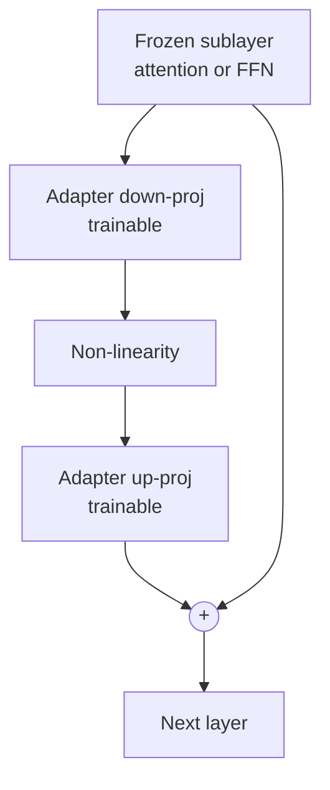

**Prefix tuning** — trainable vectors prepended to K/V at every layer; attention weights stay frozen:

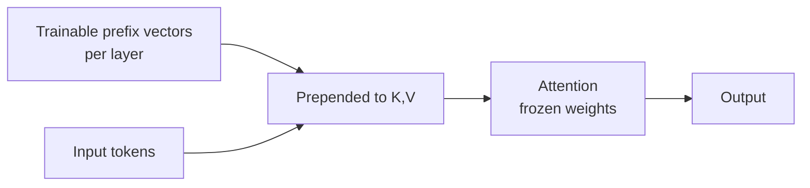

**P-tuning** — pseudo-prompt tokens passed through a small trainable encoder into continuous embeddings (stabilizes NLU prompts):

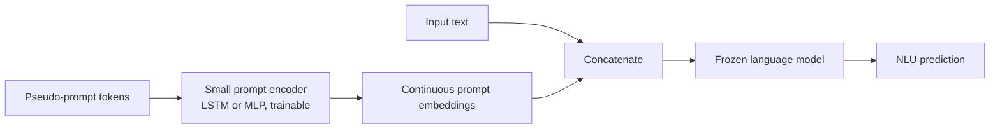

**Soft prompts / prompt tuning** — a handful of learned input-embedding vectors prepended; the entire model stays frozen and shared across tasks:

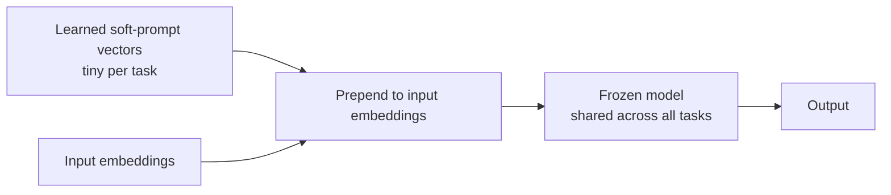

**BitFit** — train only the bias terms; every weight matrix is frozen:

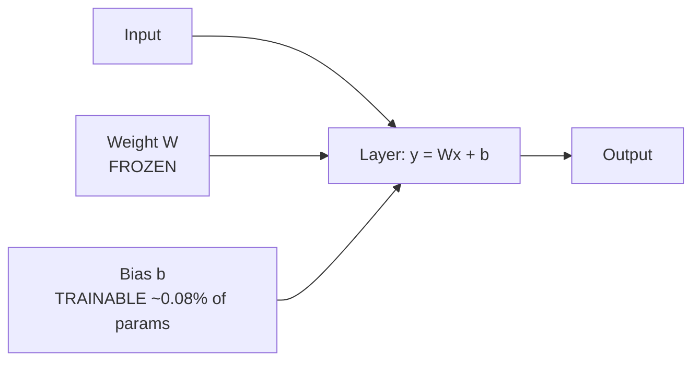

---

## Training-Set Strategies: Multi-Task and Federated

Two strategies about *how the training data is composed and sourced*, orthogonal to the PEFT method above (either can run with LoRA, full SFT, etc.).

**Multi-task fine-tuning** — train on several tasks at once so the model shares representations and generalizes, instead of overfitting one objective:

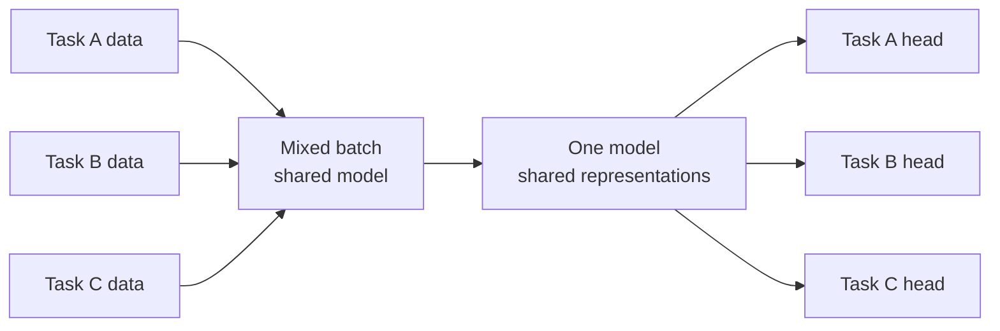

**Federated fine-tuning** — tune across decentralized clients that share only weight updates, never raw data; a server aggregates them (e.g. FedAvg). Use when data legally or physically cannot leave the device:

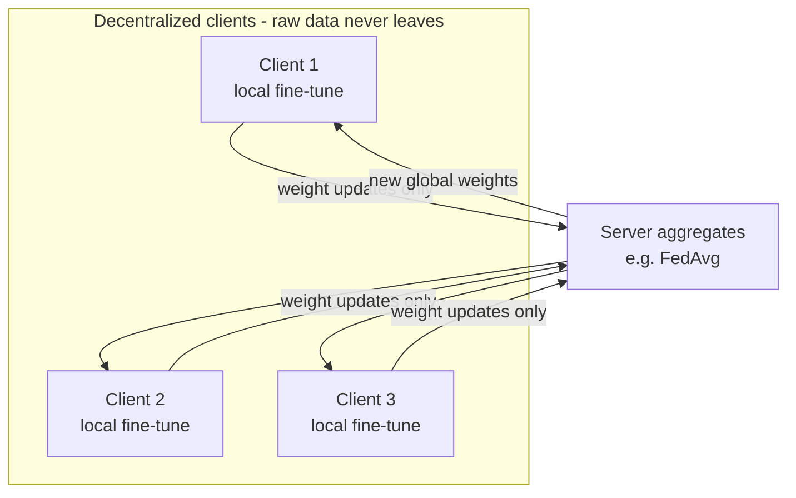

---

## Strategy Selection: When to Fine-Tune

Use this decision matrix to choose between prompting, fine-tuning, and RAG:

| Use Case | Best Approach | Rationale (Modern Research) |
|----------|---------------|---------------------------|
| MVP / Prototype | **Prompt Engineering** | Simplicity, speed, agility - quick deployment with minimal setup |
| Internal tools | **Prompt Engineering** | Fast iteration, low overhead |
| Production with sufficient data | **Fine-Tuning (PEFT/LoRA)** | Highest performance when data available |
| Cold-start (insufficient data) | **Few-shot prompting** | No persona needed for best results |
| Dynamic knowledge | **RAG** | Current information, evolving content |
| Code review automation | **Fine-Tuning** | Research shows fine-tuning achieves highest performance |
| Clinical classification | **Prompting with reasoning** | Clear, concise prompts with reasoning steps |
| Best results | **Combined: Fine-tuning + Prompting + RAG** | Hybrid approaches yield optimal outcomes |

**Trade-offs**:
- **Prompt engineering**: Fast, flexible, no training required, but may have lower accuracy
- **Fine-tuning**: Highest performance, domain specialization, but requires data and compute
- **RAG**: Access to current knowledge, but adds latency and complexity

---

## Recipe 1: Supervised Fine-Tuning (SFT) with PEFT

**Use when**: Training a model on instruction datasets with parameter efficiency

### Steps (Modern PEFT-first approach)

1. **Define model choice**
   - Model size and context window requirements
   - Hardware budget (GPU VRAM)
   - **PEFT strategy** (Modern Standard):
     - LoRA (Low-Rank Adaptation) - efficient fine-tuning
     - Updates only minor fraction of model parameters
     - Significantly reduced computational requirements
     - Choose between: training from scratch vs modifying existing model (adapting often more efficient)

2. **Prepare dataset**
   - Clean, dedupe, structure
   - Remove harmful or contradictory examples
   - Validate consistency in structure
   - Each example must represent *ideal* model behavior
   - Balance distribution of task types

3. **Training configuration (PEFT-optimized)**
   - Learning rate: 1e-5 – 2e-5 (typical for full fine-tuning)
   - Learning rate: 2e-4 (for LoRA)
   - Batch size: match VRAM constraints
   - Max steps vs epochs
   - **LoRA parameters**:
     - Rank: 8–32
     - Alpha: 16–32
     - Target modules: attention layers
   - Seed fixed for reproducibility
   - Use 4-bit quantization (QLoRA) for VRAM savings

4. **Checkpointing & evaluation** (Modern critical)
   - Periodic eval on held-out set
   - Monitor for overfitting/underfitting
   - Early stopping logic
   - Regular validation data evaluation
   - Save best checkpoint by validation loss

5. **Packaging**
   - Save tokenizer + model config
   - Save PEFT adapters separately for efficient deployment
   - Export `training_log.json` with metrics
   - Document hyperparameters and data provenance

### Checklist: SFT complete

- [ ] Dataset validated and deduped
- [ ] PEFT/LoRA strategy selected and configured
- [ ] Hyperparameters recorded (LR, rank, alpha, batch size)
- [ ] Model evaluated against baseline
- [ ] Regular validation checks for overfitting/underfitting
- [ ] Best checkpoint chosen & exported
- [ ] PEFT adapters saved separately for efficient deployment
- [ ] Training logs and metrics documented

---

## Recipe 2: Instruction Tuning

**Use when**: Building general-purpose assistant behavior

Supervised tuning on (instruction, response) pairs so the model *follows directions* instead of merely continuing text:

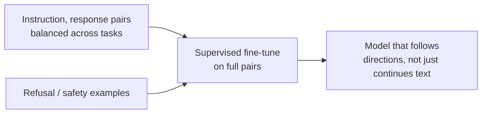

### Additional requirements beyond SFT

- Diverse task instructions across domains
- Balance categories (classification, summarization, transformation, Q&A)
- Avoid conflicting examples
- Include refusal examples for unsafe tasks
- Test multi-turn conversations if chat format
- Validate instruction-following on edge cases

### Dataset composition

- 30-40% Knowledge tasks (Q&A, factual)
- 20-30% Reasoning tasks (math, logic)
- 20-30% Creative tasks (writing, brainstorming)
- 10-20% Safety/refusal examples

### Checklist: Instruction tuning ready

- [ ] Task diversity verified across categories
- [ ] Refusal examples included (unsafe, out-of-scope)
- [ ] Multi-turn conversation tested
- [ ] Instruction-following validated on edge cases
- [ ] Dataset balanced across task types

---

## Recipe 3: LoRA / QLoRA (Parameter-Efficient Fine-Tuning)

**Use when**: Limited compute resources or need for rapid iteration

**LoRA** — freeze W, learn a low-rank update `BA` added to it; only A and B train:

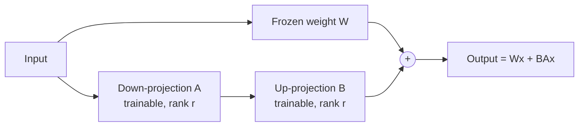

**QLoRA** — the same LoRA adapters on top of a 4-bit-quantized frozen base; gradients reach only the adapters:

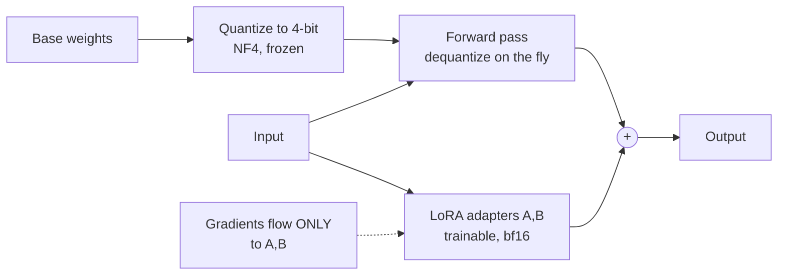

### LoRA Configuration

1. **Freeze base model** (all parameters)
2. **Attach low-rank adapters** to attention layers
3. **Train with**:
   - Learning rate: 2e-4 (higher than full fine-tuning)
   - Rank (r): 8–32 (balance between capacity and efficiency)
   - Alpha: 16–32 (scaling factor, typically 2x rank)
   - Target modules: query, key, value projections
4. **Use 4-bit quantization** (QLoRA) for VRAM savings
5. **Merge adapters** if needed for inference (or keep separate)

### Parameter selection guide

| Task Complexity | Rank | Alpha | Notes |
|----------------|------|-------|-------|
| Simple tasks | 8 | 16 | Classification, extraction |
| Medium tasks | 16 | 32 | General instruction following |
| Complex tasks | 32 | 64 | Reasoning, code generation |

### Checklist: LoRA complete

- [ ] Rank, alpha, target modules recorded
- [ ] BF16/FP16 stability checked
- [ ] Merged model validated (if merging)
- [ ] Adapter files saved separately
- [ ] Inference tested with adapters

---

## Recipe 4: Safety Requirements for Fine-Tuning

### Avoid in training data

- Private data (PII, credentials, internal info)
- Toxic/unsafe content
- Contradictory behaviors (conflicting instructions)
- "Do anything now" jailbreak patterns
- Malicious code or exploits

### Add to training data

- Refusal examples for unsafe requests
- Safety-guided templates
- Negative examples (what not to do)
- Boundary cases for allowed vs disallowed content

### Safety validation

- Test with adversarial prompts
- Verify refusal behavior on unsafe requests
- Check for data leakage (PII, training data)
- Validate policy compliance

### Checklist: Safety verified

- [ ] No PII or sensitive data in dataset
- [ ] Refusal examples included
- [ ] Adversarial testing completed
- [ ] No safety regressions vs base model
- [ ] Policy compliance validated

---

## Recipe 5: Context Window & Build Considerations

**When building/choosing models or heavy adaptation**

### Tokenizer/Encoding

- Decide BPE vs unigram for tokenization
- Cover domain-specific tokens (code, medical, legal)
- Avoid excessive splits on code/PII markers
- Validate tokenizer on domain corpus sample

### Scaling Laws and Over-Training

- Set data/parameter/compute budget
- Prefer more tokens over parameters if data-rich
- **Chinchilla-optimal** (roughly 20 tokens per parameter) minimizes training loss for a fixed compute budget. In practice, modern labs train well past Chinchilla-optimal — a smaller model trained on significantly more tokens is cheaper to serve at inference time, even if training cost is higher. This "over-train small models" regime is now standard for production deployments where inference volume matters. Do not cite specific multipliers as fact; this tradeoff shifts as hardware and serving costs evolve.
- For inference-cost-sensitive workloads, optimize for final serving cost, not training FLOP minimization.

### Context Optimizations

- FlashAttention-2 for memory efficiency
- Paged KV cache for longer contexts
- Positional embeddings (RoPE/YaRN)
- Sliding-window attention for very long docs

### Training Stability

- Warmup schedule + cosine decay
- Gradient clipping (1.0 typical)
- Optimizer: AdamW with decoupled weight decay
- Monitor loss spikes and gradient norms

### Mid-Training: Continued Pretraining and Annealing

Mid-training is a distinct phase between pretraining and instruction tuning. It is underused in smaller teams but is a standard lever at production scale.

**Continued pretraining** (also called domain-adaptive pretraining): resume pretraining on a domain-focused corpus after the base model is trained. Use when you need deep domain coverage (code, medical, legal, finance) that the base model's mix underweights. Keep learning rate low (10–20% of pretraining peak) to avoid catastrophic forgetting; blend in general-domain data to preserve broad capabilities.

**Annealing**: at the end of pretraining (or continued pretraining), reduce the learning rate to near-zero over a short token budget while mixing in a small, curated high-quality data subset. Annealing is effective at boosting performance on targeted capabilities (math, code, instruction following) without a full fine-tuning run.

**When to use mid-training vs fine-tuning**:
- Mid-training: when the base model lacks domain vocabulary, factual coverage, or format fluency that cannot be fixed by a small instruction dataset alone
- Fine-tuning (SFT/LoRA): when the model has the knowledge but not the behavior or format

**Checklist: Mid-training ready**
- [ ] Domain corpus built, deduplicated, and contamination-scanned
- [ ] Learning rate set below pretraining peak (typically 1/10–1/20)
- [ ] General-domain blend included to limit forgetting
- [ ] Annealing schedule and data mix defined
- [ ] Checkpoint saved pre-annealing (rollback option)
- [ ] Probe tasks evaluated before and after to confirm gain and detect regression

### Evaluation While Training

- Perplexity on validation set
- Task probes (accuracy on key tasks)
- Long-context stress tests
- Stop if loss flattens but eval regresses

### Checklist: Architecture ready

- [ ] Tokenizer built/validated on domain corpus
- [ ] Compute/data budget documented with scaling target
- [ ] Attention + KV strategy chosen for target context length
- [ ] Optimizer schedule + clipping configured
- [ ] Long-context eval included in dev loop

---

## Recipe 6: Data & Feedback Loops (Production)

**Use when**: You have production users/traffic and need continuous improvement

### Signal Capture

- Log prompts + outputs + ratings/edits with PII scrubbing
- Store failure exemplars (hallucinations, refusals, toxicity)
- Track user satisfaction metrics
- Capture edge cases and errors

### Labeling Loop

- Triage failures to human review queue
- Turn critiques into supervised pairs (input → ideal answer)
- Build preference data for DPO/ORPO (pairwise comparisons)
- Validate labels for consistency

### Contamination Control

- Keep eval/test IDs separate from training
- Block leakage of eval data into training set
- Hash samples to detect re-ingestion
- Version datasets with lineage tracking

### Dataset Refresh Cadence

- Nightly/weekly slices from production logs
- Auto-balance domains and task types
- Retire stale data (>6 months old)
- Track lineage (source → cleaning → split)

### Online Evaluation

- Shadow models/prompts in production
- Tie quality metrics to product KPIs (solve rate, deflection, cost, latency)
- A/B test new versions before full rollout

### Checklist: Feedback loop live

- [ ] Logging with privacy/PII scrubbing enabled
- [ ] Human-in-loop queue + labeling rubric active
- [ ] Eval sets protected from contamination
- [ ] Refresh cadence + lineage metadata stored
- [ ] Online/shadow eval tied to KPIs

---

## Recipe 7: Final Validation Checklist

Before deploying any fine-tuned model:

- [ ] Evaluation suite passed (accuracy ≥ threshold)
- [ ] JSON output stability verified (schema compliance)
- [ ] No safety regressions observed vs base model
- [ ] Refusal behavior validated on unsafe requests
- [ ] Performance benchmarks met (latency, throughput)
- [ ] Documentation completed (dataset, hyperparams, metrics)
- [ ] Model artifacts packaged (tokenizer, config, adapters)
- [ ] Rollback plan ready
- [ ] Monitoring/alerting configured

---

## See Also

- **[Post-Training 2026](post-training.md)** — 2026 post-training decision tree: GRPO, DAPO, GSPO, RLVR, SimPO, KTO vs PPO/DPO
- **[Advanced LLM Patterns](advanced-llm-patterns.md)** — RLHF loop, pretraining path, test-time compute
- **Hugging Face LLM Trainer** (external `huggingface-skills:` plugin) — TRL/SFT/GRPO implementation depth
