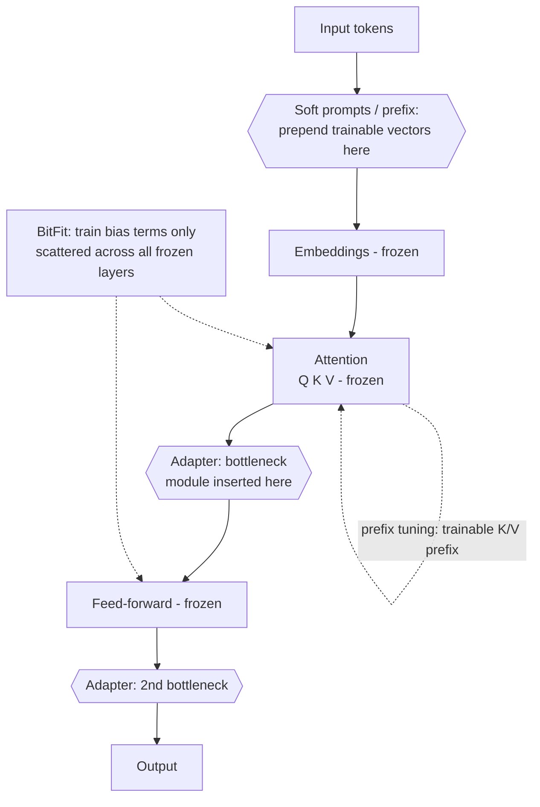
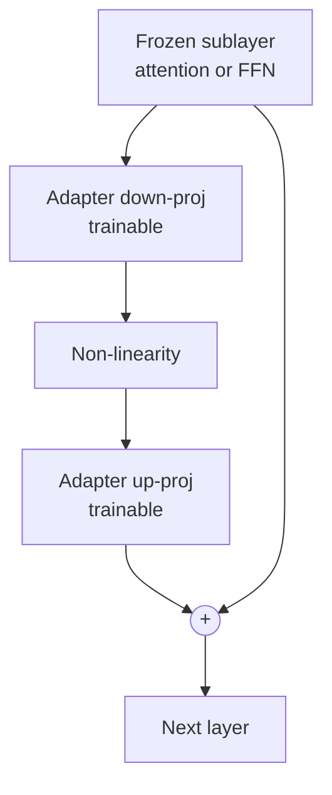
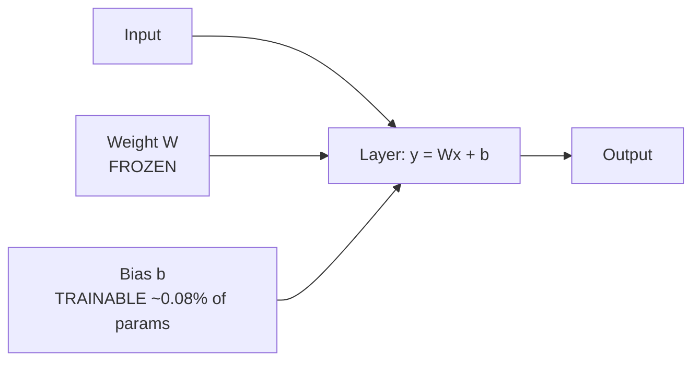
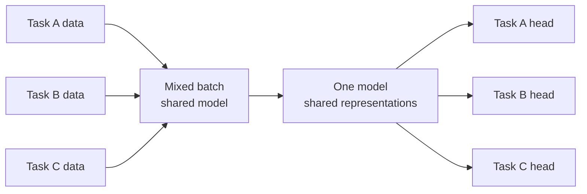
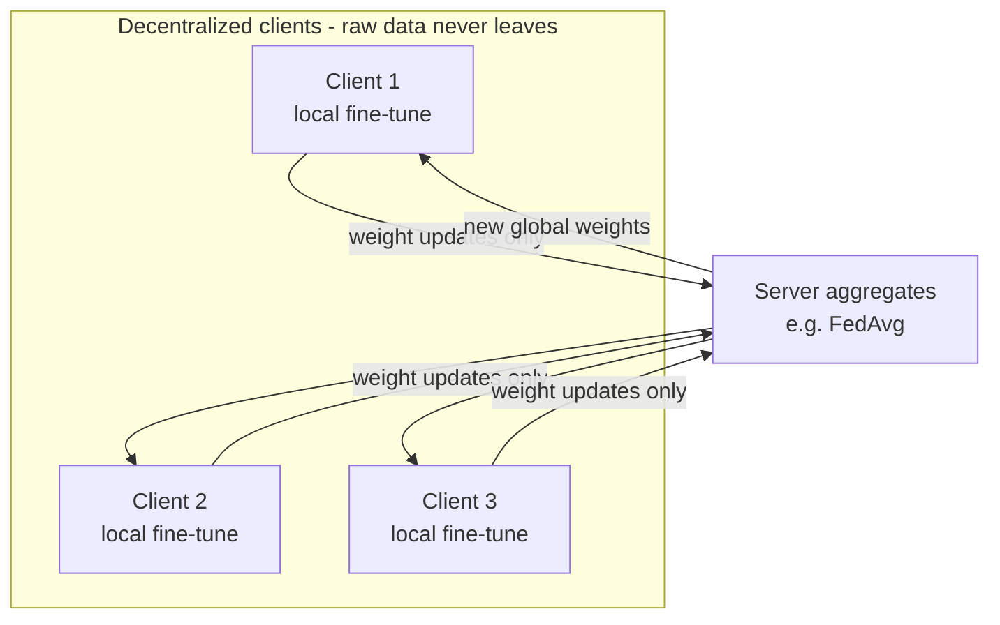
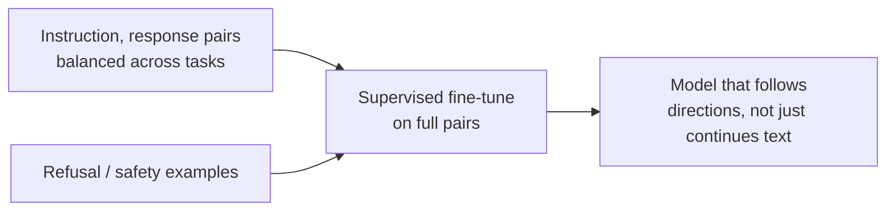
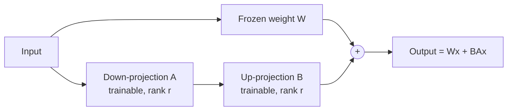
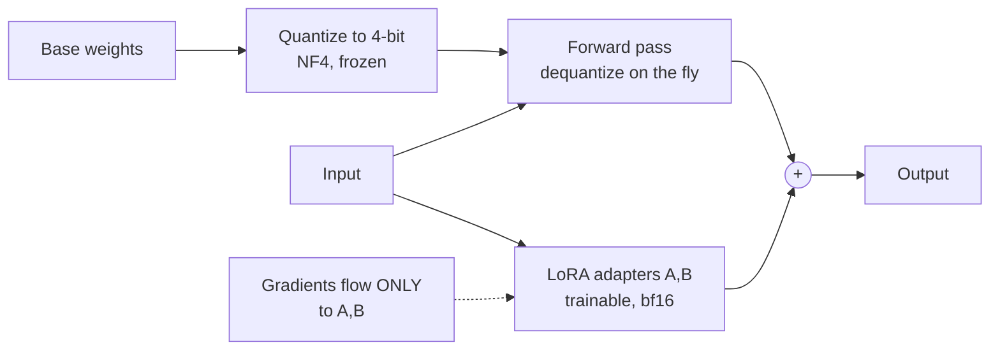

# Fine-Tuning Recipes (SFT, Instruction Tuning, PEFT/LoRA)

Operational workflows for running safe, reproducible LLM fine-tuning with modern parameter-efficient methods.

---
## Table of Contents

- [Modern Best Practices (May 2026)](#modern-best-practices-may-2026)
- [PEFT Method Family (When LoRA Isn't the Answer)](#peft-method-family-when-lora-isnt-the-answer)
- [Fine-tuning framework selection](#fine-tuning-framework-selection)
- [LoRA variants worth knowing (successors, not predecessors)](#lora-variants-worth-knowing-successors-not-predecessors)
- [Predecessor methods (recognize them; rarely reach for them)](#predecessor-methods-recognize-them-rarely-reach-for-them)
- [Training-Set Strategies: Multi-Task and Federated](#training-set-strategies-multi-task-and-federated)
- [Strategy Selection: When to Fine-Tune](#strategy-selection-when-to-fine-tune)
- [Recipe 1: Supervised Fine-Tuning (SFT) with PEFT](#recipe-1-supervised-fine-tuning-sft-with-peft)
- [Steps (Modern PEFT-first approach)](#steps-modern-peft-first-approach)
- [Checklist: SFT complete](#checklist-sft-complete)
- [Recipe 2: Instruction Tuning](#recipe-2-instruction-tuning)
- [Additional requirements beyond SFT](#additional-requirements-beyond-sft)
- [Dataset composition](#dataset-composition)
- [Checklist: Instruction tuning ready](#checklist-instruction-tuning-ready)
- [Recipe 3: LoRA / QLoRA (Parameter-Efficient Fine-Tuning)](#recipe-3-lora-qlora-parameter-efficient-fine-tuning)
- [LoRA Configuration](#lora-configuration)
- [Parameter selection guide](#parameter-selection-guide)
- [Checklist: LoRA complete](#checklist-lora-complete)
- [Recipe 4: Safety Requirements for Fine-Tuning](#recipe-4-safety-requirements-for-fine-tuning)
- [Avoid in training data](#avoid-in-training-data)
- [Add to training data](#add-to-training-data)
- [Safety validation](#safety-validation)
- [Checklist: Safety verified](#checklist-safety-verified)
- [Recipe 5: Context Window & Build Considerations](#recipe-5-context-window-&-build-considerations)
- [Tokenizer/Encoding](#tokenizerencoding)
- [Scaling Laws and Over-Training](#scaling-laws-and-over-training)
- [Context Optimizations](#context-optimizations)
- [Training Stability](#training-stability)
- [Mid-Training: Continued Pretraining and Annealing](#mid-training-continued-pretraining-and-annealing)
- [Evaluation While Training](#evaluation-while-training)
- [Checklist: Architecture ready](#checklist-architecture-ready)
- [Recipe 6: Data & Feedback Loops (Production)](#recipe-6-data-&-feedback-loops-production)
- [Signal Capture](#signal-capture)
- [Labeling Loop](#labeling-loop)
- [Contamination Control](#contamination-control)
- [Dataset Refresh Cadence](#dataset-refresh-cadence)
- [Online Evaluation](#online-evaluation)
- [Checklist: Feedback loop live](#checklist-feedback-loop-live)
- [Recipe 7: Final Validation Checklist](#recipe-7-final-validation-checklist)
- [See Also](#see-also)


## Modern Best Practices (May 2026)

**Adapters and targeted optimization are the default path when tuning is justified**:
- Minimizes trainable parameters while improving performance
- Significantly reduced computational requirements
- LoRA adapters can be saved separately for efficient deployment

**Key Insight**: Fine-tuning is rarely the first move. Exhaust prompt, contract, and retrieval fixes before adapting weights.

**Post-training stack shift (2026)**: PPO-based RLHF is now often replaced by lighter-weight preference optimization (DPO, SimPO, KTO) and RL-with-verifiable-rewards methods (GRPO, RLVR). See [Post-Training 2026](post-training.md) for the decision tree.

**Regular monitoring**: Evaluate on validation data to detect overfitting, underfitting, and behavior regressions early.

---

## PEFT Method Family (When LoRA Isn't the Answer)

**Rule**: default to LoRA/QLoRA on all-linear targets (Recipe 3). Try DoRA before raising rank — same parameter budget, usually equal or better. Reach for another family only on its specific niche: soft-prompt tiny-storage multi-tenancy, or BitFit as a near-zero-cost probe. Adapter hot-swapping is *no longer* a reason to leave LoRA (see multi-adapter serving below).

**Toolchain (name it, don't hand-wave it)**: Hugging Face `peft` implements every method in the tables below (LoRA/DoRA/rsLoRA/PiSSA via `LoraConfig`, LoRA+ via `peft.optimizers.create_loraplus_optimizer`, VeRA, IA³, prefix/prompt tuning); `bitsandbytes` supplies the NF4 4-bit quantization QLoRA depends on; `trl` wraps the SFT/DPO training loops; Unsloth and Axolotl are the common speed/convenience layers on top. Pin versions — `peft` config fields change between releases. Do not mix two PEFT families in one model without a measured reason (see the surface-conflicts principle in the coding-behavior contract).

### Fine-tuning framework selection

Pick by how much control you need, not by benchmark hype — they all sit on the same `transformers`/`peft` substrate:

| Framework | Pick when | Watch out |
| --- | --- | --- |
| Raw `peft` + `trl` | Custom loss, custom data collation, research control; the substrate everything else wraps | You own the training-loop plumbing (checkpointing, resume, logging) — including the gradient-accumulation loss normalization noted below |
| **Unsloth** | Single-GPU speed and VRAM headroom (custom Triton kernels); fastest LoRA/QLoRA iteration on one card | The open-source build is **single-GPU**; multi-GPU sits behind the paid Unsloth Pro tier (community route: Accelerate/DeepSpeed FSDP or DDP). This is a licensing boundary, not a maturity one — decide accordingly, and re-check the tier boundary before planning a cluster run, because it has moved before (checked 2026-08) |
| **Axolotl** | YAML-config runs, multi-GPU via accelerate/DeepSpeed/FSDP; reproducible team configs | Config surface is large; pin the version with the YAML |
| **LLaMA-Factory** | Broadest method × model matrix — SFT/DPO/KTO/ORPO/SimPO/PPO, 2–8-bit QLoRA, 100+ models incl. VLMs; zero-code Gradio WebUI (LLaMA Board) | Repo activity checked 2026-08 (check last commit / last release, not stars — stars are cumulative and never decay); breadth means less depth per path — validate the exact recipe you use |
| LitGPT | Research-grade pre-training/continued-pre-training (see `ai-distributed-training`) | Not the fine-tuning default; lives in the pre-training frameworks table |
| torchtune | **Don't start new work on it** | Development stopped 2025-07-15 (`meta-pytorch/torchtune#2883`, "[IMPORTANT] The future of torchtune") — a *migration* to a successor repo, not abandonment; critical bug fixes and security patches continued through 2025. The successor lane has since moved again (torchforge → consolidating into torchtitan). Treat the whole PyTorch-native fine-tuning lane as unstable for new work; prefer `peft`+`trl` or Axolotl |

### LoRA variants worth knowing (successors, not predecessors)

All `peft`-supported and config-level swaps — no new training loop:

| Variant | What it changes | Enable with |
| --- | --- | --- |
| **DoRA** | Decomposes each weight into magnitude + direction; LoRA on the direction (Liu et al., arXiv 2402.09353). Helps most at low rank | `LoraConfig(use_dora=True)` |
| **rsLoRA** | Scales adapters by `alpha/√r` instead of `alpha/r`, which "stabilizes the adapters and increases the performance potential from using a higher `r`" (peft docs; Kalajdzievski, arXiv 2312.03732) | `LoraConfig(use_rslora=True)` |
| **PiSSA** | Initializes A/B from the principal singular components of W instead of randomly; peft docs: "converges more rapidly than LoRA and ultimately achieves superior performance… reduces the quantization error compared to QLoRA". Same parameter budget | `LoraConfig(init_lora_weights="pissa")` |
| **LoRA+** | Different learning rates for the A and B matrices; peft docs report "up to 2x" faster finetuning and "1-2%" performance (arXiv 2402.12354) | `peft.optimizers.create_loraplus_optimizer(...)` |
| **VeRA** | Shared frozen random A/B pair with tiny trainable per-layer scaling vectors — the minimal-per-task-state axis. Supports bitsandbytes quantization | `VeraConfig` |
| **GaLore** | Not a PEFT method: memory-efficient **full** fine-tuning by projecting gradients into a low-rank subspace (arXiv 2403.03507). Available as an optimizer in the HF `Trainer` — verify the flag name for your version | see the escalation section below |

**Multi-adapter serving** — vLLM and TGI load many LoRA adapters against one base model and route per request; in vLLM, "requests can specify the LoRA adapter as if it were any other model via the `model` request parameter" (vLLM docs, checked 2026-08). This is the commercial argument for LoRA in multi-tenant products, and it supersedes the historical niche of Houlsby adapter tuning below — LoRA hot-swaps too, without a serial forward-pass cost.

### Predecessor methods (recognize them; rarely reach for them)

The methods below are the rest of the parameter-efficient family — mostly **predecessors LoRA largely displaced**. Know them so you can recognize them and justify *not* reaching for them.

They differ mainly in *where* they inject the trainable parameters while the base weights stay frozen:



Legend: solid boxes are frozen base components; `{{...}}` and dotted edges are the trainable additions each method introduces.

| Method | What it trains | Params tuned | Reach for it when | Why LoRA usually wins instead |
|---|---|---|---|---|
| **LoRA / QLoRA** | Low-rank update matrices on selected linear layers — attention **and** MLP; see the all-linear default in Recipe 3 (frozen base) | ~0.1–1% attention-only at low rank; ~1–3% at all-linear targets with r=16–32 | Default for almost all adaptation | — (this is the baseline) |
| **DoRA** | Decomposes each weight into magnitude + direction; LoRA on the direction (Liu et al., arXiv 2402.09353) | ~same as LoRA | A free-ish quality bump over LoRA at the same rank; supported by `peft` (`use_dora=True`) | It usually *is* the better LoRA. Cost: a slower training step, **and** an unmerged-forward overhead that also applies at inference (extra kernel launches for the normalization and magnitude scale). `merge_and_unload()` folds the magnitude vector back in and erases it — merge for serving, this is the remedy, not polish |
| **IA³** | Learned per-channel scaling vectors on K, V, and FFN activations (Liu et al., arXiv 2205.05638) | ~0.01% | T-Few-style few-shot adaptation; even smaller per-task state than LoRA | Less capacity for behavior shifts; LoRA generalizes better beyond few-shot |
| **Adapter tuning** (Houlsby) | Small bottleneck modules inserted *between* layers | ~1–5% | Little left — its stated niche (hot-swapping many adapters) is now served better by LoRA on vLLM/TGI | Adds a serial forward-pass cost; LoRA merges into weights with zero inference overhead *and* hot-swaps per request |
| **Prefix tuning** | Trainable vectors prepended to keys/values at every layer (weights frozen) | ~0.1–1% | Generation tasks; want to steer without touching attention weights | Harder to optimize; LoRA matches/beats it with simpler tuning |
| **P-tuning / P-tuning v2** | Continuous prompt embeddings via a small encoder | <0.1–1% | NLU/classification where discrete prompts are unstable | Narrower task fit; LoRA generalizes better to generation |
| **Soft prompts / prompt tuning** | A handful of learned input embedding vectors only | <0.1% | Many tasks share one frozen base; per-task storage must be tiny | Capacity too low for behavior/format shifts; underperforms on hard tasks |
| **BitFit** | Bias terms only | ~0.08% | Extreme param budget; small-to-medium data; quick baseline | Limited ceiling; LoRA gives far more capacity at similar cost |

**Adapter tuning** — bottleneck module inserted after each frozen sublayer, with a residual so it starts as a near-identity:



**Prefix tuning** — trainable vectors prepended to K/V at every layer; attention weights stay frozen. **P-tuning** adds a small trainable encoder (LSTM or MLP) that maps pseudo-prompt tokens to those continuous embeddings, which is what stabilizes NLU prompts. **Soft prompts / prompt tuning** drops the encoder entirely: a handful of learned input-embedding vectors prepended to the input, with the whole model frozen and shared across tasks — the tiniest per-task state of the three.

**BitFit** — train only the bias terms; every weight matrix is frozen:



---

## Training-Set Strategies: Multi-Task and Federated

Two strategies about *how the training data is composed and sourced*, orthogonal to the PEFT method above (either can run with LoRA, full SFT, etc.).

**Multi-task fine-tuning** — train on several tasks at once so the model shares representations and generalizes, instead of overfitting one objective:



**Federated fine-tuning** — tune across decentralized clients that share only weight updates, never raw data; a server aggregates them (e.g. FedAvg). Use when data legally or physically cannot leave the device:



---

## Strategy Selection: When to Fine-Tune

Use this decision matrix to choose between prompting, fine-tuning, and RAG:

| Use Case | Best Approach | Rationale |
|----------|---------------|---------------------------|
| MVP / Prototype | **Prompt Engineering** | Simplicity, speed, agility - quick deployment with minimal setup |
| Internal tools | **Prompt Engineering** | Fast iteration, low overhead |
| Production with sufficient data | **Fine-Tuning (PEFT/LoRA)** | Highest ceiling once you have enough labelled in-distribution examples |
| Cold-start (insufficient data) | **Few-shot prompting** | Exemplars carry the format; there is nothing yet to train on |
| Dynamic knowledge | **RAG** | Facts change faster than you can retrain weights |
| Narrow repetitive task with a stable output shape (e.g. code review triage) | **Fine-Tuning** | Practitioner default: the behavior is consistent enough to be learned once. Benchmark it against a well-prompted baseline before committing — this is a rule of thumb, not a measured result |
| High-stakes classification needing an auditable rationale (e.g. clinical) | **Prompting with reasoning** | The reasoning trace is reviewable; a fine-tune hides its basis |
| Best results | **Combined: Fine-tuning + Prompting + RAG** | The three fix different failure modes — behavior, instruction, and freshness — and compose |

**Trade-offs**:
- **Prompt engineering**: Fast, flexible, no training required, but may have lower accuracy
- **Fine-tuning**: Highest performance, domain specialization, but requires data and compute
- **RAG**: Access to current knowledge, but adds latency and complexity

---

## Recipe 1: Supervised Fine-Tuning (SFT) with PEFT

**Use when**: Training a model on instruction datasets with parameter efficiency

### Steps (Modern PEFT-first approach)

1. **Define model choice**
   - Model size and context window requirements
   - Hardware budget (GPU VRAM)
   - **PEFT strategy** (Modern Standard):
     - LoRA (Low-Rank Adaptation) - efficient fine-tuning
     - Updates only minor fraction of model parameters
     - Significantly reduced computational requirements
     - Choose between: training from scratch vs modifying existing model (adapting often more efficient)

2. **Prepare dataset**
   - Before building one: check whether a usable dataset already exists — see `ai-data-curation-pretraining` → references/dataset-discovery.md for the repository map (HF, Kaggle, Google Dataset Search, government portals) and the license/contamination gates
   - Clean, dedupe, structure
   - Remove harmful or contradictory examples
   - Validate consistency in structure
   - Each example must represent *ideal* model behavior
   - Balance distribution of task types
   - **Apply the same chat template at train and at serve.** A template mismatch between the two is one of the most common causes of a "the fine-tune did nothing" report, and it produces no error. See [dataset-formatting-guide.md](dataset-formatting-guide.md) for the formatting side
   - Decide whether loss is computed on the whole sequence or on the response only. Completion-only masking (train on the response, not the prompt) is a standard `trl` `SFTTrainer` setting; check the field name for your pinned version

3. **Training configuration (PEFT-optimized)**
   - Learning rate: 1e-5 – 2e-5 (typical for full fine-tuning)
   - Learning rate: 2e-4 centre of mass for LoRA; the usable band is roughly 1e-5 – 5e-4. Tune it *jointly with alpha* — they both scale the effective update. Schedule: warmup + cosine decay, gradient clipping ~1.0 (see [Training Stability](#training-stability))
   - **Effective batch = `micro_batch_size` × `gradient_accumulation_steps` × world size.** Only the micro batch is VRAM-bound; accumulation is the lever that makes QLoRA on one card viable at all. **Record all three** — "batch size 4" is unreproducible, because b4/g4 and b16/g1 are the same experiment and the log cannot tell them apart. Sweep at fixed *effective* batch, not fixed micro batch
   - Verification for a custom loop: two runs at the same effective batch but different micro/accum splits must produce matching loss curves. Loss has to be normalized over the accumulated token count, not averaged per micro-step. Naive accumulation produced a loss off by a factor of the accumulation steps — documented by Unsloth in Oct 2024 and fixed in the Hugging Face trainers since, but still reachable on a pinned older stack or a hand-rolled loop
   - Max steps vs epochs
   - **LoRA parameters**: Rank 8–32; alpha = rank (see [LoRA Configuration](#lora-configuration)); target modules `"all-linear"`
   - Seed fixed for reproducibility
   - 4-bit quantization (QLoRA) trades quality risk for VRAM — it is a memory-forced choice, not a default. If the base fits in bf16, LoRA on a bf16 base is the safer run

4. **Checkpointing & evaluation** (Modern critical)
   - Periodic eval on held-out set
   - Monitor for overfitting/underfitting
   - Early stopping logic
   - Regular validation data evaluation
   - Save best checkpoint by validation loss

5. **Packaging**
   - Save tokenizer + model config
   - Save PEFT adapters separately for efficient deployment — vLLM and TGI serve many adapters against one base model with per-request routing (see [multi-adapter serving](#lora-variants-worth-knowing-successors-not-predecessors))
   - Export `training_log.json` with metrics
   - Document hyperparameters and data provenance

### Checklist: SFT complete

- [ ] Dataset validated and deduped
- [ ] PEFT/LoRA strategy selected and configured
- [ ] Hyperparameters recorded (LR, rank, alpha, and effective batch as micro × accum × world size)
- [ ] Model evaluated against baseline
- [ ] Regular validation checks for overfitting/underfitting
- [ ] Best checkpoint chosen & exported
- [ ] PEFT adapters saved separately for efficient deployment
- [ ] Training logs and metrics documented

---

## Recipe 2: Instruction Tuning

**Use when**: Building general-purpose assistant behavior

Supervised tuning on (instruction, response) pairs so the model *follows directions* instead of merely continuing text:



### Additional requirements beyond SFT

- Diverse task instructions across domains
- Balance categories (classification, summarization, transformation, Q&A)
- Avoid conflicting examples
- Include refusal examples for unsafe tasks
- Test multi-turn conversations if chat format
- Validate instruction-following on edge cases

### Dataset composition

- 30-40% Knowledge tasks (Q&A, factual)
- 20-30% Reasoning tasks (math, logic)
- 20-30% Creative tasks (writing, brainstorming)
- 10-20% Safety/refusal examples

### Checklist: Instruction tuning ready

- [ ] Task diversity verified across categories
- [ ] Refusal examples included (unsafe, out-of-scope)
- [ ] Multi-turn conversation tested
- [ ] Instruction-following validated on edge cases
- [ ] Dataset balanced across task types

---

## Recipe 3: LoRA / QLoRA (Parameter-Efficient Fine-Tuning)

**Use when**: Limited compute resources or need for rapid iteration

**LoRA** — freeze W, learn a low-rank update `BA` added to it; only A and B train:



**QLoRA** — the same LoRA adapters on top of a 4-bit-quantized frozen base; gradients reach only the adapters:



### LoRA Configuration

1. **Freeze base model** (all parameters)
2. **Attach low-rank adapters to all linear layers** — attention (Q, K, V, O) *and* MLP (up/gate/down). Attention-only LoRA is the 2021 default and leaves quality on the table; `peft` ships `target_modules="all-linear"` for exactly this. Restrict to attention only when adapter size itself is the constraint.
3. **Train with**:
   - Learning rate: 2e-4 (higher than full fine-tuning); usable band ~1e-5 – 5e-4
   - Rank (r): 8–32 (balance between capacity and efficiency)
   - **Alpha — one rule.** Start with **alpha = rank** (scaling factor 1.0). `alpha = 2 × rank` is a common alternative that doubles the effective update scale; it is not "the" default, and it needs the learning rate re-tuned alongside it. **Rank sets capacity; alpha sets update scale.** Tune alpha jointly with LR on a validation set — they trade against each other. Under rsLoRA (below), the scaling is `alpha/√r` rather than `alpha/r`, so the same alpha number means a different effective step: re-tune when you flip the flag
   - At rank ≥ 64, enable rank-stabilized scaling (`use_rslora=True`). Plain LoRA scales updates by `alpha/r`, which shrinks the effective step as rank grows; rsLoRA's `alpha/√r` "stabilizes the adapters and increases the performance potential from using a higher `r`" (peft docs; Kalajdzievski, arXiv 2312.03732). The paper argues the `alpha/r` convention is wrong at *any* rank and merely bites hardest high — **rank 64 is this file's operational threshold, not the paper's**. The trade it buys: a larger rank at the *same inference cost* (adapters merge either way) for more *training* compute
4. **Use 4-bit quantization** (QLoRA) for VRAM savings (Dettmers et al., arXiv 2305.14314). Three dtypes are distinct and people conflate them:
   - **Storage**: base weights held in NF4 — approximately 0.5 bytes/param, a 4× reduction against bf16 (`bnb_4bit_quant_type="nf4"`)
   - **Compute**: those weights are dequantized on the fly to `bnb_4bit_compute_dtype=torch.bfloat16` on Ampere+
   - **Adapters**: the LoRA A/B matrices themselves train in bf16 — they are never quantized
   - `bnb_4bit_use_double_quant=True` quantizes the quantization constants themselves, saving ~0.373 bits per parameter. That is a second-order saving on the block scales, not on the weights
   - **Paged optimizers absorb spikes, they do not lower your budget.** They use unified memory to page optimizer state to CPU on an OOM spike (long sequences, checkpointing boundaries). Do not size a run as if they cut the steady-state footprint
   - VRAM budget, four terms: NF4 base (~0.5 B/param) + bf16 adapters + optimizer state *on the adapters only* + activations. Activations are dominated by `seq_len × micro_batch` and are the term gradient checkpointing cuts, at roughly a 20–30% step-time cost — after micro batch, it is the second-biggest VRAM lever
5. **Merge adapters** if needed for inference (or keep separate). **Footgun: merge into a bf16 base, not the NF4-quantized one.** Merging into a 4-bit base means dequantize → add → requantize, which is lossy — and QLoRA users by definition never had the bf16 base loaded, so this has to be a deliberate step. Related: NF4 is a *training*-time memory format, not your serving format. Merge to bf16, then quantize for serving with the format your runtime ships kernels for, and re-run evals afterwards — train-time and serve-time quantization are different schemes and the resulting quality delta is not attributable to the fine-tune

### Parameter selection guide

Alpha values below follow the `alpha = 2 × rank` convention; the `alpha = rank` default halves each. Either is defensible — pick one, record which, and tune LR with it.

| Task Complexity | Rank | Alpha (2× convention) | Notes |
|----------------|------|-------|-------|
| Simple tasks | 8 | 16 | Classification, extraction |
| Medium tasks | 16 | 32 | General instruction following |
| Complex tasks | 32 | 64 | Reasoning, code generation |

**Rank is not a VRAM knob.** Adapter parameters are a rounding error next to base weights and activations, so lowering rank to make a run fit buys almost nothing. Rank is a capacity/quality choice; sequence length, micro batch, and gradient checkpointing are the memory choices.

### When full fine-tuning instead

LoRA learns less *and* forgets less (Biderman et al., arXiv 2405.09673): on hard target domains (code, math) it can underperform full fine-tuning, while preserving out-of-domain behavior better. The paper reports LoRA mitigating forgetting better than weight decay and dropout, and keeping generation more diverse — that is the concrete reason to accept a small in-domain deficit.

**The gap is regime-dependent**, which decides whether this escalation applies to your run at all. The measurements span programming and mathematics across two regimes — instruction fine-tuning (~100k prompt-response pairs) and continued pretraining (~20B unstructured tokens) — and the mechanism is that full fine-tuning learns perturbations of far higher rank than typical LoRA configs. So the deficit shows up where you are pushing genuinely new distribution through the model (continued pretraining, deep domain shift), not in a 5k-example format-and-tone SFT. If your run is the latter and LoRA plateaus, the dataset is the more likely constraint than the rank.

Escalation order once all-linear targets, DoRA, and a rank bump are exhausted — not rank 256:

1. **GaLore** (arXiv 2403.03507) — memory-efficient *full* fine-tuning by projecting gradients into a low-rank subspace. The middle option: full-FT capacity without the full-FT optimizer-state budget
2. **Full fine-tuning** with a forgetting eval on out-of-domain tasks

### Checklist: LoRA complete

- [ ] Rank, alpha, alpha convention, and target modules recorded
- [ ] Effective batch recorded as micro × accum × world size
- [ ] BF16/FP16 stability checked
- [ ] Merged model validated (if merging)
- [ ] Adapter files saved separately
- [ ] Inference tested with adapters

---

## Recipe 4: Safety Requirements for Fine-Tuning

### Avoid in training data

- Private data (PII, credentials, internal info)
- Toxic/unsafe content
- Contradictory behaviors (conflicting instructions)
- "Do anything now" jailbreak patterns
- Malicious code or exploits

### Add to training data

- Refusal examples for unsafe requests
- Safety-guided templates
- Negative examples (what not to do)
- Boundary cases for allowed vs disallowed content

### Safety validation

- Test with adversarial prompts
- Verify refusal behavior on unsafe requests
- Check for data leakage (PII, training data)
- Validate policy compliance

### Checklist: Safety verified

- [ ] No PII or sensitive data in dataset
- [ ] Refusal examples included
- [ ] Adversarial testing completed
- [ ] No safety regressions vs base model
- [ ] Policy compliance validated

---

## Recipe 5: Context Window & Build Considerations

**When building/choosing models or heavy adaptation**

### Tokenizer/Encoding

- Decide BPE vs unigram for tokenization — method tradeoffs, vocab sizing, and fertility/compression evaluation live in `ai-pretraining` → references/bpe-tokenizer.md, "Tokenizer Landscape"
- Cover domain-specific tokens (code, medical, legal)
- Avoid excessive splits on code/PII markers
- Validate tokenizer on domain corpus sample

#### Vocabulary Extension for Domain Adaptation

When a general-purpose tokenizer shreds your domain jargon into many word-pieces, one
adaptation route is to add those terms to the vocabulary and then teach the model what
they mean. The mechanics are two lines:

```python
tokenizer.add_tokens(["CAR-T", "antisense", "oligonucleotides"])
model.resize_token_embeddings(len(tokenizer))
```

After this, the terms tokenize as single units instead of fragments. **This is only half
the job.** The embedding vectors for the new tokens contain no information about those
tokens — `resize_token_embeddings` allocates rows, it does not learn them. The
representations have to be learned through continued pretraining or fine-tuning on
domain data. Skipping that step gives you shorter sequences and worse behavior, which is
strictly the wrong trade.

Treat vocabulary extension as a **continual-pretraining tactic**, not a tokenizer tweak:

- Add the domain terms, then continue pretraining on a domain corpus so the new
  embeddings pick up meaning from context.
- Budget for that training run when you decide to extend — the token-count savings do
  not arrive for free.
- Only worth it when the domain terms are frequent enough that the compression gain and
  the unit-concept representation both pay for the run. For occasional jargon, leave the
  fragmentation alone.

Diagnose whether you have this problem before applying the fix — see
[tokenizer-diagnostics.md](tokenizer-diagnostics.md) for the fertility measurement and
the domain-fragmentation failure mode.

Source: Suhas Pai, *Designing Large Language Model Applications* (O'Reilly, 2025), Ch. 3.

### Scaling Laws and Over-Training

- Set data/parameter/compute budget
- Prefer more tokens over parameters if data-rich
- **Chinchilla-optimal** (roughly 20 tokens per parameter) minimizes training loss for a fixed compute budget. In practice, modern labs train well past Chinchilla-optimal — a smaller model trained on significantly more tokens is cheaper to serve at inference time, even if training cost is higher. This "over-train small models" regime is now standard for production deployments where inference volume matters. Do not cite specific multipliers as fact; this tradeoff shifts as hardware and serving costs evolve.
- For inference-cost-sensitive workloads, optimize for final serving cost, not training FLOP minimization.

### Context Optimizations

- FlashAttention-2 for memory efficiency
- Paged KV cache for longer contexts
- Positional embeddings (RoPE/YaRN)
- Sliding-window attention for very long docs

### Training Stability

- Warmup schedule + cosine decay
- Gradient clipping (1.0 typical)
- Optimizer: AdamW with decoupled weight decay
- Monitor loss spikes and gradient norms

### Mid-Training: Continued Pretraining and Annealing

Mid-training is a distinct phase between pretraining and instruction tuning. It is underused in smaller teams but is a standard lever at production scale.

**Continued pretraining** (also called domain-adaptive pretraining): resume pretraining on a domain-focused corpus after the base model is trained. Use when you need deep domain coverage (code, medical, legal, finance) that the base model's mix underweights. Keep learning rate low (10–20% of pretraining peak) to avoid catastrophic forgetting; blend in general-domain data to preserve broad capabilities.

**Annealing**: at the end of pretraining (or continued pretraining), reduce the learning rate to near-zero over a short token budget while mixing in a small, curated high-quality data subset. Annealing is effective at boosting performance on targeted capabilities (math, code, instruction following) without a full fine-tuning run.

**When to use mid-training vs fine-tuning**:
- Mid-training: when the base model lacks domain vocabulary, factual coverage, or format fluency that cannot be fixed by a small instruction dataset alone
- Fine-tuning (SFT/LoRA): when the model has the knowledge but not the behavior or format

**Checklist: Mid-training ready**
- [ ] Domain corpus built, deduplicated, and contamination-scanned
- [ ] Learning rate set below pretraining peak (typically 1/10–1/20)
- [ ] General-domain blend included to limit forgetting
- [ ] Annealing schedule and data mix defined
- [ ] Checkpoint saved pre-annealing (rollback option)
- [ ] Probe tasks evaluated before and after to confirm gain and detect regression

### Evaluation While Training

- Perplexity on validation set
- Task probes (accuracy on key tasks)
- Long-context stress tests
- Stop if loss flattens but eval regresses

### Checklist: Architecture ready

- [ ] Tokenizer built/validated on domain corpus
- [ ] Compute/data budget documented with scaling target
- [ ] Attention + KV strategy chosen for target context length
- [ ] Optimizer schedule + clipping configured
- [ ] Long-context eval included in dev loop

---

## Recipe 6: Data & Feedback Loops (Production)

**Use when**: You have production users/traffic and need continuous improvement

### Signal Capture

- Log prompts + outputs + ratings/edits with PII scrubbing
- Store failure exemplars (hallucinations, refusals, toxicity)
- Track user satisfaction metrics
- Capture edge cases and errors

### Labeling Loop

- Triage failures to human review queue
- Turn critiques into supervised pairs (input → ideal answer)
- Build preference data for DPO/ORPO (pairwise comparisons)
- Validate labels for consistency

### Contamination Control

- Keep eval/test IDs separate from training
- Block leakage of eval data into training set
- Hash samples to detect re-ingestion
- Version datasets with lineage tracking

### Dataset Refresh Cadence

- Nightly/weekly slices from production logs
- Auto-balance domains and task types
- Retire stale data (>6 months old)
- Track lineage (source → cleaning → split)

### Online Evaluation

- Shadow models/prompts in production
- Tie quality metrics to product KPIs (solve rate, deflection, cost, latency)
- A/B test new versions before full rollout

### Checklist: Feedback loop live

- [ ] Logging with privacy/PII scrubbing enabled
- [ ] Human-in-loop queue + labeling rubric active
- [ ] Eval sets protected from contamination
- [ ] Refresh cadence + lineage metadata stored
- [ ] Online/shadow eval tied to KPIs

---

## Recipe 7: Final Validation Checklist

Before deploying any fine-tuned model:

- [ ] Evaluation suite passed (accuracy ≥ threshold)
- [ ] JSON output stability verified (schema compliance)
- [ ] No safety regressions observed vs base model
- [ ] Refusal behavior validated on unsafe requests
- [ ] Performance benchmarks met (latency, throughput)
- [ ] Documentation completed (dataset, hyperparams, metrics)
- [ ] Model artifacts packaged (tokenizer, config, adapters)
- [ ] Rollback plan ready
- [ ] Monitoring/alerting configured

---

## See Also

- **[Post-Training 2026](post-training.md)** — 2026 post-training decision tree: GRPO, DAPO, GSPO, RLVR, SimPO, KTO vs PPO/DPO
- **[Advanced LLM Patterns](advanced-llm-patterns.md)** — RLHF loop, pretraining path, test-time compute
- **Hugging Face LLM Trainer** (external `huggingface-skills:` plugin) — TRL/SFT/GRPO implementation depth
