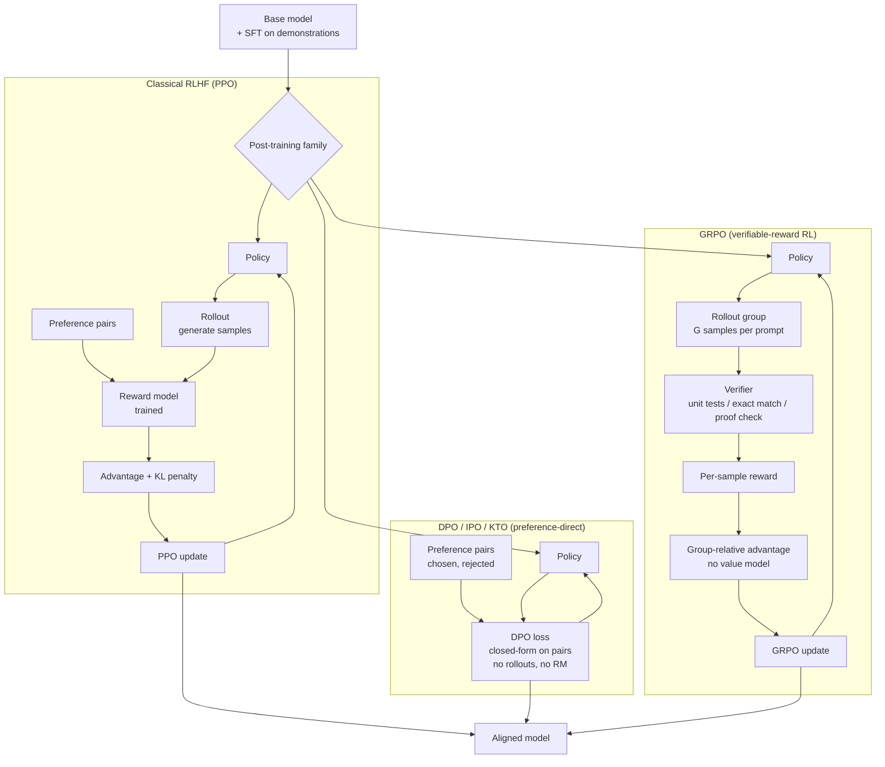
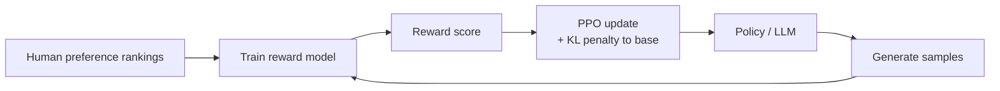
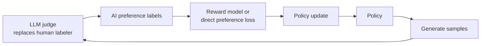
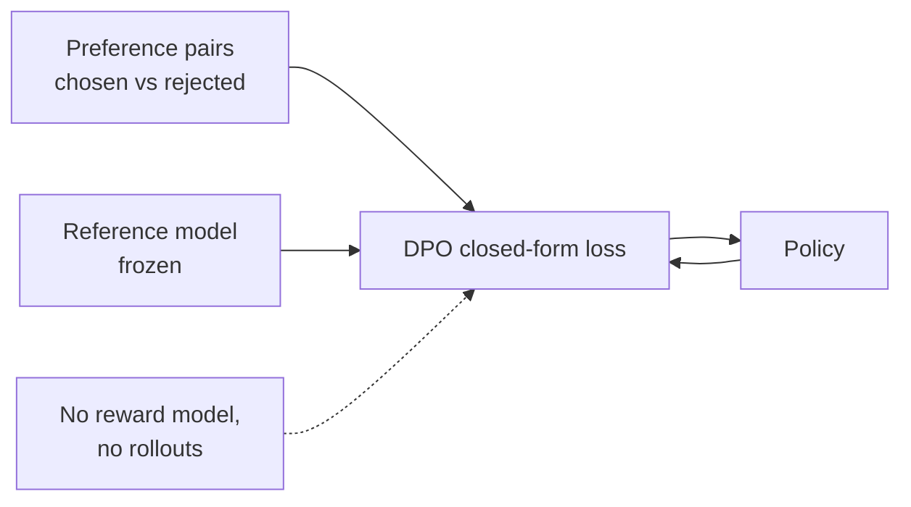
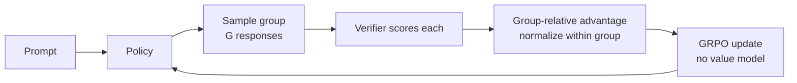
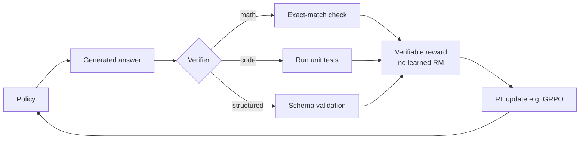
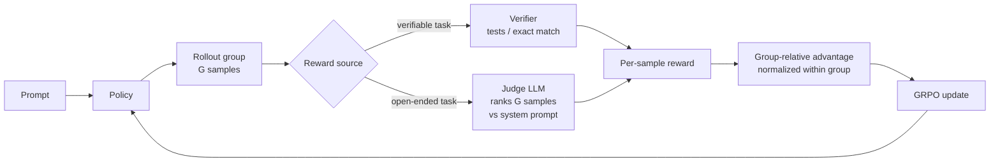

# Post-Training Stack 2026

Decision guide for the post-training algorithm landscape as of mid-2026. Covers RL-based and preference-optimization methods that have replaced or supplemented classical PPO-based RLHF in most production stacks.

---

## Table of Contents

- [Why the Stack Changed](#why-the-stack-changed)
- [Algorithm Catalogue](#algorithm-catalogue)
- [Decision Tree: Choosing a Post-Training Algorithm](#decision-tree-choosing-a-post-training-algorithm)
- [Quick Comparison Table](#quick-comparison-table)
- [Implementation Notes](#implementation-notes)
- [Anti-Patterns](#anti-patterns)

---

## Why the Stack Changed

PPO-based RLHF (the original InstructGPT approach) requires:
1. A trained reward model (RM) — expensive to collect preference data for and to train
2. A rollout engine generating samples during training — significant infra complexity
3. Careful KL-divergence constraint tuning to prevent policy collapse

Since 2024, alternatives have matured that either remove the RM, remove the rollout loop, or replace the learned reward with a programmatic verifier. These are now the default for many teams.

### Reference Diagram — Post-training algorithm families side-by-side

What each family actually moves through the loop. Boxes that disappear between families are the cost saved.



What disappears as you move right:
- **DPO drops**: reward model, rollout engine, KL-coefficient tuning hell.
- **GRPO drops**: human preference labels, learned reward model — replaced by a verifier (only works where correctness is checkable).

---

## Algorithm Catalogue

### PPO (Proximal Policy Optimization)

**What it is**: The original "gold standard" RLHF algorithm. A policy gradient method that uses a clipped surrogate objective and a learned reward model to optimize the policy.

**When to use**: Only when the reward signal is too complex to be captured by pairwise preference data or verified programmatically (e.g., nuanced safety, multi-turn dialog quality). Rarely the first choice in 2026 for new fine-tuning projects.

**Key requirements**: Learned reward model + rollout infra + KL constraint.

**Known risks**: Reward hacking (policy exploits RM weaknesses), mode collapse, high infra cost.

**RLHF pipeline** (PPO is the optimizer at its core — human preferences → reward model → PPO):



---

### RLAIF (RL from AI Feedback)

**What it is**: RLHF with the human preference labeler replaced by an LLM judge. The judge ranks completions, producing preference labels at a fraction of the cost and time of human annotation; the rest of the pipeline (reward model or direct preference loss) is unchanged.

**When to use**: When preference data volume is the bottleneck and a capable judge model can stand in for human raters on your task. Often combined with a small human-labeled calibration set to check the judge against human preference.

**Tradeoffs**: Inherits the judge model's biases; calibrate the judge against human labels before trusting it at scale (see [ai-evals](../../ai-evals/SKILL.md) for judge calibration).



---

### DPO (Direct Preference Optimization)

**What it is**: Bypasses the reward model entirely by deriving a closed-form objective directly from pairwise preference data. The policy and reference model implicitly define the reward; no explicit RM is trained.

**When to use**: You have pairwise human or AI preference labels (chosen vs rejected completions). No rollout infrastructure needed — trains like a standard supervised fine-tuning run.

**Key requirements**: Pairwise preference dataset; reference model checkpoint.

**Tradeoffs**: Simpler than PPO; no reward hacking; can underperform PPO on tasks where the RM captures nuance the pairwise comparison data misses. Sensitive to label quality.

**arXiv**: Rafailov et al. (2023), "Direct Preference Optimization: Your Language Model is Secretly a Reward Model" — arXiv:2305.18290 (verify at https://arxiv.org/abs/2305.18290).



---

### SimPO (Simple Preference Optimization)

**What it is**: A DPO variant that removes the reference model dependency and adds a length-normalized reward margin. The policy is trained with a margin between chosen and rejected completions normalized by sequence length.

**When to use**: When you want DPO-style training but without a reference model checkpoint (reduces memory and simplifies the training loop). Tends to produce better-calibrated length behavior than vanilla DPO.

**Key requirements**: Pairwise preference dataset; no reference model needed.

**Tradeoffs**: Hyperparameter-sensitive (margin γ and β); verify on your task before adopting over DPO.

**arXiv**: Meng et al. (2024), "SimPO: Simple Preference Optimization with a Reference-Free Reward" — arXiv:2405.14734 (verify at https://arxiv.org/abs/2405.14734).

---

### KTO (Kahneman-Tversky Optimization)

**What it is**: Trains on scalar binary feedback (good/bad) rather than pairwise comparisons. Models human utility using Kahneman-Tversky prospect theory framing, with separate loss terms for desirable and undesirable outputs.

**When to use**: When pairwise comparison labels are hard or expensive to collect; when you have user thumbs-up/down signals or binary quality flags from production logs. Works with unpaired feedback.

**Key requirements**: Binary (scalar) feedback labels — not pairwise. Reference model checkpoint.

**Tradeoffs**: Effective when pairwise comparisons are not available; may require more data than DPO at equivalent quality. Verify framework support (TRL has KTO as of mid-2025; check current version).

**arXiv**: Ethayarajh et al. (2024), "KTO: Model Alignment as Prospect Theoretic Optimization" — arXiv:2402.01306 (verify at https://arxiv.org/abs/2402.01306).

---

### GRPO (Group Relative Policy Optimization)

**What it is**: An RL method that eliminates the learned reward model by using a group of sampled outputs and comparing them to each other relative to a verifiable reward signal. Each output in a group is scored by a verifier; the relative scores within the group provide the training signal.

**When to use**: Tasks with deterministic or programmatically verifiable correctness: mathematics (exact answer match), code (test-case pass rate), structured data extraction (schema validation), logic puzzles. This is the post-training method used in models like DeepSeek-R1 and similar reasoning-focused models.

**Key requirements**: A programmatic verifier (ground-truth checker, test suite, parser); no RM needed. Group sampling budget at each training step.

**Tradeoffs**: Requires verifiable tasks — does not generalize to open-ended creative or subjective tasks. Group sampling increases per-step compute. Training dynamics differ from PPO; requires tuning group size, KL coefficient, and verifier strictness.

**arXiv**: Shao et al. (2024), "DeepSeekMath: Pushing the Limits of Mathematical Reasoning in Open Language Models" — arXiv:2402.03300 (verify at https://arxiv.org/abs/2402.03300). GRPO formulation appears in the DeepSeek-R1 technical report; arXiv:2501.12948 (verify at https://arxiv.org/abs/2501.12948).



---

### DAPO (Decoupled Clip and Dynamic Sampling Policy Optimization)

**What it is**: An extension of GRPO that addresses instability in GRPO training via two changes: (1) decoupled clip bounds for the policy ratio (separate ε for positive and negative advantages), and (2) dynamic sampling that filters out prompts where all group samples have the same reward (no learning signal). Also adds a token-level KL entropy bonus to prevent entropy collapse.

**When to use**: When you are training with GRPO and observing training instability, entropy collapse, or reward hacking through repetition. DAPO targets large-scale RL training specifically.

**Key requirements**: Same as GRPO (verifiable reward); compatible training framework that supports decoupled clip and dynamic filtering.

**Tradeoffs**: More hyperparameters than GRPO; primarily relevant at large scale where GRPO instability manifests. Verify framework support before adopting — as of mid-2026, DAPO is newer and ecosystem support is still developing.

**arXiv**: Yu et al. (2025), "DAPO: An Open-Source LLM Reinforcement Learning System at Scale" — verify current arXiv ID at https://arxiv.org/search/?searchtype=all&query=DAPO+GRPO+decoupled (the paper was released in early 2025; verify exact ID).

---

### GSPO (Group Sequence Policy Optimization)

**What it is**: A GRPO-family method that performs importance sampling and clipping at the **sequence level** rather than GRPO's token level. GRPO's token-level importance ratios become noisy and high-variance on Mixture-of-Experts (MoE) models, because the expert routing can differ between the rollout and the update step — which destabilizes or collapses training. GSPO defines the ratio over the whole sequence, which matches how the reward is actually assigned and removes that instability.

**When to use**: RL post-training of **MoE models** (now the frontier default), or any case where GRPO/DAPO show routing-induced instability at scale. GSPO is the method used to train the Qwen3 series and has become the production standard for large-scale MoE RL.

**Key requirements**: Same as GRPO (verifiable reward + group sampling); a framework that implements sequence-level importance weighting.

**Tradeoffs**: Sequence-level granularity is coarser than token-level, which can be less sample-efficient on dense models where GRPO is already stable — its decisive advantage is specifically on MoE. Verify framework support (e.g. veRL) before adopting.

**arXiv**: Zheng et al. (2025), Qwen team, "Group Sequence Policy Optimization" — arXiv:2507.18071 (verify at https://arxiv.org/abs/2507.18071).

---

### RLVR (RL with Verifiable Rewards)

**What it is**: An umbrella term (not a single algorithm) for the class of RL methods where the reward signal comes from a programmatic verifier rather than a learned reward model. GRPO, DAPO, and GSPO are examples of RLVR algorithms.

**When to use**: Treat RLVR as the category; choose GRPO (dense, stable), DAPO (GRPO instability fixes), or GSPO (MoE) as the specific algorithm.

**Key insight**: RLVR has been the primary driver of reasoning capability gains in frontier models since late 2024. It is effective precisely because the verifier is reliable — the policy cannot hack a ground-truth checker the way it can exploit a learned RM.



---

### RULER (Relative Universal LLM-Elicited Rewards)

**What it is**: A reward method that extends RLVR-style training to tasks with **no programmatic verifier**. Instead of a checker returning a ground-truth score, RULER passes the *group* of N sampled trajectories for a prompt to a judge LLM, which ranks them **relative to each other** against the agent's own system prompt and returns per-trajectory scores. Those scores feed GRPO exactly as a verifier's rewards would.

**Why it works with GRPO**: GRPO already normalizes advantages *within the group*, and relative ranking is more stable than absolute scoring — so the judge's relative ranks slot straight into the GRPO update without a separate reward-calibration stage. It is the bridge for the gap GRPO/RLVR cannot cross alone: open-ended outputs (RAG answers, support replies, summaries) that have no gold label to match.

**When to use**: GRPO-style training is desired but the task is **not** programmatically verifiable and you do not want to hand-author and calibrate a reward function (faithfulness/hallucination/completeness scorers are slow to tune, reward the wrong behavior when weights drift, and break whenever a tool or the system prompt changes).

**Key requirements**: A capable judge LLM; group sampling (same as GRPO); the agent's system prompt as the ranking rubric.

**Tradeoffs**: Inherits judge-LLM cost and any judge bias (calibrate the judge — see [ai-evals](../../ai-evals/SKILL.md) for judge calibration); relative ranking gives ordinal, not absolute, signal. Verify the judge does not reward-hack the same way a learned RM would.

**Reference implementation**: OpenPipe's ART (Agent Reinforcement Trainer), open-source — verify at https://github.com/OpenPipe/ART.

RULER is GRPO with the verifier box swapped for a judge box — everything downstream is identical:



The judge returns *relative* ranks, and the group-relative advantage step normalizes within the group anyway — so ranks slot in exactly where a verifier's scalars would, with no separate calibration stage.

---

### ORPO (Odds Ratio Preference Optimization)

**What it is**: Combines SFT and preference alignment into a single training pass. The loss has two terms: standard NLL for chosen completions (SFT-style) + an odds-ratio penalty for rejecting "bad" completions. No reference model needed.

**When to use**: When you want to collapse SFT + preference alignment into one stage and do not have a reference model available. Lower memory footprint than DPO.

**Tradeoffs**: Less studied than DPO at large scale; may underperform DPO when a high-quality reference model is available. Verify on your task.

**arXiv**: Hong et al. (2024), "ORPO: Monolithic Preference Optimization without Reference Model" — arXiv:2403.07691 (verify at https://arxiv.org/abs/2403.07691).

---

## Decision Tree: Choosing a Post-Training Algorithm

```text
What is your feedback signal?
├─ Pairwise (chosen vs rejected) human or AI labels
│   ├─ Do you have a reference model checkpoint?
│   │   ├─ Yes → DPO (default) or SimPO if length calibration matters
│   │   └─ No → SimPO or ORPO
│   └─ Is training stability at scale a concern?
│       └─ Not applicable to pairwise methods — proceed with DPO/SimPO
│
├─ Scalar / binary (thumbs up/down, pass/fail)
│   └─ KTO (works with unpaired binary labels)
│
├─ Programmatically verifiable (math answer, code test, schema)
│   ├─ Standard GRPO training infrastructure available?
│   │   ├─ Yes → GRPO
│   │   └─ No → Build verifier first; GRPO needs per-sample scoring
│   └─ Experiencing GRPO instability at large scale?
│       ├─ Dense model → DAPO (decoupled clip + dynamic sampling)
│       └─ MoE model → GSPO (sequence-level; fixes routing-induced collapse)
│
├─ Open-ended but rankable (RAG answer, support reply, summary — no gold label)
│   └─ RULER: judge LLM ranks the group → feeds GRPO (no verifier, no RM)
│
└─ Complex subjective reward (nuanced safety, multi-turn quality)
    └─ PPO with learned RM (last resort; highest cost and complexity)
```

---

## Quick Comparison Table

| Algorithm | Feedback Type | RM Needed | Rollout Needed | Ref Model | Primary Use Case |
|-----------|--------------|-----------|----------------|-----------|-----------------|
| PPO | Pairwise / scalar | Yes | Yes | Yes | Complex subjective reward |
| DPO | Pairwise | No | No | Yes | General preference alignment |
| SimPO | Pairwise | No | No | No | DPO without reference model; length control |
| KTO | Binary scalar | No | No | Yes | Production logs with thumbs up/down |
| ORPO | Pairwise | No | No | No | Single-stage SFT + alignment |
| GRPO | Verifiable | No (verifier instead) | Yes (group samples) | Optional | Math, code, structured output |
| DAPO | Verifiable | No (verifier instead) | Yes (group samples) | Optional | GRPO at scale with stability fixes (dense) |
| GSPO | Verifiable | No (verifier instead) | Yes (group samples) | Optional | RL on MoE models (sequence-level; Qwen3) |
| RULER | Judge LLM ranks group | No (judge instead) | Yes (group samples) | Optional | Open-ended tasks with no verifier (RAG, support, summary) |

---

## Implementation Notes

**Framework support (verify current versions)**:
- **TRL (Hugging Face)**: DPO, KTO, ORPO, GRPO trainers present as of 2025; SimPO may require a fork or custom loss — verify at https://huggingface.co/docs/trl
- **OpenRLHF**: PPO, DPO, GRPO, and variants at larger scale; verify at https://github.com/OpenRLHF/OpenRLHF
- **veRL**: Volcano Engine RL framework with GRPO/DAPO support; verify at https://github.com/volcengine/verl

**Verifier design (for GRPO/DAPO/RLVR)**:
- Math: exact-match or equivalence check (SymPy, Lean)
- Code: unit test execution in a sandbox
- Structured output: JSON schema validation, regex match
- A verifier that is too lenient enables reward hacking; too strict prevents learning — calibrate on a holdout set

**Data requirements**:
- DPO / SimPO / KTO: preference dataset; 5K–100K examples is typical depending on task complexity
- GRPO / DAPO: prompt-only dataset with a verifier; the model generates its own responses
- All methods: ensure eval set is contamination-free from training data

---

## Anti-Patterns

- **Using PPO when a verifier exists**: RLVR methods (GRPO) outperform PPO on verifiable tasks with less complexity. Default to RLVR when the task has ground truth.
- **Using DPO with low-quality preference labels**: DPO is sensitive to label noise; noisy labels can make DPO worse than no preference optimization.
- **Skipping eval after preference optimization**: Post-training can improve alignment but degrade instruction-following or reasoning if data mix is wrong. Always run lm-eval-harness and task-specific probes before shipping.
- **Using GRPO with no reward source on non-verifiable tasks**: Without a verifier *or* a judge, GRPO has no stable signal — do not run it on open-ended creative or conversational tasks. When the task is open-ended but outputs are rankable, use RULER (judge LLM ranks the group) instead of abandoning GRPO or hand-authoring a brittle reward function.
- **Ignoring length bias in DPO**: Standard DPO tends to favor shorter outputs; SimPO or length-normalized variants mitigate this. Check output length distribution before and after.

---

## Related Resources

- **[Fine-Tuning Recipes](fine-tuning-recipes.md)** — SFT, LoRA, and the full adaptation lifecycle
- **[Advanced LLM Patterns](advanced-llm-patterns.md)** — RLHF loop, test-time compute
- **[Decision Matrices](decision-matrices.md)** — Distributed training matrix, MoE vs dense
- **Hugging Face LLM Trainer** (external `huggingface-skills:` plugin) — TRL implementation depth for SFT/DPO/GRPO
