# ML Diagram Catalog (Mermaid)

Reusable Mermaid diagrams for classical ML algorithms and neural network architectures. Drop into READMEs, docs, PR descriptions, notebooks, or agent outputs.

## Table of Contents

- [When to Use](#when-to-use)
- [Authoring Conventions](#authoring-conventions)
- [Classical ML](#classical-ml)
- [Neural Network Architectures](#neural-network-architectures)
  - [Feedforward (MLP)](#feedforward-mlp)
  - [Recurrent Neural Network](#recurrent-neural-network-unrolled)
  - [Convolutional Neural Network](#convolutional-neural-network-image-classifier)
  - [Transformer (original encoder)](#transformer-encoder-block--full-stack)
  - [Modern LLM Decoder Block](#modern-llm-decoder-block-production-grade)
  - [Mixture of Experts FFN](#mixture-of-experts-moe-ffn-sublayer)
  - [State Space Model (Mamba)](#state-space-model-block-mamba-style)
  - [Vision Transformer (ViT)](#vision-transformer-vit)
  - [Diffusion Transformer (DiT)](#diffusion-transformer-dit--imagevideo-generation)
  - [Multimodal VLM (LLaVA-style)](#multimodal-vision-language-model-llava-style)
  - [Reasoning model training loop](#reasoning-model-training-loop-rl-with-cot)
- [Variants Worth Adding](#variants-worth-adding)
- [Anti-Patterns](#anti-patterns)

## When to Use

- Documenting an ML pipeline in markdown-rendered surfaces (GitHub, Notion, Obsidian, MkDocs)
- Writing PR descriptions for model changes that need a quick "before/after"
- Teaching, onboarding, or explaining a model family without slide tooling

Skip for: mathematical derivations (use LaTeX), trained-model artifacts (use SHAP / netron / TensorBoard), system-level infra diagrams (different skill).

## Authoring Conventions

- **`flowchart LR/TB/TD`** for pipelines and sequential ops.
- **`subgraph`** to encapsulate repeated blocks (transformer encoder, RNN cell).
- **Edge labels** carry *data shape*; **node labels** carry *operation*.
- **`(())` double-circle** for residual sums / merges.
- **`{}` diamond** for branching decisions (decision trees, convergence checks).
- Quote labels (`"..."`) when they contain `()`, `:`, `/`, or commas.

---

## Classical ML

### K-Means Clustering

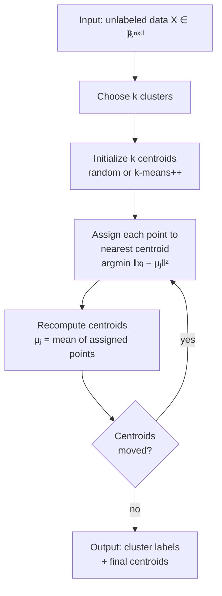

### Logistic Regression

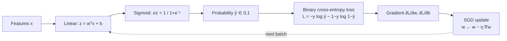

### Decision Tree (classification)

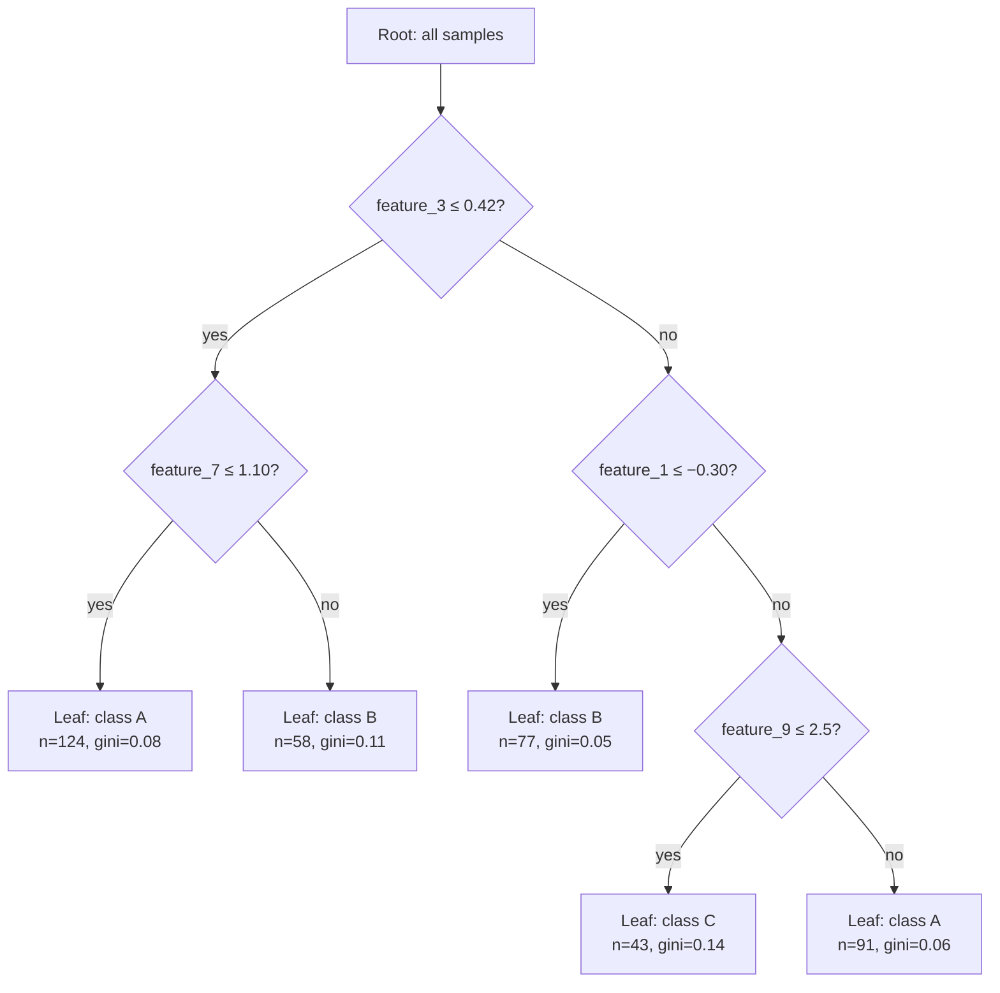

### Collaborative Filtering (matrix factorization)

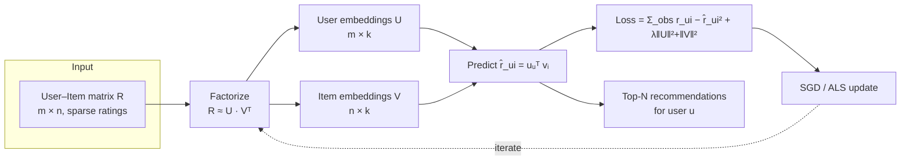

---

## Neural Network Architectures

### Feedforward (MLP)

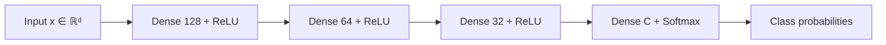

### Recurrent Neural Network (unrolled)

```mermaid
flowchart LR
    X1[x₁] --> C1[RNN cell]
    H0[h₀] --> C1
    C1 --> H1[h₁]
    C1 --> Y1[y₁]

    X2[x₂] --> C2[RNN cell]
    H1 --> C2
    C2 --> H2[h₂]
    C2 --> Y2[y₂]

    X3[x₃] --> C3[RNN cell]
    H2 --> C3
    C3 --> H3[h₃]
    C3 --> Y3[y₃]

    XT[xₜ] --> CT[RNN cell]
    H3 -. ... .-> CT
    CT --> HT[hₜ]
    CT --> YT[yₜ]
```

Every cell shares parameters `Wₕ, Wₓ, b` — the unroll is conceptual, not architectural. LSTM/GRU swap the inner cell for a gated variant but keep this skeleton.

### Convolutional Neural Network (image classifier)

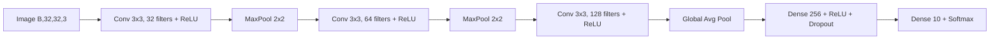

### Transformer (encoder block + full stack)

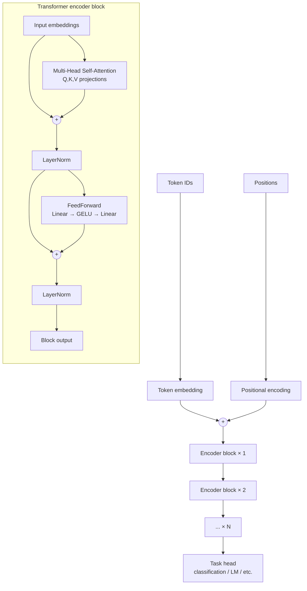

Notes:
- `(+)` nodes are **residual connections** — without them, deep transformers do not train.
- This is the **post-norm** layout from the original paper. Modern LLMs (GPT, LLaMA) use **pre-norm** (LayerNorm *before* the sublayer, then residual sum) for stability at depth.
- Decoder blocks add (1) **masked** self-attention to prevent peeking at future tokens, and (2) a **cross-attention** layer that consumes encoder output.

### Modern LLM Decoder Block (production-grade)

What frontier-tier decoder-only LLMs actually deploy. Differences from the original block above are highlighted in the notes.

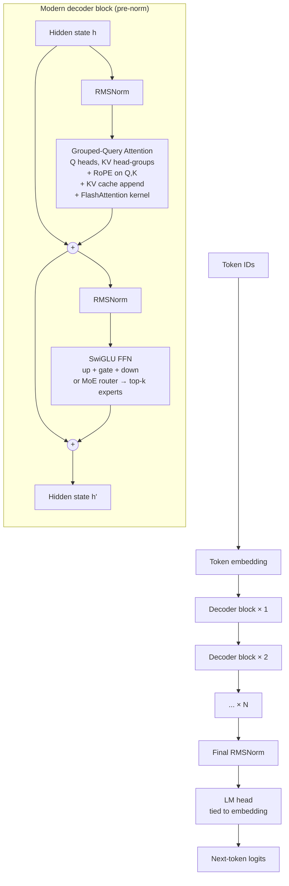

What changed vs the original block:

| Original | Modern production | Why |
|---|---|---|
| LayerNorm | **RMSNorm** | Cheaper, equally stable |
| Post-norm | **Pre-norm** | Trains deeper without divergence |
| Additive positional encoding | **RoPE** applied inside attention to Q,K | Extrapolates to longer context; no separate position embedding to learn |
| Multi-Head Attention | **GQA** (or MQA) | Cuts KV-cache memory by `n_heads / n_kv_groups`× — decisive at long context |
| Plain attention | **+ KV cache + FlashAttention** | KV cache reuses past K,V across decode steps; FlashAttention fuses the softmax to avoid materializing the attention matrix |
| GELU FFN | **SwiGLU** (gated) | Better quality at same parameter count |
| Dense FFN every layer | **MoE router → top-k experts** (frontier-tier) | Decouples capacity from FLOPs per token |
| Encoder + decoder | **Decoder-only** | Simpler; works for both generation and embedding tasks |

### Mixture of Experts (MoE) FFN sublayer

Replaces the dense FFN inside each decoder block in MoE-tier models.

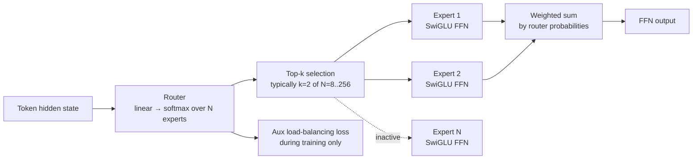

Notes:
- Only **k of N** experts run per token — that's the whole point. Total parameter count is large; per-token FLOPs are small.
- The auxiliary loss prevents the router from collapsing to one expert. Production variants: expert choice routing, shared experts (DeepSeek), no-aux-loss balancing.
- Expert parallelism (EP) shards experts across devices — see `ai-llm-inference/references/moe-expert-parallelism.md`.

### State Space Model block (Mamba-style)

Subquadratic alternative to attention. Used in hybrid stacks (Jamba, Zamba, Samba) that mix SSM blocks with attention blocks.

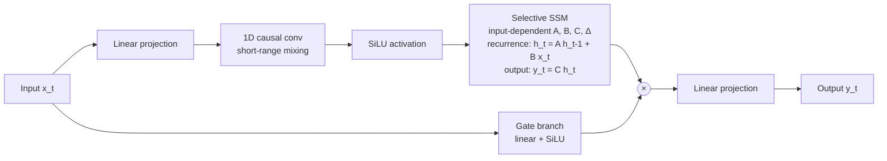

Notes:
- **Linear** in sequence length, **constant** memory per decode step — opposite tradeoff to attention.
- The recurrence is parallelizable at training time via the selective scan kernel.
- Hybrid stacks alternate `SSM block / attention block / SSM block / ...` — SSM handles long-range context cheaply; attention handles precise lookup.

### Vision Transformer (ViT)

How transformers consume images. Foundation for CLIP, SigLIP, and most modern vision-language models.

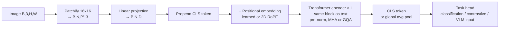

### Diffusion Transformer (DiT) — image/video generation

Replaces U-Net backbone in modern image/video gen models (Stable Diffusion 3, SDXL successors, Sora-class video).

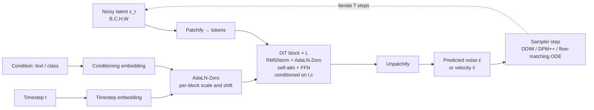

Notes:
- **AdaLN-Zero** is the modulation trick — timestep and condition modulate every block's norms.
- **Flow-matching** (rectified flow) has largely replaced DDPM-style training in new models — same architecture, different loss.
- Image gen typically `T = 20–50` steps; distilled / consistency models do it in `1–4`.

### Multimodal Vision-Language Model (LLaVA-style)

How images get into a decoder-only LLM.

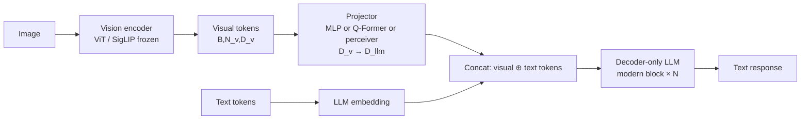

Notes:
- The **projector** is the trainable bridge — encoder and LLM are often frozen during stage-1 training.
- **Native multimodal** models (Chameleon, Gemini, GPT-4o) skip the projector by training a single transformer on interleaved image/text/audio tokens from scratch.

### Reasoning model training loop (RL-with-CoT)

How o1/o3/R1-class models are trained. Distinct from RLHF — the reward is verifiable correctness, not preference.

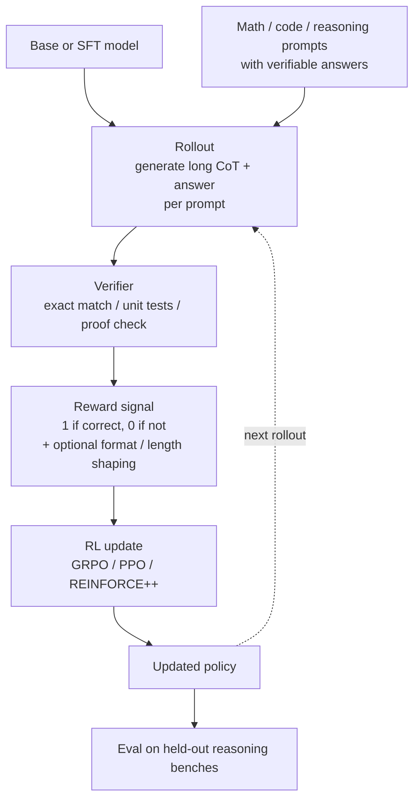

Notes:
- **GRPO** (group-relative policy optimization) is the dominant choice — drops the value model, normalizes advantages within a sampled group per prompt.
- No human preference labels needed — the verifier replaces RLHF's reward model.
- Long CoTs (10k–100k tokens) make this compute-intensive; throughput optimization matters more than for SFT.

---

## Variants Worth Adding

When the catalog needs to grow:

- **LSTM / GRU cell internals** — gates (forget/input/output) as separate sigmoid/tanh nodes, cell-state line passing through.
- **Attention head detail** — Q,K,V linear projections → `QKᵀ/√d` → softmax → multiply by V. Useful as zoom-in below the modern decoder block.
- **Multi-head vs GQA vs MQA side-by-side** — show the KV-head sharing pattern explicitly; this is the most-asked clarification.
- **RoPE rotation visual** — Q,K rotated in 2D pairs by frequency; harder to draw in Mermaid, may need static image.
- **U-Net** — symmetric encoder–decoder with skip connections; still relevant for medical imaging even though DiT replaced it for generation.
- **Autoencoder / VAE** — VAE adds the `μ, log σ²` split and reparameterization trick.
- **GNN message passing** — one layer of aggregate → transform → update, iterated as "× L".
- **Random Forest / Gradient Boosting** — one tree detailed, then ensemble combiner.
- **Speculative decoding** — draft model proposes k tokens, target verifies in parallel, accept prefix.
- **Encoder–decoder LLM** (T5/Flan style) — for the niche where it still wins (translation, summarization).

## Anti-Patterns

- **Don't draw the math.** Mermaid is bad at matrices. If you need `softmax(QKᵀ/√d)V` shown matrix-by-matrix, switch to LaTeX or a static image.
- **Don't unroll deep stacks.** Show "× N" with one block, not 12 stacked boxes.
- **Don't put hyperparameters in node labels.** Filter counts and dropout rates date a diagram fast — keep them in surrounding prose.
- **Don't combine training and inference in one diagram.** Two side-by-side diagrams beat one with optional dotted arrows.
- **Don't exceed ~25 nodes.** Past that, switch to Excalidraw/Figma, a table, or a notebook with `print(x.shape)` between layers.
