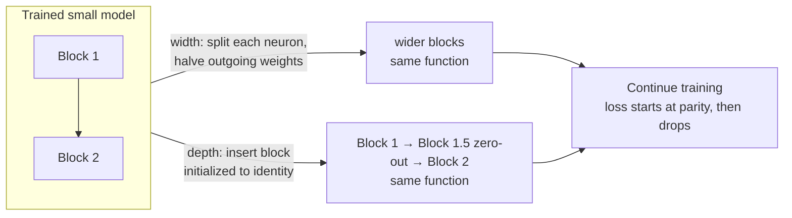

# Modern Architecture Deltas (GPT-2 → 2026 Baseline)

The rest of this skill teaches the GPT-2 (2019) architecture as the pedagogical spine: learned absolute positional embeddings, LayerNorm, GELU-MLP, AdamW, hand-rolled softmax attention. That spine is correct and the right thing to build *first*. This reference is the second pass: the deltas a top-tier "from scratch" implementation applies in 2026. Each entry is framed as **GPT-2 did X → modern does Y → why**, so it reads as a diff against code you already wrote.

The 2026 consensus decoder ("Llama-style") is: **RoPE + RMSNorm + SwiGLU + GQA + FlashAttention/SDPA**, optionally trained with **Muon**. Build GPT-2 first to understand the mechanics; then apply these to land on a modern baseline.

## Table of Contents

- [Canonical Sources](#canonical-sources)
- [RoPE: Rotary Positional Embeddings](#rope-rotary-positional-embeddings)
- [RMSNorm](#rmsnorm)
- [SwiGLU FFN](#swiglu-ffn)
- [GQA: Grouped-Query Attention](#gqa-grouped-query-attention)
- [FlashAttention / scaled_dot_product_attention](#flashattention--scaled_dot_product_attention)
- [Muon and the Speedrun Frontier](#muon-and-the-speedrun-frontier)
- [Model Surgery: Growing a Trained Net](#model-surgery-growing-a-trained-net)
- [Putting It Together: the 2026 Block](#putting-it-together-the-2026-block)
- [Common Mistakes](#common-mistakes)

## Canonical Sources

- RoPE — Su et al., "RoFormer" — https://arxiv.org/abs/2104.09864
- RMSNorm — Zhang & Sennrich — https://arxiv.org/abs/1910.07467
- SwiGLU — Shazeer, "GLU Variants Improve Transformer" — https://arxiv.org/abs/2002.05202
- GQA — Ainslie et al. — https://arxiv.org/abs/2305.13245
- FlashAttention-2 — Dao — https://arxiv.org/abs/2307.08691
- FlashAttention-3 (Hopper async + FP8) — Shah et al. — https://arxiv.org/abs/2407.08608
- FlashAttention-4 (Blackwell asymmetric-hardware co-design, March 2026) — Dao et al. — https://arxiv.org/abs/2603.05451
- Muon is Scalable for LLM Training (weight decay + update-scale fixes; Moonlight-scale benchmark) — https://arxiv.org/abs/2502.16982
- Kimi K2 Technical Report (MuonClip: Muon + QK-Clip at 1T-param scale) — Moonshot AI, 2025 — https://github.com/moonshotai/kimi-k2
- GLM-5 Technical Report (distributed Muon, GQA-8 vs MLA ablation) — arXiv 2602.15763, Feb 2026
- Karpathy nanochat (full-stack from scratch, Oct 2025) — https://github.com/karpathy/nanochat
- modded-nanoGPT speedrun + Muon — https://github.com/KellerJordan/modded-nanogpt

## RoPE: Rotary Positional Embeddings

**GPT-2 did:** a learned position embedding table `wpe` of shape `(block_size, n_embd)`, added to token embeddings at the input.

**Modern does:** no input position embedding at all. Instead, rotate the query and key vectors by a position-dependent angle *inside attention*, per head, before the `QK^T` dot product.

**Why:** RoPE encodes *relative* position directly in the dot product — `q_m · k_n` depends only on `m - n`. It extrapolates to longer contexts better than learned absolute tables and is the substrate for long-context tricks (NTK scaling, YaRN). Removing `wpe` also removes a hard `block_size` ceiling on positions.

```python
def precompute_rope(head_dim, max_seq, base=10000.0, device='cuda'):
    # base 10000 is the Llama default; long-context models raise it (e.g. 1e6) or use YaRN
    inv_freq = 1.0 / (base ** (torch.arange(0, head_dim, 2, device=device).float() / head_dim))
    t = torch.arange(max_seq, device=device).float()
    freqs = torch.outer(t, inv_freq)            # (max_seq, head_dim/2)
    return torch.cos(freqs), torch.sin(freqs)

def apply_rope(x, cos, sin):                      # x: (B, n_head, T, head_dim)
    x1, x2 = x[..., 0::2], x[..., 1::2]
    cos, sin = cos[None, None, :x.size(2)], sin[None, None, :x.size(2)]
    return torch.stack([x1 * cos - x2 * sin,
                        x1 * sin + x2 * cos], dim=-1).flatten(-2)
```

Apply to `q` and `k` only (never `v`), after the head reshape, before the attention matmul.

## RMSNorm

**GPT-2 did:** `nn.LayerNorm` — subtract mean, divide by std, scale (`gamma`) and shift (`beta`).

**Modern does:** RMSNorm — skip the mean-centering and the bias; only rescale by RMS.

**Why:** the centering term contributes little empirically, RMSNorm is cheaper, and it is marginally more stable at depth. It is the norm in Llama, Mistral, Qwen, Gemma.

```python
class RMSNorm(nn.Module):
    def __init__(self, dim, eps=1e-6):
        super().__init__()
        self.eps = eps
        self.weight = nn.Parameter(torch.ones(dim))
    def forward(self, x):
        norm = x * torch.rsqrt(x.pow(2).mean(-1, keepdim=True) + self.eps)
        return norm * self.weight
```

Compute the norm in float32 even under bf16 autocast (`x.float()` then cast back) to avoid precision loss in the reduction.

## SwiGLU FFN

**GPT-2 did:** `Linear(n_embd, 4*n_embd) → GELU → Linear(4*n_embd, n_embd)` — two matrices.

**Modern does:** a gated FFN with three matrices: `down( silu(gate(x)) * up(x) )`.

**Why:** the multiplicative gate consistently improves quality per the GLU-variants paper. To keep parameter count roughly equal to the 4x GELU-MLP, the hidden dim is scaled to `~8/3 * n_embd` (i.e. `2/3` of `4*n_embd`), then rounded to a hardware-friendly multiple.

```python
class SwiGLU(nn.Module):
    def __init__(self, n_embd, mult=4, round_to=256):
        super().__init__()
        hidden = int(2/3 * mult * n_embd)
        hidden = round_to * ((hidden + round_to - 1) // round_to)   # round up
        self.gate = nn.Linear(n_embd, hidden, bias=False)
        self.up   = nn.Linear(n_embd, hidden, bias=False)
        self.down = nn.Linear(hidden, n_embd, bias=False)
    def forward(self, x):
        return self.down(F.silu(self.gate(x)) * self.up(x))
```

## GQA: Grouped-Query Attention

**GPT-2 did:** multi-head attention — `n_head` query heads and the *same* `n_head` key/value heads (MHA).

**Modern does:** fewer KV heads than query heads. `n_kv_head` divides `n_head`; each KV head is shared across a group of query heads. MHA (`n_kv=n_head`) and MQA (`n_kv=1`) are the endpoints; GQA sits between.

**Why:** the KV cache dominates inference memory and bandwidth. GQA shrinks it `n_head / n_kv_head`× with negligible quality loss. Pretraining-time concern only insofar as you must train with the head layout you'll serve.

**MQA (the `n_kv=1` endpoint):** Multi-Query Attention (Shazeer, 2019) collapses to a *single* shared KV head — the maximal KV-cache shrink. It came first and proved the idea, but the quality drop at `n_kv=1` is steep on larger models; GQA was introduced specifically as the middle ground that keeps most of MQA's memory savings without the degradation. Practical rule: reach for GQA (`n_kv_head` of 4–8), not pure MQA, unless inference memory is so tight that the quality hit is worth it. arXiv: Shazeer, "Fast Transformer Decoding: One Write-Head is All You Need" — https://arxiv.org/abs/1911.02150.

**GQA is the right default for this skill's build-from-scratch scope, but it is not the only frontier choice by mid-2026.** GQA remains the near-universal default under ~100B params (Qwen3, Llama 4) because it is simpler to implement and tune. At the largest MoE frontier models, Multi-head Latent Attention (MLA — DeepSeek-V2/V3/V4, Kimi K2) has gained real production traction for its deeper KV-cache cut, though the field has not converged: GLM-5's own report found GQA-8 outperformed MLA in their internal ablation and shipped GQA instead. Build GQA first; see [architecture-limitations-and-workarounds.md §3](architecture-limitations-and-workarounds.md#3-attention-head-schemes-mha---mqa---gqa---mla) before committing to MLA's added complexity.

```python
# project fewer KV heads, then repeat_interleave to match query heads before attention
self.c_q  = nn.Linear(n_embd, n_head    * head_dim, bias=False)
self.c_kv = nn.Linear(n_embd, 2 * n_kv_head * head_dim, bias=False)
# ... after reshaping k, v to (B, n_kv_head, T, head_dim):
k = k.repeat_interleave(n_head // n_kv_head, dim=1)
v = v.repeat_interleave(n_head // n_kv_head, dim=1)
```

## FlashAttention / scaled_dot_product_attention

**GPT-2 (this skill's reference) did:** hand-rolled `softmax(QK^T/√d) @ V` with an explicit `(T, T)` mask buffer. Correct for *learning*; quadratic in memory and slow.

**Modern does:** `F.scaled_dot_product_attention(q, k, v, is_causal=True)`. On supported hardware this dispatches to the FlashAttention kernel — tiled, IO-aware, `O(T)` memory instead of `O(T²)`.

```python
y = F.scaled_dot_product_attention(q, k, v, is_causal=True)   # no manual mask buffer
y = y.transpose(1, 2).contiguous().view(B, T, C)
```

This is what current nanoGPT uses. Keep the hand-rolled version as the thing you build to *understand* attention; switch to SDPA the moment you train past a toy `block_size`. Note RoPE must be applied to `q`/`k` *before* this call.

The kernel SDPA dispatches to has moved on from the FlashAttention-2 era: **FlashAttention-3** (asynchrony + warp-specialization + FP8, ~1.6–2× over FA-2) is the Hopper standard, and **FlashAttention-4** (Dao et al., March 2026 — arXiv:2603.05451, "Algorithm and Kernel Pipelining Co-Design for Asymmetric Hardware Scaling") is a real, shipped kernel targeting Blackwell's (B200/GB200) asymmetric hardware, reporting ~20% over cuDNN's prior best. You rarely call these directly — SDPA, vLLM, SGLang, and TensorRT-LLM pick the best available kernel for the hardware — but know that "FlashAttention" in 2026 means FA-3 on Hopper / FA-4 on Blackwell, not the 2023 FA-2.

## Muon and the Speedrun Frontier

**GPT-2 did:** AdamW with `betas=(0.9, 0.95)` for all parameters.

**Modern frontier does:** **Muon** ("Momentum Orthogonalized by Newton-Schulz") for the 2D hidden weight matrices, with AdamW kept for embeddings, the LM head, and scalar/1D params. Muon orthogonalizes the momentum update via a few Newton-Schulz iterations, giving large convergence speedups per step.

The `modded-nanoGPT` speedrun stacks Muon with other modern tricks — **QK-Norm** (RMSNorm on q/k before attention), **ReLU²** activation, **logit softcap**, **zero-init projections**, and **embedding-skip connections** into every block — to drive GPT-2-grade FineWeb validation loss (~3.28) far below the original nanoGPT wall-clock on 8×H100. The exact record is a continually falling moving target; verify the current `modded-nanogpt` README rather than quoting a fixed time.

Muon is no longer just a speedrun trick. "Muon is Scalable for LLM Training" (arXiv 2502.16982, Feb 2025) showed two fixes — **weight decay** and **per-parameter update-scale adjustment** — that let Muon train at scale without bespoke tuning, demonstrated on the 3B/16B-active **Moonlight** MoE with roughly 2× the compute efficiency of AdamW at matched loss. That paper's own benchmark is Moonlight only — treat the ~2× figure as a Moonlight-scale result, not a blanket production number.

Since then, Muon (or a variant) has shown up in production at trillion-parameter scale, each with its own technical report rather than 2502.16982 directly: **Kimi K2** (Moonshot AI, 2025) uses **MuonClip** — Muon's orthogonalized update plus a **QK-Clip** mechanism that bounds attention-logit growth, letting a 1T-param model pretrain 15.5T tokens with no loss spikes (see §2 softmax-pathology parallel in [architecture-limitations-and-workarounds.md](architecture-limitations-and-workarounds.md)); **DeepSeek-V4** (April 2026) and **GLM-5** (Feb 2026, ~745B-param MoE) both name Muon in their own technical reports as a core optimizer choice, with GLM-5 detailing a zero-redundant-communication distributed Muon implementation and reporting that GQA-8 outperformed MLA in their internal ablation despite adopting Muon for the optimizer. Cite each model's own report for its specific recipe — don't cite the original Moonlight paper as evidence for what a *different* model's technical report claims. The split still holds: Muon on the 2D hidden matrices, AdamW on embeddings/head/1D params.

Treat Muon and the speedrun stack as the "after you can reproduce GPT-2 with AdamW, here is the frontier" tier — not the first thing a learner wires up — but understand it is now a serious AdamW replacement, not a curiosity.

## Model Surgery: Growing a Trained Net

**Model surgery** (also **model growth**, **network growth**, **model expansion**) means changing a model's architecture *while preserving the function it has already learned*, so the larger model starts from the smaller one's competence instead of random init. It is a training-efficiency lever, distinct from scaling-law *sizing* (how big to make a fresh run — see [ai-scaling-laws](../../ai-scaling-laws/SKILL.md)).

The two directions:

- **Width/depth expansion (warm-start a bigger model).** Net2Net-style transforms widen a layer (split a neuron into copies and halve outgoing weights so the function is unchanged) or deepen the stack (insert identity-initialized layers). Modern LLM "model growth" trains a small model cheaply, then expands it and continues training — cheaper than training the large model from scratch for the same final quality. Depth growth pairs naturally with the identity-residual skeleton: a newly inserted pre-norm block initialized to output ~zero is an identity at first, so the larger net's loss does not jump.
- **Pruning / distillation (shrink a trained model).** The reverse surgery for inference cost: remove low-importance weights/heads/layers (**pruning**) or train a smaller student to match a larger teacher (**distillation**). Covered in the applications-layer skills ([ai-llm](../../ai-llm/SKILL.md) for distillation, [ai-mlops](../../ai-mlops/SKILL.md) for serving-time compression).

Both expansion moves are *function-preserving by construction* — the larger model computes the same output as the smaller one at the instant of surgery, then training improves from there:



**When to reach for it:** you already have a trained small model and want a larger one without paying full from-scratch cost, or you are running a curriculum that grows capacity over training. **When not to:** a single clean from-scratch run at the target size is simpler and the surgery's function-preservation guarantees are approximate — verify with a loss-parity check immediately after the transform (the larger model's loss should match the smaller model's at the surgery step, then improve).

## Putting It Together: the 2026 Block

```python
class ModernBlock(nn.Module):
    def __init__(self, config):
        super().__init__()
        self.attn_norm = RMSNorm(config.n_embd)
        self.attn = GroupedQueryAttention(config)   # RoPE inside, SDPA for the matmul
        self.ffn_norm = RMSNorm(config.n_embd)
        self.ffn = SwiGLU(config.n_embd)
    def forward(self, x, cos, sin):
        x = x + self.attn(self.attn_norm(x), cos, sin)   # pre-norm, RoPE applied in attn
        x = x + self.ffn(self.ffn_norm(x))
        return x
```

Same pre-norm residual skeleton as the GPT-2 block — only the sublayers and the norm changed. That is the point: the architecture you built transfers; you are swapping four components, not rewriting.

## Common Mistakes

- **Applying RoPE to `v`** — it goes on `q` and `k` only.
- **Keeping `wpe` *and* adding RoPE** — RoPE replaces the learned position table; remove `wpe`.
- **Computing RMSNorm in bf16** — do the squared-mean reduction in float32, then cast back.
- **SwiGLU hidden dim left at `4*n_embd`** — that silently adds ~50% FFN params vs GELU-MLP; scale to `~8/3 * n_embd`.
- **GQA without matching train/serve head layout** — train with the `n_kv_head` you intend to serve.
- **Muon on embeddings or the LM head** — Muon is for 2D hidden matrices; keep AdamW for embeddings, head, norms, and biases.
- **Quoting a stale speedrun record** — verify the current `modded-nanogpt` README; the number moves monthly.
