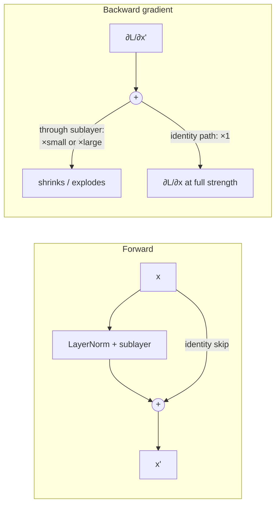

# Transformer From Scratch

Reference for implementing the transformer architecture from first principles, following nanoGPT conventions.

## Table of Contents

- [Canonical Sources](#canonical-sources)
- [Attention Math](#attention-math)
- [Multi-Head Attention](#multi-head-attention)
- [Transformer Block](#transformer-block)
- [GPT Assembly](#gpt-assembly)
- [Weight Initialization](#weight-initialization)
- [Sampling: Temperature and Top-k](#sampling-temperature-and-top-k)
- [KV-Cache for Inference](#kv-cache-for-inference)
- [Parity Check Procedure](#parity-check-procedure)

## Canonical Sources

- Karpathy "Let's build GPT from scratch" — https://www.youtube.com/watch?v=kCc8FmEb1nY
- Karpathy "Let's reproduce GPT-2 (124M)" — https://www.youtube.com/watch?v=l8pRSuU81PU
- nanoGPT — https://github.com/karpathy/nanoGPT
- "Attention Is All You Need" — https://arxiv.org/abs/1706.03762
- Raschka "Build a Large Language Model From Scratch" — https://github.com/rasbt/LLMs-from-scratch

## Attention Math

Scaled dot-product attention for a single head:

```
Attention(Q, K, V) = softmax( QK^T / sqrt(d_k) ) * V
```

- `Q, K, V` each have shape `(B, T, d_k)` for a single head
- `/sqrt(d_k)` keeps variance stable regardless of head dimension
- Causal mask: `torch.tril(torch.ones(T, T))` — set future positions to `-inf` before softmax
- After softmax, each row sums to 1.0 (verify this in unit tests)

Key pitfalls:
- Fill masked positions with `float('-inf')`, not `-1e9` — the latter leaks tiny nonzero attention to future tokens via softmax numerical precision.
- Transpose: `K` is transposed as `K.transpose(-2, -1)` to get `(B, d_k, T)` for the matmul.

## Multi-Head Attention

```python
# Conceptually: split n_embd into n_head heads of head_size = n_embd // n_head
# Implement as single batched projection for efficiency

class CausalSelfAttention(nn.Module):
    def __init__(self, config):
        super().__init__()
        assert config.n_embd % config.n_head == 0
        self.c_attn = nn.Linear(config.n_embd, 3 * config.n_embd)  # Q, K, V in one
        self.c_proj = nn.Linear(config.n_embd, config.n_embd)
        self.n_head = config.n_head
        self.n_embd = config.n_embd
        # causal mask as buffer
        self.register_buffer('bias', torch.tril(torch.ones(config.block_size, config.block_size))
                             .view(1, 1, config.block_size, config.block_size))

    def forward(self, x):
        B, T, C = x.size()
        q, k, v = self.c_attn(x).split(self.n_embd, dim=2)
        hs = C // self.n_head
        # reshape to (B, n_head, T, head_size)
        q = q.view(B, T, self.n_head, hs).transpose(1, 2)
        k = k.view(B, T, self.n_head, hs).transpose(1, 2)
        v = v.view(B, T, self.n_head, hs).transpose(1, 2)
        att = (q @ k.transpose(-2, -1)) * (1.0 / math.sqrt(hs))
        att = att.masked_fill(self.bias[:,:,:T,:T] == 0, float('-inf'))
        att = F.softmax(att, dim=-1)
        y = att @ v  # (B, n_head, T, hs)
        y = y.transpose(1, 2).contiguous().view(B, T, C)
        return self.c_proj(y)
```

## Transformer Block

GPT-2 style (pre-norm):

```python
class Block(nn.Module):
    def __init__(self, config):
        super().__init__()
        self.ln_1 = nn.LayerNorm(config.n_embd)
        self.attn = CausalSelfAttention(config)
        self.ln_2 = nn.LayerNorm(config.n_embd)
        self.mlp = MLP(config)  # Linear(n_embd, 4*n_embd) -> GELU -> Linear(4*n_embd, n_embd)

    def forward(self, x):
        x = x + self.attn(self.ln_1(x))   # pre-norm attention + residual
        x = x + self.mlp(self.ln_2(x))    # pre-norm FFN + residual
        return x
```

Pre-norm (norm before sublayer) vs original post-norm (norm after sublayer + residual):
- Pre-norm: gradient flows cleanly through residuals; preferred for deep stacks
- Post-norm: original "Attention Is All You Need"; harder to train without careful LR warmup

**Why LayerNorm, not BatchNorm.** BatchNorm normalizes each feature across the *batch* dimension — it couples examples together and depends on batch statistics, which breaks for variable-length sequences, small batches, and autoregressive inference (where you generate one token at a time and have no batch to compute statistics over). LayerNorm normalizes across the *feature* dimension within each token independently, so it is batch-size- and sequence-position-agnostic. That independence is why every GPT-style model uses LayerNorm (or its cheaper sibling RMSNorm; see [Modern Architecture Deltas](modern-architecture-deltas.md)) and BatchNorm essentially never appears in transformers.

**What the architecture is defending against — gradient pathologies in deep stacks:**

- **Vanishing gradients**: in a deep network, repeated multiplication of small Jacobian terms during backprop shrinks the gradient toward zero in early layers, so they stop learning. Residual connections (the `x +` in the block) give gradients an identity path that bypasses the shrinking factors — this is the single most important reason deep transformers train at all.
- **Exploding gradients**: the mirror failure — gradient magnitudes blow up, producing NaN/Inf loss spikes. Defended by **gradient clipping** (cap the global grad norm, typically 1.0; see the pretraining loop) plus the scaled residual init below (`std *= (2·n_layer)^-0.5`), which keeps per-block variance from growing with depth.
- **Saddle points**: in high-dimensional loss landscapes, true local minima are rare — most "stuck" regions are saddle points (flat in some directions, descending in others). Momentum-based optimizers (Adam/AdamW) escape them by accumulating velocity through the flat directions; this is a practical reason plain SGD is rarely used for transformer pretraining.

The residual connection is what lets the backward gradient skip the shrinking/exploding sublayer factors — it travels the identity path at full strength:



Without the identity edge, the only route back to early layers is through every sublayer's Jacobian — multiply enough of those and the signal vanishes (or, unclipped, explodes).

FFN activation: GELU (not ReLU) — GPT-2 used approximate GELU (`tanh` variant); PyTorch `nn.GELU()` defaults to exact GELU which is fine.

## GPT Assembly

```python
class GPT(nn.Module):
    def __init__(self, config):
        super().__init__()
        self.transformer = nn.ModuleDict({
            'wte': nn.Embedding(config.vocab_size, config.n_embd),   # token embed
            'wpe': nn.Embedding(config.block_size, config.n_embd),   # position embed
            'h': nn.ModuleList([Block(config) for _ in range(config.n_layer)]),
            'ln_f': nn.LayerNorm(config.n_embd),
        })
        self.lm_head = nn.Linear(config.n_embd, config.vocab_size, bias=False)
        # Weight tying: LM head shares weights with token embedding
        self.transformer.wte.weight = self.lm_head.weight

    def forward(self, idx, targets=None):
        B, T = idx.size()
        pos = torch.arange(0, T, device=idx.device)
        x = self.transformer.wte(idx) + self.transformer.wpe(pos)
        for block in self.transformer.h:
            x = block(x)
        x = self.transformer.ln_f(x)
        logits = self.lm_head(x)  # (B, T, vocab_size)
        loss = None
        if targets is not None:
            loss = F.cross_entropy(logits.view(-1, logits.size(-1)), targets.view(-1))
        return logits, loss
```

GPT-2 (124M) config: `n_layer=12, n_head=12, n_embd=768, block_size=1024, vocab_size=50257`.

## Weight Initialization

From nanoGPT (matching GPT-2 paper):

- Most weights: `std=0.02`, normal distribution
- Biases: zero
- Residual projection layers (the output projection of attention and FFN): `std=0.02 / sqrt(2 * n_layer)` — this scales down contributions from each residual block to prevent variance growth with depth
- Embeddings: `std=0.02`

```python
def _init_weights(self, module):
    if isinstance(module, nn.Linear):
        std = 0.02
        if hasattr(module, 'NANOGPT_SCALE_INIT'):
            std *= (2 * self.config.n_layer) ** -0.5
        torch.nn.init.normal_(module.weight, mean=0.0, std=std)
        if module.bias is not None:
            torch.nn.init.zeros_(module.bias)
    elif isinstance(module, nn.Embedding):
        torch.nn.init.normal_(module.weight, mean=0.0, std=0.02)
```

Tag residual projections (`c_proj` in attention and MLP) with `NANOGPT_SCALE_INIT = 1` to apply the scaled init.

**Relation to Xavier/He initialization.** The classic schemes set the init variance from layer width to keep activation/gradient variance stable through depth: **Xavier (Glorot)** uses `1/fan_in`-style scaling, tuned for symmetric activations (tanh/sigmoid); **He (Kaiming)** uses `2/fan_in`, tuned for ReLU-family activations where half the units are zeroed. GPT-2 deliberately uses a *fixed* `std=0.02` instead — at GPT-2's widths this is numerically close to what these formulas would give, and the depth-stability job is handed instead to the `1/sqrt(2·n_layer)` residual-projection scaling above plus LayerNorm. If you build a from-scratch net *without* normalization layers, reach for He init (ReLU/GELU nets) or Xavier (tanh nets); inside a normalized transformer the fixed-std + residual-scaling recipe is the standard.

## Sampling: Temperature and Top-k

After pretraining, the model generates by sampling from `logits[:, -1, :]` (the last token's distribution) autoregressively.

```python
def generate(model, idx, max_new_tokens, temperature=1.0, top_k=None):
    for _ in range(max_new_tokens):
        idx_cond = idx[:, -config.block_size:]   # crop to context length
        logits, _ = model(idx_cond)
        logits = logits[:, -1, :]                # (B, vocab_size)
        logits = logits / temperature            # temperature scaling
        if top_k is not None:
            # zero out all logits below the k-th largest
            v, _ = torch.topk(logits, min(top_k, logits.size(-1)))
            logits[logits < v[:, [-1]]] = float('-inf')
        probs = F.softmax(logits, dim=-1)
        idx_next = torch.multinomial(probs, num_samples=1)
        idx = torch.cat((idx, idx_next), dim=1)
    return idx
```

**Temperature** (`T`): divide logits before softmax. `T < 1.0` sharpens the distribution (more confident, more repetitive). `T > 1.0` flattens it (more diverse, more random). `T = 1.0` is unmodified. Apply to logits, not to probabilities — applying post-softmax has no effect.

**Top-k**: after temperature scaling, set all logits below the k-th highest to `-inf`. Forces sampling only from the k most likely tokens. `k=1` is greedy decoding. Raschka's book covers this as the primary sampling strategy for text generation chapters.

Common mistake: applying `temperature` after `softmax` instead of before — the distribution is unchanged because softmax normalizes anyway.

## KV-Cache for Inference

During autoregressive generation the model computes K and V for every past position on every new token — O(T²) total work. A **KV-cache** stores those tensors and reuses them:

1. On the first forward pass (prefill), compute and cache `K, V` for all prompt tokens.
2. On each generation step, compute `Q, K, V` only for the single new token; append the new `K, V` slices to the cache.
3. Run attention against the full cached `K, V`.

This reduces per-step attention from O(T²) to O(T) and is the primary reason inference is fast in production. GQA (fewer KV heads) shrinks the cache proportionally; see [Modern Architecture Deltas](modern-architecture-deltas.md).

KV-cache is an **inference optimization** — not needed during pretraining (training processes full sequences in parallel). Implement it only after verifying your model generates correctly without a cache.

## Parity Check Procedure

After implementing each component, verify against PyTorch reference:

1. Set identical random seeds.
2. Construct your layer and `nn.` equivalent with same params.
3. Feed identical input tensor.
4. Assert `torch.allclose(out_custom, out_torch, atol=1e-5)`.

For the full GPT: load OpenAI's GPT-2 weights via `transformers.GPT2LMHeadModel`, copy them into your model, run on a fixed input, compare logits. If they match, your architecture is correct.
