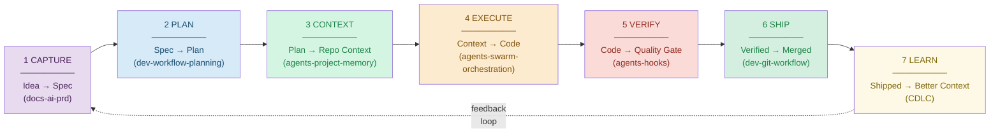
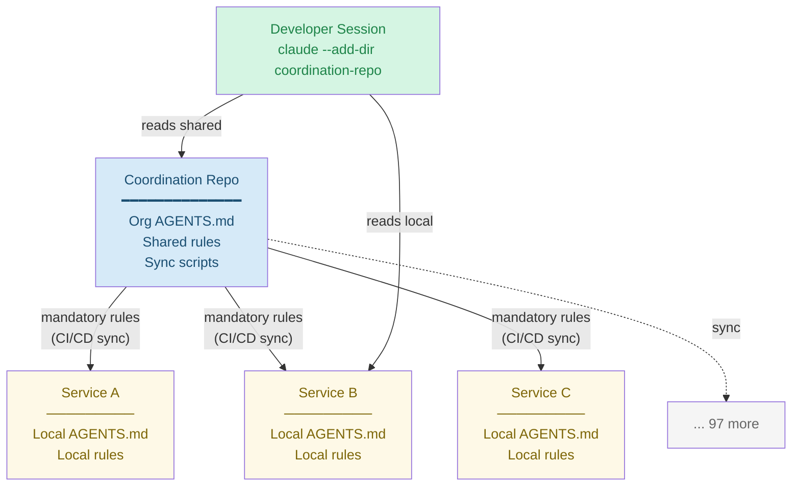
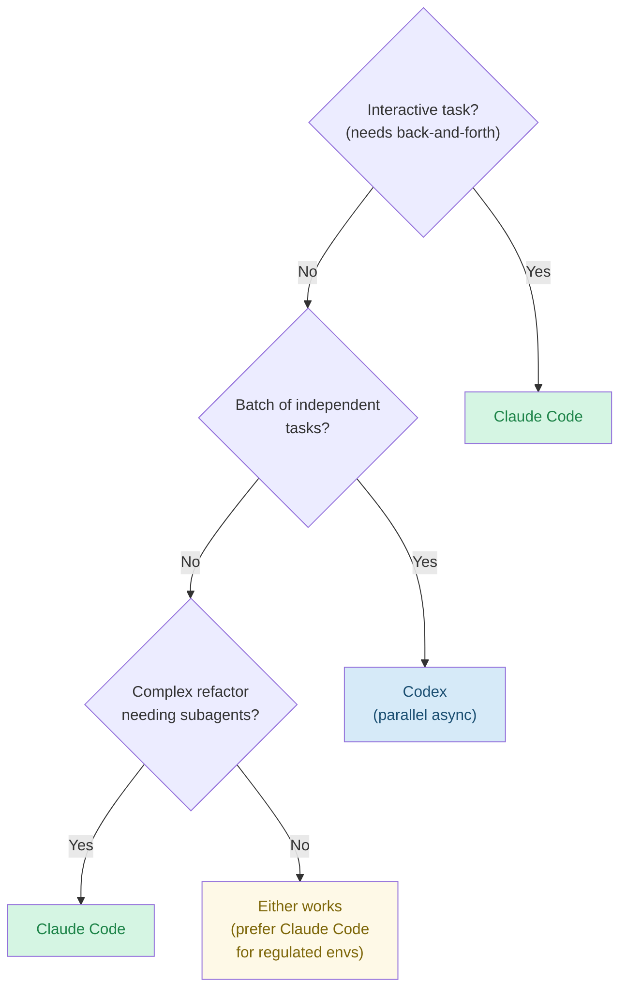

# Context Engineering for AI-Augmented Development

## Quick Reference

| Task | Primary Skill | Reference |
|------|--------------|-----------|
| Write AGENTS.md / CLAUDE.md | agents-project-memory | memory-patterns.md |
| Create implementation plan | dev-workflow-planning | — |
| Write PRD / spec | docs-ai-prd | agentic-coding-best-practices.md |
| Create subagents | agents-subagents | — |
| Set up hooks | agents-hooks | — |
| Configure MCP servers | agents-mcp | — |
| Git workflow + worktrees | dev-git-workflow | ai-agent-worktrees.md |
| Orchestrate parallel agents | agents-swarm-orchestration | — |
| Application security | software-security-appsec | — |
| **Assess repo maturity** | **this skill** | maturity-model.md |
| **Full idea-to-ship lifecycle** | **this skill** | — |
| **Multi-repo coordination** | **this skill** | multi-repo-strategy.md |
| **Regulated environment setup** | **this skill** | regulated-environment-patterns.md |
| **Fast-track onboarding** | **this skill** | fast-track-guide.md |
| **Context lifecycle (CDLC)** | **this skill** | context-development-lifecycle.md |
| **Convert existing repos** | **this skill** | repo-conversion-playbook.md |
| **Team transformation** | **this skill** | team-transformation-patterns.md |
| **Measure AI coding impact** | dev-ai-coding-metrics | — |

## The Paradigm Shift

Software development is shifting from tool-centric workflows to context-driven development:

| Dimension | Traditional | Context-Driven |
|-----------|------------|----------------|
| Source of truth | Jira + Confluence | Repository (AGENTS.md + docs/) |
| Standards | Wiki page | `.claude/rules/` (loaded every session) |
| Execution | Human writes code | Agent writes code with structured context |
| Knowledge transfer | Onboarding meetings | AGENTS.md = instant context |
| Planning | Sprint board | `docs/plans/` with dependency graphs |
| Review | Humans only | Humans + AI disclosure checklist |

**Why it matters**: Unstructured AI coding ("vibe coding") is 19% slower with 1.7x more issues (METR). Structured context engineering inverts this — agents become faster and more reliable than solo coding. But context quality matters more than quantity: ETH Zurich research (March 2026) shows LLM-generated context files *degrade* performance by 3% while human-written files help only when limited to non-inferable details.

**Cross-platform convention**: `AGENTS.md` is the primary file. `CLAUDE.md` is always a symlink (`ln -s AGENTS.md CLAUDE.md`). Codex reads AGENTS.md directly; Claude Code reads the symlink. One file, two agents, zero drift.

See: references/paradigm-comparison.md for full mapping + migration playbook.

## Complete Lifecycle: Idea to Ship



Seven phases from idea capture to learning. Each phase references the primary skill and key actions.

### Phase 1: CAPTURE — Idea to Spec

**Skill**: docs-ai-prd

1. Capture the idea in `docs/specs/feature-name.md`
2. Use docs-ai-prd to generate a structured PRD
3. Include: problem statement, success criteria, constraints, non-goals
4. Architecture extraction: docs-ai-prd/references/architecture-extraction.md
5. Convention mining: docs-ai-prd/references/convention-mining.md

### Phase 2: PLAN — Spec to Implementation Plan

**Skill**: dev-workflow-planning

1. Create `docs/plans/feature-name.md` from the spec
2. Break into tasks with dependencies and verification steps
3. Identify parallelizable tasks for multi-agent execution
4. Estimate token budget for the implementation

### Phase 3: CONTEXT SETUP — Plan to Repository Context

**Skills**: agents-project-memory, agents-subagents

1. Update AGENTS.md if the feature introduces new patterns
2. Add/update `.claude/rules/` for any new conventions
3. Create specialized subagents if needed (e.g., test-writer, migration-helper)
4. For multi-repo: ensure coordination repo is updated if shared context changes

### Phase 4: EXECUTE — Context to Working Code

**Skills**: agents-swarm-orchestration, dev-git-workflow

1. Create feature branch and worktree for isolation
2. Execute plan tasks — use subagents for parallel work
3. Follow plan verification steps after each task
4. Use `--add-dir` for cross-repo context if needed

### Phase 5: VERIFY — Code to Quality + Compliance Gate

**Skills**: agents-hooks, dev-git-workflow

1. Run automated verification: tests, lint, type-check
2. Run compliance gates (if regulated): signed commits, secrets scan, SAST, PII check
3. AI disclosure: complete PR template with AI involvement
4. Human review: code reviewer verifies AI-generated code

### Phase 6: SHIP — Verified to Merged + Deployed

**Skill**: dev-git-workflow

1. PR approved by reviewer (different person from author)
2. Security review for critical paths (auth/, payments/, crypto/)
3. Merge to main via merge commit (not squash — audit trail)
4. Deployment approved by DevOps (separate from code approval)

### Phase 7: LEARN — Shipped to Better Context

**Framework**: CDLC (context-development-lifecycle.md)

1. Session retrospective: what context was missing or misleading?
2. Update AGENTS.md and rules based on learnings
3. Extract patterns: if you repeated the same instruction 3+ times, make it a rule
4. Track metrics: agent success rate, rework rate, token cost

### SDLC Compression

Traditional regulated SDLC: Requirements (14d) → Dev (3w) → QA (6-8w) → Deploy (1-2w) = **12-16 weeks**.

The 2-month QA is a **late discovery** problem, not a QA problem. CDLC shifts verification left into every phase:

| Phase | Traditional | With CDLC | Key Enabler |
|-------|-----------|-----------|-------------|
| Requirements | 14 days | 3-5 days | AI-assisted specs, architecture extraction |
| Development | 3 weeks | 2-3 weeks | Structured context = fewer mistakes |
| QA | 6-8 weeks | 1-2 weeks | Automated gates + verification per task |
| Deployment | 1-2 weeks | 1-3 days | Pre-verified compliance, audit trail |
| **Total** | **12-16 weeks** | **4-6 weeks** | **60-65% compression** |

QA compresses the most because convention violations, integration bugs, compliance gaps, and missing tests are caught during development — not discovered weeks later. Automated compliance gates mean QA focuses on what humans are good at: exploratory testing and edge cases.

See: references/context-development-lifecycle.md § SDLC Compression for full analysis with caveats.

## Repository Maturity Quick Assessment

| Level | Per-Repo | Org-Wide (100 repos) | Key Action |
|-------|----------|---------------------|------------|
| **L0** No Context | No AGENTS.md | No shared standards | Create AGENTS.md (30 min) |
| **L1** Basic | AGENTS.md <50 lines | Template repo exists, 10% adoption | Add rules + docs (2-4 hrs) |
| **L2** Structured | + rules + docs/specs | Shared rules, 50% adoption | Add agents + hooks (1-2 days) |
| **L3** Automated | + agents + hooks + CI gates | Compliance gates, 80% adoption | Start CDLC (2-4 weeks) |
| **L4** Full CE | + CDLC active + metrics | InnerSource governance, 95%+ | Sustain + optimize |

Quick self-assessment: 14 yes/no questions in references/maturity-model.md.

## Multi-Repo at Scale

For organizations with many repositories, use a coordination layer pattern:

### Coordination Repo (recommended for polyrepo)



One meta-repo holds shared context: org-wide AGENTS.md, mandatory rules, shared skills, sync scripts. Individual repos maintain focused local context.

```bash
# Load shared context into any repo session
claude --add-dir ../coordination-repo
```

### Shared vs Local Context

| Category | Scope | Distribution |
|----------|-------|-------------|
| **Mandatory** (compliance, security, data handling) | All repos | CI/CD sync (automated) |
| **Recommended** (coding standards, commit conventions) | Most repos | Template sync or --add-dir |
| **Local** (architecture, domain patterns, subagents) | Per-repo | Maintained by repo team |

### Symlink Convention (enforced everywhere)

```bash
# Every repo, every time
ln -s AGENTS.md CLAUDE.md
# CI validates: [ -L CLAUDE.md ] or fail
```

See: references/multi-repo-strategy.md for full patterns, sync scripts, token budgets, and InnerSource governance.

## Regulated Environments

For FCA-regulated EMIs and similar organizations:

### Mandatory Compliance Rules

Install these in every repo (copy from `assets/` directory):

| Asset File | Install To | Purpose |
|-----------|-----------|---------|
| `compliance-fca-emi.md` | `.claude/rules/compliance-fca-emi.md` | Audit trail, separation of duties, SM&CR |
| `data-handling-gdpr-pci.md` | `.claude/rules/data-handling-gdpr-pci.md` | Safe/prohibited data categories |
| `ai-agent-governance.md` | `.claude/rules/ai-agent-governance.md` | Approved tools, disclosure, training |
| `pr-template-ai-disclosure.md` | `.github/pull_request_template.md` | AI involvement checklist per PR |
| `fca-compliance-gate.yml` | `.github/workflows/fca-compliance-gate.yml` | Signed commits, secrets, SAST, PII, AI disclosure |

### Core Regulatory Principles

1. **Audit trail**: Signed commits, merge commits, immutable history (PS21/3)
2. **Separation of duties**: AI cannot approve/merge/deploy; different reviewer required
3. **No sensitive data in context**: PII, card data, credentials never in agent prompts or files
4. **AI disclosure**: Every PR declares AI involvement and human verification
5. **Accountability**: Named Senior Manager accountable for AI governance (SM&CR)
6. **Portability**: Dual-agent strategy (Claude Code + Codex) avoids vendor lock-in (PS24/16)
7. **Agent isolation**: Sandbox execution for automated agent runs (microVM/gVisor for CI/CD)
8. **Platform audit**: GitHub Agent HQ audit logs with `actor_is_agent` identifiers (Feb 2026)

Also track: **NIST AI Agent Standards Initiative** (Feb 2026) — US framework for agent identity, security, governance. **FINRA 2026** — first financial regulator to require AI agent action logging and human-in-the-loop oversight.

See: references/regulated-environment-patterns.md for full regulatory mapping and incident response.

## Agent and Tool Selection

### Primary Agents (use both)

Both Claude Code and Codex are available as first-class agents on **GitHub Agent HQ** (Feb 2026), with enterprise audit logging (`actor_is_agent` identifiers), MCP allowlists, and organization-wide policy management.

| Capability | Claude Code | Codex |
|-----------|------------|-------|
| **Best for** | Interactive planning, complex refactoring | Async batch tasks, issue triage |
| **Context file** | Reads CLAUDE.md (symlink) | Reads AGENTS.md (direct) |
| **Execution** | Local, interactive | Cloud, sandboxed |
| **GitHub Agent HQ** | Yes (cloud sessions) | Yes (cloud sessions) |
| **Subagents** | Yes (`.claude/agents/`) | No |
| **Hooks** | Yes (`.claude/hooks/`) | No |
| **MCP servers** | Yes | No |
| **Worktrees** | Yes | Branches |
| **Multi-repo** | `--add-dir` | Single repo per task |

### Decision Tree



### Supplementary Tools

| Tool | Use When | Context File |
|------|----------|-------------|
| Cursor | IDE-embedded editing, quick fixes | `.cursor/rules` |
| GitHub Copilot | Inline suggestions during manual coding | — |

## Context as Infrastructure

Six principles for treating context like production infrastructure:

1. **Version it** — AGENTS.md and rules live in git, reviewed in PRs
2. **Review it** — Context changes get the same review rigor as code changes
3. **Test it** — Run a task with new context to verify it works before committing
4. **Scope it** — One concern per rule file; clear sections in AGENTS.md
5. **Budget it** — Monitor token cost; compress or split when context grows
6. **Retire it** — Remove stale rules quarterly; outdated context is worse than no context

## Anti-Patterns

| Anti-Pattern | Problem | Fix |
|-------------|---------|-----|
| **Vibe coding** | No spec, no plan, just "build it" | Start with Phase 1 (CAPTURE) |
| **Context bloat** | 2000-line AGENTS.md nobody reads | Split into rules/ and references; keep AGENTS.md <200 lines |
| **Over-specification** | Rules for every edge case | Write rules for patterns, not exceptions |
| **Tool accumulation** | 5 AI tools, no coordination | Pick 2 primary (Claude Code + Codex), standardize context |
| **Parallel Jira+context** | Maintaining specs in both Jira and repo | Jira for portfolio; repo for execution context |
| **Static context** | Write AGENTS.md once, never update | CDLC: monthly review, retire stale rules |
| **God agent** | One agent does everything | Specialized subagents for distinct tasks |
| **Skipping verification** | Trust AI output without review | Phase 5 (VERIFY) is mandatory, not optional |
| **Compliance bypass** | "We'll add gates later" | Install mandatory rules from day 1 (assets/) |
| **Separate CLAUDE.md** | CLAUDE.md and AGENTS.md with different content | Always symlink: `ln -s AGENTS.md CLAUDE.md` |
| **LLM-generated context** | Auto-generated AGENTS.md duplicates discoverable info (-3% perf) | Write only non-inferable details (ETH Zurich 2026) |
| **Single-file at scale** | One massive file can't scale beyond modest codebases | Three-tier architecture: hot memory → agents → cold knowledge |

## Do / Avoid

**Do**:
- Start with maturity assessment before investing in automation
- Use the lifecycle (7 phases) — skipping CAPTURE and PLAN is the #1 cause of rework
- Install compliance rules before development starts (not after)
- Run context retrospectives — context without feedback loops decays
- Use both Claude Code and Codex for their respective strengths

**Avoid**:
- Don't migrate from Jira overnight — use the incremental playbook
- Don't create 500-line AGENTS.md files — use progressive disclosure
- Don't skip the symlink convention — drift between AGENTS.md and CLAUDE.md causes bugs
- Don't let context go stale — if it hasn't been updated in 90 days, it's suspect
- Don't treat AI-generated code differently from human code in review rigor

## Navigation

### References

| File | Content | Lines |
|------|---------|-------|
| paradigm-comparison.md | Old vs new paradigm mapping, 2026 industry validation | ~200 |
| maturity-model.md | 5-level maturity, adoption data, research caveats | ~280 |
| fast-track-guide.md | 30-min, 2-hour, batch tracks + quality research insight | ~250 |
| context-development-lifecycle.md | CDLC + three-tier architecture, Manus patterns, ETH research | ~615 |
| multi-repo-strategy.md | Coordination patterns, GitHub Agent HQ, VS Code CE | ~420 |
| regulated-environment-patterns.md | FCA/EMI, NIST, FINRA 2026, sandbox isolation, GH audit | ~400 |
| repo-conversion-playbook.md | Step-by-step conversion with real scripts and templates | ~790 |
| team-transformation-patterns.md | AI-native vs traditional teams, shadow experiments, risk assessment | ~230 |

### Assets (Copy-Ready Templates)

| File | Install To | Purpose |
|------|-----------|---------|
| compliance-fca-emi.md | `.claude/rules/` | FCA/EMI audit trail and separation of duties |
| data-handling-gdpr-pci.md | `.claude/rules/` | GDPR/PCI safe and prohibited data categories |
| ai-agent-governance.md | `.claude/rules/` | AI tool restrictions and disclosure |
| pr-template-ai-disclosure.md | `.github/` | PR template with AI involvement checklist |
| fca-compliance-gate.yml | `.github/workflows/` | CI/CD compliance gates |

### Related Skills

| Skill | Relationship |
|-------|-------------|
| agents-project-memory | How to write AGENTS.md (L1 foundation) |
| dev-workflow-planning | Creating implementation plans (Phase 2) |
| docs-ai-prd | Writing specs for AI agents (Phase 1) |
| agents-subagents | Creating specialized subagents (Phase 3) |
| agents-hooks | Event-driven automation (Phase 5) |
| agents-mcp | MCP server configuration |
| dev-git-workflow | Git patterns, worktrees (Phase 4-6) |
| agents-swarm-orchestration | Parallel agent execution (Phase 4) |

## Web Verification

83 curated sources in `data/sources.json` across 10 categories:

| Category | Sources | Key Items |
|----------|---------|-----------|
| Context Engineering | 10 | Anthropic CE, Fowler, CDLC, Codified Context (arxiv), Manus lessons |
| AGENTS.md Standard | 6 | agents.md spec, Linux Foundation, ETH Zurich evaluation (arxiv) |
| Paradigm Shift | 8 | OpenAI Harness, METR study, Anthropic 2026 Trends Report |
| Tool Documentation | 10 | Claude Code, Codex, GitHub Agent HQ, VS Code CE guide |
| Multi-Repo Patterns | 6 | Spine Pattern, InnerSource, Git submodules, GH Actions |
| Security Tooling | 10 | Gitleaks, Semgrep, NIST Agent Standards, sandbox patterns |
| FCA/EMI Compliance | 9 | PS21/3, SS1/23, SM&CR, PS24/16, FINRA 2026 AI agents |
| Data Protection | 4 | IAPP GDPR, PCI SSC, Anthropic DPA, OpenAI DPA |
| SDLC and DevOps | 6 | DORA metrics, GitHub Enterprise AI Controls, branch protection |
| Practitioner Insights | 14 | Stripe Minions, Block/Dorsey, HBR AI layoffs, Harvard/P&G, OpenAI guide |

Verify current facts before final answers. Priority areas:
- AGENTS.md specification changes (agents.md — 60,000+ repos, evolving rapidly)
- Claude Code and Codex feature updates (now on GitHub Agent HQ)
- GitHub Enterprise AI Controls evolution (MCP allowlists, agent governance)
- FCA regulatory updates (PS21/3, SS1/23, PS24/16 — watch for consultations)
- NIST AI Agent Standards Initiative (comments due April 2026)
- FINRA AI agent guidance evolution (annual oversight reports)
- CDLC framework evolution (community-driven, externally validated March 2026)
- Context file effectiveness research (ETH Zurich, Codified Context — ongoing)

## Fact-Checking

- Use web search/web fetch to verify current external facts, versions, pricing, deadlines, regulations, or platform behavior before final answers.
- Prefer primary sources; report source links and dates for volatile information.
- If web access is unavailable, state the limitation and mark guidance as unverified.
