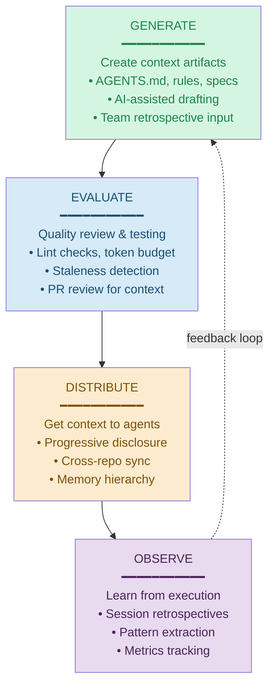
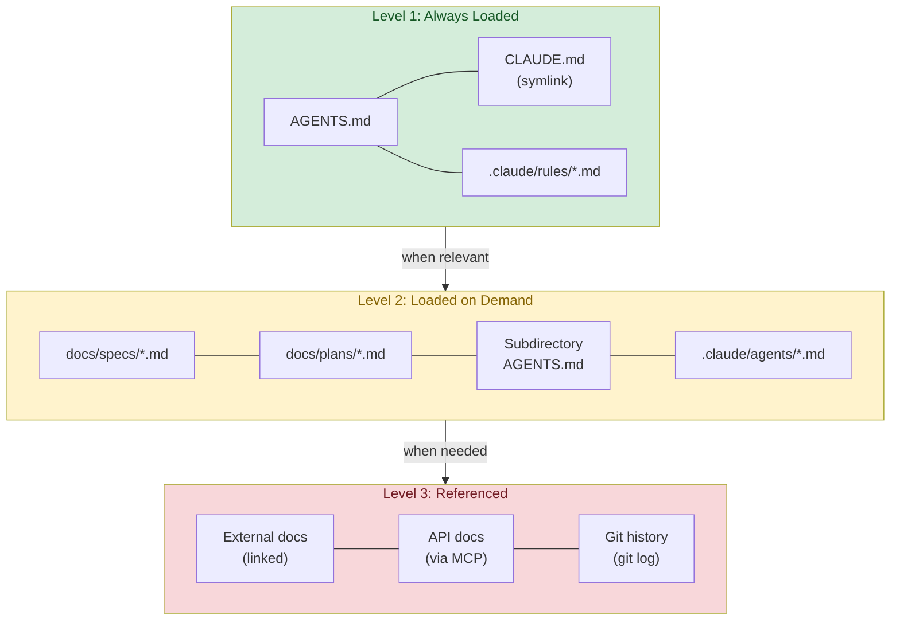
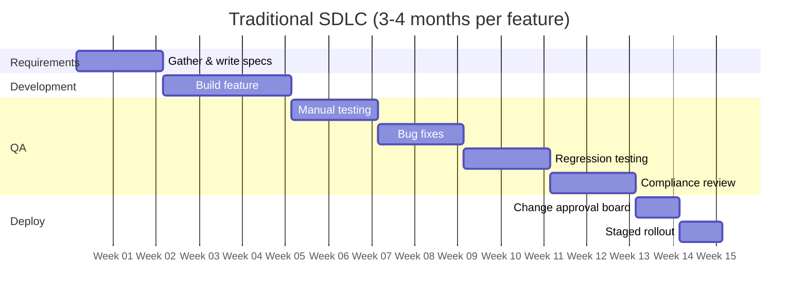
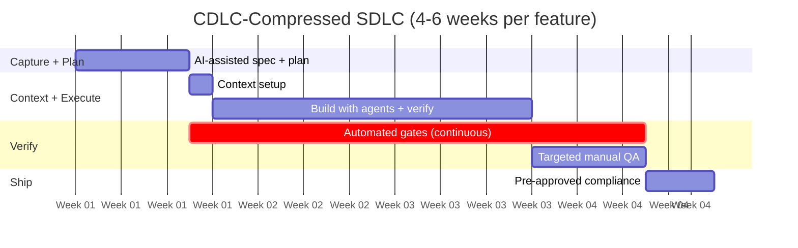
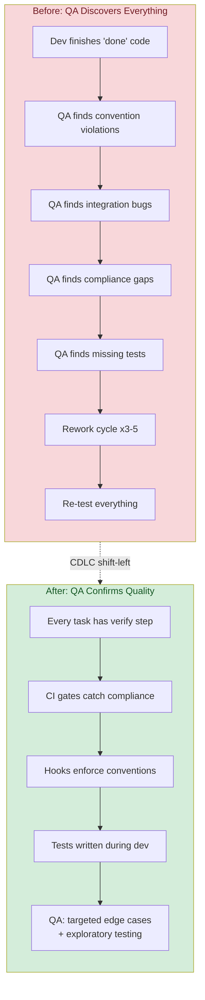

# Context Development Lifecycle (CDLC)

The CDLC is a continuous improvement loop for context artifacts: **Generate → Evaluate → Distribute → Observe**. It ensures context stays fresh, relevant, and cost-effective.

## The Four Phases



## Phase 1: Generate

Creating context artifacts. What to write, how to collaborate, templates.

### What to Generate

| Artifact | When | Skill Reference |
|----------|------|----------------|
| AGENTS.md | New repo or major architecture change | agents-project-memory |
| Rules (`.claude/rules/`) | New convention, recurring issue, compliance requirement | agents-project-memory |
| Specs (`docs/specs/`) | New feature or significant change | docs-ai-prd |
| Plans (`docs/plans/`) | Before implementation starts | dev-workflow-planning |
| Subagents (`.claude/agents/`) | Recurring specialized task | agents-subagents |
| Hooks (`.claude/hooks/`) | Automated enforcement needed | agents-hooks |

### Collaboration Patterns

**Solo generation**: Developer writes context based on their knowledge.

**AI-assisted generation**: Ask Claude Code to draft context artifacts:
```
"Analyze this codebase and draft an AGENTS.md file"
"Create a .claude/rules/ file for our testing conventions based on existing tests"
"Extract architecture patterns from this repo into docs/architecture.md"
```

**Team generation**: Context retrospective where team identifies gaps:
- "What did agents not know that caused rework?"
- "What instructions did you repeat in every session?"
- "What conventions did agents violate?"

### Generation Quality Checklist

Before committing new context:
- [ ] Concise: No unnecessary words (agents pay per token)
- [ ] Actionable: Tells agents what to DO, not just what IS
- [ ] Scoped: One concern per file (rules) or clear sections (AGENTS.md)
- [ ] Tested: Run a task with the new context to verify it works
- [ ] Non-duplicative: Doesn't repeat what's in other context files

### Research Evidence: What to Include

ETH Zurich research (arxiv 2602.11988, March 2026) evaluated context files across 138 tasks and 4 models:

| Context Type | Success Rate | Cost Impact | Recommendation |
|-------------|-------------|-------------|----------------|
| No context file | Baseline | Baseline | — |
| LLM-generated | -3% (worse) | +20% cost | **Omit entirely** |
| Human-written | +4% marginal | +19% cost | **Non-inferable details only** |

**Why LLM-generated files hurt**: They duplicate information the agent can discover by reading repository docs, causing "thorough but counterproductive" behavior — extra testing, broader file exploration, redundant checks.

**What to include in human-written context** (non-inferable details):
- Custom build commands and tooling not discoverable from code
- Specific testing patterns or CI quirks
- Domain-specific conventions not evident from codebase
- Known failure modes and their workarounds

**What to omit** (agent can discover these itself):
- Project structure descriptions derivable from directory listing
- Dependency lists duplicating package files
- README-level documentation already in the repo

This validates the CDLC Generate principle: **quality over quantity**. The smallest set of high-signal tokens maximizes outcomes.

## Phase 2: Evaluate

Quality review and testing of context artifacts.

### Lint Checks

Automated checks for context quality:

```bash
# Context lint script
check_context() {
  local file="$1"

  # Check file size (warn if over 200 lines for rules, 500 for AGENTS.md)
  lines=$(wc -l < "$file")
  if [ "$lines" -gt 500 ]; then
    echo "WARNING: $file is $lines lines — consider splitting"
  fi

  # Check for PII patterns
  if grep -qiE '(email|phone|address|ssn|passport|card.?number)' "$file"; then
    echo "WARNING: $file may contain PII-related content"
  fi

  # Check for stale dates
  if grep -qE '202[0-4]' "$file"; then
    echo "WARNING: $file references dates that may be outdated"
  fi

  # Check for TODO/FIXME left in context
  if grep -qiE '(TODO|FIXME|HACK|XXX)' "$file"; then
    echo "WARNING: $file contains unresolved markers"
  fi
}

# Run on all context files
for f in AGENTS.md CLAUDE.md .claude/rules/*.md .claude/agents/*.md; do
  [ -f "$f" ] && check_context "$f"
done
```

### Token Budget Analysis

Measure the cost of your context:

```bash
# Approximate token count (1 token ≈ 4 characters)
context_tokens() {
  local total=0
  for f in AGENTS.md .claude/rules/*.md; do
    if [ -f "$f" ]; then
      chars=$(wc -c < "$f")
      tokens=$((chars / 4))
      echo "$f: ~$tokens tokens"
      total=$((total + tokens))
    fi
  done
  echo "Total: ~$total tokens"
}
context_tokens
```

### Staleness Detection

Context that hasn't been updated becomes misleading:

```bash
# Find context files not updated in 90+ days
find . -name 'AGENTS.md' -o -name 'CLAUDE.md' -o -path '.claude/rules/*.md' | while read f; do
  last_modified=$(git log -1 --format=%ci -- "$f" 2>/dev/null)
  if [ -n "$last_modified" ]; then
    days_ago=$(( ($(date +%s) - $(date -d "$last_modified" +%s 2>/dev/null || date -j -f "%Y-%m-%d" "${last_modified%% *}" +%s 2>/dev/null)) / 86400 ))
    if [ "$days_ago" -gt 90 ]; then
      echo "STALE ($days_ago days): $f"
    fi
  fi
done
```

### PR Review for Context Changes

Context changes deserve the same review rigor as code:

- **AGENTS.md changes**: Review for accuracy, completeness, token efficiency
- **Rule additions**: Verify the rule is necessary and doesn't duplicate existing rules
- **Rule removals**: Confirm the pattern is truly obsolete
- **Compliance rules**: Require compliance team review (CODEOWNERS enforcement)

## Phase 3: Distribute

Getting context to agents effectively.

### Distribution Hierarchy



```
Level 1: Always loaded (every session)
├── AGENTS.md (root)
├── CLAUDE.md (symlink)
└── .claude/rules/*.md (all rule files)

Level 2: Loaded on demand (when relevant)
├── docs/specs/*.md (when working on that feature)
├── docs/plans/*.md (when executing that plan)
├── Subdirectory AGENTS.md (when working in that area)
└── .claude/agents/*.md (when specialized task needed)

Level 3: Referenced but not loaded
├── External docs (linked from AGENTS.md)
├── API documentation (fetched via MCP)
└── Historical decisions (git log)
```

### Pre-Hydration Pattern (from Stripe Minions)

Before an agent session starts, deterministically run context-gathering tools on known inputs:

```bash
# Pre-hydration: gather context BEFORE the agent loop begins
# Stripe runs relevant MCP tools over linked URLs/tickets automatically

# Example: extract context from a Jira/Linear ticket before agent starts
ticket_context=$(gh issue view "$ISSUE_NUM" --json title,body,labels 2>/dev/null)
spec_file=$(find docs/specs -name "*${FEATURE_SLUG}*" 2>/dev/null | head -1)
recent_changes=$(git log --oneline --since="7 days" -- "$AFFECTED_DIR" 2>/dev/null)

# Feed pre-hydrated context to agent session
claude --context "Ticket: $ticket_context" \
       --context "Spec: $(cat "$spec_file" 2>/dev/null)" \
       --context "Recent changes: $recent_changes"
```

**Why this works**: Agents spend significant tokens on orientation — reading files, searching code, understanding context. Pre-hydration front-loads this deterministically (faster, cheaper, more reliable than agent-driven exploration). Stripe reports this enables "one-shot" completion for most tasks.

**At scale**: Stripe's "Toolshed" server provides 400+ MCP tools. Pre-hydration selects and runs the relevant subset automatically based on task links and metadata. For smaller orgs, a simple script extracting ticket + spec + recent changes achieves 80% of the benefit.

### Progressive Disclosure Pattern

Don't load everything at once. Structure context for progressive discovery:

```markdown
# AGENTS.md — Keep this brief (L1: always loaded)

## Quick Reference
[Essential commands and patterns — 20 lines max]

## Architecture
[High-level overview — 10 lines, link to docs/architecture.md for details]

## Key Rules
[Summary of what's in .claude/rules/ — agents will read the full files]

## Deep Dives
- Payment flows: see docs/specs/payment-architecture.md
- Auth patterns: see src/auth/AGENTS.md
- API design: see docs/api-conventions.md
```

### Cross-Repo Distribution

For multi-repo organizations, see multi-repo-strategy.md. Key patterns:
- **Mandatory rules**: CI/CD sync (automated, auditable)
- **Shared standards**: `--add-dir` coordination repo
- **New repos**: Template repo bootstrapping

### Memory Hierarchy (agents-project-memory)

```
Tier 1: Project memory (AGENTS.md, rules) — permanent, versioned
Tier 2: Session memory (conversation context) — ephemeral, per-session
Tier 3: User memory (~/.claude/) — personal, cross-project
Tier 4: Organizational memory (coordination repo) — shared, governed
```

### Three-Tier Context Architecture (Codified Context)

Research on a 108K LOC C# codebase (arxiv 2602.20478) demonstrates that single-file manifests cannot scale. A three-tier architecture maintains agent coherence across 283 sessions:

| Tier | Name | Content | Loading |
|------|------|---------|---------|
| **T1** | Hot Memory (Constitution) | ~660 lines: conventions, build commands, orchestration triggers | Always loaded |
| **T2** | Specialist Agents | 19 agents, 115-1,233 lines each (~9,300 total): domain expertise | Per-task via trigger table |
| **T3** | Cold Memory (Knowledge Base) | 34 spec documents (~16,250 lines): detailed patterns | On-demand via MCP |

**Key metrics:**
- Context infrastructure = 24.2% of codebase size
- 1,478 MCP retrieval calls across 218 sessions
- Maintenance cost: 1-2 hours/week
- 80%+ of human prompts under 100 words (context does the heavy lifting)

**Mapping to AGENTS.md ecosystem:**
- T1 = `AGENTS.md` + `.claude/rules/` (always loaded)
- T2 = `.claude/agents/` specialist subagents (loaded per task)
- T3 = `docs/` specifications retrieved via MCP or `--add-dir`

**When to add tiers:**
- L1 repos: T1 only (AGENTS.md)
- L2 repos: T1 + basic T2 (1-3 subagents)
- L3+ repos: Full three-tier with MCP retrieval

## Phase 4: Observe

Learning from agent execution to improve context.

### Session Retrospectives

After significant agent sessions, capture learnings:

**Quick retro (2 minutes)**:
- Did the agent follow conventions? If not, which rule was missing?
- Did the agent ask for information that should be in context?
- Was any context misleading or outdated?

**Structured retro (10 minutes, weekly)**:
- Review agent-generated PRs from the week
- Identify patterns: What rules were most violated?
- Track: rework rate, PR revision count, agent success rate
- Action: Create/update rules for top 3 issues

### Pattern Extraction

When you notice agents repeatedly making the same mistake, extract a rule:

```
Observation: Agents keep using `console.log` instead of our structured logger
Action: Create .claude/rules/logging.md with:
  "Always use the structured logger from src/lib/logger.ts. Never use console.log in production code."
```

### Verification Constraints (from Stripe Minions)

Set hard limits on automated verification loops to prevent runaway agent cycles:

| Constraint | Stripe's Pattern | Recommended Default |
|-----------|-----------------|---------------------|
| Max CI rounds | 2 per agent run | 2-3 per task |
| Local lint check | <5 seconds, heuristic-selected | Run lint + type-check before push |
| Test selection | Selective from 3M+ tests | Run affected tests, not full suite |
| Autofix | Apply available fixes automatically | Use `--fix` flags for lint/format |
| Hard stop | Fail after second push | Fail after third attempt, flag for human |

**Key principle**: "If it's good for humans, it's good for LLMs" (Stripe). Shift lint and format checks left — enforce in IDE/hooks rather than discovering in CI. Every issue caught locally saves a CI round.

**Isolation pattern**: Stripe uses pre-warmed devboxes (10-second spin-up) isolated from production and the internet. For regulated environments, this is stronger isolation than worktrees — no accidental production access. Consider devbox/container isolation for security-critical repos.

### Anti-Pattern Detection

Watch for these signals that context needs attention:

| Signal | Indicates | Action |
|--------|----------|--------|
| Agents ignore a rule | Rule is poorly written or contradicts code | Rewrite rule with examples |
| Same instruction repeated each session | Missing from AGENTS.md | Add to AGENTS.md |
| Agent output quality declining | Context may be stale or bloated | Audit and trim |
| Token usage increasing | Context bloat | Remove redundant rules, compress |
| New developers struggle with setup | AGENTS.md lacks onboarding info | Add quick-start section |

### Production Optimization Patterns (from Manus)

Manus, a production AI agent system, validated several context optimization patterns relevant to CDLC Observe:

**KV-Cache Hit Rate as Primary Metric:**
Cached input tokens cost $0.30/MTok vs $3.00/MTok uncached — a 10x difference. With typical 100:1 input-to-output ratio, cache efficiency dominates cost. Practices:
- Keep system prompt prefixes unchanging (avoid cache invalidation)
- Use append-only context structures
- Mark explicit cache breakpoints

**Attention Through Recitation:**
Rewrite task goals into context regularly (e.g., `todo.md` files). This combats the "lost-in-the-middle" problem in long reasoning chains. In CDLC terms: make the plan visible in every session, not just at the start.

**Preserve Failure States:**
Leave error traces and failed actions in context. Models implicitly learn from observation-action failures, shifting away from similar mistakes. Don't clean up context mid-session — the "mess" is informative.

**Avoid Few-Shot Brittleness:**
Uniform context patterns cause models to over-imitate. Introduce controlled variation in serialization templates to prevent repetitive action loops.

### Metrics

Track these to measure CDLC effectiveness:

| Metric | How to Measure | Target |
|--------|---------------|--------|
| **Context freshness** | Days since last AGENTS.md update | <30 days |
| **Agent success rate** | First-attempt tasks that need no rework | >70% |
| **Rework rate** | PRs needing revision / total PRs | <15% |
| **Token cost per session** | Average tokens consumed | Stable or decreasing |
| **Rule coverage** | % of team conventions captured in rules | >80% |
| **Onboarding time** | Time to first meaningful PR (new dev) | <2 days |

## SDLC Compression: From Months to Weeks

Traditional regulated SDLC timelines often look like this:



**Why QA takes 2 months**: It's not a QA problem — it's a **late discovery** problem. When verification happens only after development is "done," QA becomes the place where specification gaps, integration issues, compliance failures, and convention violations are all discovered at once. Every bug found in QA triggers a rework cycle: fix → re-test → re-review → re-deploy to staging.

**Why deployment takes long**: Manual approval chains, compliance checks done for the first time, risk assessments on unfamiliar code, and lack of automated audit trails.

### How CDLC Compresses Each Phase



### Phase-by-Phase Compression Analysis

#### Requirements: 14 days → 3-5 days

| Bottleneck | CDLC Solution | Mechanism |
|-----------|---------------|-----------|
| Writing specs from scratch | AI-assisted PRD generation | docs-ai-prd extracts architecture and conventions automatically |
| Unclear acceptance criteria | Spec templates with verification steps | Plan files include testable criteria per task |
| Knowledge gathering | Architecture extraction + convention mining | Agent analyzes codebase in minutes, not days |
| Stakeholder alignment | Spec-in-repo = reviewable PRs | Stakeholders review actual spec files, not meeting notes |
| Compliance requirements scoping | Compliance rules pre-defined in .claude/rules/ | Agent knows constraints from day 1 |

**What stays**: Domain expertise, stakeholder sign-off, regulatory scoping. These are irreducible.
**What compresses**: Documentation, knowledge gathering, format/template work.

#### Development: Similar duration, but higher quality output

| Bottleneck | CDLC Solution | Mechanism |
|-----------|---------------|-----------|
| Misunderstanding conventions | .claude/rules/ loaded every session | Agents follow standards consistently |
| Architectural misfit | Architecture docs in AGENTS.md | Agents know the system before writing code |
| Missing test coverage | Test-writer subagent + plan verification steps | Tests written alongside code, not after |
| Integration issues | Verification steps after each plan task | Issues caught during dev, not in QA |

**Key shift**: Development time may be similar, but bugs-per-feature drops significantly because verification is embedded in every task, not deferred to a later phase.

#### QA: Up to 2 months → 1-2 weeks

This is where CDLC has the biggest impact. The compression comes from **shifting left**:



| QA Activity | Traditional Time | With CDLC | Why |
|------------|-----------------|-----------|-----|
| Convention violation bugs | 1-2 weeks | Near zero | Rules enforce conventions during dev |
| Integration bugs | 1-2 weeks | 2-3 days | Verification after each plan task |
| Compliance gaps | 1-2 weeks | Near zero | CI gates check compliance on every PR |
| Missing test coverage | 1 week | Near zero | Test subagent writes tests alongside code |
| Regression testing | 1-2 weeks | 2-3 days | Automated test suite, fewer regressions |
| **Targeted manual QA** | — | **1 week** | Exploratory testing, edge cases, UX review |
| **Total** | **6-8 weeks** | **1-2 weeks** | |

**What CDLC cannot compress**: Exploratory testing, UX review, load/performance testing, regulatory sign-off. These still require human judgment and domain expertise. But they're now done on code that's already passed all automated checks, so manual QA focuses on what humans are actually good at.

**For FCA-regulated orgs**: The compliance gates (signed commits, secrets scan, SAST, PII detection, AI disclosure) run on every PR automatically. By the time code reaches QA, compliance is already verified. The compliance review becomes a confirmation, not a discovery process.

#### Deployment: Long → 1-3 days

| Bottleneck | CDLC Solution | Mechanism |
|-----------|---------------|-----------|
| Manual compliance checklist | Automated CI/CD compliance gates | fca-compliance-gate.yml runs on every PR |
| Risk assessment on unfamiliar code | AI disclosure in every PR | Reviewers know what's AI-generated |
| Approval chains | Pre-approved via branch protection | CI gates + reviewer approval = change is auditable |
| Lack of audit trail | Git = compliance tool | Signed commits, merge commits, immutable history |
| Rollback fear | Smaller, verified changes | Each PR is self-contained with verification |

**What stays**: Staged rollout, final deployment approval (separation of duties), monitoring. These are non-negotiable for regulated environments.
**What compresses**: Compliance checks (already done), risk assessment (already documented), approval paperwork (automated).

### Timeline Comparison Summary

| Phase | Traditional | With CDLC | Compression | Key Enabler |
|-------|-----------|-----------|-------------|-------------|
| Requirements | 14 days | 3-5 days | 60-65% | AI-assisted specs, architecture extraction |
| Development | 3 weeks | 2-3 weeks | 0-30% | Better context = fewer mistakes |
| QA | 6-8 weeks | 1-2 weeks | 75-80% | Shift-left verification, automated gates |
| Deployment | 1-2 weeks | 1-3 days | 70-80% | Pre-verified compliance, audit trail |
| **Total** | **12-16 weeks** | **4-6 weeks** | **60-65%** | |

### Honest Caveats

CDLC is not magic. Be realistic about:

1. **First feature takes longer**: Setting up context infrastructure is an investment. ROI starts from feature 2 onwards.
2. **Regulatory minimums exist**: FCA requires certain review and testing periods regardless of automation. Check with compliance.
3. **Team adoption takes time**: Developers need 2-4 weeks to internalize CDLC workflows. Plan for learning curve.
4. **Complex domains resist compression**: Payment flows, cryptographic operations, and regulatory reporting have irreducible complexity.
5. **Quality gates can expand**: If automated gates catch more issues, teams may initially feel "slower" — they're actually catching bugs that would have been found in QA anyway.

### Measuring Compression

Track these before/after metrics to validate CDLC impact:

| Metric | Before CDLC | Target After | How to Measure |
|--------|------------|-------------|----------------|
| Requirements → first commit | 14 days | 3-5 days | Git log first commit date vs spec creation |
| Bugs found in QA | 30-50 per feature | <10 per feature | QA bug tracker |
| QA rework cycles | 3-5 rounds | 1-2 rounds | QA testing rounds count |
| Time in QA | 6-8 weeks | 1-2 weeks | QA start → QA sign-off |
| Deployment lead time | 1-2 weeks | 1-3 days | Merge to main → production |
| Total cycle time | 12-16 weeks | 4-6 weeks | Spec creation → production |
| Escaped defects (prod bugs) | Baseline | 50% reduction | Production incident count |

## Team Adoption Patterns

### Start Small (Week 1-2)
- 1 developer, 1 repo
- 30-minute fast-track setup
- Capture 3 most-repeated instructions as rules
- Measure: before/after rework rate

### Pilot Team (Week 3-4)
- 3-5 developers, 5-10 repos
- Standardize AGENTS.md template across team repos
- Weekly context retrospective (15 minutes in standup)
- Share learnings: "What rules helped most?"

### Roll Out (Week 5-8)
- All teams, priority-ordered repos
- Use batch onboarding from fast-track-guide.md
- Monthly context retrospective per team
- Establish context curation guild

### Sustain (Ongoing)
- Quarterly org-wide context audit
- Context curation guild reviews shared rules monthly
- Retire unused rules (track usage if instrumented)
- Annual CDLC maturity assessment

## CDLC Calendar

| Frequency | Activity | Owner |
|-----------|----------|-------|
| Every session | Quick retro (mental note) | Developer |
| Weekly | Review agent PRs, extract patterns | Team lead |
| Monthly | Context retrospective, update rules | Team |
| Quarterly | Org-wide context audit, retire stale rules | Context guild |
| Annually | CDLC maturity assessment, strategy review | Engineering leadership |

## Related References

- **maturity-model.md** — L4 requires active CDLC
- **multi-repo-strategy.md** — CDLC at organizational scale
- **fast-track-guide.md** — Getting started with context (Generate phase)
- **agents-project-memory** — Writing effective context artifacts
- **agents-project-memory/references/memory-patterns.md** — Memory patterns and anti-patterns
