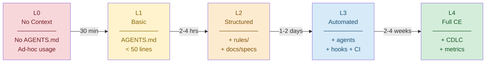

# Repository Context Maturity Model

A 5-level maturity model for assessing how well repositories (and organizations) support AI coding agents through structured context.

## Industry Adoption (March 2026)

| Metric | Value | Source |
|--------|-------|--------|
| Public repos with AGENTS.md | 60,000+ | GitHub search, agents.md |
| Estimated coding agent adoption rate | 15-23% of GitHub projects | arxiv 2601.18341 (129K projects) |
| AI agent market size | $7.84B (2025) → $52.6B (2030) | Industry analysis |
| Enterprise apps with embedded agents (Gartner) | 40% by end of 2026 | Gartner predictions |
| Developers using AI in work | 60% | Anthropic 2026 Trends Report |
| Tasks fully delegated to agents | 0-20% (current) | Anthropic 2026 Trends Report |
| Multi-agent enterprise adoption | 72% (up from 23% in 2024) | Industry analysis |

These benchmarks help calibrate where your organization sits relative to industry adoption.

## Maturity Levels Overview



| Level | Name | Per-Repo Indicators | Org-Wide Indicators (100 repos) |
|-------|------|--------------------|---------------------------------|
| **L0** | No Context | No AGENTS.md, no rules | No shared standards, agents used ad-hoc |
| **L1** | Basic | AGENTS.md <50 lines, basic orientation | Template repo exists, 10% of repos have AGENTS.md |
| **L2** | Structured | + rules/ + docs/specs + clear sections | + shared rules via coordination repo, 50% adoption |
| **L3** | Automated | + agents + hooks + worktrees + CI gates | + compliance gates across repos, 80% adoption |
| **L4** | Full CE | + CDLC active + metrics + retrospectives | + InnerSource governance, cross-repo CDLC, 95%+ |

## Level 0: No Context

**State**: Developers use AI agents with no repository-level context. Every session starts from scratch. Agents rely on scanning code and general knowledge.

**Symptoms**:
- Agents produce inconsistent code style across sessions
- Same instructions repeated in every prompt
- No AGENTS.md or CLAUDE.md in repository
- High rework rate on AI-generated code

**Migration to L1** (~30 minutes per repo):
1. Create `AGENTS.md` with project overview, tech stack, key commands
2. Symlink: `ln -s AGENTS.md CLAUDE.md`
3. Add to `.gitignore`: nothing needed (these should be committed)
4. Verify: `cat AGENTS.md | wc -l` should be 20-50 lines

**Common stall point**: "We'll add AGENTS.md later" — assign one person to do it now.

## Level 1: Basic Context

**State**: Repository has a basic AGENTS.md providing orientation. Agents know what the project is and key commands.

**Criteria**:
- [ ] AGENTS.md exists with project description
- [ ] CLAUDE.md symlinked to AGENTS.md
- [ ] Tech stack documented
- [ ] Build/test/lint commands listed
- [ ] Directory structure overview included

**Symptoms of L1**:
- Agents understand the project but not the conventions
- Style inconsistencies still common
- No enforcement of standards
- Ad-hoc instructions still needed for complex tasks

**Migration to L2** (~2-4 hours per repo):
1. Create `.claude/rules/` with coding standards
2. Add `docs/` directory for specs and architecture
3. Expand AGENTS.md sections: architecture overview, key patterns, conventions
4. Add `.claude/settings.json` if needed

**Common stall point**: Over-engineering AGENTS.md — keep rules focused, 1 rule per file.

## Level 2: Structured Context

**State**: Repository has comprehensive context: structured AGENTS.md, rules files, documentation directory. Agents produce consistent output matching team conventions.

**Criteria**:
- [ ] All L1 criteria met
- [ ] `.claude/rules/` with 3+ focused rule files
- [ ] `docs/` directory with architecture and/or specs
- [ ] AGENTS.md has clear sections (>100 lines with purpose)
- [ ] Key patterns and anti-patterns documented
- [ ] Commit conventions specified

**Symptoms of L2**:
- Consistent code quality from agents
- Less rework needed
- But: manual orchestration still required
- No automated verification of agent output
- Context may drift from codebase over time

**Migration to L3** (~1-2 days per repo):
1. Create `.claude/agents/` with specialized subagents (agents-subagents)
2. Add hooks for commit validation (agents-hooks)
3. Configure git worktrees for parallel work (dev-git-workflow)
4. Add CI/CD compliance gates (if regulated)
5. Set up pre-commit hooks for context validation

**Common stall point**: Trying to automate everything at once — start with 1 hook, 1 subagent.

## Level 3: Automated Context

**State**: Repository has automated context enforcement. Hooks validate output, subagents handle specialized tasks, CI gates verify compliance. Agents work within guardrails.

**Criteria**:
- [ ] All L2 criteria met
- [ ] `.claude/agents/` with 2+ specialized subagents
- [ ] Hooks configured (pre-commit, post-save, or notification)
- [ ] Git worktrees used for parallel feature work
- [ ] CI/CD gates validate agent output (lint, test, security scan)
- [ ] PR template includes AI disclosure (if regulated)

**Symptoms of L3**:
- High agent productivity with guardrails
- Automated quality enforcement
- But: context may still become stale
- No systematic learning from agent sessions
- Token budgets not optimized

**Migration to L4** (~ongoing, 2-4 weeks to establish):
1. Implement CDLC (context-development-lifecycle.md)
2. Schedule monthly context retrospectives
3. Add context freshness metrics
4. Track agent success rates and rework metrics
5. Establish context curation ownership

**Common stall point**: No one owns context maintenance — assign a context curator per team.

## Level 4: Full Context Engineering

**State**: Repository participates in a full Context Development Lifecycle. Context is treated as infrastructure: versioned, reviewed, tested, scoped, budgeted, and retired. Organization learns from agent execution patterns.

**Criteria**:
- [ ] All L3 criteria met
- [ ] CDLC active: Generate → Evaluate → Distribute → Observe
- [ ] Context freshness tracked (<30 days for active sections)
- [ ] Agent success rate measured (>70% first-attempt)
- [ ] Token budget optimized per session type
- [ ] Monthly context retrospectives with action items
- [ ] Stale rules identified and retired quarterly

**Org-wide L4 indicators**:
- [ ] InnerSource governance for shared context artifacts
- [ ] Context curation guild with cross-team representation
- [ ] Shared rules changes require PR review
- [ ] Skill usage metrics tracked and low-usage skills retired
- [ ] Cross-repo CDLC with quarterly audits

### Research Caveat: Context Quality Over Quantity

ETH Zurich research (arxiv 2602.11988, March 2026) provides an important nuance for maturity progression:

**Finding**: LLM-generated context files degrade agent performance by 3% and increase costs 20%+. Even human-written files only help +4% while raising costs 19%.

**Implication for maturity model**: Moving from L0 to L4 is NOT about adding more context. It's about adding the *right* context:

- **L1**: Write AGENTS.md with only non-inferable details (build commands, custom tooling, domain conventions)
- **L2**: Rules should encode patterns agents can't discover from code inspection
- **L3**: Subagents should embed domain expertise not available in the codebase
- **L4**: CDLC should actively prune context that duplicates repository-discoverable information

**The codified context study** (arxiv 2602.20478) reinforces this: context infrastructure at 24.2% of codebase size works because each tier serves a distinct, non-redundant purpose. The three-tier architecture (hot memory → specialist agents → cold knowledge base) prevents the bloat that single-file approaches create.

**Anti-pattern to watch**: Teams at L1-L2 often write exhaustive AGENTS.md files describing project structure, dependencies, and code organization that the agent could discover on its own. This adds cost without improving outcomes. Focus on what the agent *cannot* infer.

## Quick Self-Assessment Checklist

Answer yes/no to determine your current level:

### L1 Questions (need all yes for L1)
1. Does your repo have an AGENTS.md file?
2. Is CLAUDE.md symlinked to AGENTS.md?
3. Are build/test commands documented?
4. Is the tech stack listed?

### L2 Questions (need all yes for L2)
5. Do you have `.claude/rules/` with coding standards?
6. Are architecture patterns documented?
7. Do agents consistently match your code style?
8. Are specs written in `docs/` rather than external tools only?

### L3 Questions (need all yes for L3)
9. Do you have automated hooks or subagents?
10. Does CI/CD validate agent output?
11. Do you use worktrees for parallel agent work?

### L4 Questions (need all yes for L4)
12. Do you run regular context retrospectives?
13. Do you track context freshness and agent success metrics?
14. Is there an owner for context maintenance?

**Scoring**: Your level = highest level where ALL questions are answered "yes"

## Org-Wide Scoring (100 repos)

Calculate your organization's context maturity:

```
Org Score = weighted average of per-repo levels

Weight by repo activity:
  - Active repos (commits in last 30 days): weight 3x
  - Moderate repos (commits in last 90 days): weight 2x
  - Dormant repos (no commits in 90 days): weight 1x

Targets:
  - 6 months: 50% of active repos at L2+
  - 12 months: 80% of active repos at L2+, 30% at L3+
  - 18 months: 80% at L3+, 20% at L4
```

### Audit Script

Quick assessment across repos:

```bash
#!/bin/bash
# Audit context maturity across repos
for repo in repos/*/; do
  name=$(basename "$repo")
  l0=true; l1=true; l2=true; l3=true

  # L1 checks
  [ -f "$repo/AGENTS.md" ] || l1=false
  [ -L "$repo/CLAUDE.md" ] || l1=false

  # L2 checks
  [ -d "$repo/.claude/rules" ] && [ "$(ls -A "$repo/.claude/rules" 2>/dev/null)" ] || l2=false
  [ -d "$repo/docs" ] || l2=false

  # L3 checks
  [ -d "$repo/.claude/agents" ] || l3=false

  if $l3 && $l2 && $l1; then level="L3+"
  elif $l2 && $l1; then level="L2"
  elif $l1; then level="L1"
  else level="L0"
  fi

  echo "$name: $level"
done
```

## Maturity by Repo Type

Different repo types have different ceiling expectations:

| Repo Type | Target Level | Rationale |
|-----------|-------------|-----------|
| Core services (auth, payments) | L3-L4 | High change frequency, compliance requirements |
| Feature services | L2-L3 | Regular development, benefits from automation |
| Libraries/packages | L2 | Stable patterns, less need for full automation |
| Infrastructure/DevOps | L2-L3 | Critical but lower change frequency |
| Internal tools | L1-L2 | Lower risk, basic context sufficient |
| Archived/legacy | L0-L1 | Minimal investment, basic orientation only |

## Related References

- **fast-track-guide.md** — Getting to L1-L2 quickly
- **multi-repo-strategy.md** — Org-wide coordination patterns
- **context-development-lifecycle.md** — The L4 feedback loop
- **agents-project-memory** — Writing effective AGENTS.md (L1 foundation)
