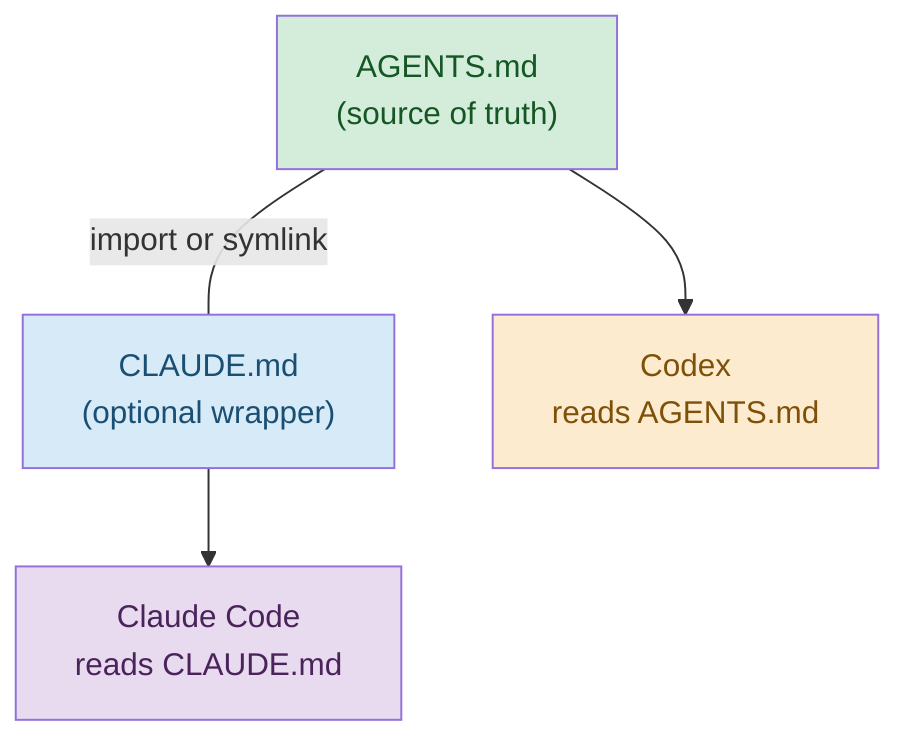

# Multi-Repo Context Strategy

Managing context-driven development across 100+ repositories. Patterns for sharing context, enforcing standards, and coordinating AI agent instructions at scale.



## Table of Contents

- [Cross-Platform Convention](#cross-platform-convention)
- [Coordination Patterns](#coordination-patterns)
- [Pattern 1: Root Coordination Layer (Recommended for Polyrepo)](#pattern-1-root-coordination-layer-recommended-for-polyrepo)
- [Pattern 2: Template Repository + Sync](#pattern-2-template-repository-sync)
- [.github/workflows/template-sync.yml](#githubworkflowstemplate-syncyml)
- [Pattern 3: Workspace-Level Context](#pattern-3-workspace-level-context)
- [Developer workflow](#developer-workflow)
- [Or via shell alias](#or-via-shell-alias)
- [Pattern 4: Centralized MCP Toolshed (from Stripe)](#pattern-4-centralized-mcp-toolshed-from-stripe)
- [GitHub Agents and Enterprise Controls (March 2026)](#github-agents-and-enterprise-controls-march-2026)
- [VS Code Context Engineering Patterns](#vs-code-context-engineering-patterns)
- [Shared vs Local Context](#shared-vs-local-context)
- [Mandatory Context (All 100 repos)](#mandatory-context-all-100-repos)
- [Recommended Context (Most repos)](#recommended-context-most-repos)
- [Local-Only Context (Per-repo)](#local-only-context-per-repo)
- [Distribution Mechanisms](#distribution-mechanisms)
- [Recommended combination for regulated orgs](#recommended-combination-for-regulated-orgs)
- [Token Budget at Scale](#token-budget-at-scale)
- [Optimization strategies](#optimization-strategies)
- [Cost estimation (100 repos, 20 developers)](#cost-estimation-100-repos-20-developers)
- [Sync Scripts](#sync-scripts)
- [Validate all repos for compliance](#validate-all-repos-for-compliance)
- [validate-repos.sh — Run from parent directory containing all repos](#validate-repossh-—-run-from-parent-directory-containing-all-repos)
- [Push mandatory rules to all repos](#push-mandatory-rules-to-all-repos)
- [sync-rules.sh — Push mandatory rules from coordination repo to all repos](#sync-rulessh-—-push-mandatory-rules-from-coordination-repo-to-all-repos)
- [InnerSource Governance](#innersource-governance)
- [Context Curation Guild](#context-curation-guild)
- [Change Management](#change-management)
- [Quarterly Context Audit](#quarterly-context-audit)
- [Skill Usage Metrics](#skill-usage-metrics)
- [Anti-Patterns](#anti-patterns)
- [Related References](#related-references)

## Cross-Platform Convention

**AGENTS.md is the portable baseline.** Add runtime-specific files only when they unlock real capability:

- Codex uses `AGENTS.md` directly.
- Claude Code can use `CLAUDE.md`, imports, `.claude/rules/`, and `.claude/agents/`.
- GitHub Copilot and VS Code can use `AGENTS.md`, `.github/copilot-instructions.md`, `.github/instructions/*.instructions.md`, and `.github/agents/*.agent.md`.

If you maintain both `AGENTS.md` and `CLAUDE.md`, use a thin wrapper/import or a symlink. The key rule is **no duplicated drift**.

## Coordination Patterns

Choose one primary coordination pattern based on your organization's structure.

### Pattern 1: Root Coordination Layer (Recommended for Polyrepo)

A dedicated meta-repo holds shared context. Individual repos maintain focused local context.

```
coordination-repo/                    # Shared context (ONE repo)
├── AGENTS.md                         # Org-wide agent instructions (PRIMARY)
├── CLAUDE.md                         # Optional Claude wrapper/import
├── .claude/
│   ├── skills/ -> shared-skills/     # Shared skills (symlink or submodule)
│   ├── rules/
│   │   ├── coding-standards.md       # Org-wide coding conventions
│   │   ├── compliance-fca-emi.md     # FCA/EMI regulatory rules (mandatory)
│   │   ├── data-handling-gdpr-pci.md # GDPR/PCI DSS rules (mandatory)
│   │   ├── security-baseline.md      # Security standards (mandatory)
│   │   └── ai-agent-governance.md    # AI tool restrictions (mandatory)
│   └── settings.json
├── .github/
│   ├── copilot-instructions.md       # GitHub-wide agent guidance
│   ├── instructions/                 # Path-specific instructions
│   └── agents/                       # Custom GitHub/Copilot agents
├── docs/
│   ├── architecture-overview.md      # Cross-repo architecture map
│   └── engineering-standards.md      # Org-wide engineering standards
├── templates/
│   ├── AGENTS.md.template            # Starting point for new repos
│   ├── pr-template.md                # PR template with AI disclosure
│   └── compliance-gate.yml           # CI/CD workflow template
└── scripts/
    ├── clone-repos.sh                # Onboard new developers
    ├── sync-rules.sh                 # Push rule updates to all repos
    ├── validate-repos.sh             # Audit all repos for compliance
    └── sync-agent-entrypoints.sh     # Keep entrypoints aligned
```

```
per-repo/ (each of 100 repos)
├── AGENTS.md                         # Repo-specific context (PRIMARY)
├── CLAUDE.md                         # Optional Claude wrapper/import
├── .claude/
│   └── rules/                        # Repo-specific rules only
│       └── domain-patterns.md        # Tech/domain-specific rules
├── .github/
│   ├── copilot-instructions.md       # Optional GitHub/Copilot guidance
│   ├── instructions/                 # Optional path-specific instructions
│   └── agents/                       # Optional custom agents
├── docs/
│   ├── specs/                        # Feature specifications
│   └── plans/                        # Implementation plans
└── ...
```

**How it works**:
1. Developer clones coordination repo alongside work repos
2. `claude --add-dir ../coordination-repo` loads shared context into sessions
3. Shared rules supplement (not replace) repo-local rules
4. Updates to shared rules go through PR review in coordination repo

### Pattern 2: Template Repository + Sync

GitHub template repo with `.claude/`, `AGENTS.md`, CI workflows. New repos start from template; updates propagated via sync workflow.

```yaml
# .github/workflows/template-sync.yml
name: Sync from template
on:
  schedule:
    - cron: '0 6 * * 1'  # Weekly Monday 6am
  workflow_dispatch:

jobs:
  sync:
    runs-on: ubuntu-latest
    steps:
      - uses: actions/checkout@v4
      - name: Sync mandatory rules
        run: |
          # Pull latest mandatory rules from template repo
          git clone --depth 1 https://github.com/org/template-repo /tmp/template
          cp /tmp/template/.claude/rules/compliance-*.md .claude/rules/
          cp /tmp/template/.claude/rules/data-handling-*.md .claude/rules/
          cp /tmp/template/.claude/rules/ai-agent-governance.md .claude/rules/
          # Do NOT overwrite repo-specific AGENTS.md or local rules
      - name: Create PR if changes
        run: |
          if [ -n "$(git status --porcelain)" ]; then
            git checkout -b template-sync-$(date +%Y%m%d)
            git add .claude/rules/
            git commit -m "chore: sync mandatory rules from template"
            gh pr create --title "Sync mandatory rules" --body "Automated sync from template repo"
          fi
```

**Best for**: Organizations that want automated propagation without `--add-dir`.

### Pattern 3: Workspace-Level Context

Claude Code `--add-dir` loads shared context from a coordination repo at session start.

```bash
# Developer workflow
claude --add-dir ~/work/coordination-repo --add-dir ~/work/service-repo

# Or via shell alias
alias cc-service='claude --add-dir ~/work/coordination-repo'
cc-service  # Start session with shared context pre-loaded
```

**Best for**: Small organizations (5-20 repos) where a full coordination repo feels heavy.

### Pattern 4: Centralized MCP Toolshed (from Stripe)

A single MCP server aggregates 400+ tools spanning internal systems and SaaS platforms. Agents connect to one endpoint and get access to documentation, ticket details, build statuses, code intelligence, and more.

```
┌─────────────────────────────────────┐
│         Toolshed (MCP Server)       │
│  ┌──────────┐ ┌──────────────────┐  │
│  │ Internal │ │ Code Intelligence│  │
│  │   Docs   │ │  (Sourcegraph)   │  │
│  └──────────┘ └──────────────────┘  │
│  ┌──────────┐ ┌──────────────────┐  │
│  │  Ticket  │ │  Build/CI Status │  │
│  │ Systems  │ │                  │  │
│  └──────────┘ └──────────────────┘  │
└──────────────┬──────────────────────┘
               │ MCP protocol
    ┌──────────┼──────────┐
    ▼          ▼          ▼
 Agent A    Agent B    Agent C
(Service X) (Service Y) (Service Z)
```

**Key patterns from Stripe**:
- **Pre-hydration**: Deterministically run relevant MCP tools on linked resources *before* agent starts (faster than agent-driven exploration)
- **Curated access**: Agents get a subset of tools relevant to their task, not all 400+
- **Agent rule files**: Conditional rules by subdirectory — same formats as Cursor/Claude Code
- **Scale result**: 1,000+ merged PRs per week across hundreds of millions of LOC

**Best for**: Large organizations (50+ repos) with centralized platform teams who can maintain the MCP server. Requires investment but provides the richest context.

**Combining patterns**: Stripe's Toolshed (Pattern 4) complements the Coordination Repo (Pattern 1). Use Pattern 1 for static context (rules, AGENTS.md templates) and Pattern 4 for dynamic context (ticket details, build status, code search).

### GitHub Agents and Enterprise Controls (March 2026)

GitHub now provides two complementary layers:

- **Repository context surfaces**: `AGENTS.md`, `.github/copilot-instructions.md`, and `.github/instructions/*.instructions.md`
- **Agent surfaces**: `.github/agents/*.agent.md` plus GitHub Copilot coding agent and third-party agents

For enterprise governance, GitHub's agent control plane adds:

- audit-log events that distinguish agent actions from human actions
- session-level visibility for agent tasks
- enterprise controls for which agents and MCP servers are allowed

Use GitHub for platform-level governance and execution. Use the coordination repo for shared policy, templates, and cross-repo standards.

### VS Code Context Engineering Patterns

VS Code's March 2026 guidance converges on the same layered model:

1. `AGENTS.md` as a portable baseline
2. `.github/copilot-instructions.md` for repo-wide GitHub/Copilot instructions
3. `.github/instructions/*.instructions.md` for path-specific behavior
4. `.github/agents/*.agent.md` for planning or implementation personas

For multi-repo organizations, standardize the baseline plus the runtime-specific layers you actually use.

## Shared vs Local Context

### Mandatory Context (All 100 repos)

These are the baseline artifacts for regulated organizations. `AGENTS.md` and the compliance rule files are mandatory. `CLAUDE.md` is optional, but if present it must stay aligned:

| File | Purpose | Enforcement |
|------|---------|-------------|
| `AGENTS.md` | Portable agent instructions | CI check: file exists |
| `CLAUDE.md` | Optional Claude wrapper/import | CI check: if present, no duplicated drift |
| `.claude/rules/compliance-fca-emi.md` | FCA/EMI audit trail, separation of duties | Template sync |
| `.claude/rules/data-handling-gdpr-pci.md` | GDPR/PCI safe/prohibited data | Template sync |
| `.claude/rules/ai-agent-governance.md` | AI tool restrictions, disclosure | Template sync |

### Recommended Context (Most repos)

| File | Purpose | When to skip |
|------|---------|-------------|
| `.claude/rules/coding-standards.md` | Code style, patterns | Archived repos |
| `.claude/rules/commit-conventions.md` | Commit message format | Archived repos |
| `.github/pull_request_template.md` | PR template with AI disclosure | Internal-only repos |

### Local-Only Context (Per-repo)

| File | Purpose | Examples |
|------|---------|---------|
| AGENTS.md body | Repo-specific instructions | "This is a Next.js app using Prisma..." |
| `.claude/rules/domain-*.md` | Domain patterns | Payment flows, auth patterns |
| `.claude/agents/*.md` | Specialized subagents | Test writer, migration helper |
| `docs/architecture.md` | Repo architecture | Service boundaries, data flow |

## Distribution Mechanisms

| Mechanism | Pros | Cons | Best For |
|-----------|------|------|----------|
| **Git submodule** | Version-pinned, explicit updates | Requires `git submodule update` | Strict version control |
| **Symlinks** | Fast, no extra tooling | Fragile on Windows, path-dependent | Unix-only teams |
| **NPM/package** | Semver, familiar tooling | Overhead for non-JS repos | JS/TS monorepos |
| **CI/CD sync** | Automated, auditable | PR noise, delayed propagation | Regulated environments |
| **`--add-dir`** | Zero setup per repo | Requires coordination repo clone | Developer workstations |
| **Template sync** | Automated PR creation | Requires merging sync PRs | Large orgs with many repos |

### Recommended combination for regulated orgs
1. **CI/CD sync** for mandatory compliance rules (automated, auditable)
2. **`--add-dir`** for shared skills and coding standards (developer convenience)
3. **Template repo** for new repo bootstrapping (consistent starting point)

## Token Budget at Scale

Context has a cost. Budget it:

| Context Layer | Approximate Tokens | Notes |
|--------------|-------------------|-------|
| Shared rules (mandatory) | ~2,000 | Compliance + data handling + governance |
| Shared rules (recommended) | ~1,500 | Coding standards + commit conventions |
| Repo AGENTS.md | ~500-2,000 | Varies by repo complexity |
| Skills discovery | ~500 | Skill router overhead |
| **Workspace overhead** | **~4,500-6,000** | Before any task-specific context |
| Available for work | ~144,000-195,000 | Depends on model context window |

### Optimization strategies
- **Progressive disclosure**: Load detailed rules only when relevant (use rule file names as triggers)
- **Scoped AGENTS.md**: Keep top-level brief, use subdirectory AGENTS.md for deep context
- **Sub-agent isolation**: Heavy research in subagents (separate context windows)
- **RAG patterns**: For repos with extensive documentation, summarize in AGENTS.md, link to full docs

### Cost estimation (100 repos, 20 developers)

```
Per session: ~5K tokens overhead + ~50K tokens work = ~55K tokens
Sessions per developer per day: ~10
Daily org total: 20 devs x 10 sessions x 55K = 11M tokens/day
Monthly: ~220M tokens (input) + ~40M tokens (output)
```

## Sync Scripts

### Validate all repos for compliance

```bash
#!/bin/bash
# validate-repos.sh — Run from parent directory containing all repos
MANDATORY_FILES=(
  "AGENTS.md"
  ".claude/rules/compliance-fca-emi.md"
  ".claude/rules/data-handling-gdpr-pci.md"
  ".claude/rules/ai-agent-governance.md"
)

pass=0; fail=0; total=0

for repo in */; do
  [ ! -d "$repo/.git" ] && continue
  total=$((total + 1))
  repo_pass=true

  for file in "${MANDATORY_FILES[@]}"; do
    if [ ! -f "$repo/$file" ]; then
      echo "MISSING: $repo$file"
      repo_pass=false
    fi
  done

  # Check CLAUDE.md does not drift if present
  if [ -f "$repo/CLAUDE.md" ] && [ ! -L "$repo/CLAUDE.md" ] && ! grep -q '@AGENTS.md' "$repo/CLAUDE.md"; then
    echo "REVIEW: ${repo}CLAUDE.md exists but is neither a wrapper nor a symlink"
    repo_pass=false
  fi

  if $repo_pass; then
    pass=$((pass + 1))
  else
    fail=$((fail + 1))
  fi
done

echo ""
echo "Results: $pass/$total repos compliant ($fail non-compliant)"
```

### Push mandatory rules to all repos

```bash
#!/bin/bash
# sync-rules.sh — Push mandatory rules from coordination repo to all repos
COORDINATION_REPO="./coordination-repo"
MANDATORY_RULES=(
  "compliance-fca-emi.md"
  "data-handling-gdpr-pci.md"
  "ai-agent-governance.md"
)

for repo in repos/*/; do
  [ ! -d "$repo/.git" ] && continue
  name=$(basename "$repo")

  # Ensure .claude/rules/ exists
  mkdir -p "$repo/.claude/rules"

  # Copy mandatory rules
  for rule in "${MANDATORY_RULES[@]}"; do
    cp "$COORDINATION_REPO/.claude/rules/$rule" "$repo/.claude/rules/$rule"
  done

  # Ensure Claude compatibility wrapper if desired
  if [ -f "$repo/AGENTS.md" ] && [ ! -f "$repo/CLAUDE.md" ]; then
    printf '@AGENTS.md\n' > "$repo/CLAUDE.md"
  fi

  echo "Synced: $name"
done
```

## InnerSource Governance

For organizations managing shared context at scale:

### Context Curation Guild
- **Members**: 1 engineering lead per team + security + compliance + platform
- **Cadence**: Monthly review of shared rules and skills
- **Authority**: Approve/reject changes to mandatory rules in coordination repo
- **CODEOWNERS**: `.claude/rules/compliance-*` owned by compliance team

### Change Management
- **Mandatory rules**: Require 2 approvals (engineering + compliance)
- **Recommended rules**: Require 1 approval (engineering lead)
- **Local rules**: Team discretion (no cross-team review)
- **Breaking changes**: Announced 2 weeks before propagation, major version bump

### Quarterly Context Audit
1. Review context freshness: `git log --since="90 days" -- AGENTS.md .claude/`
2. Identify stale rules (no updates in 6+ months with active repo)
3. Measure rule compliance rate across repos
4. Survey developers: "Which rules helped? Which were noise?"
5. Retire low-value rules, update outdated ones

### Skill Usage Metrics
- Track which skills are invoked (if instrumented)
- Retire skills with <5% usage over a quarter
- Promote high-usage skills to mandatory/recommended

## Anti-Patterns

| Anti-Pattern | Problem | Fix |
|-------------|---------|-----|
| **God coordination repo** | 5000+ line AGENTS.md covering everything | Keep coordination AGENTS.md to org-wide concerns only |
| **Copy-paste rules** | Same rules duplicated across 100 repos | Use sync mechanism, single source of truth |
| **Divergent entrypoints** | `CLAUDE.md` drifts away from `AGENTS.md` | Enforce wrapper-or-symlink checks in CI |
| **Manual sync** | "Remember to copy rules when they change" | Automate with CI/CD sync workflow |
| **No local context** | Repos rely entirely on coordination repo | Each repo needs its own AGENTS.md with repo-specific content |
| **Over-syncing** | Every rule synced to every repo | Distinguish mandatory (sync) vs recommended (opt-in) |

## Durable vs Replaceable — The Tool-Portability Boundary

<!-- Source: github.com/garrytan/gbrain@adb02b7826a010700efc968b18df8aaf17d8ffa1 (MIT), extracted 2026-04-13 -->

The patterns above handle *portfolio* multi-repo strategy — many services, one org, shared rules. There's a second, orthogonal axis worth naming explicitly: splitting **agent behavior** from **world knowledge** into two repos along a durability line.

**The boundary test** (apply to every file):

| Question | If YES → | Example |
|----------|---------|---------|
| Would this file transfer if you switched AI agents? | Agent repo (replaceable) | `AGENTS.md`, `.claude/rules/`, hooks, subagent configs, operational state |
| Would this file transfer if you switched to a different person or team? | Knowledge repo (durable) | Architecture docs, decision records, system maps, domain concepts, entity dossiers |

The two axes — "which agent runs this?" and "whose knowledge is this?" — are independent. A repo can have:

- Replaceable *and* portable → agent repo
- Durable *and* org-owned → knowledge/docs repo
- Both → split into two repos so the survival rules are explicit

**Why this matters**: if agent config and world knowledge live in the same repo, you lose one when you swap the other. Switch from Claude Code to Codex and you shouldn't lose your architecture docs. Change teams and the incoming team shouldn't inherit your personal tool preferences. The split makes each failure mode impossible by construction.

**Decision tree for a new file**:

```
About a person, company, system, decision, or domain concept → knowledge repo
About how the agent should behave → agent repo
Original thinking (yours, an architect's, a PM's) → knowledge repo (under an originals/ area)
Session logs, daily ops state, task lists → agent repo
Skill configs, hooks, cron definitions → agent repo
Rules about policy, compliance, safety → knowledge repo if org-wide, agent repo if agent-local
```

**Interaction with the portfolio patterns above**: the durable/replaceable split happens *per organizational unit* (a team, a user, a project). The portfolio patterns handle how multiple such units coordinate. Pattern 1 (Root Coordination Layer) can itself be split — the coordination repo holds shared policy (durable), while each developer's agent config lives elsewhere (replaceable).

## Related References

- **maturity-model.md** — Assess readiness before scaling
- **regulated-environment-patterns.md** — Compliance rules that must be synced
- **fast-track-guide.md** — Batch onboarding for 100 repos
- **context-development-lifecycle.md** — The CDLC feedback loop at scale
- **information-routing-rules.md** — The *per-information* routing rule (world vs operations vs session) that complements this *per-file* repo boundary
