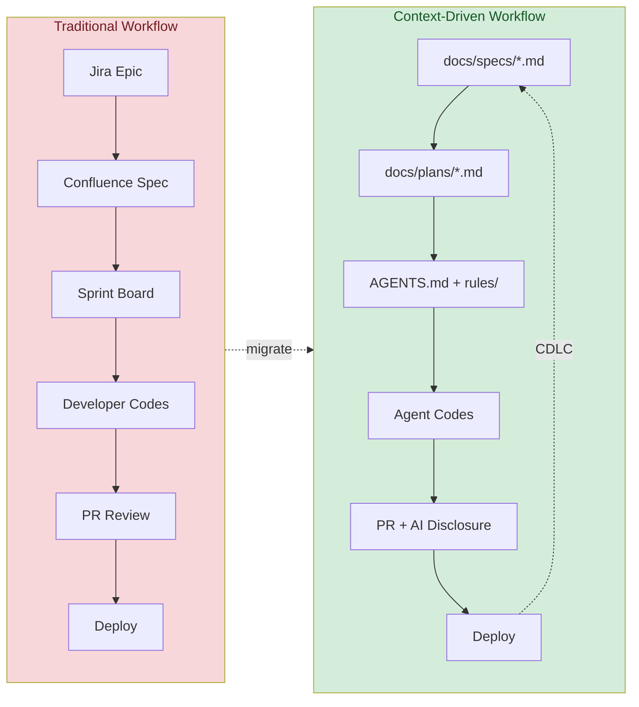
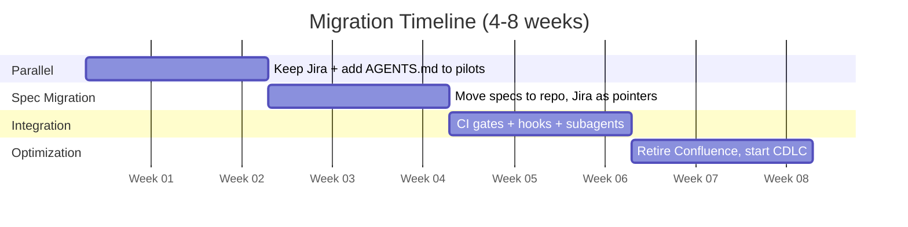

# Paradigm Comparison: Traditional vs Context-Driven Development

How software development workflows transform when AI coding agents become primary executors.



## Phase-by-Phase Comparison

| Phase | Traditional (Jira/Confluence) | Context-Driven (AGENTS.md) |
|-------|-------------------------------|---------------------------|
| **Requirements** | Jira epic with acceptance criteria | `docs/specs/*.md` in repo, PRD via docs-ai-prd |
| **Architecture** | Confluence page with diagrams | `docs/architecture.md` + inline AGENTS.md references |
| **Task Tracking** | Jira board with sprint lanes | `docs/plans/*.md` with dependency graphs (dev-workflow-planning) |
| **Standards** | Wiki page nobody reads | `.claude/rules/*.md` loaded every session |
| **Knowledge Transfer** | Onboarding doc, pair programming | AGENTS.md + rules = instant context for any agent |
| **Execution** | Developer writes code manually | Agent writes code with structured context |
| **Review** | PR review by humans only | PR review by humans + AI disclosure checklist |
| **Retrospective** | Sprint retro in meeting notes | Context retrospective: update AGENTS.md, retire stale rules |

## Artifact Mapping

Old artifacts map directly to new ones:

| Traditional Artifact | Context-Driven Equivalent | Location |
|---------------------|--------------------------|----------|
| Jira epic | Spec document | `docs/specs/feature-name.md` |
| Jira ticket | Plan task | `docs/plans/feature-name.md` task item |
| Confluence architecture page | Architecture doc | `docs/architecture.md` or AGENTS.md section |
| Sprint board | Dependency graph | Plan file with `depends_on` fields |
| Wiki coding standards | Agent rules | `.claude/rules/coding-standards.md` |
| Onboarding checklist | AGENTS.md quick-start | Top of AGENTS.md with orientation commands |
| Sprint velocity | Context metrics | Agent success rate, rework rate, token cost |
| Definition of Done | Verification steps | Plan file verification commands per task |
| Release notes | Conventional commits | `git log --oneline` with structured messages |

## Role Transformation

Roles evolve rather than disappear:

| Traditional Role | Evolves To | Key Activities |
|-----------------|-----------|----------------|
| **Project Manager** | Context Curator | Writes specs, maintains AGENTS.md, reviews context PRs |
| **Tech Lead** | Context Reviewer | Reviews rules, sets architecture context, approves shared rules |
| **Developer** | Agent Orchestrator | Writes plans, configures agents, reviews AI output |
| **QA Engineer** | Verification Designer | Defines test context, creates compliance gates, reviews AI test coverage |
| **Scrum Master** | Workflow Architect | Designs CDLC process, runs context retrospectives |

### What stays the same
- Domain expertise is still essential (agents need correct context)
- Code review is still required (humans verify AI output)
- Architecture decisions still need senior judgment
- Security review cannot be delegated to agents

## Migration Playbook: Incremental Transition

Do not attempt a big-bang migration. Transition incrementally over 4-8 weeks:



### Week 1-2: Parallel Operation
1. Keep Jira for cross-team coordination and sprint ceremonies
2. Add `AGENTS.md` to 2-3 pilot repos (use agents-project-memory)
3. Create `CLAUDE.md` as symlink: `ln -s AGENTS.md CLAUDE.md`
4. Add `.claude/rules/` with 2-3 coding standards
5. **Measure**: Agent success rate on tasks with vs without context

### Week 3-4: Spec Migration
1. Move upcoming feature specs from Confluence to `docs/specs/` in repos
2. Use docs-ai-prd to generate PRDs directly in repo
3. Create implementation plans in `docs/plans/` (dev-workflow-planning)
4. Keep Jira tickets as lightweight pointers to repo specs
5. **Measure**: Time-to-first-commit for spec'd vs unspec'd work

### Week 5-6: Workflow Integration
1. Add CI/CD compliance gates (if regulated)
2. Set up hooks for commit validation (agents-hooks)
3. Configure subagents for common patterns (agents-subagents)
4. Start context retrospectives: "What context was missing this sprint?"
5. **Measure**: Rework rate, PR revision count

### Week 7-8: Optimization
1. Retire redundant Confluence pages (archive, don't delete)
2. Reduce Jira to portfolio/program-level tracking
3. Roll out to remaining repos using multi-repo strategy
4. Establish CDLC cadence (monthly context review)
5. **Measure**: Full cycle time (idea to merged PR)

## When to Keep Traditional Tools

Context-driven development does not replace everything:

| Keep Using | When | Why |
|-----------|------|-----|
| **Jira/Linear** | Portfolio management across 10+ teams | Cross-team visibility needs a shared dashboard |
| **Jira/Linear** | Non-engineering stakeholders need status | Business users won't read AGENTS.md |
| **Confluence/Notion** | Regulatory documentation | Some compliance docs must be in specific formats |
| **Slack/Teams** | Real-time coordination | Async context files don't replace synchronous discussion |
| **Figma/design tools** | UI/UX design artifacts | Design files remain separate; reference them from specs |

## Hybrid Approach (Recommended for Large Orgs)

```
Portfolio Level (Jira/Linear):
  - Program epics, cross-team dependencies
  - Executive dashboards, quarterly planning
  - Compliance audit trail (if required)

Repository Level (Context-Driven):
  - AGENTS.md (agent instructions, PRIMARY file)
  - CLAUDE.md -> symlink to AGENTS.md
  - docs/specs/ (feature specifications)
  - docs/plans/ (implementation plans)
  - .claude/rules/ (coding standards, compliance rules)
  - .claude/agents/ (specialized subagents)

Linking Layer:
  - Jira ticket includes link to docs/specs/feature.md
  - PR description references Jira ticket number
  - Conventional commits include ticket ID when applicable
```

### Key Principle
**Jira tells you WHAT needs doing across the organization. Repository context tells agents HOW to do it.** They serve different audiences and complement each other.

## Industry Validation (March 2026)

**Anthropic's 2026 Agentic Coding Trends Report** validates this paradigm shift with data from production usage:

- Developers now use AI in **60% of their work** but fully delegate only 0-20% of tasks
- Engineering roles are shifting from writing code to **coordinating AI agents** focused on architecture and strategy
- Single-agent workflows evolving into **multi-agent coordination** with specialized agents working in parallel
- Agent task duration nearly doubled (Q4 2025→Q1 2026): 99.9th percentile went from <25 min to **>45 min per turn**
- Agents are spreading **beyond software engineers** into security, operations, and business departments

**AGENTS.md adoption** has reached 60,000+ public repositories (arxiv 2601.18341), with 15-23% estimated coding agent adoption rate across GitHub — making context-driven development a mainstream practice, not an early-adopter experiment.

**GitHub Agent HQ** (Feb 2026) now provides Claude and Codex as first-class agents within GitHub's security perimeter, with enterprise audit logging and organization-wide policy management — institutional infrastructure for the paradigm shift.

## Metrics: Measuring the Transition

Track these to validate the shift is working:

| Metric | Traditional Baseline | Context-Driven Target | How to Measure |
|--------|--------------------|-----------------------|----------------|
| Time to first commit | Hours-days | Minutes-hours | Git log timestamps |
| PR revision rounds | 2-4 rounds | 1-2 rounds | GitHub PR analytics |
| Onboarding time (new dev) | 1-2 weeks | 1-2 days | First meaningful PR |
| Context staleness | N/A (wiki rot) | <30 days | `git log` on AGENTS.md |
| Agent success rate | N/A | >70% first-attempt | Session retrospectives |
| Rework rate | 15-25% | <10% | Reverted commits / total |

## Related Skills

- **agents-project-memory** — How to write effective AGENTS.md files
- **dev-workflow-planning** — Creating implementation plans in repos
- **docs-ai-prd** — Writing specs optimized for AI agents
