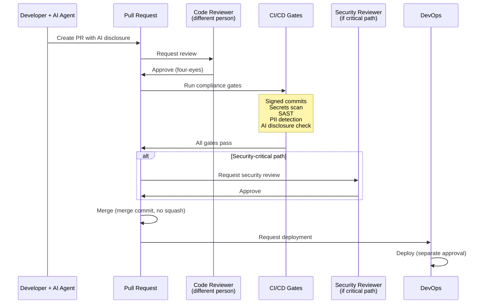

# Regulated Environment Patterns

FCA/EMI compliance patterns for AI-driven development. Covers regulatory framework mapping, mandatory agent rules, CI/CD compliance gates, change approval workflows, and audit trail requirements.

## Table of Contents

- [Regulatory Framework Coverage](#regulatory-framework-coverage)
- [PS21/3: Operational Resilience](#ps213-operational-resilience)
- [SS1/23: Model Risk Management](#ss123-model-risk-management)
- [SM&CR: Senior Managers and Certification Regime](#sm&cr-senior-managers-and-certification-regime)
- [PS24/16: Critical Third Parties (CTP)](#ps2416-critical-third-parties-ctp)
- [GDPR / UK GDPR](#gdpr-uk-gdpr)
- [PCI DSS](#pci-dss)
- [NIST AI Agent Standards Initiative (2026)](#nist-ai-agent-standards-initiative-2026)
- [FINRA 2026: AI Agent Regulatory Precedent](#finra-2026-ai-agent-regulatory-precedent)
- [Industry Evidence: AI Agents in Regulated Fintech](#industry-evidence-ai-agents-in-regulated-fintech)
- [Stripe Minions (1,000+ PRs/week, $1T+ payment volume)](#stripe-minions-1000-prsweek-$1t-payment-volume)
- [Mandatory Agent Rules](#mandatory-agent-rules)
- [1. FCA/EMI Compliance (`.claude/rules/compliance-fca-emi.md`)](#1-fcaemi-compliance-clauderulescompliance-fca-emimd)
- [2. Data Handling (`.claude/rules/data-handling-gdpr-pci.md`)](#2-data-handling-clauderulesdata-handling-gdpr-pcimd)
- [3. AI Agent Governance (`.claude/rules/ai-agent-governance.md`)](#3-ai-agent-governance-clauderulesai-agent-governancemd)
- [Change Approval Workflow](#change-approval-workflow)
- [Standard Flow](#standard-flow)
- [Enhanced Flow (Security-Critical Paths)](#enhanced-flow-security-critical-paths)
- [CODEOWNERS Configuration](#codeowners-configuration)
- [.github/CODEOWNERS](#githubcodeowners)
- [Security-critical directories require security team review](#security-critical-directories-require-security-team-review)
- [Agent rules require compliance review](#agent-rules-require-compliance-review)
- [Infrastructure requires DevOps review](#infrastructure-requires-devops-review)
- [Audit Trail Requirements](#audit-trail-requirements)
- [Git as Compliance Tool](#git-as-compliance-tool)
- [PR Description Template](#pr-description-template)
- [Quarterly Integrity Checks](#quarterly-integrity-checks)
- [Run quarterly across all repos](#run-quarterly-across-all-repos)
- [Audit Log Export](#audit-log-export)
- [Export audit log for a date range](#export-audit-log-for-a-date-range)
- [Compliance-Aware CI/CD](#compliance-aware-cicd)
- [Gate Summary](#gate-summary)
- [Compliance Metrics](#compliance-metrics)
- [Incident Response: AI Tool Failures](#incident-response-ai-tool-failures)
- [Severity Classification](#severity-classification)
- [Post-Incident Actions](#post-incident-actions)
- [Agent Execution Security](#agent-execution-security)
- [Sandbox Isolation Patterns](#sandbox-isolation-patterns)
- [GitHub Enterprise Agent Audit Integration](#github-enterprise-agent-audit-integration)
- [Related References](#related-references)

## Regulatory Framework Coverage

### PS21/3: Operational Resilience

AI coding tools are critical dependencies in your Important Business Services (IBS):

- **Impact tolerance**: Define maximum tolerable disruption if AI tools become unavailable
- **Scenario testing**: Test manual fallback pathways quarterly (can your team ship without AI agents?)
- **Dependency mapping**: Document AI tool providers (Anthropic, OpenAI) in your IBS dependency register
- **Exit strategy**: Maintain ability to develop without any single AI provider (dual-agent strategy helps)

### SS1/23: Model Risk Management

AI-generated code is model output that must be governed:

- **Inventory**: Track which code artifacts were AI-generated (PR disclosure, commit metadata)
- **Validation**: Human review required for all AI-generated code before merge
- **Testing**: AI-generated code must meet same test coverage thresholds as human code
- **Explainability**: Developers must understand AI-generated code before approving
- **Monitoring**: Track defect rates in AI-generated vs human-written code

### SM&CR: Senior Managers and Certification Regime

Named accountability for AI tool governance:

- **Senior Manager Function**: Designate SMF responsible for AI tool governance (typically CTO/CIO)
- **Delegation is not a defense**: "The AI did it" is not an acceptable explanation to the FCA
- **Reasonable steps**: Document policies, training, and controls for AI tool usage
- **Certification**: Developers using AI tools should be certified under SM&CR if in scope

### PS24/16: Critical Third Parties (CTP)

AI providers may be designated as Critical Third Parties:

- **Portability**: Maintain ability to switch between AI providers and context surfaces
- **Concentration risk**: Do not depend on a single AI provider for all development
- **Contractual provisions**: Ensure DPA and service terms with AI providers meet FCA requirements
- **Incident reporting**: AI tool outages affecting IBS must be reported per operational resilience framework

### GDPR / UK GDPR

Data protection requirements for AI-assisted development:

- **DPA**: Data Processing Agreement with Anthropic and OpenAI (both offer DPAs)
- **DPIA**: Data Protection Impact Assessment if AI processes personal data
- **Context safety**: Agent context files (AGENTS.md, rules, plans) must NEVER contain personal data
- **Lawful basis**: Legitimate interest for code generation; explicit consent if processing customer data patterns
- **Right to explanation**: If AI-generated decisions affect individuals, explainability required

### PCI DSS

Payment Card Industry requirements:

- **Card data prohibition**: Real or synthetic card numbers must NEVER appear in agent context, prompts, or code comments
- **Segmentation**: AI agents must not have access to cardholder data environments
- **Logging**: AI tool access to payment-related code must be auditable
- **Key management**: AI agents must never see encryption keys, even in test environments

### NIST AI Agent Standards Initiative (2026)

The first US government framework specifically targeting autonomous AI agents, launched by NIST's Center for AI Standards and Innovation (CAISI):

**Three pillars:**
1. **Industry-led standards**: Gap analyses, voluntary guidelines, international standards coordination
2. **Community-led protocols**: Open-source agent protocol interoperability (NSF investment)
3. **Security research**: Agent authentication, identity infrastructure, security evaluations

**Key focus areas for coding agents:**
- **Agent identity and authorization**: How agents authenticate and what permissions they hold
- **Governance and oversight controls**: Human supervision, escalation protocols, access controls
- **Security controls**: Mitigating misuse, privilege escalation, unintended autonomous actions

**Relevance for FCA-regulated firms**: While NIST standards are US-focused, they provide a complementary framework. FCA-regulated firms operating internationally should track NIST developments for alignment opportunities.

### FINRA 2026: AI Agent Regulatory Precedent

FINRA's 2026 Regulatory Oversight Report contains the first dedicated section on AI agents by a major financial regulator, defining them as "systems capable of autonomous actions on behalf of users":

**Agent-specific risks identified:**
- Autonomy without human validation and approval
- Scope creep beyond intended authority
- Auditability challenges (multi-step reasoning difficult to trace)
- Data sensitivity (unintended storage or disclosure)
- Misaligned reward functions affecting outcomes

**Required controls (applicable to coding agents):**
- Track and log agent actions and decisions
- Store prompt and output logs for accountability
- Record which model version was used and when
- Implement human-in-the-loop review procedures
- Define guardrails to restrict agent behaviors

**Mapping to FCA context**: While FINRA is a US regulator, its specificity on AI agent audit trails is more detailed than current FCA guidance. FCA-regulated EMIs should proactively adopt FINRA's logging recommendations as best practice — regulators learn from each other.

## Industry Evidence: AI Agents in Regulated Fintech

### Stripe Minions (1,000+ PRs/week, $1T+ payment volume)

Stripe's internal coding agents demonstrate that AI-generated code at scale is compatible with stringent financial regulation:

| Control | Stripe's Implementation | FCA Equivalent |
|---------|------------------------|---------------|
| **Isolation** | Pre-warmed devboxes, no production/internet access | Operational resilience (PS21/3) |
| **Human review** | All agent output requires human review before merge | Separation of duties (SM&CR) |
| **Verification** | Max 2 CI rounds, local lint <5s, selective test running | Model risk validation (SS1/23) |
| **Context rules** | Agent rule files conditional by subdirectory | `.claude/rules/` per directory |
| **Tool governance** | Curated MCP tool subset per task (from 400+) | Approved tool list |
| **Audit trail** | Full visibility into agent decisions via web UI | PR disclosure + signed commits |

**Key takeaway for FCA-regulated EMIs**: If Stripe can merge 1,000+ AI-generated PRs weekly while processing $1T+ in payments, the approach is viable for EMIs — but requires the same rigor: isolation, human review, verification constraints, and auditability.

**Isolation pattern worth adopting**: Stripe's devboxes are fully isolated from production and the internet. For EMIs, consider container-based agent execution environments that:
- Cannot reach production databases or APIs
- Cannot make outbound network calls (prevents data exfiltration)
- Are pre-loaded with code and test infrastructure only
- Spin up in <30 seconds for developer ergonomics

## Mandatory Agent Rules

These rules templates must be installed in every repository. Copy from `assets/` directory.

### 1. FCA/EMI Compliance (`.claude/rules/compliance-fca-emi.md`)

Covers:
- Signed commits required (audit trail)
- No force-push (immutable history)
- Merge commits only to main (traceable changes)
- AI cannot approve or deploy (separation of duties)
- Different reviewer required (four-eyes principle)
- Prohibited: auto-merge to production branches
- Model risk: all AI-generated artifacts tracked

See: `assets/compliance-fca-emi.md` for copy-ready template.

### 2. Data Handling (`.claude/rules/data-handling-gdpr-pci.md`)

Covers:
- Safe data categories (code abstractions, business logic, synthetic test data)
- Prohibited data categories (PII, card data, credentials, connection strings)
- Context filtering patterns
- Test data guidelines

See: `assets/data-handling-gdpr-pci.md` for copy-ready template.

### 3. AI Agent Governance (`.claude/rules/ai-agent-governance.md`)

Covers:
- Approved AI tool list
- Usage restrictions per environment
- Disclosure requirements
- Training requirements
- Incident response for AI tool failures

See: `assets/ai-agent-governance.md` for copy-ready template.

## Change Approval Workflow



### Standard Flow

```
Developer + AI Agent
    ↓ creates PR
Human Review (PR author cannot be sole reviewer)
    ↓ approves
Code Reviewer (different person, required)
    ↓ approves
Automated Gates (CI/CD)
    ├── Signed commit verification
    ├── Secrets detection (gitleaks)
    ├── SAST scanning
    ├── PII pattern detection
    ├── AI disclosure check
    ├── Test coverage threshold
    └── Dependency vulnerability scan
    ↓ all pass
Merge to main (merge commit, no squash)
    ↓
DevOps approves deployment (separate from code approval)
```

### Enhanced Flow (Security-Critical Paths)

For changes touching `auth/`, `payments/`, `crypto/`, `compliance/`:

```
Standard Flow
    ↓ plus
Security Reviewer (separate from code reviewer)
    ↓ approves
Compliance Check (manual or automated)
    ↓ clears
Merge with 2+ approvals
```

### CODEOWNERS Configuration

```
# .github/CODEOWNERS
# Security-critical directories require security team review
/auth/           @org/security-team @org/backend-leads
/payments/       @org/security-team @org/payments-team
/crypto/         @org/security-team
/compliance/     @org/compliance-team @org/security-team

# Agent rules require compliance review
/.claude/rules/compliance-*  @org/compliance-team
/.claude/rules/data-handling* @org/compliance-team @org/security-team

# Infrastructure requires DevOps review
/.github/workflows/  @org/devops-team
/terraform/          @org/devops-team
/k8s/                @org/devops-team
```

## Audit Trail Requirements

### Git as Compliance Tool

Git provides an immutable, signed audit trail when configured correctly:

| Requirement | Git Implementation | Enforcement |
|------------|-------------------|-------------|
| **Immutability** | No force-push, no rebase on main | Branch protection rules |
| **Attribution** | Signed commits (GPG/SSH) | `git config commit.gpgsign true` |
| **Traceability** | Merge commits (no squash) | Branch protection: merge commits only |
| **Disclosure** | PR template with AI involvement | PR template check in CI |
| **Chronology** | Commit timestamps | Git's native ordering |
| **Integrity** | SHA-256 commit hashes | `git fsck --full` quarterly |

### PR Description Template

Every PR must include AI involvement disclosure. See `assets/pr-template-ai-disclosure.md`.

Key fields:
- AI tools used (Claude Code, Codex, Cursor, Copilot, none)
- AI role (generated code, reviewed code, generated tests, assisted debugging)
- Human verification checklist (understood code, ran tests, reviewed security, checked compliance)
- Files primarily AI-generated (list)
- Confidence level (high/medium/low for each AI-generated section)

### Quarterly Integrity Checks

```bash
# Run quarterly across all repos
for repo in repos/*/; do
  echo "=== $(basename $repo) ==="
  (cd "$repo" && git fsck --full 2>&1 | tail -1)
  (cd "$repo" && git log --oneline --no-merges main | wc -l)
  echo "---"
done
```

### Audit Log Export

For compliance reporting, export git history to immutable storage:

```bash
# Export audit log for a date range
git log --since="2026-01-01" --until="2026-03-31" \
  --format='%H|%ai|%an|%ae|%s' \
  --show-signature \
  > audit-log-2026-Q1.csv
```

## Compliance-Aware CI/CD

See `assets/fca-compliance-gate.yml` for the full GitHub Actions workflow template.

### Gate Summary

| Gate | Tool | Blocks Merge | Purpose |
|------|------|-------------|---------|
| Signed commits | `git verify-commit` | Yes | Audit trail attribution |
| Secrets detection | gitleaks | Yes | Prevent credential exposure |
| SAST scanning | Semgrep/CodeQL | Yes | Vulnerability detection |
| PII detection | Custom regex | Yes | Data protection |
| AI disclosure | PR template check | Yes | Regulatory transparency |
| Test coverage | Coverage tool | Yes (if below threshold) | Code quality |
| Dependency scan | Dependabot/Snyk | Warning | Supply chain security |
| License check | License tool | Warning | Legal compliance |

## Compliance Metrics

Track and report these metrics for regulatory purposes:

| Metric | Target | Frequency | Report To |
|--------|--------|-----------|-----------|
| % repos with mandatory rules | 100% | Weekly | CTO/compliance |
| % PRs with AI disclosure | 100% | Weekly | Engineering leads |
| Security scan pass rate | >95% | Daily | Security team |
| Mean time to gate resolution | <4 hours | Weekly | Engineering leads |
| Signed commit compliance | 100% | Daily | DevOps |
| Force-push attempts blocked | 0 | Daily | Security team |
| PII detection true positive rate | >80% | Monthly | DPO |
| Quarterly git integrity pass | 100% | Quarterly | Compliance/audit |

## Incident Response: AI Tool Failures

When an AI tool fails or produces problematic output:

### Severity Classification

| Severity | Criteria | Response Time | Escalation |
|----------|----------|---------------|------------|
| **P1 Critical** | AI-generated code causes production incident | 15 min | CTO + compliance |
| **P2 High** | AI tool leaks sensitive data | 1 hour | Security + DPO |
| **P3 Medium** | AI tool produces non-compliant code (caught in review) | 24 hours | Engineering lead |
| **P4 Low** | AI tool unavailable | 48 hours | DevOps |

### Post-Incident Actions
1. Isolate: Revert AI-generated code if in production
2. Investigate: Determine root cause (context issue, model behavior, human oversight failure)
3. Remediate: Fix the immediate issue
4. Prevent: Update rules, gates, or training to prevent recurrence
5. Report: Log incident per operational resilience framework

## Agent Execution Security

### Sandbox Isolation Patterns

For regulated environments, agent code execution requires isolation beyond git worktrees. Choose isolation level based on threat model:

| Technology | Isolation | Boot Time | Security Level | Best For |
|-----------|-----------|-----------|---------------|----------|
| **Git worktrees** | Branch-level | Instant | Code isolation only | Development (L2) |
| **Docker containers** | Process (shared kernel) | Milliseconds | Process-level | Trusted, audited code |
| **gVisor** | Syscall interception | Milliseconds | Syscall-level | CI/CD, multi-tenant |
| **Firecracker microVM** | Hardware (dedicated kernel) | ~125ms | Hardware-enforced | Production agents, regulated |
| **Kata Containers** | Hardware (via VMM) | ~200ms | Hardware-enforced | Kubernetes, regulated industries |

**Recommendation for FCA-regulated EMIs:**
- **Development**: Git worktrees (standard for agent isolation)
- **CI/CD**: gVisor or Firecracker (stronger isolation for automated runs)
- **Production agent execution**: Firecracker microVMs (dedicated kernel, <5 MiB overhead)

**Defense-in-depth for agent execution:**
1. Network isolation: Block all outbound connections by default; whitelist only required endpoints
2. Resource limits: CPU/memory caps, disk quotas, I/O rate limiting
3. Zero-trust credentials: Short-lived tokens with task-specific scope
4. Human-in-the-loop gates: Approval required for high-risk operations
5. Immutable audit trails: Track every code execution, tool call, and API request

Sandboxing and network restriction materially reduce blast radius compared to unrestricted agent execution.

### GitHub Enterprise Agent Audit Integration

GitHub's enterprise agent controls provide platform-level audit capabilities that complement repository-level compliance:

**Audit log enhancements for agents:**
- agent-specific audit events distinguish agent actions from human actions
- session-level task events capture lifecycle and status
- events can be reviewed at organization and enterprise scope

**Enterprise governance features:**
- custom agent definitions in `.github/agents/`
- enterprise controls for approved agents and MCP servers
- policy enforcement and review at org / enterprise scope
- custom roles for AI governance

**Integration with FCA compliance:**
These controls map to FCA requirements:
- agent-specific audit events → SM&CR accountability
- session events → PS21/3 operational resilience
- approved-agent and MCP controls → PS24/16 third-party governance
- protected agent definition files → separation of duties

## Related References

- **multi-repo-strategy.md** — How to distribute compliance rules across repos
- **maturity-model.md** — L3+ requires compliance gates
- **context-development-lifecycle.md** — Compliance rules need CDLC maintenance
- **software-security-appsec** — Application security patterns (OWASP, auth)
