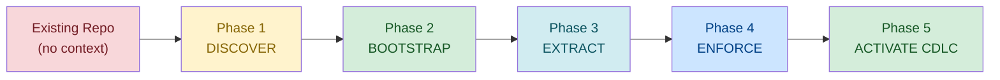

# Repo Conversion Playbook: Traditional to CDLC

Step-by-step guide for converting existing repositories from ad-hoc or Jira-centric workflows to the Context Development Lifecycle. Uses real scripts and skills from this framework.

## Overview



## Prerequisites

Before starting, ensure these tools are installed:

```bash
# Install Claude Code + Codex + code quality tools
# Uses the real setup script from this repo:
bash docs/scripts/code_agents_update.sh
```

Verify:
```bash
claude --version    # Claude Code CLI
codex --version     # OpenAI Codex CLI
rg --version        # ripgrep (used by lint scripts)
```

## Phase 1: DISCOVER (30 minutes)

Understand the existing repo before adding context. Do NOT start writing AGENTS.md yet.

### Step 1.1: Codebase Orientation

Run these commands to understand what you're working with:

```bash
# Size and language breakdown
echo "=== Codebase Size ==="
find . -name '*.ts' -o -name '*.tsx' -o -name '*.js' -o -name '*.jsx' \
       -o -name '*.py' -o -name '*.go' -o -name '*.rs' -o -name '*.java' \
  | xargs wc -l 2>/dev/null | tail -1

echo ""
echo "=== Language Distribution ==="
find . -type f -not -path '*/node_modules/*' -not -path '*/.git/*' \
       -not -path '*/vendor/*' -not -path '*/dist/*' \
  | sed 's/.*\.//' | sort | uniq -c | sort -rn | head -15

echo ""
echo "=== Directory Structure (depth 3) ==="
tree -L 3 -d --gitignore 2>/dev/null || find . -type d -maxdepth 3 \
  -not -path '*/node_modules/*' -not -path '*/.git/*' | sort

echo ""
echo "=== Entry Points ==="
find . -maxdepth 3 \( -name 'main.*' -o -name 'index.*' -o -name 'app.*' \
  -o -name 'server.*' -o -name 'manage.py' \) \
  -not -path '*/node_modules/*' -not -path '*/dist/*'

echo ""
echo "=== Config Files ==="
ls -la package.json tsconfig.json pyproject.toml go.mod Cargo.toml \
  Gemfile Makefile docker-compose.yml 2>/dev/null

echo ""
echo "=== Git Activity (last 90 days) ==="
git log --since="90 days ago" --oneline | wc -l
echo "commits in last 90 days"
git shortlog --since="90 days ago" -sn | head -10
```

### Step 1.2: Architecture Extraction

Use the docs-ai-prd skill's architecture extraction patterns:

```bash
# Identify architectural layers
echo "=== Presentation Layer ==="
find . -type d \( -name 'api' -o -name 'routes' -o -name 'controllers' \
  -o -name 'handlers' -o -name 'pages' -o -name 'views' \) \
  -not -path '*/node_modules/*' 2>/dev/null

echo ""
echo "=== Business Logic Layer ==="
find . -type d \( -name 'services' -o -name 'usecases' -o -name 'domain' \
  -o -name 'logic' -o -name 'core' \) \
  -not -path '*/node_modules/*' 2>/dev/null

echo ""
echo "=== Data Access Layer ==="
find . -type d \( -name 'repositories' -o -name 'models' -o -name 'entities' \
  -o -name 'schemas' -o -name 'migrations' -o -name 'prisma' \) \
  -not -path '*/node_modules/*' 2>/dev/null

echo ""
echo "=== Infrastructure Layer ==="
find . -type d \( -name 'infra' -o -name 'adapters' -o -name 'config' \
  -o -name 'middleware' -o -name 'providers' \) \
  -not -path '*/node_modules/*' 2>/dev/null

echo ""
echo "=== Design Patterns in Use ==="
rg -l 'Repository|Service|Factory|Observer|Singleton|Strategy' \
  --type ts --type py --type go -g '!node_modules' 2>/dev/null | head -20
```

See: docs-ai-prd/references/architecture-extraction.md for comprehensive extraction patterns.

### Step 1.3: Convention Mining

Detect existing team conventions from the codebase:

```bash
# Naming conventions
echo "=== File Naming Convention ==="
find src/ -type f -name '*.ts' 2>/dev/null | head -20 | while read f; do
  basename "$f"
done | sort

echo ""
echo "=== Function/Method Naming ==="
rg 'function\s+\w+|def\s+\w+|func\s+\w+' --type ts --type py --type go \
  -g '!node_modules' -o 2>/dev/null | head -20

echo ""
echo "=== Import Organization ==="
head -20 $(find src/ -name '*.ts' -type f 2>/dev/null | head -1) 2>/dev/null

echo ""
echo "=== Test Patterns ==="
find . -name '*.test.*' -o -name '*.spec.*' -o -name '*_test.*' \
  -not -path '*/node_modules/*' 2>/dev/null | head -10
echo "Test framework:"
rg '"jest"|"vitest"|"mocha"|"pytest"|"testing"' package.json pyproject.toml \
  go.mod 2>/dev/null | head -5

echo ""
echo "=== Commit Convention ==="
git log --oneline -20

echo ""
echo "=== Existing Documentation ==="
find . -name 'README.md' -o -name 'CONTRIBUTING.md' -o -name 'CHANGELOG.md' \
  -o -name 'AGENTS.md' -o -name 'CLAUDE.md' \
  -not -path '*/node_modules/*' 2>/dev/null
```

See: docs-ai-prd/references/convention-mining.md for comprehensive convention detection.

### Step 1.4: Existing Context Audit

Check what context already exists:

```bash
echo "=== Existing Agent Context ==="
for file in AGENTS.md CLAUDE.md .cursor/rules .github/copilot-instructions.md; do
  if [ -e "$file" ]; then
    echo "FOUND: $file ($(wc -l < "$file") lines)"
  else
    echo "MISSING: $file"
  fi
done

echo ""
echo "=== Existing .claude/ Structure ==="
find .claude/ -type f 2>/dev/null || echo "No .claude/ directory"

echo ""
echo "=== Existing CI/CD ==="
ls -la .github/workflows/*.yml 2>/dev/null || echo "No GitHub Actions workflows"
```

**Output of Phase 1**: Mental model of the codebase — size, languages, architecture, conventions, existing context. Do NOT skip this. It informs everything that follows.

## Phase 2: BOOTSTRAP (20 minutes)

Set up the context infrastructure using the framework's real setup scripts.

### Step 2.1: Bootstrap .claude/ Directory

Use the framework's setup script to create the `.claude/` structure:

```bash
# Option A: If AI-Agents repo is available locally
# This script auto-detects the repo location and copies hooks, skills, settings
bash /path/to/AI-Agents/frameworks/scripts/setup-claude.sh

# Option B: Manual minimal setup
mkdir -p .claude/rules .claude/agents docs/specs docs/plans
```

The `setup-claude.sh` script will:
- Create `.claude/hooks/`, `.claude/skills/`, `.claude/settings.json`
- Copy shared skills from the AI-Agents repo
- Preserve any existing custom skills
- Clean up legacy directories (`.claude/agents/`, `.claude/commands/`)

### Step 2.2: Create AGENTS.md

Use Claude Code to generate AGENTS.md from what you discovered in Phase 1:

```bash
# Interactive generation (recommended)
claude "Analyze this codebase and generate an AGENTS.md file. Include:
1. Project overview (1-2 sentences)
2. Tech stack
3. Build/test/lint commands
4. Directory structure overview
5. Key architectural patterns
6. Coding conventions you detect
7. Important files and entry points"
```

Or use this template and fill in from Phase 1 findings:

```markdown
# [Project Name]

## Overview
[1-2 sentences: what this service does and why it exists]

## Tech Stack
- Language: [detected from Phase 1]
- Framework: [detected from Phase 1]
- Database: [if applicable]
- Testing: [test framework from Phase 1]

## Commands
- Build: `[from package.json/Makefile/etc]`
- Test: `[test command]`
- Lint: `[lint command]`
- Dev: `[dev server command]`

## Directory Structure
[from Phase 1.1 tree output, condensed to key directories]

## Architecture
[from Phase 1.2 layer analysis]

## Key Patterns
[from Phase 1.3 convention mining — naming, imports, patterns]

## Conventions
- Commits: [from git log analysis]
- Branches: [from git branch naming]
- Testing: [test file naming pattern]
```

### Step 2.3: Create the Symlink

```bash
# ALWAYS create the symlink — this is non-negotiable
ln -s AGENTS.md CLAUDE.md

# Verify
ls -la CLAUDE.md
# Should show: CLAUDE.md -> AGENTS.md
```

### Step 2.4: Add Initial Rules

Create 2-3 focused rule files based on Phase 1 convention mining:

```bash
# Rule 1: Coding standards (from convention mining)
cat > .claude/rules/coding-standards.md << 'EOF'
# Coding Standards

## Naming
- Files: [kebab-case / camelCase / PascalCase — from Phase 1.3]
- Functions: [camelCase / snake_case — from Phase 1.3]
- Classes: PascalCase
- Constants: UPPER_SNAKE_CASE

## Imports
- [Order: stdlib, external, internal — from Phase 1.3]
- [Absolute vs relative — from Phase 1.3]

## Patterns
- [Key pattern 1 from Phase 1.2]
- [Key pattern 2 from Phase 1.2]
EOF

# Rule 2: Testing conventions
cat > .claude/rules/testing.md << 'EOF'
# Testing Conventions

- Test files: [*.test.ts / *.spec.ts / *_test.go — from Phase 1.3]
- Location: [co-located / __tests__/ / tests/ — from Phase 1.3]
- Framework: [vitest / jest / pytest — from Phase 1.3]
- Coverage threshold: [if known, else "aim for >80% on new code"]
- Always write tests for new features and bug fixes
EOF
```

### Step 2.5: Validate the Bootstrap

Use the framework's lint script to verify your setup:

```bash
# Run memory file linter
bash /path/to/AI-Agents/frameworks/shared-skills/skills/agents-project-memory/scripts/lint_claude_memory.sh

# Quick manual validation
echo "=== Validation ==="
[ -f AGENTS.md ] && echo "OK: AGENTS.md exists" || echo "FAIL: No AGENTS.md"
[ -L CLAUDE.md ] && echo "OK: CLAUDE.md is symlink" || echo "FAIL: CLAUDE.md not a symlink"
[ -d .claude/rules ] && echo "OK: .claude/rules/ exists" || echo "FAIL: No .claude/rules/"
wc -l AGENTS.md
echo "(target: 30-150 lines for single-service repos)"
```

**Output of Phase 2**: Working AGENTS.md (symlinked to CLAUDE.md), `.claude/rules/` with initial standards, `.claude/` directory bootstrapped. Maturity: L1-L2.

## Phase 3: EXTRACT (1-2 hours)

Deep extraction of knowledge from the codebase into context artifacts. This is where you use AI agents to accelerate the process.

### Step 3.1: Architecture Documentation

```bash
# Use Claude Code to generate architecture docs
claude "Analyze the codebase architecture and create docs/architecture.md covering:
1. High-level system diagram (describe in text, I'll create Mermaid later)
2. Service boundaries and responsibilities
3. Data flow patterns
4. Key dependencies (internal and external)
5. Critical paths (auth, payments, data processing)
Cross-reference: docs-ai-prd/references/architecture-extraction.md"
```

### Step 3.2: Extract Rules from Code Review History

Mining past PRs for implicit conventions that should become explicit rules:

```bash
# Find recurring review comments (if using GitHub)
gh pr list --state merged --limit 50 --json number,title | head -20

# Look at PR review comments for patterns
for pr in $(gh pr list --state merged --limit 10 --json number -q '.[].number'); do
  echo "=== PR #$pr ==="
  gh api "repos/{owner}/{repo}/pulls/$pr/comments" \
    --jq '.[].body' 2>/dev/null | head -5
done

# Or ask Claude Code to analyze recent changes
claude "Look at the last 20 commits (git log -20 --stat) and identify:
1. What patterns are consistently followed?
2. What areas have the most churn (frequent changes)?
3. Any implicit rules visible in code style?"
```

### Step 3.3: Create Specialized Subagents

For repos with distinct domains, create subagents using agents-subagents skill:

```bash
# Example: Create a test-writer subagent
cat > .claude/agents/test-writer.md << 'AGENT'
# Test Writer Agent

## Role
Write tests for new and modified code following the project's testing conventions.

## Context
- Test framework: [from Phase 1.3]
- Test location: [from Phase 1.3]
- Naming pattern: [from Phase 1.3]

## Rules
- Every new function gets at least one happy-path and one error-path test
- Use the project's test utilities from [test utils path]
- Mock external dependencies; never make real API calls in tests
- Follow existing test file structure for consistency
AGENT

# Example: Create a migration-helper subagent (if using ORMs)
cat > .claude/agents/migration-helper.md << 'AGENT'
# Migration Helper Agent

## Role
Create and review database migrations following the project's migration patterns.

## Context
- ORM: [Prisma / TypeORM / Alembic / etc]
- Migration directory: [from Phase 1.2]

## Rules
- Always create reversible migrations (up AND down)
- Never modify existing migrations; create new ones
- Include data migration steps when schema changes affect existing data
- Test migrations against a copy of production schema
AGENT
```

### Step 3.4: Migrate Existing Documentation

If the team has Confluence pages, wiki docs, or README files with useful content:

```bash
# Find existing documentation
find . -name 'README.md' -not -path '*/node_modules/*' -exec echo "=== {} ===" \; \
  -exec head -20 {} \;

# Use Claude Code to consolidate
claude "Read all README.md files in this repo and extract content that should be in:
1. AGENTS.md (project context for AI agents)
2. .claude/rules/ (coding standards, conventions)
3. docs/architecture.md (system design)
Do NOT duplicate — reference existing docs where they are comprehensive."
```

For Confluence content (manual step):
1. Export relevant Confluence pages to Markdown
2. Place in `docs/legacy/` temporarily
3. Use Claude Code to extract actionable context into AGENTS.md and rules
4. Archive or delete the Confluence export after extraction

**Output of Phase 3**: Architecture docs, specialized subagents, rules extracted from code review history. Maturity: solid L2.

## Phase 4: ENFORCE (2-4 hours)

Add automated enforcement: hooks, CI gates, validation.

### Step 4.1: Set Up Hooks

Use the agents-hooks skill to create enforcement hooks:

```bash
# Create pre-commit hook for context validation
cat > .claude/hooks/pre-commit-context-check.sh << 'HOOK'
#!/bin/bash
# Validate context files on commit
set -euo pipefail

# Check CLAUDE.md is still a symlink
if [ -f CLAUDE.md ] && [ ! -L CLAUDE.md ]; then
  echo "ERROR: CLAUDE.md is not a symlink. Run: ln -sf AGENTS.md CLAUDE.md"
  exit 1
fi

# Check AGENTS.md hasn't grown too large
if [ -f AGENTS.md ]; then
  lines=$(wc -l < AGENTS.md)
  if [ "$lines" -gt 300 ]; then
    echo "WARNING: AGENTS.md is $lines lines. Consider splitting into .claude/rules/"
  fi
fi

# Run memory lint if available
LINT_SCRIPT="${AI_AGENTS_ROOT:-$HOME/Documents/AI-Agents}/frameworks/shared-skills/skills/agents-project-memory/scripts/lint_claude_memory.sh"
if [ -f "$LINT_SCRIPT" ]; then
  bash "$LINT_SCRIPT" 2>/dev/null || echo "WARNING: Memory lint found issues (non-blocking)"
fi
HOOK
chmod +x .claude/hooks/pre-commit-context-check.sh
```

### Step 4.2: Install Compliance Rules (Regulated Repos)

For FCA-regulated repos, copy the mandatory asset templates:

```bash
ASSETS="/path/to/AI-Agents/frameworks/shared-skills/skills/dev-context-engineering/assets"

# Copy mandatory compliance rules
cp "$ASSETS/compliance-fca-emi.md" .claude/rules/compliance-fca-emi.md
cp "$ASSETS/data-handling-gdpr-pci.md" .claude/rules/data-handling-gdpr-pci.md
cp "$ASSETS/ai-agent-governance.md" .claude/rules/ai-agent-governance.md

# Install PR template
mkdir -p .github
cp "$ASSETS/pr-template-ai-disclosure.md" .github/pull_request_template.md

# Install CI/CD compliance gate
mkdir -p .github/workflows
cp "$ASSETS/fca-compliance-gate.yml" .github/workflows/fca-compliance-gate.yml

echo "Compliance rules installed. Verify:"
ls -la .claude/rules/compliance-*.md .claude/rules/data-handling-*.md \
  .claude/rules/ai-agent-governance.md .github/pull_request_template.md \
  .github/workflows/fca-compliance-gate.yml
```

### Step 4.3: Configure Branch Protection

```bash
# Via GitHub CLI (requires admin access)
gh api repos/{owner}/{repo}/branches/main/protection -X PUT \
  --input - << 'JSON'
{
  "required_status_checks": {
    "strict": true,
    "contexts": ["FCA Compliance Gate / Signed Commits",
                 "FCA Compliance Gate / Secrets Detection",
                 "FCA Compliance Gate / PII Pattern Detection"]
  },
  "required_pull_request_reviews": {
    "required_approving_review_count": 1,
    "dismiss_stale_reviews": true
  },
  "enforce_admins": true,
  "restrictions": null,
  "required_signatures": true,
  "allow_force_pushes": false,
  "allow_deletions": false
}
JSON
```

### Step 4.4: Set Up Signed Commits

```bash
# Configure signed commits for the repo
git config commit.gpgsign true

# If using SSH signing (recommended for simplicity)
git config gpg.format ssh
git config user.signingkey ~/.ssh/id_ed25519.pub

# Verify
echo "test" | git commit --allow-empty -m "test: verify signed commits" --dry-run
```

**Output of Phase 4**: Automated hooks, compliance gates, branch protection, signed commits. Maturity: L3.

## Phase 5: ACTIVATE CDLC (Ongoing)

Start the continuous improvement loop: Generate → Evaluate → Distribute → Observe.

### Step 5.1: First Context Retrospective

After 1 week of using the new context:

```bash
# Gather data for retrospective
echo "=== PRs This Week ==="
gh pr list --state merged --limit 20 --json number,title,createdAt

echo ""
echo "=== Context File Changes ==="
git log --since="7 days ago" --oneline -- AGENTS.md .claude/

echo ""
echo "=== Agent Session Quality (manual assessment) ==="
echo "Answer these questions:"
echo "1. Did agents follow conventions consistently? (yes/mostly/no)"
echo "2. What instructions did you repeat in every session?"
echo "3. What rules were violated most often?"
echo "4. What context was missing that caused rework?"
echo "5. Any rules that agents ignored or that caused confusion?"
```

### Step 5.2: Establish CDLC Cadence

```bash
# Add calendar reminders (or add to sprint ceremonies)
echo "CDLC Cadence:"
echo "  Weekly: 5-min retro during standup — any missing context?"
echo "  Monthly: 30-min context review — update AGENTS.md, retire stale rules"
echo "  Quarterly: Full audit — measure maturity, plan improvements"
```

### Step 5.3: Track Metrics

```bash
# Context freshness
echo "=== Context Freshness ==="
for f in AGENTS.md .claude/rules/*.md; do
  [ -f "$f" ] || continue
  last=$(git log -1 --format=%cr -- "$f" 2>/dev/null || echo "untracked")
  echo "$f: last updated $last"
done

# Rework rate (approximate)
echo ""
echo "=== Rework Indicators (last 30 days) ==="
echo "Reverted commits:"
git log --since="30 days ago" --oneline --grep="revert" -i | wc -l
echo "Fix commits (fixing recent work):"
git log --since="30 days ago" --oneline --grep="fix" -i | wc -l
echo "Total commits:"
git log --since="30 days ago" --oneline | wc -l
```

**Output of Phase 5**: Active CDLC loop with regular retrospectives, metrics tracking, and continuous context improvement. Maturity: L4.

## Batch Conversion Script

For converting multiple repos at once, use this wrapper:

```bash
#!/bin/bash
# convert-repos.sh — Batch convert repos to CDLC
# Usage: ./convert-repos.sh repos.txt
#   repos.txt contains one repo path per line
set -euo pipefail

AI_AGENTS_ROOT="${AI_AGENTS_ROOT:-$HOME/Documents/AI-Agents}"
ASSETS="$AI_AGENTS_ROOT/frameworks/shared-skills/skills/dev-context-engineering/assets"
SETUP_SCRIPT="$AI_AGENTS_ROOT/frameworks/scripts/setup-claude.sh"
LINT_SCRIPT="$AI_AGENTS_ROOT/frameworks/shared-skills/skills/agents-project-memory/scripts/lint_claude_memory.sh"

REPOS_FILE="${1:?Usage: $0 repos.txt}"
PASS=0; FAIL=0; TOTAL=0

while IFS= read -r repo_path; do
  [ -z "$repo_path" ] && continue
  [[ "$repo_path" == \#* ]] && continue  # skip comments
  TOTAL=$((TOTAL + 1))

  echo ""
  echo "=========================================="
  echo "Converting: $repo_path"
  echo "=========================================="

  if [ ! -d "$repo_path/.git" ]; then
    echo "SKIP: Not a git repo"
    FAIL=$((FAIL + 1))
    continue
  fi

  cd "$repo_path"

  # Phase 2.1: Bootstrap .claude/ (if setup script available)
  if [ -f "$SETUP_SCRIPT" ]; then
    bash "$SETUP_SCRIPT" 2>/dev/null || true
  else
    mkdir -p .claude/rules
  fi

  # Phase 2.3: Create CLAUDE.md symlink (if AGENTS.md exists)
  if [ -f AGENTS.md ] && [ ! -L CLAUDE.md ]; then
    ln -sf AGENTS.md CLAUDE.md
    echo "Created CLAUDE.md symlink"
  elif [ ! -f AGENTS.md ]; then
    echo "WARNING: No AGENTS.md — create manually with Claude Code"
  fi

  # Phase 4.2: Install mandatory compliance rules
  mkdir -p .claude/rules
  for rule in compliance-fca-emi.md data-handling-gdpr-pci.md ai-agent-governance.md; do
    if [ -f "$ASSETS/$rule" ]; then
      cp "$ASSETS/$rule" ".claude/rules/$rule"
    fi
  done

  # Install PR template
  if [ -f "$ASSETS/pr-template-ai-disclosure.md" ]; then
    mkdir -p .github
    cp "$ASSETS/pr-template-ai-disclosure.md" .github/pull_request_template.md
  fi

  # Install CI/CD gate
  if [ -f "$ASSETS/fca-compliance-gate.yml" ]; then
    mkdir -p .github/workflows
    cp "$ASSETS/fca-compliance-gate.yml" .github/workflows/fca-compliance-gate.yml
  fi

  # Validate
  if [ -f "$LINT_SCRIPT" ]; then
    bash "$LINT_SCRIPT" 2>/dev/null && PASS=$((PASS + 1)) || FAIL=$((FAIL + 1))
  else
    PASS=$((PASS + 1))
  fi

  cd - > /dev/null
done < "$REPOS_FILE"

echo ""
echo "=========================================="
echo "Batch conversion complete: $PASS/$TOTAL passed ($FAIL issues)"
echo "=========================================="
echo ""
echo "Next steps for each repo:"
echo "  1. Create AGENTS.md if missing (use Claude Code: 'Analyze and generate AGENTS.md')"
echo "  2. Run Phase 1 discovery scripts to fill in content"
echo "  3. Customize .claude/rules/ for repo-specific conventions"
echo "  4. Enable branch protection and signed commits"
echo "  5. Start CDLC cadence (weekly retro, monthly review)"
```

## Conversion Checklist

Use this checklist per repo to track progress:

```markdown
## [Repo Name] Conversion Checklist

### Phase 1: DISCOVER
- [ ] Ran codebase orientation scripts
- [ ] Identified architecture layers
- [ ] Mined coding conventions
- [ ] Audited existing context files

### Phase 2: BOOTSTRAP
- [ ] Ran setup-claude.sh or created .claude/ manually
- [ ] Created AGENTS.md with discovery findings
- [ ] Created CLAUDE.md symlink (`ln -s AGENTS.md CLAUDE.md`)
- [ ] Added 2-3 initial rules to .claude/rules/
- [ ] Ran lint_claude_memory.sh — passes

### Phase 3: EXTRACT
- [ ] Generated docs/architecture.md
- [ ] Created specialized subagents (if needed)
- [ ] Extracted rules from code review history
- [ ] Migrated useful Confluence/wiki content

### Phase 4: ENFORCE
- [ ] Installed compliance rules (if regulated)
- [ ] Installed PR template with AI disclosure
- [ ] Installed CI/CD compliance gate (if regulated)
- [ ] Configured branch protection
- [ ] Enabled signed commits

### Phase 5: ACTIVATE CDLC
- [ ] Ran first context retrospective
- [ ] Established CDLC cadence
- [ ] Tracking context freshness metrics
- [ ] Assigned context maintainer

### Maturity: [L0 / L1 / L2 / L3 / L4]
```

## Common Conversion Scenarios

### Scenario A: Small Node.js Service (10K LOC)

```
Time: 45 minutes
Phase 1: 10 min (scan package.json, src/, tests/)
Phase 2: 15 min (AGENTS.md + symlink + 2 rules)
Phase 3: Skip (too small for subagents)
Phase 4: 15 min (compliance rules + PR template)
Phase 5: Start at next standup
Result: L2-L3 in under an hour
```

### Scenario B: Large Python Monolith (200K LOC)

```
Time: 4-6 hours
Phase 1: 45 min (deep architecture extraction, convention mining)
Phase 2: 30 min (hierarchical AGENTS.md with subdirectory files)
Phase 3: 2-3 hours (architecture docs, 3-4 subagents, rule extraction)
Phase 4: 1-2 hours (compliance + hooks + branch protection)
Phase 5: First retrospective after 1 week
Result: L3 in a day, L4 after first CDLC cycle
```

### Scenario C: Batch of 100 Microservices

```
Time: 2-3 weeks
Week 1: Run batch conversion script on all 100 repos
         (installs compliance rules, PR templates, CI gates)
         Create AGENTS.md for 10 pilot repos
Week 2: Create AGENTS.md for next 30 repos (highest activity)
         Customize rules for domain-specific repos
Week 3: Remaining 60 repos (many will be similar)
         First org-wide context retrospective
Ongoing: Monthly CDLC reviews per team
Result: 80% at L2+, 20% at L3+ within a month
```

## Related References

- **fast-track-guide.md** — Quick wins and time-boxed tracks
- **maturity-model.md** — Assess before/after conversion
- **multi-repo-strategy.md** — Batch conversion coordination
- **context-development-lifecycle.md** — Phase 5 in detail
- **agents-project-memory** — AGENTS.md writing patterns
- **docs-ai-prd/references/architecture-extraction.md** — Phase 1.2 deep dive
- **docs-ai-prd/references/convention-mining.md** — Phase 1.3 deep dive
- **agents-project-memory/references/large-codebase-strategy.md** — Large repo patterns
