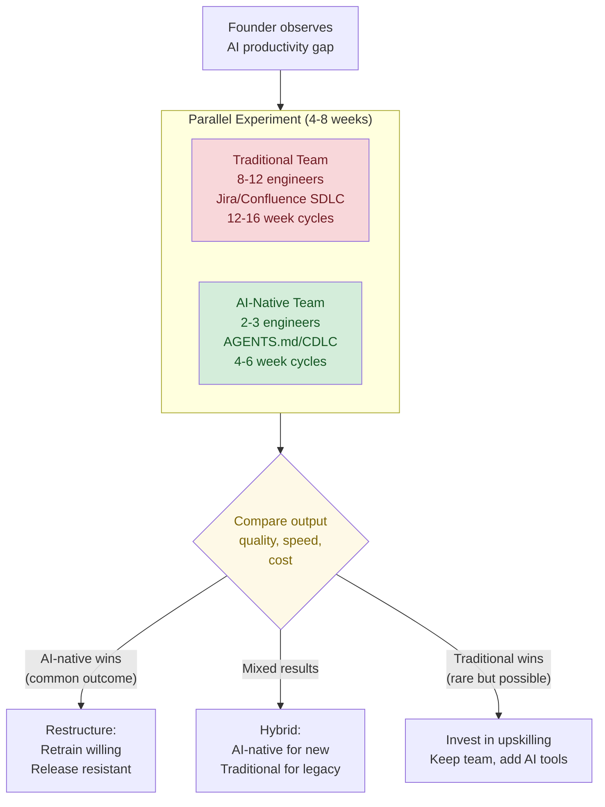
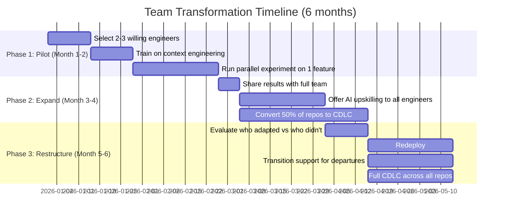

# Team Transformation Patterns: AI-Native vs Traditional Engineering

How founders and engineering leaders are restructuring teams around AI coding agents. Covers the parallel team hypothesis, documented case studies, risk assessment, and honest caveats.

## The Parallel Team Hypothesis

Some founders are running a deliberate experiment: build a small AI-native team in parallel with the existing engineering org, compare output, then make a restructuring decision.



**Why founders consider this**: A single AI-augmented engineer can match the output of 5 traditional engineers (VC estimates, 2026). Solo-founded startups now represent 36.3% of all new ventures (Scalable.news). Sequoia Capital has begun adjusting underwriting for "agentic leverage."

**The uncomfortable math**:

| Metric | Traditional Team (10 eng) | AI-Native Team (3 eng) |
|--------|--------------------------|----------------------|
| Monthly cost (loaded) | $150K-250K | $45K-75K + $2K-5K AI tools |
| Feature delivery cycle | 12-16 weeks | 4-6 weeks |
| Code output | ~10K LOC/month | ~50K-100K LOC/month |
| Review bottleneck | 2-4 PR revision rounds | 1-2 rounds |
| Context consistency | Variable (tribal knowledge) | High (AGENTS.md enforced) |
| Bus factor | High (specialized knowledge) | Medium (context is codified) |

## Documented Case Studies (2025-2026)

### Hard Cutover Pattern

**IgniteTech** — CEO fired ~80% of workforce for refusing AI adoption. Company had nine-figure revenue and ~75% EBITDA. Rebuilt with "AI Innovation Specialists" across all functions. Result: new customer-ready products built in as little as 4 days. Two years later, the CEO said he'd do it again.

**Block/Square** (Feb 2026) — Jack Dorsey cut 4,000 employees (40% of workforce, from 10,000+ to ~6,000), citing "intelligence tools we're creating and using, paired with smaller and flatter teams, are enabling a new way of working." Company posted strong fundamentals: $2.87B gross profit (up 24% YoY). Stock rose 18% on announcement. Dorsey predicted "the majority of companies will reach the same conclusion" within a year.

**Klarna** — Fired 700 employees for AI efficiency, then rehired some at lower wages. A cautionary tale of execution without a complete AI capability strategy.

### Selective Retention Pattern

**Coinbase** — CEO fired engineers who didn't try AI tools immediately. Retained and promoted engineers who demonstrated AI-native workflows. The message: AI adoption is not optional; it's a job requirement.

### AI-Native from Day One

**Midjourney**: $200M ARR with 10 employees
**Cursor (Anysphere)**: $100M ARR in 21 months with 20 employees
**ElevenLabs**: $100M ARR in 2 years with 50 employees
**BuiltWith**: $14M/year with a single employee

These aren't restructured traditional companies — they were built AI-native from inception, demonstrating what the end state looks like.

## The Shadow Team Experiment

For founders considering the parallel approach, here's a structured experiment framework:

### Setup (Week 0)

```
1. Select a meaningful feature (not trivial, not critical-path)
2. Assign to both teams simultaneously
3. Define identical success criteria:
   - Feature completeness
   - Test coverage
   - Code quality (linting, SAST)
   - Time to completion
   - Total cost (engineer time + tools)
```

### AI-Native Team Requirements

The AI-native team must use context-driven development:

```
# Minimum viable context engineering
1. AGENTS.md with project context + conventions
2. ln -s AGENTS.md CLAUDE.md
3. docs/specs/feature.md (spec before code)
4. docs/plans/feature.md (plan before execution)
5. .claude/rules/ with 2-3 coding standards
6. AI disclosure in PR template
```

### Traditional Team Requirements

The traditional team works with their current tooling and process — Jira tickets, Confluence specs, sprint ceremonies. No AI coding agents.

### What to Measure

| Metric | How | Why It Matters |
|--------|-----|---------------|
| Time to first working prototype | Git timestamps | Raw speed comparison |
| Total engineering hours | Time tracking | True cost comparison |
| PR revision rounds | GitHub analytics | Quality-on-first-attempt |
| Bug density (post-merge) | Issue tracking (30 days) | Delayed quality signal |
| Test coverage | CI reports | AI teams sometimes skip tests |
| Code maintainability | Cognitive complexity scores | AI code can be verbose |
| Developer satisfaction | Survey | Sustainability signal |

### Expected Outcomes

Based on industry data (March 2026):

- **Speed**: AI-native teams typically deliver 2-4x faster for greenfield features
- **Quality**: Mixed — AI code has comparable bug density but may have higher cognitive complexity
- **Cost**: AI-native teams cost 50-70% less (fewer engineers + tool costs)
- **Maintainability**: Depends heavily on context quality — well-structured AGENTS.md produces cleaner code

## Risk Assessment

### Risks of Restructuring Too Fast

| Risk | Severity | Mitigation |
|------|----------|-----------|
| **Loss of domain knowledge** | Critical | Codify knowledge in AGENTS.md + docs/ BEFORE restructuring |
| **AI tool dependency** | High | Dual-agent strategy (Claude Code + Codex), manual fallback plan |
| **Legal exposure** (regulated industries) | High | Maintain human review, audit trails, SM&CR accountability |
| **Morale collapse** | High | Transparent communication, retraining paths, voluntary transitions |
| **AI capability plateau** | Medium | Models improve, but don't bet on future capabilities for today's team decisions |
| **Rehiring costs** | Medium | Klarna case: fired then rehired at lower wages — reputational damage |

### Risks of NOT Restructuring

| Risk | Severity | Evidence |
|------|----------|---------|
| **Competitive disadvantage** | Critical | Competitors deliver in 4 weeks what takes you 16 |
| **Talent flight** | High | Best engineers leave for AI-native orgs |
| **Cost structure unsustainable** | High | Block: 40% cut, stock up 18% — market rewards efficiency |
| **Innovation velocity** | High | AI-native startups iterate 3-5x faster |

### The Middle Path: Gradual Transformation

For most organizations, especially regulated ones, the safest approach is **gradual transformation**, not hard cutover:



## Role Evolution (Not Elimination)

The AI-native team doesn't eliminate engineering roles — it transforms them:

| Traditional Role | AI-Native Role | Key Shift |
|-----------------|---------------|-----------|
| Junior developer | Agent operator | From writing code to directing agents |
| Senior developer | Context engineer | From coding to designing AGENTS.md + rules |
| Tech lead | Agent architect | From code review to context review + agent orchestration |
| Engineering manager | Capability manager | From sprint management to AI capability + upskilling |
| QA engineer | Verification engineer | From manual testing to automated gates + exploratory |
| DevOps | Platform engineer | Adding agent execution environments, MCP infrastructure |

**Harvard/P&G finding** (2024): Teams with AI produced 3x more top-10% quality ideas than teams without. AI doesn't replace thinking — it amplifies it when properly orchestrated.

## The "Junior Engineer Problem"

A critical concern: junior engineers using AI tools without deep understanding.

- Graduate hiring at top 15 US tech companies: **down 55%** since 2019
- UC computer science enrollment: **first decline since dot-com era** (6% drop in 2025)
- Anonymous junior engineer report: "I'm basically a proxy to Claude Code. I understand half the code I submit."

**Implication for AI-native teams**: You still need senior engineers who understand the code. AI amplifies expertise — it doesn't replace it. An AI-native team of 3 engineers should be 3 *senior* engineers, not 3 juniors with AI tools.

## For Regulated Organizations (FCA/EMI)

The parallel team approach carries additional considerations in regulated environments:

1. **SM&CR accountability**: The named Senior Manager must understand and approve any team restructuring that affects software delivery capability
2. **Operational resilience** (PS21/3): You must demonstrate that AI-native teams can maintain Important Business Services; scenario test for AI tool outages
3. **Knowledge continuity**: Domain knowledge about payment systems, compliance rules, and customer data handling must be codified BEFORE any team member leaves
4. **Human review requirement**: Regardless of team size, every AI-generated code change requires human review before merge — this doesn't change with restructuring
5. **Vendor risk**: Reducing team size increases dependency on AI tool providers — ensure dual-agent strategy and manual fallback capability

**Recommended approach for regulated firms**: The gradual transformation (6-month) path, not hard cutover. Codify knowledge into AGENTS.md first, prove CDLC works, then restructure with regulatory confidence.

## Honest Caveats

**What the hype misses:**
- AI code output volume ≠ business value. 100K LOC of agent-generated code may have less value than 5K LOC of expertly designed architecture
- Most "10x productivity" claims are for greenfield features. Legacy system maintenance, debugging production incidents, and cross-team coordination still require human judgment
- Industries resistant to lean models: biotech, pharma, hardware, cybersecurity, heavily regulated fintech — all require substantial specialized teams regardless of AI
- 72% of startup founders experience mental health issues (Startup Snapshot). The "3-person team + 50 AI agents" model can be isolating and unsustainable
- Oxford Economics: many "AI-driven layoffs" actually resulted from COVID-era overhiring, not genuine AI displacement
- Dario Amodei (Anthropic CEO) warned AI could eliminate half of entry-level white-collar jobs within 1-5 years — but this is a prediction, not current reality

**What the data supports:**
- AI-augmented teams consistently deliver faster for well-defined, greenfield features
- Context engineering (AGENTS.md, CDLC, structured plans) is the key differentiator — not just "using AI tools"
- The gap between AI-native and traditional teams is widening, not closing
- Founders who invest in context infrastructure before restructuring get better outcomes
- Human expertise remains essential for architecture, system design, security, and regulatory compliance

## Related References

- **paradigm-comparison.md** — Traditional vs context-driven workflow
- **context-development-lifecycle.md** — CDLC framework that enables smaller teams
- **maturity-model.md** — Assess readiness before restructuring
- **regulated-environment-patterns.md** — Additional constraints for FCA-regulated firms
- **fast-track-guide.md** — Getting the AI-native team productive quickly
