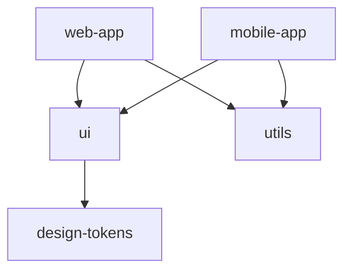

# Monorepo Patterns and Best Practices

Comprehensive guide to managing monorepos with workspaces, build optimization, and dependency management.

## Table of Contents

- [What is a Monorepo?](#what-is-a-monorepo)
- [Workspace Tools](#workspace-tools)
- [Monorepo Structure](#monorepo-structure)
- [Dependency Management](#dependency-management)
- [Build Optimization](#build-optimization)
- [Common Patterns](#common-patterns)
- [Migration Strategies](#migration-strategies)
- [Best Practices](#best-practices)

---

## What is a Monorepo?

A **monorepo** (monolithic repository) is a single repository containing multiple related projects or packages.

### Monorepo vs Polyrepo

| Aspect | Monorepo | Polyrepo |
|--------|----------|----------|
| **Code location** | Single repository | Multiple repositories |
| **Dependencies** | Shared, linked locally | Published to registry |
| **Versioning** | Coordinated or independent | Independent |
| **Tooling** | Workspace-aware tools | Standard tools |
| **CI/CD** | Single pipeline, affected packages | Per-repository pipelines |

### When to Use a Monorepo

[OK] **Good fit:**
- Multiple packages with shared code
- Coordinated releases across packages
- Internal tools and applications
- Frontend + backend in same project
- Design system + applications using it

[FAIL] **Not recommended:**
- Completely independent projects
- Different tech stacks with no overlap
- External/public libraries (better as separate repos)

---

## Workspace Tools

### pnpm (Recommended)

**Why pnpm:**
- 3x faster than npm/yarn
- Uses 1/3 disk space (hard links)
- Strict dependency isolation
- Best monorepo support

**Installation:**
```bash
npm install -g pnpm
```

**Configuration (`pnpm-workspace.yaml`):**
```yaml
packages:
  - 'packages/*'
  - 'apps/*'
```

**Commands:**
```bash
# Install all dependencies
pnpm install

# Add dependency to specific package
pnpm add lodash --filter @myorg/ui

# Run script in all packages
pnpm -r build

# Run script in specific package
pnpm --filter @myorg/api-client test

# Run script in packages matching pattern
pnpm --filter "./packages/*" build

# Update dependencies
pnpm update -r
```

### npm Workspaces

**Configuration (`package.json`):**
```json
{
  "name": "my-monorepo",
  "workspaces": [
    "packages/*",
    "apps/*"
  ]
}
```

**Commands:**
```bash
# Install all dependencies
npm install

# Add dependency to specific workspace
npm install lodash --workspace=@myorg/ui

# Run script in all workspaces
npm run build --workspaces

# Run script in specific workspace
npm run test --workspace=@myorg/api-client
```

### Yarn Workspaces

**Configuration (`package.json`):**
```json
{
  "private": true,
  "workspaces": {
    "packages": [
      "packages/*",
      "apps/*"
    ]
  }
}
```

**Commands:**
```bash
# Install all dependencies
yarn install

# Add dependency to specific workspace
yarn workspace @myorg/ui add lodash

# Run script in all workspaces
yarn workspaces run build

# Run script in specific workspace
yarn workspace @myorg/api-client test
```

---

## Monorepo Structure

### Recommended Directory Structure

```
my-monorepo/
├── package.json                 # Root package.json
├── pnpm-workspace.yaml          # Workspace configuration
├── turbo.json                   # Turborepo configuration (optional)
├── .github/
│   └── workflows/
│       └── ci.yml               # CI/CD pipeline
├── packages/                    # Shared libraries
│   ├── ui/
│   │   ├── package.json
│   │   ├── src/
│   │   └── tsconfig.json
│   ├── utils/
│   │   ├── package.json
│   │   └── src/
│   └── api-client/
│       ├── package.json
│       └── src/
├── apps/                        # Applications
│   ├── web/                     # Next.js app
│   │   ├── package.json
│   │   ├── next.config.js
│   │   └── src/
│   └── docs/                    # Documentation site
│       ├── package.json
│       └── src/
├── tools/                       # Build tools and scripts
│   └── eslint-config/
│       └── package.json
└── docs/                        # Documentation
    └── README.md
```

### Package Naming Convention

Use **scoped packages** for organization:

```json
{
  "name": "@myorg/ui",
  "name": "@myorg/utils",
  "name": "@myorg/api-client",
  "name": "@myorg/web-app"
}
```

---

## Dependency Management

### Hoisting Dependencies

Workspace tools **hoist** shared dependencies to the root `node_modules`:

```
my-monorepo/
├── node_modules/
│   ├── react          <- Shared, hoisted to root
│   ├── lodash         <- Shared, hoisted to root
│   └── @myorg/
│       ├── ui         <- Symlink to packages/ui
│       └── utils      <- Symlink to packages/utils
├── packages/
│   ├── ui/
│   │   └── node_modules/
│   │       └── clsx   <- Package-specific, not hoisted
│   └── utils/
│       └── package.json
```

### Internal Package Dependencies

**packages/web-app/package.json:**
```json
{
  "name": "@myorg/web-app",
  "dependencies": {
    "@myorg/ui": "workspace:*",
    "@myorg/utils": "workspace:^1.0.0",
    "react": "^18.2.0"
  }
}
```

**Workspace protocol versions:**
- `workspace:*` - Always use workspace version
- `workspace:^1.0.0` - Use workspace version if it satisfies constraint
- `workspace:~1.0.0` - Stricter constraint

### Root vs Package Dependencies

**Root `package.json` (shared devDependencies):**
```json
{
  "name": "my-monorepo",
  "private": true,
  "devDependencies": {
    "typescript": "^5.0.0",
    "eslint": "^8.0.0",
    "prettier": "^3.0.0",
    "turbo": "^1.10.0"
  }
}
```

**Package-specific `package.json`:**
```json
{
  "name": "@myorg/ui",
  "dependencies": {
    "react": "^18.2.0",
    "clsx": "^2.0.0"
  },
  "devDependencies": {
    "@types/react": "^18.2.0"
  }
}
```

**Rule of thumb:**
- **Root:** Tooling used by ALL packages (ESLint, TypeScript, Prettier)
- **Packages:** Dependencies specific to that package

### Version Synchronization

**Option 1: Synchronized versions (coordinated release)**
```json
// All packages use same version
{
  "name": "@myorg/ui",
  "version": "1.5.0"
}
{
  "name": "@myorg/utils",
  "version": "1.5.0"
}
```

**Tools:** Lerna, Changesets

**Option 2: Independent versions**
```json
{
  "name": "@myorg/ui",
  "version": "2.3.1"
}
{
  "name": "@myorg/utils",
  "version": "1.8.0"
}
```

**Recommendation:** Use synchronized versions for tightly coupled packages, independent for loosely coupled.

---

## Build Optimization

### Turborepo (Recommended)

**Why Turborepo:**
- Incremental builds (only rebuild what changed)
- Remote caching (share builds across CI and developers)
- Task scheduling and parallelization
- Excellent DX

**Installation:**
```bash
pnpm add -D turbo
```

**Configuration (`turbo.json`):**
```json
{
  "$schema": "https://turbo.build/schema.json",
  "pipeline": {
    "build": {
      "dependsOn": ["^build"],
      "outputs": ["dist/**", ".next/**"]
    },
    "test": {
      "dependsOn": ["build"],
      "outputs": []
    },
    "lint": {
      "outputs": []
    },
    "dev": {
      "cache": false,
      "persistent": true
    }
  }
}
```

**Commands:**
```bash
# Build all packages (with caching)
turbo run build

# Build specific package
turbo run build --filter=@myorg/ui

# Build with remote caching
turbo run build --token=<your-token>
```

### Nx (Alternative)

**Why Nx:**
- Computation caching
- Dependency graph visualization
- Affected command (only build what changed)
- Plugin ecosystem

**Installation:**
```bash
npx create-nx-workspace@latest
```

**Commands:**
```bash
# Build all projects
nx run-many --target=build --all

# Build only affected projects
nx affected:build

# Visualize dependency graph
nx graph
```

---

## Common Patterns

### Pattern 1: Shared TypeScript Configuration

**Root `tsconfig.json`:**
```json
{
  "compilerOptions": {
    "target": "ES2020",
    "module": "ESNext",
    "lib": ["ES2020", "DOM"],
    "jsx": "react-jsx",
    "strict": true,
    "esModuleInterop": true,
    "skipLibCheck": true,
    "forceConsistentCasingInFileNames": true
  }
}
```

**packages/ui/tsconfig.json:**
```json
{
  "extends": "../../tsconfig.json",
  "compilerOptions": {
    "outDir": "dist",
    "rootDir": "src"
  },
  "include": ["src"],
  "exclude": ["node_modules", "dist"]
}
```

### Pattern 2: Shared ESLint Configuration

**packages/eslint-config/package.json:**
```json
{
  "name": "@myorg/eslint-config",
  "main": "index.js",
  "dependencies": {
    "eslint": "^8.0.0",
    "eslint-plugin-react": "^7.32.0"
  }
}
```

**packages/eslint-config/index.js:**
```javascript
module.exports = {
  extends: ['eslint:recommended', 'plugin:react/recommended'],
  rules: {
    'no-console': 'warn'
  }
};
```

**packages/ui/.eslintrc.js:**
```javascript
module.exports = {
  extends: ['@myorg/eslint-config']
};
```

### Pattern 3: Shared Build Scripts

**Root `package.json`:**
```json
{
  "scripts": {
    "build": "turbo run build",
    "test": "turbo run test",
    "lint": "turbo run lint",
    "dev": "turbo run dev --parallel",
    "clean": "turbo run clean && rm -rf node_modules",
    "format": "prettier --write \"**/*.{js,jsx,ts,tsx,json,md}\""
  }
}
```

### Pattern 4: Cross-Package Imports

**packages/web-app/src/App.tsx:**
```typescript
import { Button } from '@myorg/ui';
import { formatDate } from '@myorg/utils';

export function App() {
  return (
    <Button onClick={() => console.log(formatDate(new Date()))}>
      Click me
    </Button>
  );
}
```

No build step needed - imports work directly via workspace symlinks!

---

## Migration Strategies

### Migrating from Polyrepo to Monorepo

**Step 1: Create monorepo structure**
```bash
mkdir my-monorepo
cd my-monorepo
npm init -y
```

**Step 2: Add workspace configuration**
```json
{
  "name": "my-monorepo",
  "private": true,
  "workspaces": ["packages/*", "apps/*"]
}
```

**Step 3: Move repositories**
```bash
mkdir -p packages apps
git clone https://github.com/myorg/ui.git packages/ui
git clone https://github.com/myorg/web-app.git apps/web-app
```

**Step 4: Update package names**
```json
// packages/ui/package.json
{
  "name": "@myorg/ui",  // Add scope
  "version": "1.0.0"
}
```

**Step 5: Replace published dependencies with workspace dependencies**
```json
// Before (apps/web-app/package.json)
{
  "dependencies": {
    "ui": "^1.0.0"  // Published to npm
  }
}

// After
{
  "dependencies": {
    "@myorg/ui": "workspace:*"  // Local workspace
  }
}
```

**Step 6: Install and test**
```bash
pnpm install
pnpm run build
pnpm run test
```

---

## Best Practices

### 1. Use pnpm for Performance

```bash
# 3x faster installs, 1/3 disk usage
pnpm install
```

### 2. Enable Turborepo/Nx for Caching

```bash
# Only rebuild what changed
turbo run build
```

### 3. Use Workspace Protocol

```json
{
  "dependencies": {
    "@myorg/ui": "workspace:*"  // NOT "workspace:../packages/ui"
  }
}
```

### 4. Hoist Shared Dependencies

Let the package manager hoist dependencies automatically:

```bash
# pnpm hoists automatically
pnpm install

# Yarn requires configuration
# .yarnrc.yml
nmHoistingLimits: workspaces
```

### 5. Use Path Aliases for Imports

**tsconfig.json:**
```json
{
  "compilerOptions": {
    "paths": {
      "@myorg/*": ["./packages/*/src"]
    }
  }
}
```

### 6. Consistent Tooling Across Packages

- Same TypeScript version
- Same ESLint rules
- Same Prettier configuration
- Same Node.js version

### 7. CI/CD: Build Only Affected Packages

**GitHub Actions with Turborepo:**
```yaml
name: CI

on: [push, pull_request]

jobs:
  build:
    runs-on: ubuntu-latest
    steps:
      - uses: actions/checkout@v3
      - uses: pnpm/action-setup@v2
      - run: pnpm install
      - run: pnpm turbo run build test lint
```

**With remote caching:**
```yaml
- run: pnpm turbo run build --token=${{ secrets.TURBO_TOKEN }}
```

### 8. Use Changesets for Versioning

**Installation:**
```bash
pnpm add -D @changesets/cli
pnpm changeset init
```

**Workflow:**
```bash
# Create changeset
pnpm changeset

# Version packages
pnpm changeset version

# Publish
pnpm changeset publish
```

### 9. Separate Public and Private Packages

```json
// Public package (published to npm)
{
  "name": "@myorg/ui",
  "private": false,
  "publishConfig": {
    "access": "public"
  }
}

// Private package (internal only)
{
  "name": "@myorg/web-app",
  "private": true
}
```

### 10. Document Dependencies Between Packages

Create a dependency graph diagram in your README:



---

## Troubleshooting

### Issue: "Cannot find module '@myorg/ui'"

**Cause:** Workspace symlinks not created

**Fix:**
```bash
# Reinstall dependencies
rm -rf node_modules packages/*/node_modules
pnpm install
```

### Issue: TypeScript can't find workspace packages

**Cause:** Missing `paths` configuration

**Fix (tsconfig.json):**
```json
{
  "compilerOptions": {
    "baseUrl": ".",
    "paths": {
      "@myorg/*": ["./packages/*/src"]
    }
  }
}
```

### Issue: Circular dependencies

**Cause:** Package A depends on Package B, and Package B depends on Package A

**Fix:** Refactor to extract shared code into a third package:

```
Before:
  ui --> utils
  utils --> ui

After:
  ui --> shared
  utils --> shared
```

### Issue: Slow builds

**Cause:** Rebuilding everything on every change

**Fix:** Use Turborepo or Nx for incremental builds:

```bash
turbo run build  # Only rebuilds changed packages
```

---

## Resources

- [pnpm Workspaces](https://pnpm.io/workspaces)
- [npm Workspaces](https://docs.npmjs.com/cli/v10/using-npm/workspaces)
- [Yarn Workspaces](https://classic.yarnpkg.com/en/docs/workspaces/)
- [Turborepo Documentation](https://turbo.build/repo/docs)
- [Nx Documentation](https://nx.dev/)
- [Changesets](https://github.com/changesets/changesets)
- [Monorepo.tools](https://monorepo.tools/)
