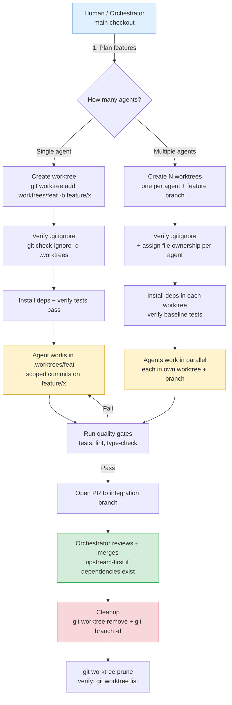
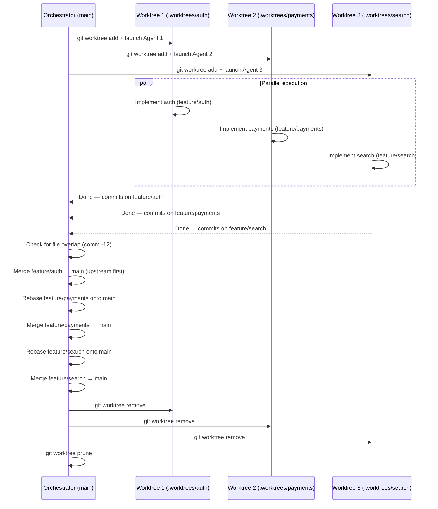

# AI Agent Worktrees — Isolated Workspaces for Coding Agents

Git worktrees enable AI coding agents (Claude Code, Codex, Copilot Workspace, Aider, etc.) to work in isolated directories while sharing the same repository. Each agent gets its own checkout, its own branch, and its own working tree — no `git stash` juggling, no accidental cross-contamination.

## Typical Flow



### Parallel Multi-Agent Detail



## Contents

- When to Use Worktrees with AI Agents
- Directory Conventions
- Setup: One Worktree per Agent
- Agent-Specific Patterns
- Parallel Agent Execution
- Safety and Conflict Prevention
- Cleanup Lifecycle
- Decision Table
- Anti-Patterns
- Quick Command Reference

---

## When to Use Worktrees with AI Agents

| Scenario | Worktree? | Why |
|----------|-----------|-----|
| Single agent, single feature | Optional | Branch checkout is fine |
| Single agent, context isolation needed | Yes | Keeps main checkout clean for human work |
| Multiple agents working in parallel | **Required** | Prevents file conflicts between agents |
| Agent + human working simultaneously | **Recommended** | Human keeps main checkout; agent works in worktree |
| CI/CD bot building while you develop | Yes | Avoids lock contention on `.git/index` |
| Codex (cloud sandbox) | No | Codex creates its own sandbox per task |

**Rule of thumb:** If more than one actor (human or agent) touches the repo simultaneously, use worktrees.

---

## Directory Conventions

Three common placement strategies, in priority order:

### 1. Project-local hidden directory (preferred)

```
myproject/
  .worktrees/
    feature-auth/       # worktree for auth feature
    fix-payment-bug/    # worktree for payment fix
  src/                  # main checkout
  .gitignore            # must contain .worktrees/
```

**Advantages:** Visible to the project, easy to discover, co-located.

### 2. Project-local visible directory

```
myproject/
  worktrees/
    feature-auth/
  .gitignore            # must contain worktrees/
```

### 3. Global directory (outside project)

```
~/.local/share/worktrees/myproject/
  feature-auth/
  fix-payment-bug/
```

**Advantages:** No `.gitignore` management needed. Useful for repos where you cannot modify `.gitignore`.

### Priority resolution

1. If `.worktrees/` or `worktrees/` exists in the project, use it.
2. If `CLAUDE.md` or `AGENTS.md` specifies a worktree directory, use that.
3. Otherwise, create `.worktrees/` and add it to `.gitignore`.

---

## Setup: One Worktree per Agent

### Step 1: Verify `.gitignore` (project-local only)

```bash
# Check if worktree directory is ignored
git check-ignore -q .worktrees 2>/dev/null
echo $?  # 0 = ignored (good), 1 = not ignored (fix it)
```

If not ignored, add it:

```bash
echo ".worktrees/" >> .gitignore
git add .gitignore && git commit -m "chore: ignore worktree directory"
```

### Step 2: Create worktree with feature branch

```bash
# From main checkout
git worktree add .worktrees/feature-auth -b feature/auth

# Or from an existing remote branch
git worktree add .worktrees/feature-auth origin/feature/auth
```

### Step 3: Install dependencies (auto-detect)

```bash
cd .worktrees/feature-auth

# Node.js
[ -f package.json ] && npm install

# Python
[ -f requirements.txt ] && pip install -r requirements.txt
[ -f pyproject.toml ] && poetry install || pip install -e .

# Rust
[ -f Cargo.toml ] && cargo build

# Go
[ -f go.mod ] && go mod download
```

### Step 4: Verify clean baseline

```bash
# Run project tests to confirm worktree starts clean
npm test          # or pytest, cargo test, go test ./...
```

If tests fail before any changes, the worktree has a pre-existing issue — report it before proceeding.

---

## Agent-Specific Patterns

### Claude Code

Claude Code has native worktree support via the `EnterWorktree` tool.

**Interactive session (single agent):**
```
# Claude Code creates and enters a worktree automatically
# via the EnterWorktree tool during brainstorming/execution skills
```

**Headless / multi-agent via CLI:**
```bash
# Launch agent 1 in its own worktree
cd .worktrees/feature-auth
claude --print "Implement OAuth2 login flow in src/auth/"

# Launch agent 2 in a separate worktree (parallel terminal)
cd .worktrees/feature-payments
claude --print "Add Stripe webhook handler in src/payments/"
```

**Subagent delegation (Task tool):**
The orchestrator agent stays in the main checkout. Each subagent receives a worktree path in its handoff:

```text
Goal: Implement auth middleware
Constraints: Only modify files under src/auth/
Worktree: .worktrees/feature-auth (already created, deps installed)
Do-not-touch: src/payments/, src/core/
Output: working tests, conventional commits on feature/auth branch
```

### OpenAI Codex

Codex runs in cloud sandboxes — each task already gets an isolated environment. Worktrees are not needed for Codex's own execution. However, when *you* review Codex output locally:

```bash
# Create a worktree to review/test Codex's branch locally
git fetch origin
git worktree add .worktrees/codex-feature origin/codex/feature-name
cd .worktrees/codex-feature
npm test
```

### Aider / Other Terminal Agents

```bash
# Create worktree, then point the agent at it
git worktree add .worktrees/feature-search -b feature/search
cd .worktrees/feature-search
aider --file src/search/index.ts src/search/engine.ts
```

### GitHub Copilot Workspace

Copilot Workspace operates in its own cloud environment (similar to Codex). Use worktrees for local review of its output branches.

---

## Parallel Agent Execution

Running multiple AI agents simultaneously is the primary use case for worktrees.

### Architecture

```text
myproject/                          # Human works here (main branch)
  .worktrees/
    feature-auth/                   # Agent 1: auth feature
    feature-payments/               # Agent 2: payments feature
    fix-search-perf/                # Agent 3: search performance fix
```

### Rules for parallel agents

1. **One worktree per agent.** Never share a worktree between agents.
2. **One branch per worktree.** Git enforces this — you cannot check out the same branch in two worktrees.
3. **Disjoint file ownership.** Each agent should own a bounded set of files. If agents need to touch the same file, serialize them (wave dispatch pattern).
4. **Orchestrator stays in main.** The coordinating agent/human uses the main checkout to review, merge, and verify.

### Launching parallel agents (shell example)

```bash
# Create worktrees
git worktree add .worktrees/feat-auth -b feature/auth
git worktree add .worktrees/feat-payments -b feature/payments

# Launch agents in parallel (background processes)
(cd .worktrees/feat-auth && claude --print "Implement OAuth2 flow") &
(cd .worktrees/feat-payments && claude --print "Add Stripe webhooks") &
wait

# Orchestrator reviews from main checkout
git log --oneline feature/auth feature/payments
```

### Merge strategy after parallel work

1. Merge the **upstream dependency** branch first (e.g., `feature/auth` before `feature/payments` if payments depends on auth).
2. Rebase the downstream branch onto the updated integration branch.
3. Run full test suite after each merge.
4. If conflicts arise, the orchestrator resolves them — not the subagents.

---

## Safety and Conflict Prevention

### `.gitignore` discipline

**Always verify before creating project-local worktrees:**

```bash
git check-ignore -q .worktrees || {
  echo ".worktrees/" >> .gitignore
  git add .gitignore
  git commit -m "chore: ignore worktree directory"
}
```

**Why critical:** Without this, `git status` will show the entire worktree contents as untracked files, and `git add .` will stage them into your commit.

### Lock file contention

Multiple worktrees share the same `.git` directory (via `.git/worktrees/`). Most Git operations are safe in parallel, but some can contend:

| Operation | Safe in parallel? | Notes |
|-----------|-------------------|-------|
| `git add` / `git commit` | Yes | Each worktree has its own index |
| `git fetch` | Yes | Updates shared refs safely |
| `git gc` / `git prune` | **No** | Run only when no agent is active |
| `git worktree add/remove` | **No** | Serialize worktree management |

### Preventing cross-agent file conflicts

- Define `Owned files` and `Do-not-touch files` in every agent handoff.
- If two agents must modify the same file, use wave dispatch: finish agent 1, then start agent 2.
- After parallel execution, check for conflicts before merging:

```bash
# Check if branches touch the same files
git diff --name-only main..feature/auth > /tmp/auth-files.txt
git diff --name-only main..feature/payments > /tmp/payments-files.txt
comm -12 <(sort /tmp/auth-files.txt) <(sort /tmp/payments-files.txt)
# If output is non-empty, review those files for conflicts
```

### Stale worktree detection

```bash
# List all worktrees and their branch status
git worktree list

# Find worktrees with branches already merged to main
for wt in $(git worktree list --porcelain | grep "^worktree " | cut -d' ' -f2); do
  branch=$(git -C "$wt" branch --show-current 2>/dev/null)
  if [ -n "$branch" ] && git branch --merged main | grep -q "$branch"; then
    echo "STALE: $wt ($branch is merged)"
  fi
done
```

---

## Cleanup Lifecycle

After a feature branch is merged, clean up its worktree promptly.

### Standard cleanup

```bash
# 1. Remove the worktree
git worktree remove .worktrees/feature-auth

# 2. Delete the branch (if merged)
git branch -d feature/auth

# 3. Prune worktree metadata (if worktree was deleted manually)
git worktree prune
```

### Batch cleanup script

```bash
#!/usr/bin/env bash
# Clean up all worktrees whose branches are merged to main
set -euo pipefail

git worktree list --porcelain | grep "^worktree " | cut -d' ' -f2 | while read -r wt; do
  [ "$wt" = "$(git rev-parse --show-toplevel)" ] && continue  # skip main
  branch=$(git -C "$wt" branch --show-current 2>/dev/null || true)
  if [ -n "$branch" ] && git branch --merged main | grep -qw "$branch"; then
    echo "Removing: $wt ($branch)"
    git worktree remove "$wt"
    git branch -d "$branch" 2>/dev/null || true
  fi
done

git worktree prune
```

### Post-merge checklist

- [ ] Worktree directory removed (`git worktree remove`)
- [ ] Feature branch deleted (`git branch -d`)
- [ ] No orphaned `node_modules` / `venv` / `target` left behind
- [ ] `git worktree list` shows only active worktrees

---

## Decision Table

| Question | Answer | Action |
|----------|--------|--------|
| How many agents run at once? | 1 | Worktree optional; branch checkout is fine |
| | 2+ | One worktree per agent (required) |
| Human working at same time? | Yes | Agent(s) in worktrees; human in main checkout |
| | No | Agent can use main checkout |
| Agent is cloud-based (Codex)? | Yes | No local worktree needed; agent has its own sandbox |
| | Reviewing locally | Create worktree to test agent's branch |
| Agents touch same files? | Yes | Serialize via wave dispatch; do not parallelize |
| | No | Safe to parallelize in separate worktrees |
| Project has CI that runs locally? | Yes | Worktrees prevent CI and agent from competing |

---

## Anti-Patterns

| Anti-Pattern | Problem | Fix |
|--------------|---------|-----|
| **Two agents in one worktree** | File conflicts, corrupted state | One worktree per agent, always |
| **Worktree not in `.gitignore`** | Worktree contents tracked by Git | `git check-ignore` before creating |
| **Running `git gc` during parallel work** | Can corrupt shared refs | Only run when all agents are idle |
| **No file ownership in handoff** | Agents overwrite each other's work | Define `Owned files` / `Do-not-touch` per agent |
| **Forgetting to install deps** | Agent hits import errors, wastes tokens | Auto-detect and run setup after worktree creation |
| **Leaving stale worktrees** | Disk bloat, confusing `git worktree list` | Clean up after branch merge |
| **Nesting worktrees inside worktrees** | Git confusion, broken refs | Always create worktrees from the main checkout |

---

## Quick Command Reference

```bash
# Create worktree with new branch
git worktree add .worktrees/my-feature -b feature/my-feature

# Create worktree from existing remote branch
git worktree add .worktrees/my-feature origin/feature/my-feature

# List all worktrees
git worktree list

# Remove a worktree
git worktree remove .worktrees/my-feature

# Prune stale worktree metadata
git worktree prune

# Check if directory is gitignored
git check-ignore -q .worktrees

# See which files two branches both changed
comm -12 <(git diff --name-only main..branch-a | sort) \
         <(git diff --name-only main..branch-b | sort)

# Move a worktree to a new location
git worktree move .worktrees/old-name .worktrees/new-name
```

---

## Related Resources

- [Git Workflow SKILL.md](../SKILL.md) — AI Agent Feature Loop, Local Safety Preflight
- [Branching Strategies](branching-strategies.md) — GitHub Flow, Trunk-Based, GitFlow
- [Agents & Subagents Skill](../../agents-subagents/SKILL.md) — Orchestration, handoffs, wave dispatch
- [Common Mistakes](common-mistakes.md) — Force push, lock files, history rewriting
