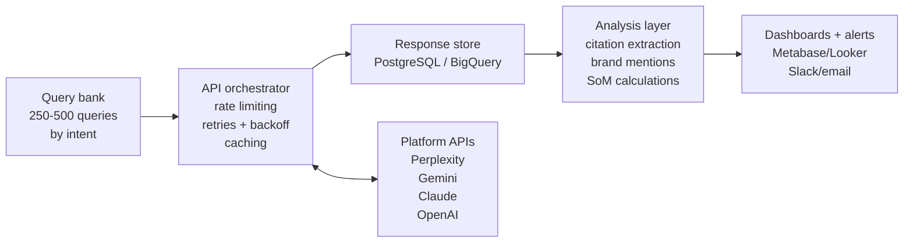
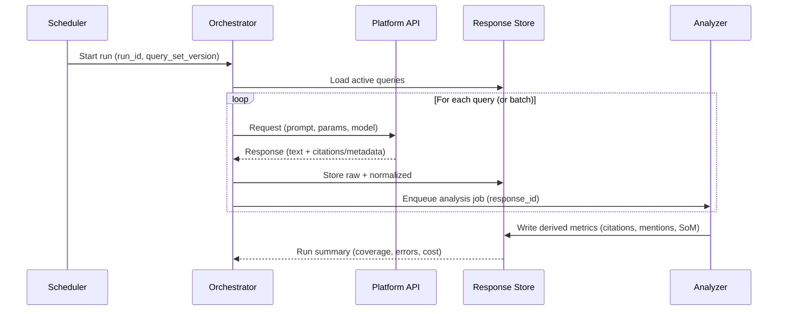
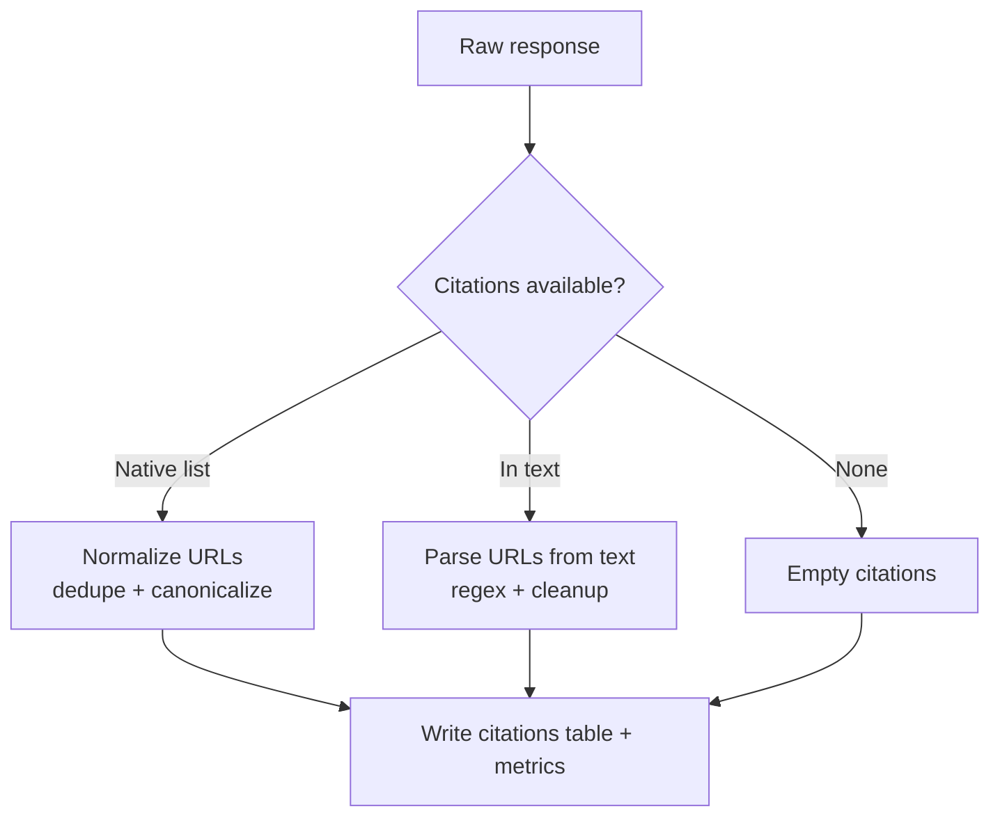
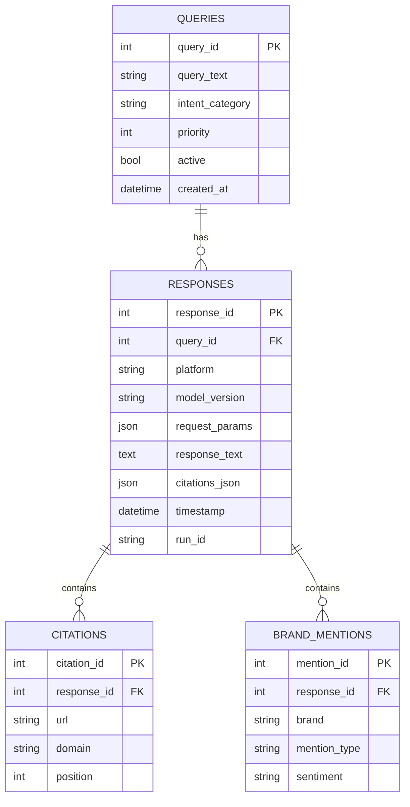
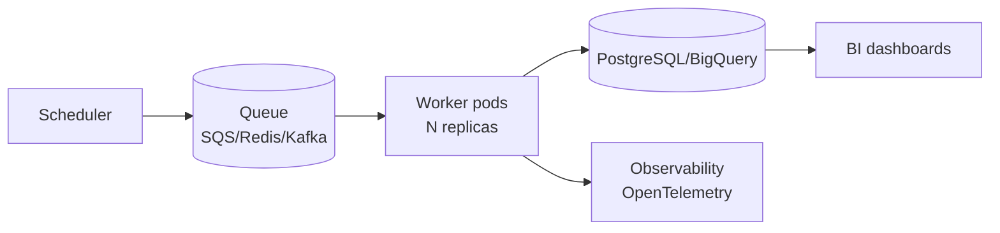

# Architecture Diagrams

System architecture patterns for AEO monitoring infrastructure.

Note: Diagrams use Mermaid. If Mermaid rendering is unavailable, treat them as conceptual flowcharts.

## Tier 1: API-First Architecture (Recommended)

### Overview



### Component Details

**Query Bank**

- 250-500 queries organized by intent (informational, commercial, transactional)
- Include brand, competitors, integrations, pricing, and "best/vs" queries
- Refresh quarterly; track additions/removals as a versioned dataset

**API Orchestrator**

- Central coordinator for all platform calls
- Per-platform rate limiting and budgets
- Retries with exponential backoff + jitter
- Caching (24-48 hour TTL) to control costs
- Store full request metadata (model, params, timestamp, prompt version)

**Response Store**

- PostgreSQL for most cases; BigQuery for high volume analytics
- Store raw response, normalized fields, and extracted artifacts (citations, entities)
- Partition by date and platform for fast queries

**Analysis Layer**

- Citation extraction (native where available; otherwise parse/normalize)
- Brand mention detection (exact match + alias map; optional NER/LLM)
- Competitive tracking (brand/citation share per query group)
- Share of Model (SoM) and trend calculations

## Tier 2: Hybrid Architecture (API + Vendor Coverage)

Use when one or more target surfaces are not accessible via official APIs and you have a compliant vendor.

### Overview

```mermaid
flowchart LR
  QB[Query bank] --> ORCH[Orchestrator]
  ORCH <--> APIS[Official APIs]
  ORCH <--> VENDOR[Vendor data source\n(commercial coverage)]
  ORCH --> STORE[Response store]
  STORE --> ANALYSIS[Analysis]
  ANALYSIS --> DASH[Dashboard/alerts]
```

### When to Use

- You need citations from surfaces that do not have an official API
- You have legal/compliance approval for a vendor contract
- You accept dependency risk (vendor changes, coverage changes, pricing changes)

## Data Flow Diagram

### Query Processing Flow



### Citation Extraction Flow



## Database Schema Diagram

### Entity Relationship



## Deployment Architecture

### Minimal (Serverless)

```mermaid
flowchart LR
  CRON[Scheduler\n(EventBridge/Cloud Scheduler)] --> FN[Serverless job\n(Lambda/Cloud Functions)]
  FN --> DB[(PostgreSQL/Supabase)]
  FN --> LOGS[Logs/metrics\n(CloudWatch/Stackdriver)]
```

### Standard (Container-Based)

```mermaid
flowchart LR
  CRON[Scheduler] --> JOB[Worker container\n(CronJob/Task)]
  JOB --> DB[(PostgreSQL)]
  JOB --> OBJ[(Object storage\nS3/GCS)]
  JOB --> OBS[Observability\nlogs + metrics]
```

### Enterprise (Kubernetes + Queue)



## Integration Patterns

### Webhook Notifications

```mermaid
flowchart LR
  ANALYSIS[SoM + anomaly detection] --> ALERT{Trigger?}
  ALERT -->|Yes| WEBHOOK[Webhook\n(Slack/Teams/email)]
  ALERT -->|No| NOOP[No action]
```

### CRM Integration

```mermaid
flowchart LR
  METRICS[SoM + citation share\nby query group] --> MAP[Map to account/category]
  MAP --> CRM[CRM/RevOps system]
  CRM --> PLAY[Playbook\n(opportunity notes, enablement)]
```

## Scaling Considerations

### Horizontal Scaling

```mermaid
flowchart LR
  Q[(Queue)] --> W[Workers\n(per-platform pools)]
  W --> DB[(Primary store)]
  W --> DLQ[(Dead letter queue)]
```

### Queue-Based Processing

```mermaid
flowchart LR
  SRC[Query source\n(versioned query set)] --> Q[(Queue)]
  Q --> WP[Worker pool]
  WP --> DB[(DB)]
  DB --> ANA[Analysis jobs]
  ANA --> DB
```
