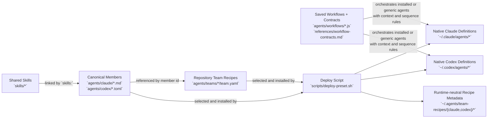
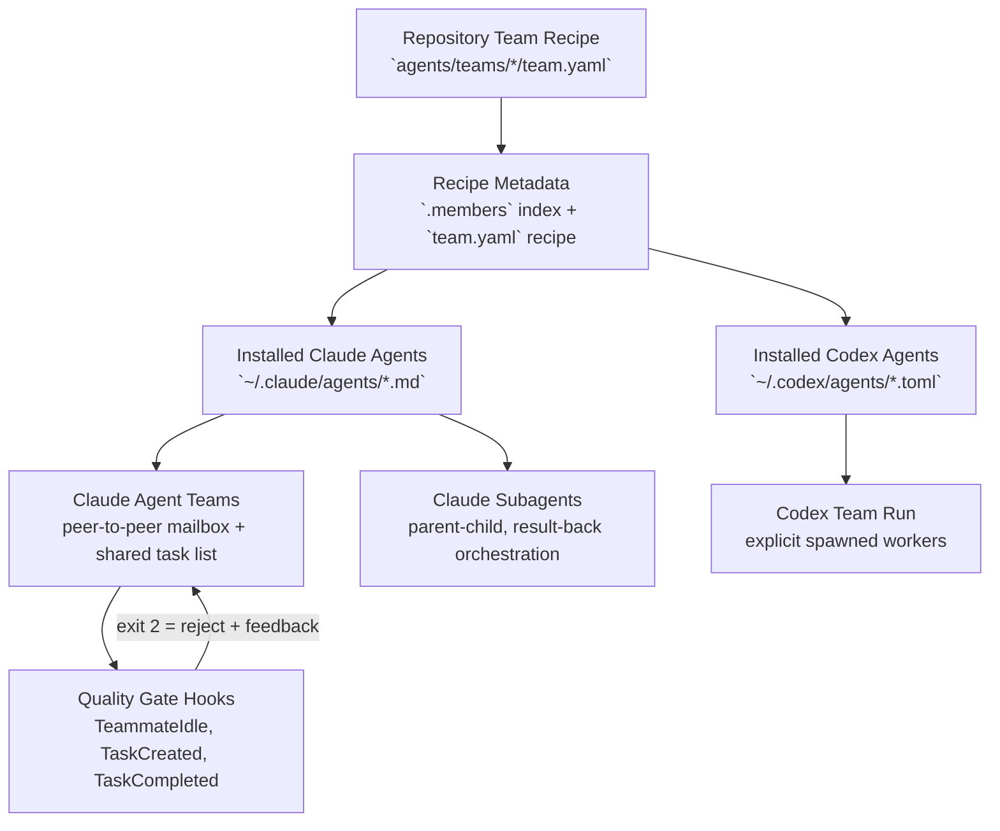

# Runtime Topology Diagram

## Table of Contents

- [Source To Runtime](#source-to-runtime)
- [Claude And Codex Execution](#claude-and-codex-execution)
- [Debate And Game Theory Layer](#debate-and-game-theory-layer)
- [Practical Interpretation](#practical-interpretation)
- [Verification Order](#verification-order)
- [Related References](#related-references)

This reference shows the actual source-to-runtime flow for shared skills, members, teams, and launchers.

Core rules:
- skills attach to canonical members
- teams compose canonical members
- saved workflows and workflow contracts choose the sequence and output contract
- native runtime registries store members; `.agents/team-recipes/` stores repository recipe metadata
- teams do not declare skills directly

## Source To Runtime

## Claude And Codex Execution

## Debate And Game Theory Layer

```mermaid
flowchart TB
    subgraph Debate["Debate System (10 methods + 7 masks)"]
        M1["Six Thinking Hats"]
        M2["Pre-Mortem"]
        M3["Devil's Advocate"]
        M4["Steel-Manning"]
        M5["Dialectical Inquiry"]
        M6["Scenario 2×2"]
        M7["Polarity Management"]
        M8["Courtroom / PROClaim"]
        M9["Delphi Method"]
        M10["Socratic Questioning"]
    end

    subgraph GameTheory["Game Theory Mechanisms (22)"]
        G1["ECON Belief Coordination"]
        G2["Adversarial Debate"]
        G3["Auction Task Routing"]
        G4["Shapley Contribution Scoring"]
        G5["Reputation-Gated Autonomy"]
        G6["Cooperation Enforcement (FAIRGAME)"]
        G7["Mechanism Design for Synthesis"]
        G8["Courtroom Progressive RAG"]
        G9["Pareto-Nash Multi-Objective"]
        G10["Evolutionary Coordination (offline)"]
        G11["Prediction Market Confidence"]
        G12["Negotiation Protocol ZOPA"]
        G13["Reasoning-Tree Audit"]
        G14["Per-Claim Credibility Scoring"]
        G15["Generative Social Choice"]
        G16["Meta-Debate Role Routing"]
        G17["Online Shapley Prompt Evolution"]
        G18["Beyond Majority Voting (BMV)"]
        G19["Radial Consensus Score (RCS)"]
        G20["Conformal Social Choice"]
        G21["Attested Delegation Contracts"]
        G22["Coalition Formation Routing"]
    end

    subgraph Overlays["Post-Synthesis Overlays (3)"]
        O1["MAR Reflexion"]
        O2["Purple Team"]
        O3["Prediction Market Validation"]
    end

    subgraph Masks["Decision Masks (7)"]
        K1["Inversion"]
        K2["First-Principles"]
        K3["Regret Minimization"]
        K4["Second-Order"]
        K5["Anchoring Reset"]
        K6["Base-Rate Reset"]
        K7["Constitutional"]
    end

    Teams["18 Team Recipes<br/>(15 debate-enabled)"] --> Debate
    Debate --> Overlays
    Debate --> Masks
    GameTheory --> Teams
```

## Practical Interpretation

- Claude and Codex use the same source catalog.
- The shared repo owns the logical model: `Skill -> Member -> Team`.
- The execution ladder is runtime-neutral: main thread -> built-in worker -> installed specialist -> repo-local/shared member -> saved workflow -> team -> debate. Team scenarios are a late escalation, not the entry point.
- The deploy script installs native member definitions into runtime folders and keeps recipes in the separate `.agents/team-recipes/` metadata area.
- Claude and Codex differ in orchestration style, not in the underlying catalog:
  - Claude can run Agent Teams with peer-to-peer mailbox and shared task list (experimental, v2.1.32+).
  - Claude subagents provide parent-child orchestration without inter-agent messaging.
  - Claude subagents may use `isolation: worktree`; Agent Team teammates share the lead checkout and require disjoint file ownership.
  - Codex runs the same composition as a parent-led subagent workflow; delegation may come from the user or applicable repository/skill policy.
- Agent Teams add three quality gate hooks (TeammateIdle, TaskCreated, TaskCompleted) that can enforce debate discipline.
- The debate system provides 10 methods (including courtroom/PROClaim, Delphi, and Socratic from 2026 research) and 7 decision masks (including the Constitutional self-critique mask from Anthropic 2022).
- The game theory layer provides 22 mechanisms, including 2025–26 patterns for courtroom P-RAG, Pareto-Nash, AlphaEvolve, prediction markets, negotiation, online Shapley-driven prompt evolution, Beyond Majority Voting, Radial Consensus Score, conformal social choice, attested delegation contracts, and coalition formation routing.
- 3 post-synthesis overlays (MAR Reflexion, Purple Team, Prediction Market Validation) provide quality gates after initial synthesis.
- Workflow contracts and scenario prompts are the operational layer. They do not define agents or teams; they define how to run the selected composition well.
- For startup work, the workflow sequence matters as much as the member composition. Use the startup playbook and startup-growth diagrams before launching multiple boards.

## Verification Order

When you want to confirm that skills are being used correctly:

1. Check the canonical member definition in `agents/`
2. Check the repository team recipe in `agents/teams/`
3. Check native agent artifacts in `~/.claude/` or `~/.codex/` and recipe metadata in `~/.agents/team-recipes/`
4. Check the launcher/playbook that decides review order

## Related References

- `SKILL.md`
- `references/team-selection-guide.md`
- `agents/README.md`
- `agents/teams/README.md`
- `references/workflow-contracts.md`
- `references/team-lifecycle.md`
- `references/team-coverage.md`
- `references/universal-team-playbook.md`
- `references/startup-growth-system-diagram.md`
