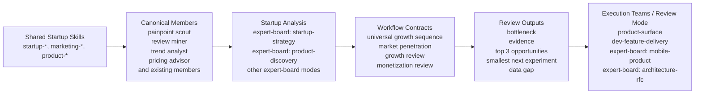
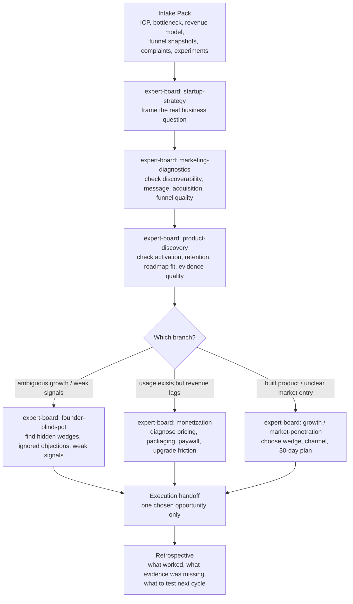

# Startup Growth System Diagram

This reference explains how the startup-growth workflow modes and retained delivery teams work together in practice.

## Table of Contents

- [System Overview](#system-overview)
- [Review Sequence](#review-sequence)
- [How It Works](#how-it-works)
- [What Each Layer Owns](#what-each-layer-owns)
- [Branch Selection Rule](#branch-selection-rule)

## System Overview

## Review Sequence

## How It Works

The system is designed to avoid the common failure mode of launching too many smart teams at once and getting broad but low-signal advice.

The sequence is intentionally narrow:

1. `expert-board` in `startup-strategy` mode defines the business question and the 30-day success metric.
2. `expert-board` in `marketing-diagnostics` mode checks whether demand capture or message quality is the issue.
3. `expert-board` in `product-discovery` mode checks whether the real problem is activation, retention, or weak product evidence.
4. Only after those three do you branch to one specialist board:
   - `expert-board` in `founder-blindspot` mode for hidden wedges, timing signals, and things the founder may be normalizing away
   - `expert-board` in `monetization` mode for pricing, packaging, paywall, and conversion diagnosis
   - `expert-board` in `growth` / `market-penetration` mode for choosing the first serious market, primary channel, activation-quality metric, and 30-day plan
5. The result is handed to one execution team, not all of them.

## What Each Layer Owns

- Skills own reusable domain knowledge.
- Canonical members own a working lens and output style.
- Saved workflow modes own multi-perspective analysis and debate rules.
- Workflow contracts own sequence, intake discipline, and output shape.
- Execution teams own shipping the chosen opportunity.

## Branch Selection Rule

Choose `expert-board` with `founder-blindspot` when:

- signals are contradictory
- growth feels noisy or ambiguous
- a hidden segment, wedge, or objection may exist
- the founder suspects something important is being missed

Choose `expert-board` with `monetization` when:

- signups or usage exist
- paid conversion lags
- upgrades are weak
- value communication, packaging, or paywall timing are likely broken

Choose `expert-board` with `growth` / `market-penetration` and the [market-penetration workflow contract](workflow-contracts.md#market-penetration-review) when:

- the product or app is already built
- the first serious market wedge is unclear
- channel focus is unclear
- the founder needs a 30-day plan that produces activated users, not generic traffic

## Output Contract

Every stage should return the same shape:

- bottleneck
- evidence
- top 3 opportunities
- smallest next experiment
- expected impact
- confidence
- data gap
- recommended execution team

## Related References

- `references/team-selection-guide.md`
- `references/universal-team-playbook.md`
- `references/runtime-topology-diagram.md`
- [`references/workflow-contracts.md`](workflow-contracts.md), especially the universal growth, startup growth, market penetration, and monetization sections
