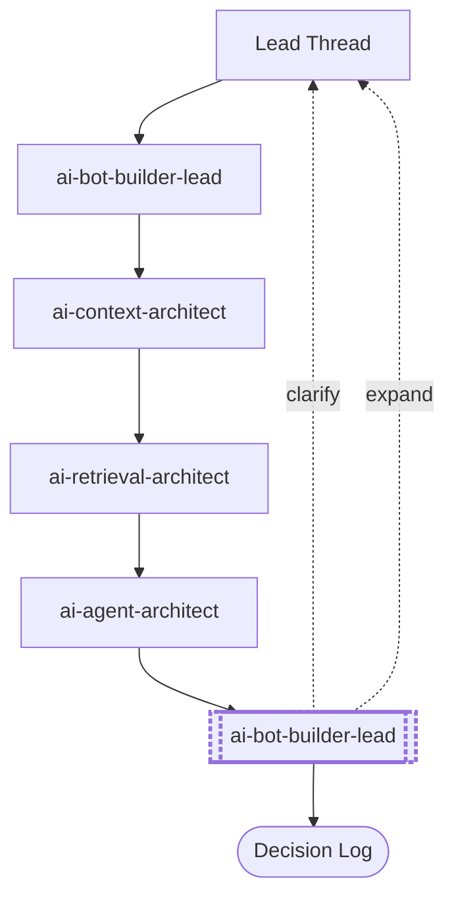
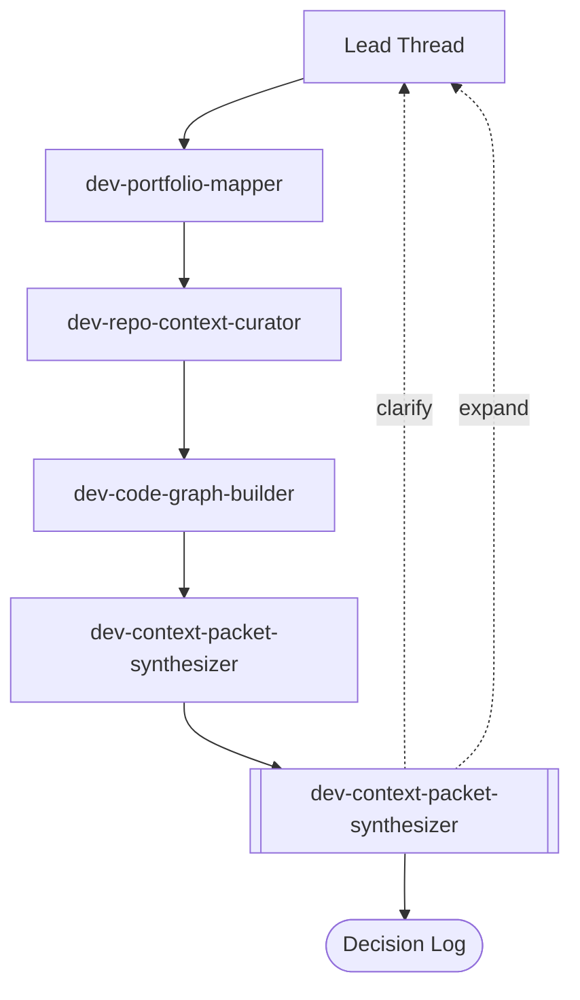
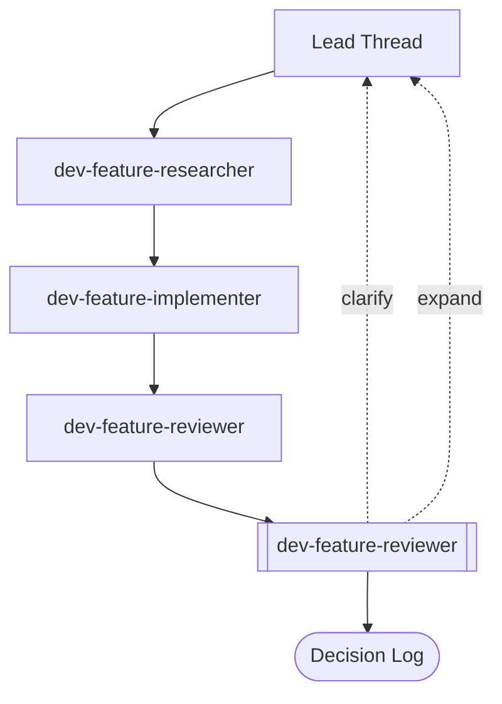
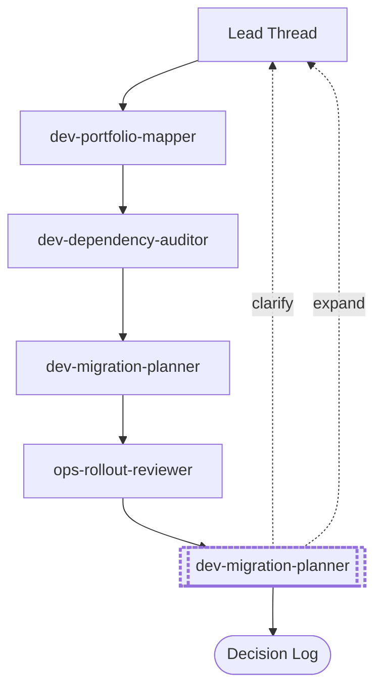
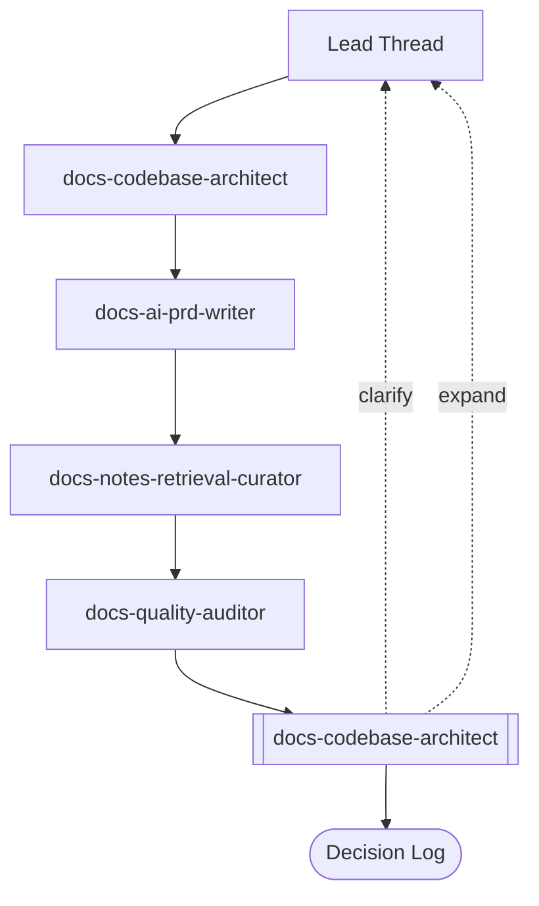
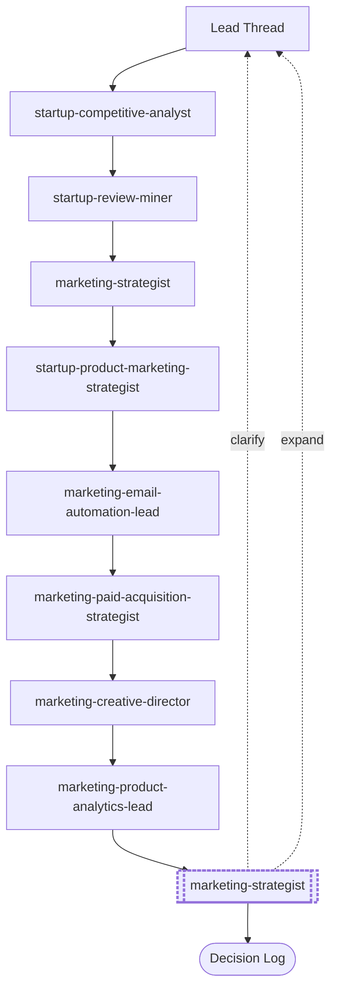
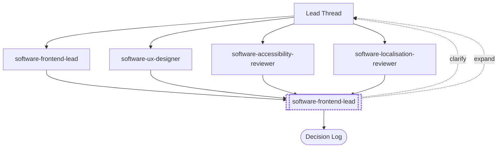
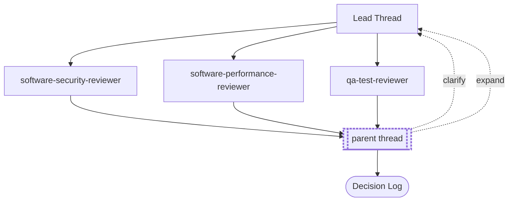

# Team Diagrams

Auto-generated Mermaid flowcharts — one per shared team. Diagrams show lead-thread dispatch, member fan-out, synthesis owner, and the two defensive-output feedback loops (dotted: clarification and expansion back to the lead). Highlighted synthesis nodes indicate debate is on.

Diagrams are communication artifacts, not runtime logic. Actual dispatch behavior lives in the lead thread. See [dynamic-team-expansion.md](dynamic-team-expansion.md) for the end-to-end flow and [clarification-questions-protocol.md](clarification-questions-protocol.md) for the anti-slop gates.

## Table of Contents

- [Regeneration](#regeneration)
- [Summary](#summary)
- [`ai-knowledge-bot-builder`](#ai-knowledge-bot-builder)
- [`dev-context-preparation`](#dev-context-preparation)
- [`dev-feature-delivery`](#dev-feature-delivery)
- [`dev-migration-map`](#dev-migration-map)
- [`docs-knowledge`](#docs-knowledge)
- [`marketing-campaign`](#marketing-campaign)
- [`product-surface`](#product-surface)
- [`software-code-review-board`](#software-code-review-board)

## Regeneration

```bash
python3 scripts/generate-team-diagrams.py
```

Regenerate after any `team.yaml` change. Do not edit this file by hand — edits will be overwritten.

## Summary

- **Total teams:** 8
- **Install modes:** default: 7, opt-in: 1
- **Debate on:** 5 / 8
- **Concurrency:** staged: 6, parallel: 2

---

## `ai-knowledge-bot-builder`

**Family:** ai
**Install:** default
**Concurrency:** staged
**Debate:** on (method: `dialectical-inquiry`, masks: `inversion`, `regret-minimization`, `anchoring-mask`, `base-rate-mask`)
**Manifest:** [agents/teams/ai-knowledge-bot-builder/team.yaml](../../../../agents/teams/ai-knowledge-bot-builder/team.yaml)

> Build AI bots with persistent knowledge bases — from architecture to production. Covers memory pattern



---

## `dev-context-preparation`

**Family:** dev
**Install:** default
**Concurrency:** staged
**Debate:** off
**Manifest:** [agents/teams/dev-context-preparation/team.yaml](../../../../agents/teams/dev-context-preparation/team.yaml)

> Build and refresh reusable context artifacts before engineering work.



---

## `dev-feature-delivery`

**Family:** dev
**Install:** default
**Concurrency:** staged
**Debate:** off
**Manifest:** [agents/teams/dev-feature-delivery/team.yaml](../../../../agents/teams/dev-feature-delivery/team.yaml)

> Staged research, implementation, and review pipeline.



---

## `dev-migration-map`

**Family:** dev
**Install:** default
**Concurrency:** staged
**Debate:** on (method: `pre-mortem`, masks: `inversion`, `second-order`, `base-rate-mask`)
**Manifest:** [agents/teams/dev-migration-map/team.yaml](../../../../agents/teams/dev-migration-map/team.yaml)

> Migration planning team for repo, framework, and platform transitions.



---

## `docs-knowledge`

**Family:** docs
**Install:** default
**Concurrency:** staged
**Debate:** off
**Manifest:** [agents/teams/docs-knowledge/team.yaml](../../../../agents/teams/docs-knowledge/team.yaml)

> Documentation and knowledge-ops team for codebase docs, PRDs, note retrieval, and doc quality.



---

## `marketing-campaign`

**Family:** marketing
**Install:** opt-in
**Concurrency:** staged
**Debate:** on (method: `dialectical-inquiry`, masks: `anchoring-mask`, `base-rate-mask`)
**Manifest:** [agents/teams/marketing-campaign/team.yaml](../../../../agents/teams/marketing-campaign/team.yaml)

> Staged campaign team - research, a one-owner positioning lock, parallel channel drafts, then a conversion and brand review.



---

## `product-surface`

**Family:** product
**Install:** default
**Concurrency:** parallel
**Debate:** on (method: `dialectical-inquiry`, masks: `inversion`, `base-rate-mask`)
**Manifest:** [agents/teams/product-surface/team.yaml](../../../../agents/teams/product-surface/team.yaml)

> Product surface team for frontend architecture, UX quality, accessibility, and localization readiness.



---

## `software-code-review-board`

**Family:** software
**Install:** default
**Concurrency:** parallel
**Debate:** on (method: `dialectical-inquiry`, masks: `inversion`, `regret-minimization`)
**Manifest:** [agents/teams/software-code-review-board/team.yaml](../../../../agents/teams/software-code-review-board/team.yaml)

> Multi-perspective review team using canonical reviewer members.



---
