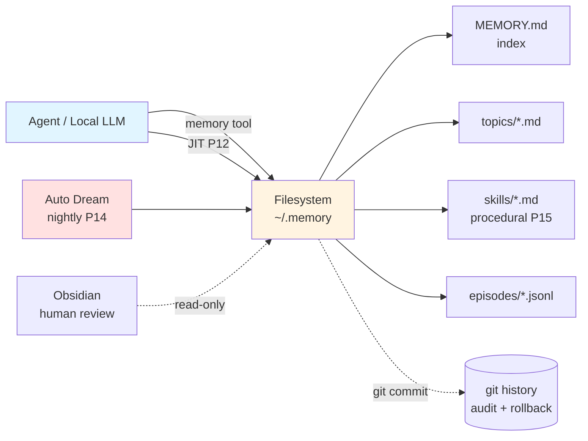
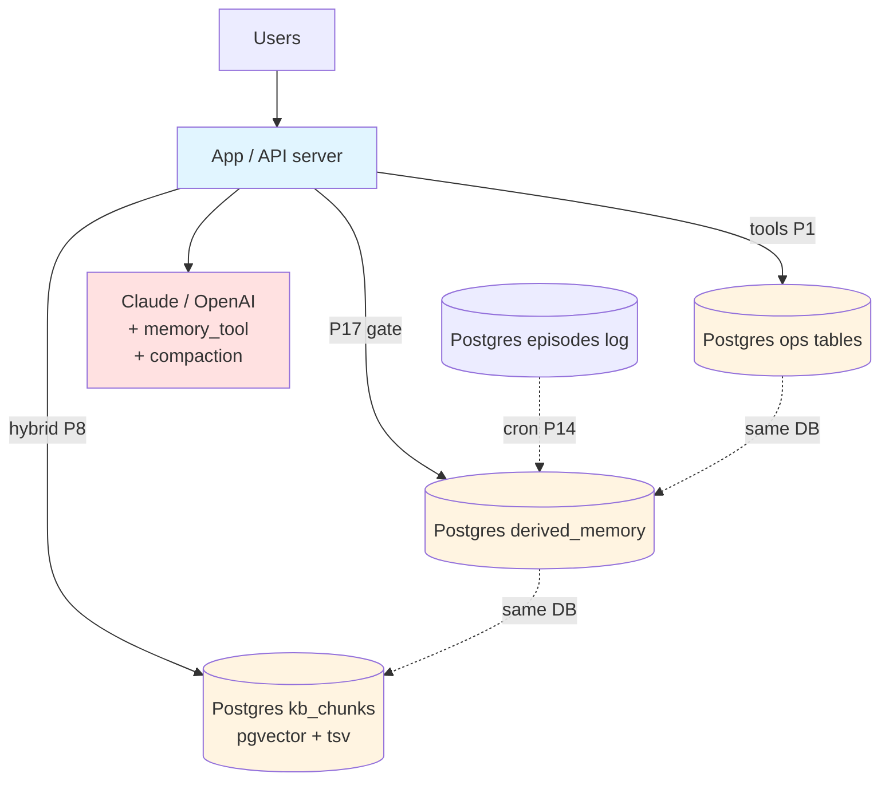
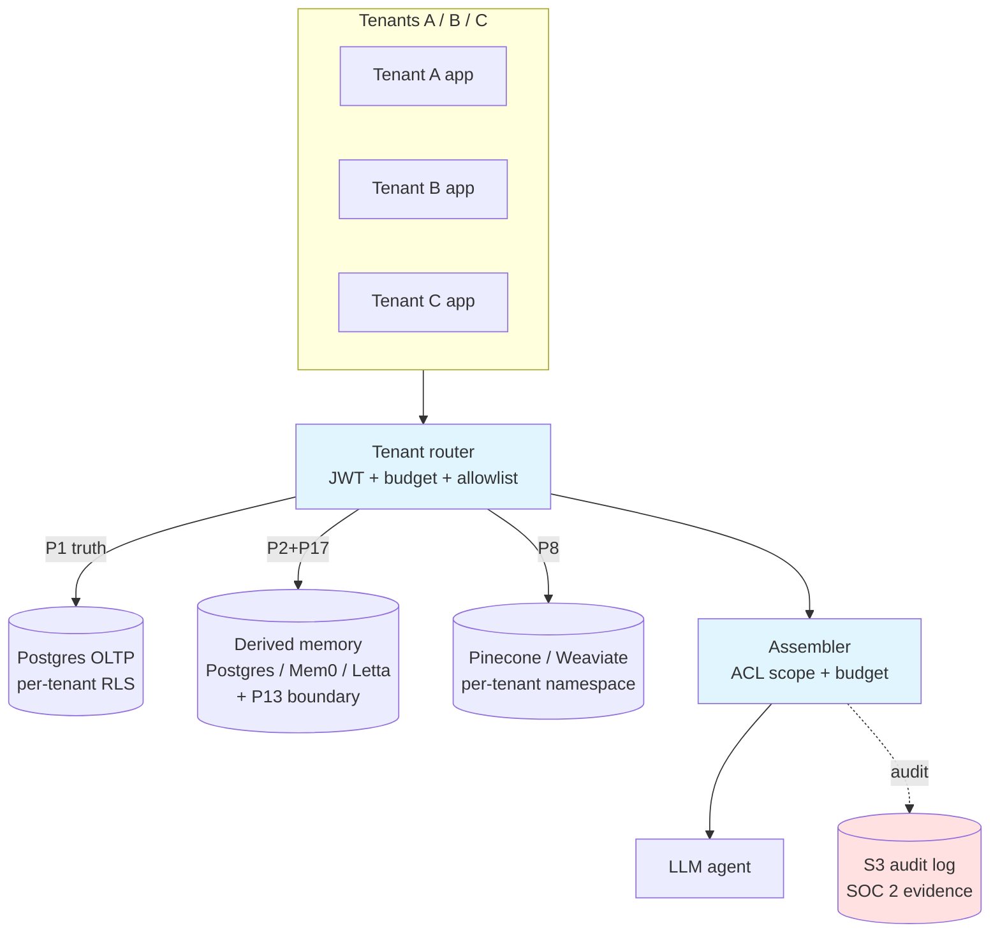
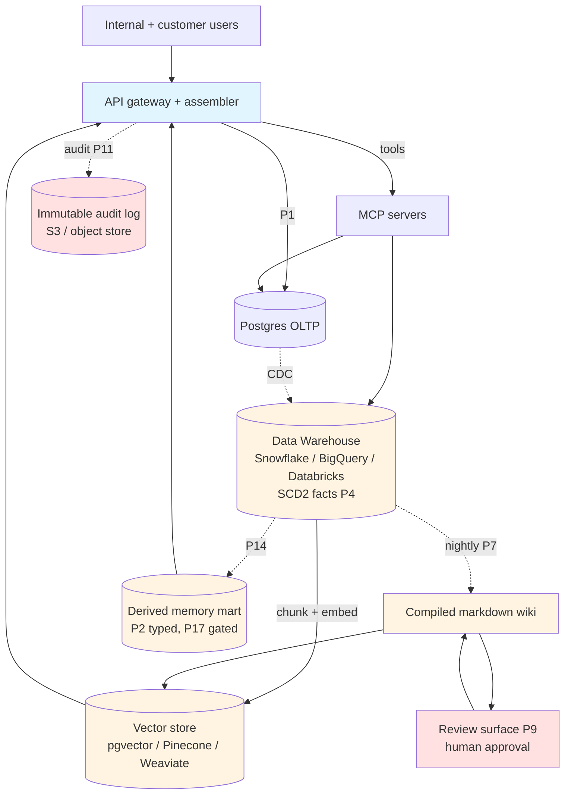
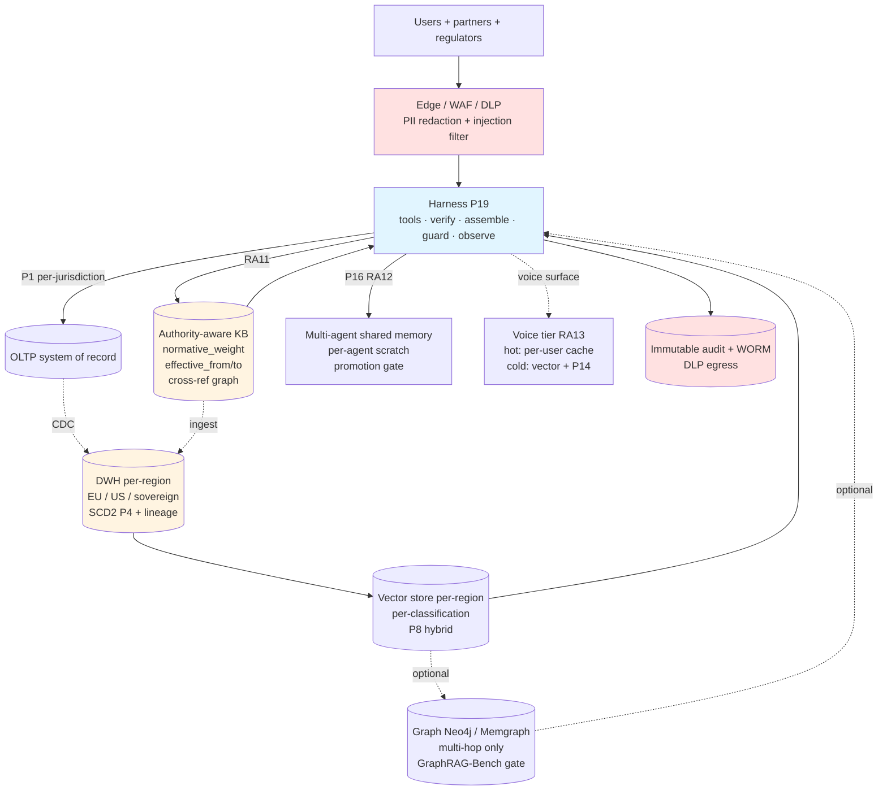

# Architectures by Organization Shape

Navigation document. Maps **organization scale × data substrate** to the
right composition of patterns (P1–P25) and reference architectures
(RA1–RA13). Use this when a request starts with "I'm a solo dev / startup /
enterprise — how should I organize my context layer?" rather than with a
specific architecture.

This doc does not introduce new patterns. It is the *deployment lens* over
the existing catalog. Every cell points back to:

- `references/patterns-catalog.md` (P1–P25)
- `references/reference-architectures.md` (RA1–RA13)
- `references/anti-patterns-catalog.md` (A1–A49)

Sources for the production economics and substrate choices behind
this matrix are listed at the bottom.

## Table of contents

1. [The five organization tiers](#the-five-organization-tiers)
2. [The five substrate primitives](#the-five-substrate-primitives)
3. [Decision matrix: org × substrate](#decision-matrix-org--substrate)
4. [Tier 1 — Solo / local](#tier-1--solo--local-developer-or-prosumer)
5. [Tier 2 — Startup, pre-PMF / PLG](#tier-2--startup-pre-pmf--plg)
6. [Tier 3 — Startup with enterprise customers](#tier-3--startup-with-enterprise-customers)
7. [Tier 4 — Mid-enterprise with DWH](#tier-4--mid-enterprise-with-data-warehouse)
8. [Tier 5 — Large enterprise / regulated](#tier-5--large-enterprise--regulated)
9. [Substrate cheat-sheet](#substrate-cheat-sheet-pros-and-cons)
10. [Graduation triggers](#graduation-triggers)
11. [Sources](#sources)

## The five organization tiers

| Tier | Shape | Users | Latency budget | Compliance | Dominant constraint |
|------|-------|-------|----------------|------------|---------------------|
| **T1 — Solo / local** | 1 dev, on-device | 1 | none (interactive) | none | Zero infra cost |
| **T2 — Startup pre-PMF / PLG** | 2–15 people | 10²–10⁴ | <1s p95 | TOS only | Iteration speed |
| **T3 — Startup with enterprise customers** | 10–80 people | 10³–10⁵ | <500ms p95 | SOC 2, GDPR, ACL | Tenant isolation |
| **T4 — Mid-enterprise w/ DWH** | 100–2000 people | 10⁴–10⁶ | <300ms p95 | SOC 2 + sector | DWH already exists; integrate |
| **T5 — Large enterprise / regulated** | 2000+ | 10⁵–10⁸ | <300ms; voice <300ms | full (HIPAA / PCI / banking / EU AI Act) | Auditability + sovereignty |

## The five substrate primitives

Every context layer is some composition of these five. The matrix below
shows which compositions are recommended at each tier.

| S | Primitive | What it is | When it earns its keep |
|---|-----------|------------|------------------------|
| **S1** | **Files / git** | Markdown, SQLite, local filesystem, git history | T1 always; T2 prototype; T4/T5 *as audit substrate*, not primary |
| **S2** | **Relational + vector (one substrate)** | Postgres + pgvector / Supabase / MongoDB Atlas | T2 default; T3 default until tenant scale forces split |
| **S3** | **Dedicated vector DB** | Pinecone, Weaviate, Qdrant, Vespa | T3 at scale; T4/T5 for retrieval-heavy surfaces |
| **S4** | **Data warehouse + vector** | Snowflake / BigQuery / Databricks + pgvector or external vector | T4 default; T5 always |
| **S5** | **Graph + vector** | Neo4j / Memgraph + vector index | T4/T5 only when traversal changes the answer (per P5 + GraphRAG-Bench) |

## Decision matrix: org × substrate

🟢 = canonical choice for the tier · 🟡 = legitimate · 🔴 = anti-pattern at
this tier · — = doesn't apply

| | S1 Files/git | S2 Rel+vec | S3 Vector | S4 DWH+vec | S5 Graph+vec |
|--|:-:|:-:|:-:|:-:|:-:|
| **T1 Solo / local** | 🟢 dominant | 🟡 if hosted profile | 🔴 over-engineering | — | 🔴 over-engineering |
| **T2 Startup pre-PMF / PLG** | 🟡 prototype only | 🟢 dominant | 🟡 retrieval-heavy only | 🔴 premature DWH | 🔴 premature graph |
| **T3 Startup with enterprise customers** | 🟡 audit log | 🟢 default | 🟢 if retrieval is the product | 🟡 if customer is the DWH | 🟡 multi-hop only |
| **T4 Mid-enterprise w/ DWH** | 🟡 policy/ops docs | 🟡 OLTP only | 🟢 retrieval surfaces | 🟢 dominant | 🟡 multi-hop reasoning |
| **T5 Large enterprise / regulated** | 🟢 git as audit | 🟡 OLTP only | 🟢 with tenant isolation | 🟢 dominant | 🟡 regulated traversal (RA11) |

The pattern: **start S1 → S2 → S3/S4 → S4+S5**. Skipping tiers is the
common anti-pattern (T1 jumping to S3 = A8 logical convergence prematurely
on a vector store you don't need; T3 jumping to S4 = premature DWH cost).

---

## Tier 1 — Solo / local (developer or prosumer)

**Pattern stack:** P1 (tools-as-truth on disk) + P10 (filesystem-as-memory)
+ P12 (just-in-time loading) + P14 (sleep-time consolidation via Anthropic
Auto Dream or `dream-skill`) + P15 (skill library = procedural memory).
**RA mapping:** RA2 (personal AI with cross-session memory).

### ASCII

```text
┌─────────────────────────────────────────────────────────────┐
│  Single user / single device                                │
│                                                             │
│   ┌────────────┐    write/read    ┌──────────────────┐      │
│   │ Coding /   │ ───────────────► │ ~/.memory/       │      │
│   │ chat agent │ ◄─────────────── │  ├─ MEMORY.md    │      │
│   │ (Claude    │                  │  ├─ topics/*.md  │      │
│   │  Code,     │                  │  ├─ skills/*.md  │      │
│   │  OpenClaw, │   memory_tool /  │  └─ episodes/    │      │
│   │  local LLM)│    MCP server    │     *.jsonl      │      │
│   └────┬───────┘                  └──────────────────┘      │
│        │                                  ▲                 │
│        │ JIT load by ref (P12)            │                 │
│        ▼                                  │ git commit      │
│   ┌────────────┐    nightly job          │                  │
│   │ Window     │    (P14 Auto Dream) ────┘                  │
│   │ (transient)│                                            │
│   └────────────┘                                            │
└─────────────────────────────────────────────────────────────┘
                  ▲
                  │ Optional: Obsidian (read-only) for human review
                  │ Optional: SQLite FTS5 + tiny vector index for search
```

### Mermaid



### Pros

- Zero infrastructure cost; no vendor lock-in.
- Audit story is `git log`; rollback is `git revert`.
- Works offline; survives vendor outages.
- Maps cleanly to the Anthropic memory tool — production-grade
  primitive at solo scale.

### Cons

- Single-user only. No tenant isolation, no concurrent writers.
- Search is local-only (SQLite FTS5 + tiny ANN index). Recall stops scaling
  ~10⁶ rows.
- No managed durability beyond git push to a remote.

### Anti-patterns to avoid

- **A8 / A9 — logical convergence on a vector store**: a solo dev with
  ~10³ rows does not need Pinecone or Weaviate; the substrate cost and
  operational burden never pay back. Files + SQLite FTS is correct.
- **A1 — chat transcripts as memory**: even at T1, run an extraction step
  (or P14 Auto Dream) before writing to MEMORY.md. Raw transcripts rot.
- **A30 — scope-free managed retrieval**: if you bolt on a hosted vector
  service at T1 because "it'll scale", you've paid for compliance surface
  you don't have. Use it when you have a paying customer.

### Graduate to T2 when

You have >1 user, or the memory store crosses ~10⁶ rows, or you need
multi-device sync that isn't covered by `git push`.

### Example implementations (verify current versions before adopting)

- Anthropic Claude Code with the provider memory tool + Auto Dream
  (check release status) — see `references/filesystem-as-memory.md`.
- Community: `dream-skill` (github.com/grandamenium/dream-skill), EchoVault,
  ClawMem (SQLite + Obsidian-compatible markdown vault), `agent-memory` MCP
  server.

---

## Tier 2 — Startup, pre-PMF / PLG

**Pattern stack:** P1 (operational truth in Postgres) + P2 (typed derived
memory) + P8 (hybrid retrieval inside the same Postgres via pgvector) + P12
(JIT pointer-first loading) + P14 (sleep-time consolidation) + P17 (schema-
grounded write gate). **RA mapping:** RA1 with simplifications, or **RA9
(converged datastore)** — the canonical T2 architecture.

### ASCII

```text
┌──────────────────────────────────────────────────────────────────┐
│   User devices (web / mobile)                                    │
└─────────────────────────────┬────────────────────────────────────┘
                              │ HTTPS
                              ▼
                  ┌────────────────────────┐
                  │   App / API server     │
                  │   - tools (P1 truth)   │
                  │   - bundle assembler   │
                  │   - P17 write gate     │
                  └─────┬──────────────┬───┘
                        │              │
       ┌────────────────┘              └──────────────────┐
       ▼                                                  ▼
┌──────────────────────────────────┐         ┌──────────────────────┐
│  Postgres (Supabase / RDS)       │         │  LLM provider        │
│  ┌──────────────────────────┐    │         │  (Claude / OpenAI)   │
│  │ operational tables       │    │         │  + memory_tool       │
│  │ (users, orgs, billing)   │ P1 │         │  + compaction API    │
│  ├──────────────────────────┤    │         │  + clear_tool_uses   │
│  │ derived_memory           │ P2 │         └──────────────────────┘
│  │ (typed: profile/         │    │
│  │  behavioral/outcome)     │    │                  ▲
│  ├──────────────────────────┤    │                  │
│  │ kb_chunks                │ P8 │                  │
│  │ (text, embedding         │    │    ContextBundle │
│  │  vector(1536), bm25_tsv) │    │   (typed)         │
│  ├──────────────────────────┤    │                   │
│  │ episodes / events log    │    │                   │
│  └──────────────────────────┘    │                   │
│        RLS for ACL (per-user)    │                   │
└──────────────────────────────────┘                   │
                        ▲                              │
                        │                              │
                        └───────── assembler ──────────┘
```

### Mermaid



### Pros

- One substrate, one ops burden, one backup strategy.
- Vendor comparison write-ups (Deeflect migration, Groovyweb comparison)
  report pgvector cheaper than Pinecone below roughly 50M rows; re-price
  at your own scale.
- ACID for operational truth + vector for retrieval in the same
  transaction — no dual-write consistency problems.
- Row-Level Security gives ACL scope without a separate identity service.
- Stance #12: substrate convergence is legitimate when *logical*
  separation holds (separate tables, separate ACL, separate retention).

### Cons

- Single-substrate ceiling around 50M vectors on a well-provisioned
  PostgreSQL instance (per production write-ups; measure on your hardware).
- Embedding-model lock-in if you use `autoEmbed` features (MongoDB Atlas
  or Supabase equivalents). Manage as a P13 boundary.
- Backup/restore times grow with the vector index; plan for 30–60min RTO
  at the 50M ceiling.

### Anti-patterns to avoid

- **A8 — single-table personalization blob**: even on one substrate, keep
  `derived_memory`, `kb_chunks`, and `episodes` as *separate tables*. The
  table boundary is the logical isolation that makes RA9 safe.
- **A27 — eager prefetch masquerading as retrieval**: don't ship the full
  vector store contents in the bundle; use P12 pointer-first.
- **A37 — eager compaction**: don't compact early just because
  you can. Start from the provider's documented default trigger (look it up)
  and the clear-vs-keep rule in `references/context-hygiene.md`.

### Graduate to T3 when

A real enterprise customer signs and asks for SOC 2 / GDPR DPA, or your
multi-tenant ACL requirements exceed RLS.

### Example implementations (verify current versions before adopting)

- Supabase + pgvector + LangChain memory (production-tested per an Agilesoftlabs
  write-up).
- MongoDB Atlas with `autoEmbed` (one substrate, vector + document +
  ACL in the same place).
- Convex for full-stack TS shops.

---

## Tier 3 — Startup with enterprise customers

**Pattern stack:** P1 + P2 + P8 + P11 (sub-agent isolation per tenant) + P12
+ P13 (managed-memory boundaries if using Mem0/Letta/Zep) + P17 + tenant
isolation patterns. **RA mapping:** RA3 (multi-tenant customer knowledge
layer); add RA12 (multi-agent shared memory with barriers) if multiple
agents collaborate per tenant.

### ASCII

```text
┌────────────────────────────────────────────────────────────────────┐
│  Tenant A           Tenant B           Tenant C                    │
│  (web/API/mobile)   (web/API/mobile)   (web/API/mobile)            │
└──────┬───────────────────┬───────────────────┬─────────────────────┘
       │                   │                   │
       └─────────── per-tenant JWT ────────────┘
                           │
                           ▼
              ┌─────────────────────────────┐
              │   Identity / tenant router  │  (RA3)
              │   - tenant_id resolution    │
              │   - per-tenant token budget │
              │   - per-tenant tool allowlist│
              └──────────┬──────────────────┘
                         │
       ┌─────────────────┼─────────────────┐
       ▼                 ▼                 ▼
┌──────────────┐   ┌──────────────┐  ┌─────────────────┐
│ Postgres OLTP│   │ Postgres /   │  │ Pinecone / Weaviate │
│ (per-tenant  │   │ Mem0 / Letta │  │ (S3, one index    │
│  schema or   │   │ derived mem  │  │  per tenant or     │
│  RLS)        │   │  (P2+P17)    │  │  namespace)       │
│  P1 truth    │   │  + P13       │  │  + tenant filter   │
└──────────────┘   └──────────────┘  └─────────────────┘
       ▲                 ▲                 ▲
       │                 │                 │
       └────────── assembler with ACL scope ┘
                         │
                         ▼
                  ┌─────────────┐
                  │  LLM agent  │
                  └─────────────┘
        + audit log → S3 / object store (compliance evidence)
```

### Mermaid



### Pros

- Real tenant isolation: per-tenant ACL, per-tenant budget, per-tenant
  tool allowlist all enforced at the router.
- Vector workload offloaded to a dedicated substrate (S3) once retrieval
  becomes the product (per Mem0 State of Memory 2026: teams hit a
  consolidation ceiling on vector-only retrieval — moving to memory-first
  with a dedicated vector index for KB is the documented next step).
- Managed memory vendors (Mem0, Letta, Zep) accelerate delivery without
  surrendering P1 operational truth — that stays in Postgres.

### Cons

- Two substrates = two backup strategies, two ops burdens.
- Cross-tenant analytics require a third substrate (DWH); plan for T4
  early if your customers ask for aggregated insight dashboards.
- Per-tenant Pinecone namespaces have quota / cost-allocation cliffs;
  monitor before the bill spikes.

### Anti-patterns to avoid

- **A28 — hosted memory treated as canonical truth**: Mem0/Letta is a
  derived-memory store, not your source of truth. Operational truth stays
  in your Postgres (P1).
- **A30 — scope-free managed retrieval**: every vector query must carry
  the tenant filter before it leaves the assembler. Forget once and you
  leak across tenants.
- **A36 — victory declaration bias**: enterprise customers will notice
  silent failures (P19 harness column 2 must run).

### Graduate to T4 when

Your customer is itself an enterprise with a DWH, or your aggregated
analytics requirements exceed what OLTP + a dedicated vector store can
serve, or compliance asks for retention/sovereignty controls you can't
meet on managed Pinecone.

### Example implementations (verify current versions before adopting)

- Postgres (per-tenant RLS) + Pinecone (per-tenant namespace) + Mem0 or
  Letta for derived memory.
- LangGraph + Supabase + per-tenant RLS for the "still mostly one substrate"
  variant.
- AWS Bedrock Knowledge Bases for the "want hosted everything" variant: retrieval
  backend options are OpenSearch Serverless (default, zero-ops), Aurora pgvector,
  MongoDB Atlas, and Pinecone — selectable at KB creation time. Default embedding
  model is **Amazon Nova 2 Multimodal Embeddings** (Bedrock; supersedes Titan v2).
  Managed retriever alternative: build the KB on an **Amazon Kendra GenAI Index**
  (hybrid + semantic + built-in reranker, index once / reuse across Bedrock
  Knowledge Bases and Amazon Q Business) instead of self-managing OpenSearch or
  a vector store. Use Kendra GenAI Index when the same document corpus must serve
  both Bedrock KB and Q Business without dual-indexing.
  See `../../ai-rag/references/aws-bedrock-knowledge-bases.md`.

---

## Tier 4 — Mid-enterprise with data warehouse

**Pattern stack:** P1 + P2 + P4 (temporal facts via DWH SCD2) + P7 (compiled
markdown wiki off the DWH) + P8 + P9 (review surface) + P12 + P13 + P17 +
optional P5 (graph) for genuine multi-hop. **RA mapping:** RA1 (living
enterprise KB) + RA4 (regulated/compliance memory if sector-regulated) +
RA11 (policy / compliance / ops docs).

### ASCII

```text
┌──────────────────────────────────────────────────────────────────────┐
│  Internal users + customer apps                                      │
└────────────────────────────┬─────────────────────────────────────────┘
                             │ SSO / JWT
                             ▼
              ┌──────────────────────────────┐
              │   API gateway + assembler    │
              │   (per-surface bundles)      │
              └─────┬────────────────────────┘
                    │
   ┌────────────────┼──────────────────────────┐
   ▼                ▼                          ▼
┌────────────┐  ┌────────────┐         ┌────────────────────┐
│ OLTP       │  │ MCP servers│         │ Compiled markdown  │
│ (Postgres) │  │ (tools     │         │ wiki (P7)          │
│ P1 truth   │  │  exposing  │         │ regenerated from   │
└──────┬─────┘  │  P1+DWH)   │         │ DWH nightly        │
       │        └────┬───────┘         └─────────┬──────────┘
       │             │                           │
       │             ▼                           │ chunked
       │      ┌──────────────────────┐          ▼
       │      │ Data Warehouse       │   ┌──────────────────────┐
       │      │ (Snowflake /         │   │ Vector store         │
       └─────►│  BigQuery /          │──►│ (pgvector for KB     │
       CDC    │  Databricks)         │   │  rows; Pinecone /    │
              │  - facts             │   │  Weaviate for very   │
              │  - dim tables        │   │  large surfaces)     │
              │  - SCD2 history (P4) │   │  P8 hybrid retrieval │
              └──────┬───────────────┘   └──────────┬───────────┘
                     │                              │
                     │  consolidation (P14)         │
                     ▼                              ▼
              ┌──────────────────────┐   ┌──────────────────────┐
              │ Derived memory mart  │   │ Review surface       │
              │ (typed, gated by P17)│   │ (P9: humans approve  │
              │ per-user / per-org   │   │  before cutover)     │
              └──────────────────────┘   └──────────────────────┘
                       ▲                              ▲
                       └────── audit log (P11) ───────┘
                              (immutable, S3 / object store)
```

### Mermaid



### Pros

- DWH already exists; the context layer projects from it rather than
  duplicating truth. P1 boundary stays clean.
- Compiled markdown wiki (P7) is the bridge between structured DWH facts
  and free-text agent retrieval — same row appears as SCD2 fact and as
  vector chunk, both anchored to the same surrogate key.
- Audit story is automatic: every retrieval can quote `(doc_id, version,
  clause_id, effective_at)` per RA11.
- Review surface (P9) gives humans veto power before the agent reads
  newly-ingested content.

### Cons

- 4–5 substrates to operate: OLTP, DWH, vector store, wiki object store,
  audit log. Real platform-team effort.
- Latency: a DWH query in the bundle path is fatal — DWH is for ingest /
  consolidation, the read path goes through the vector store and the
  compiled wiki.
- Freshness lag: nightly P7 compilation means new facts are 24h stale on
  the agent path unless you wire CDC into the vector reindex.

### Anti-patterns to avoid

- **A28 — wiki as canonical truth**: the DWH is P1; the wiki is derived.
  When they conflict, DWH wins.
- **A30 — DWH query in the read path**: latency budget will not survive
  it. DWH writes to the vector store; agents read from the vector store.
- **A33 — GraphRAG misapplied**: at this tier a router is mandatory. Most
  queries are single-hop; reserve graph traversal for the small slice of
  multi-hop reasoning (GraphRAG-Bench, arXiv 2506.02404 — multi-hop only;
  measure your own gain rather than assuming a published one).
- **A37 — eager compaction** on bundles built from DWH projections.

### Graduate to T5 when

Sector regulation kicks in (HIPAA / PCI / banking / EU AI Act high-risk),
or the user base crosses the sovereignty threshold (EU / UK / specific
nation-state customer requirements), or audit becomes an external
regulator-driven obligation rather than internal SOC 2 evidence.

### Example implementations (verify current versions before adopting)

- Snowflake / BigQuery / Databricks for DWH + pgvector (in Snowflake
  Cortex / BigQuery vector / Databricks Delta) for vector + a compiled
  markdown wiki regenerated nightly.
- The split-stack pattern documented in Pingcap 2026 *Best Database for AI
  Agents*: Redis (short-term) + Pinecone or Weaviate (semantic) +
  PostgreSQL (episodic + procedural) + DWH for analytics.

---

## Tier 5 — Large enterprise / regulated

**Pattern stack:** Everything from T4 *plus* P3 (managed memory blocks for
controllability) when required + P11 (sub-agent isolation, mandatory) + P13
(managed-memory boundaries, explicit) + P15 (procedural memory governed by
review board) + P16 (multi-agent shared memory with barriers) + P18 (ACE
for self-improving playbooks, only after governance approves) + RA13 (voice
tier if voice surface exists). **RA mapping:** RA4 (regulated memory) + RA11
(policy / compliance / ops docs as authority-aware KB) + RA12 (multi-agent
with barriers) + RA13 (voice) as applicable.

### ASCII

```text
┌──────────────────────────────────────────────────────────────────────────┐
│  Internal users + customer apps + partners + regulators                  │
└────────────────────────┬─────────────────────────────────────────────────┘
                         │ SSO + step-up auth + per-role JWT
                         ▼
            ┌────────────────────────────────┐
            │   Edge / WAF / DLP             │
            │   - PII redaction              │
            │   - prompt-injection filter    │
            │   - per-user budget            │
            └─────┬──────────────────────────┘
                  │
                  ▼
            ┌────────────────────────────────┐
            │   Harness (P19)                │
            │   - tool orchestration         │
            │   - verification loops         │
            │   - context assembler          │
            │   - guardrails (HITL)          │
            │   - observability              │
            └──┬─────────────┬────────────┬──┘
               │             │            │
   ┌───────────┘             │            └────────────┐
   ▼                         ▼                         ▼
┌────────────┐    ┌──────────────────────┐    ┌──────────────────────┐
│ OLTP +     │    │ Authority-aware KB   │    │ Multi-agent shared   │
│ system of  │    │ (RA11: policies,     │    │ memory w/ barriers   │
│ record     │ P1 │  regs, runbooks,     │    │ (RA12: per-agent     │
│ (per-      │    │  control mappings)   │    │  scratch + promotion │
│ jurisdiction│   │ - normative_weight   │    │  gate + role NS)     │
│  shards)   │    │ - effective_from/to  │    │  P16                 │
└─────┬──────┘    │ - cross-ref graph    │    └──────┬───────────────┘
      │           └──────┬───────────────┘           │
      │ CDC               │                          │
      ▼                   ▼                          │
┌────────────────────────────────────────────┐       │
│  DWH (per-region: EU / US / sovereign)      │      │
│  - SCD2 facts (P4)                          │      │
│  - lineage to source documents              │      │
│  - retention per regulation                 │      │
└─────────────┬──────────────────────────────┘       │
              │                                       │
              ▼                                       │
┌────────────────────────────────────────────┐       │
│  Vector store (per-region, per-classification)│    │
│  - tenant + classification filter required    │    │
│  - hybrid retrieval (P8): dense + BM25 + filter│   │
└─────────────┬──────────────────────────────┘       │
              │                                       │
              ▼                                       │
┌────────────────────────────────────────────┐       │
│  Optional: graph (Neo4j / Memgraph)        │       │
│  - only for the multi-hop reasoning slice  │       │
│  - GraphRAG-Bench gate: must beat plain    │       │
│    RAG by ≥5pts on the eval suite          │       │
└────────────────────────────────────────────┘       │
                                                      │
┌────────────────────────────────────────────┐       │
│  Voice tier (RA13) — if voice surface exists│      │
│  - hot tier: per-user sub-ms cache          │      │
│  - cold tier: vector + pre-fetch + P14      │◄─────┘
└────────────────────────────────────────────┘
                  │
                  ▼
         ┌────────────────────┐
         │  Immutable audit   │
         │  + WORM storage    │
         │  + DLP egress      │
         └────────────────────┘
```

### Mermaid



### Pros

- Every retrieval is paragraph-cited and effective-time-queryable
  (RA11 contract).
- Multi-agent collaboration is safe by construction (P16 + RA12 barriers).
- Sovereignty story holds — per-region DWH + per-region vector store +
  per-classification ACL.
- Voice surface honors the 200–300ms budget (RA13) instead of running
  chat-tier memory and failing A34.

### Cons

- 7–10 substrates; large platform team and dedicated MLOps.
- Every change goes through a review surface (P9) — cycle time measured
  in days, not minutes. This is deliberate.
- Cost: managed vector stores at this scale need explicit FinOps; expect
  6-figure annual line item before optimization.
- Embedding-model lock-in is a board-level risk (re-embedding 100M+
  vectors after a model change is a multi-quarter project).

### Anti-patterns to avoid

- **A28 — hosted memory as canonical truth**: at this tier, breaking this
  rule is a regulatory finding, not a bug.
- **A33 — graph everywhere**: the graph is a slice, not the substrate.
  GraphRAG-Bench multi-hop gate must hold before traversal is wired in.
- **A26 / A31 / A35 — self-ingestion → mode/context collapse**: P14 and
  P18 Curator must have schema-grounded write gates (P17) and external
  outcome signals; never feed model output back as a "preference" without
  P17 normalization.
- **A36 — victory declaration**: at this tier, harness column 2
  (verification loops) is regulator-visible; agents marking "done"
  without evidence is a compliance issue.
- **A32 — uncoordinated multi-agent writes**: P16 barriers are mandatory,
  not advisory.

### Example implementations (verify current versions before adopting)

- Per-region cloud (AWS / GCP / Azure) DWH + per-region vector store +
  managed memory boundary (Letta / Mem0 enterprise) for derived memory
  with explicit P13 contract + Anthropic / OpenAI / Vertex agent runtime
  with provider compaction + memory tool and HITL approval surfaces.
- Reference: Atlan 2026 *Top Vector Databases for Enterprise AI*; Pingcap
  2026 *Best Database for AI Agents* split-stack pattern; Mem0 2026 State
  of Memory enterprise case studies.

---

## Substrate cheat-sheet (pros and cons)

Quick reference. Detailed substrate selection lives in
`references/vendor-landscape.md`.

| Substrate | Best at | Avoid when | Production ceiling (indicative; re-measure) |
|-----------|---------|-----------|-------------------------------|
| **Files + git** | Solo dev, audit log substrate at any tier, policy docs versioning | Multi-writer concurrent agents; high-QPS retrieval | ~10⁶ rows per repo |
| **SQLite + FTS5** | Solo dev keyword search, on-device agents | Multi-user concurrent writes; semantic search | ~10⁷ rows single file |
| **Postgres + pgvector** | T2/T3 default; tenant isolation via RLS; one-substrate ops | When you cross 50M vectors or need <40ms p95 | ~50M vectors per node |
| **MongoDB Atlas (autoEmbed)** | T2 unified document+vector; native embedding pipeline | When you need open-source portability; when relational joins dominate | Tens of millions of vectors per cluster |
| **Supabase (Postgres + pgvector + RLS)** | T2 / T3 with multi-tenant from day one | Single-region SLA constraints; very high QPS | ~50M vectors per project |
| **Pinecone** | T3+ retrieval-heavy; serverless cost only above ~100M scale | Sub-10M corpora (pgvector cheaper); when you need ACID with your truth | 10⁹+ vectors managed |
| **Weaviate** | T3+ self-hosted; hybrid retrieval native; multi-tenancy | Tiny corpora; teams without k8s capacity | ~10⁹ vectors per cluster |
| **Qdrant** | T3+ self-hosted; payload-heavy filtering | Cloud-only managed needs | ~10⁹ vectors per cluster |
| **Snowflake / BigQuery / Databricks + vector** | T4/T5 enterprise with existing DWH | When DWH does not already exist (don't introduce one for memory) | DWH-scale (10¹⁰+) |
| **Neo4j / Memgraph** | T4/T5 multi-hop reasoning slice; relationship-changes-the-answer questions | Single-hop questions (A33); when GraphRAG-Bench gate fails | Depends on partitioning |
| **Mem0 / Letta / Zep** | T3+ derived-memory acceleration; managed schema for episodic/profile/behavioral | As source of operational truth (A28); without an explicit P13 boundary | Vendor-dependent |
| **Provider memory tool (client-side files)** | T1 always; T2 prototypes; T3+ as one substrate alongside DB | Multi-tenant by itself (client-side files) | Filesystem-scale |
| **Redis (short-term tier)** | T4/T5 hot tier of memory; voice RA13 fast cache | As durable derived memory (it isn't) | Cluster-scale |

## Graduation triggers

The most common mistake is staying on a tier substrate after it stops fitting,
or jumping tiers without earning the next one. Use these as boundary triggers.

```text
T1 → T2:  >1 user OR >10⁶ memory rows OR multi-device sync needs
          Signal: you're emailing yourself screenshots between machines.

T2 → T3:  First enterprise customer signs DPA OR multi-tenant ACL
          requirements exceed RLS practicality OR vector store crosses
          50M rows.
          Signal: a security questionnaire shows up with >50 controls.

T3 → T4:  Internal aggregated analytics required (cross-tenant safe);
          customer is itself an enterprise with a DWH; latency budget
          requires read-path optimization that managed Pinecone alone
          cannot deliver.
          Signal: someone proposes "let's build a metrics dashboard for
          our customer's CISO".

T4 → T5:  Sector regulation kicks in (HIPAA / PCI / banking / EU AI Act
          high-risk); sovereignty requirements appear; audit becomes
          externally regulator-driven.
          Signal: your contract MSA template grows a "Regulatory
          Cooperation" annex.
```

Going backwards is rare but legitimate. Most "T5 → T4" downgrades are
actually scope-narrowing of one product line within a T5 organization to
T4-style architecture for cost reasons — same matrix still applies per
product surface.

## Sources

- Mem0, *State of AI Agent Memory 2026* — `https://mem0.ai/blog/state-of-ai-agent-memory-2026`
- Atlan, *Best AI Agent Memory Frameworks in 2026* — `https://atlan.com/know/best-ai-agent-memory-frameworks-2026/`
- Atlan, *Top Vector Databases for Enterprise AI: 2026 Comparison* — `https://atlan.com/know/top-vector-databases-enterprise-ai/`
- Pingcap, *Best Database for AI Agents (2026): Memory, State & RAG Guide* — `https://www.pingcap.com/compare/best-database-for-ai-agents/`
- Redis, *AI Agent Architecture: Build Systems That Work in 2026* — `https://redis.io/blog/ai-agent-architecture/`
- Knowlee, *AI Agent Platform Architecture 2026: Reference Patterns + Layer Decomposition* — `https://www.knowlee.ai/blog/ai-agent-platform-architecture-2026`
- Groovyweb, *Pinecone vs pgvector vs Chroma vs Weaviate (2026): Best Vector DB by Use Case* — `https://www.groovyweb.co/blog/vector-database-comparison-2026`
- Deeflect, *Supabase vs Pinecone: I Migrated My Production AI System* — `https://deeflect.com/all-posts/supabase-vs-pinecone-i-migrated-my-production-ai-system-and-here-s-what-actually-matters`
- Agilesoftlabs, *Long-Term AI Agent Memory with LangChain & Supabase* (May 2026) — `https://www.agilesoftlabs.com/blog/2026/05/longterm-ai-agent-memory-with-langchain`
- Muhammadraza, *I Built Local Memory for Coding Agents* (2026) — `https://muhammadraza.me/2026/building-local-memory-for-coding-agents/`
- Anthropic, *Context engineering: memory, compaction, tool clearing* (cookbook) — `https://platform.claude.com/cookbook/tool-use-context-engineering-context-engineering-tools`
- `references/reference-architectures.md` — full RA1–RA13 specifications
- `references/patterns-catalog.md` — P1–P25 pattern definitions
- `references/anti-patterns-catalog.md` — A1–A49 failure modes
- `references/vendor-landscape.md` — substrate-by-substrate decision matrix
